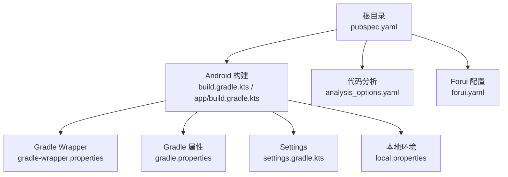
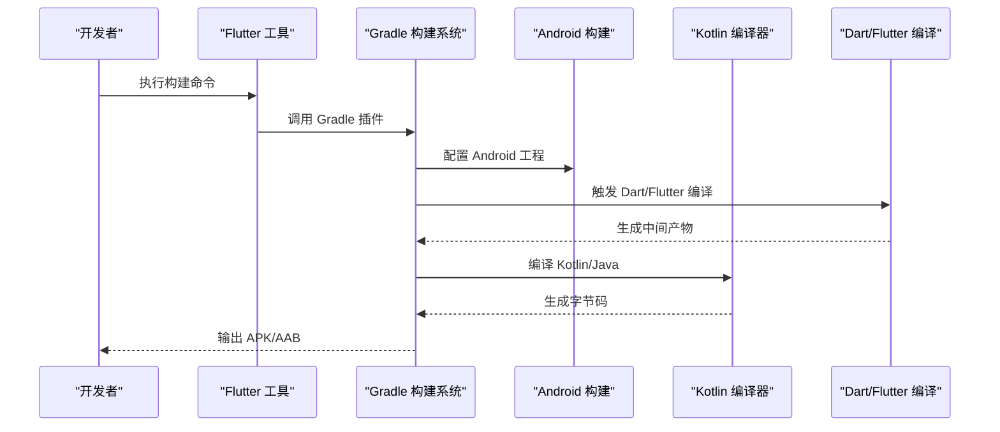
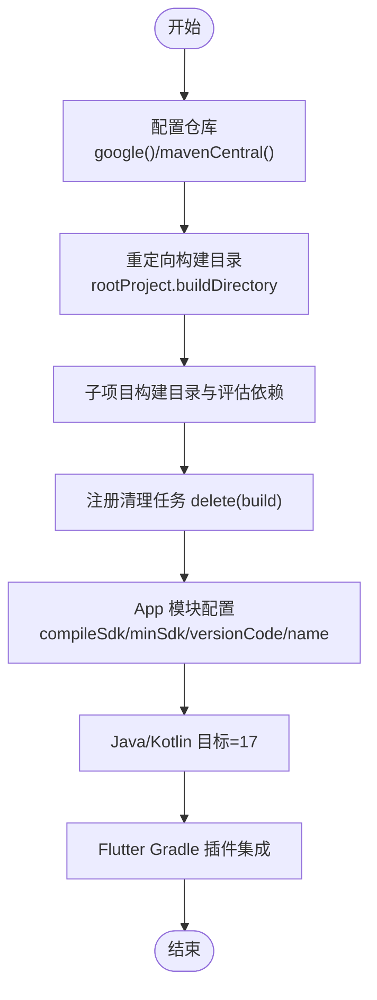
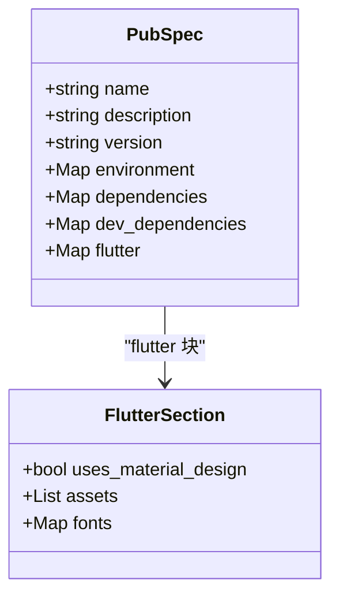
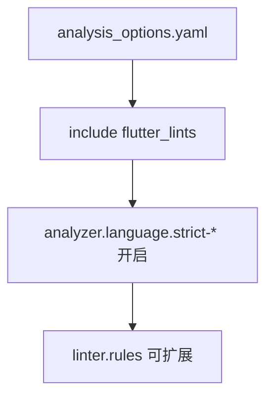
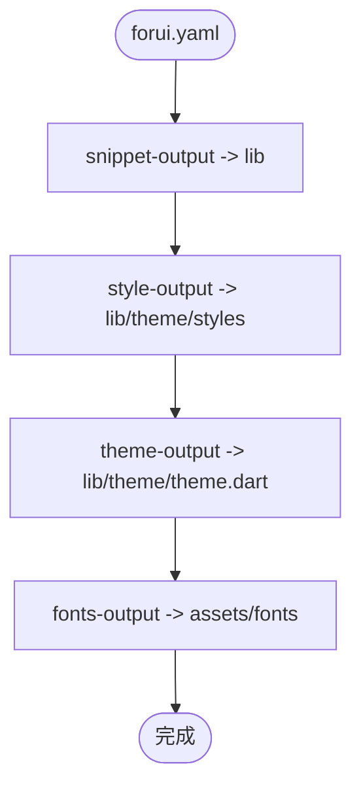
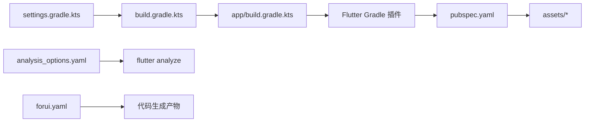

# 构建配置

<cite>
**本文引用的文件**   
- [pubspec.yaml](file://pubspec.yaml)
- [analysis_options.yaml](file://analysis_options.yaml)
- [forui.yaml](file://forui.yaml)
- [android/build.gradle.kts](file://android/build.gradle.kts)
- [android/app/build.gradle.kts](file://android/app/build.gradle.kts)
- [android/settings.gradle.kts](file://android/settings.gradle.kts)
- [android/gradle.properties](file://android/gradle.properties)
- [android/gradle/wrapper/gradle-wrapper.properties](file://android/gradle/wrapper/gradle-wrapper.properties)
- [android/local.properties](file://android/local.properties)
</cite>

## 目录
1. [简介](#简介)
2. [项目结构](#项目结构)
3. [核心组件](#核心组件)
4. [架构总览](#架构总览)
5. [详细组件分析](#详细组件分析)
6. [依赖关系分析](#依赖关系分析)
7. [性能考虑](#性能考虑)
8. [故障排查指南](#故障排查指南)
9. [结论](#结论)
10. [附录](#附录)

## 简介
本文件面向会迹（MeetTrace）项目的构建与质量配置，覆盖以下方面：
- Android Gradle 构建配置：仓库设置、构建目录管理、子项目配置、清理任务、版本与签名、Kotlin/Java 编译目标。
- Flutter 项目 pubspec.yaml 配置：依赖管理、资源文件、平台相关设置。
- 代码分析 analysis_options.yaml：lint 规则、静态检查、严格模式。
- Forui 组件库 forui.yaml：代码生成输出路径与字体资源目录。
- 构建优化技巧：增量构建、缓存策略、并行编译。
- 常见构建问题排查与解决方案。

## 项目结构
本项目为 Flutter 多端应用，Android 侧使用 Gradle/Kotlin DSL 进行构建；Dart/Flutter 侧通过 pubspec.yaml 管理依赖与资源；代码质量由 analysis_options.yaml 统一控制；Forui 通过 forui.yaml 控制代码生成产物位置。

**图表来源** 
- [pubspec.yaml:1-112](file://pubspec.yaml#L1-L112)
- [android/build.gradle.kts:1-25](file://android/build.gradle.kts#L1-L25)
- [android/app/build.gradle.kts:1-60](file://android/app/build.gradle.kts#L1-L60)
- [android/settings.gradle.kts:1-27](file://android/settings.gradle.kts#L1-L27)
- [android/gradle/wrapper/gradle-wrapper.properties:1-6](file://android/gradle/wrapper/gradle-wrapper.properties#L1-L6)
- [android/gradle.properties:1-7](file://android/gradle.properties#L1-L7)
- [android/local.properties:1-5](file://android/local.properties#L1-L5)

**章节来源**
- [pubspec.yaml:1-112](file://pubspec.yaml#L1-L112)
- [android/build.gradle.kts:1-25](file://android/build.gradle.kts#L1-L25)
- [android/app/build.gradle.kts:1-60](file://android/app/build.gradle.kts#L1-L60)
- [android/settings.gradle.kts:1-27](file://android/settings.gradle.kts#L1-L27)
- [android/gradle/wrapper/gradle-wrapper.properties:1-6](file://android/gradle/wrapper/gradle-wrapper.properties#L1-L6)
- [android/gradle.properties:1-7](file://android/gradle.properties#L1-L7)
- [android/local.properties:1-5](file://android/local.properties#L1-L5)

## 核心组件
- Android Gradle 顶层与 App 模块配置：统一仓库、构建目录、子项目评估、清理任务、Android 编译选项、Kotlin/JVM 目标、Flutter 插件集成。
- Flutter 包配置：SDK 约束、依赖声明、资源清单、Material Design 启用。
- 代码分析：继承 flutter_lints，开启严格类型推断与原始类型检查。
- Forui CLI：指定生成的 snippet、样式、主题与字体资源的默认输出目录。

**章节来源**
- [android/build.gradle.kts:1-25](file://android/build.gradle.kts#L1-L25)
- [android/app/build.gradle.kts:1-60](file://android/app/build.gradle.kts#L1-L60)
- [pubspec.yaml:1-112](file://pubspec.yaml#L1-L112)
- [analysis_options.yaml:1-35](file://analysis_options.yaml#L1-L35)
- [forui.yaml:1-13](file://forui.yaml#L1-L13)

## 架构总览
下图展示 Flutter 与 Android Gradle 的构建协作关系：Flutter 工具链通过 Gradle 插件注入到 Android 构建流程中，最终产出 APK/AAB。

**图表来源** 
- [android/settings.gradle.kts:1-27](file://android/settings.gradle.kts#L1-L27)
- [android/app/build.gradle.kts:1-60](file://android/app/build.gradle.kts#L1-L60)
- [pubspec.yaml:1-112](file://pubspec.yaml#L1-L112)

## 详细组件分析

### Android Gradle 构建配置
- 仓库设置：顶层 allprojects 统一 google() 与 mavenCentral()，确保依赖可下载。
- 构建目录管理：将根级 build 目录重定向至项目根下的 build 目录，子项目各自在 build/<子项目名> 下生成产物，便于集中管理与清理。
- 子项目配置：强制子项目评估依赖 :app，保证依赖解析顺序正确。
- 清理任务：自定义 clean 任务删除根级 build 目录。
- App 模块配置：
  - 命名空间与 SDK：使用 Flutter 提供的 compileSdk/targetSdk/ndkVersion。
  - Java/Kotlin 目标：JVM 目标设置为 17，兼容现代语言特性。
  - 版本与签名：minSdk 固定，release 构建默认使用 debug 签名（需替换为正式签名）。
  - Flutter 插件：通过 flutter { source = "../.." } 指向 Flutter 源码根。
- Settings 与 Wrapper：
  - settings 引入 Flutter 工具 Gradle 插件并声明 Android/Kotlin 插件版本。
  - wrapper 指定 Gradle 分发版本与缓存路径。
- Gradle 属性：
  - JVM 参数：堆内存、元空间、代码缓存大小与 OOM 转储开关。
  - AndroidX 与新 DSL 标志位。
- local.properties：
  - 指定 Android SDK 路径与 Flutter SDK 路径，以及构建模式与版本号。

**图表来源** 
- [android/build.gradle.kts:1-25](file://android/build.gradle.kts#L1-L25)
- [android/app/build.gradle.kts:1-60](file://android/app/build.gradle.kts#L1-L60)
- [android/settings.gradle.kts:1-27](file://android/settings.gradle.kts#L1-L27)
- [android/gradle/wrapper/gradle-wrapper.properties:1-6](file://android/gradle/wrapper/gradle-wrapper.properties#L1-L6)
- [android/gradle.properties:1-7](file://android/gradle.properties#L1-L7)
- [android/local.properties:1-5](file://android/local.properties#L1-L5)

**章节来源**
- [android/build.gradle.kts:1-25](file://android/build.gradle.kts#L1-L25)
- [android/app/build.gradle.kts:1-60](file://android/app/build.gradle.kts#L1-L60)
- [android/settings.gradle.kts:1-27](file://android/settings.gradle.kts#L1-L27)
- [android/gradle/wrapper/gradle-wrapper.properties:1-6](file://android/gradle/wrapper/gradle-wrapper.properties#L1-L6)
- [android/gradle.properties:1-7](file://android/gradle.properties#L1-L7)
- [android/local.properties:1-5](file://android/local.properties#L1-L5)

### Flutter 项目 pubspec.yaml 配置
- 包元信息：名称、描述、发布限制、版本与构建号。
- 环境约束：SDK 版本要求。
- 依赖管理：运行时依赖与开发依赖分离，包含音频、网络、文件系统、数据库、ASR 等关键库。
- Flutter 特定配置：启用 Material Design 图标、资源清单（模型清单与许可证文件）。
- 字体与资源：预留 fonts 与 assets 扩展点，当前仅声明必要资源。

**图表来源** 
- [pubspec.yaml:1-112](file://pubspec.yaml#L1-L112)

**章节来源**
- [pubspec.yaml:1-112](file://pubspec.yaml#L1-L112)

### 代码分析 analysis_options.yaml
- 继承 flutter_lints 推荐规则集。
- analyzer 语言级别严格模式：strict-casts、strict-inference、strict-raw-types。
- linter 规则：保留扩展点以便按需启用或禁用具体规则。

**图表来源** 
- [analysis_options.yaml:1-35](file://analysis_options.yaml#L1-L35)

**章节来源**
- [analysis_options.yaml:1-35](file://analysis_options.yaml#L1-L35)

### Forui 组件库 forui.yaml
- cli.snippet-output：代码片段生成默认输出目录。
- cli.style-output：样式生成默认输出目录。
- cli.theme-output：主题生成默认输出文件。
- cli.fonts-output：预设字体资源默认下载目录。

**图表来源** 
- [forui.yaml:1-13](file://forui.yaml#L1-L13)

**章节来源**
- [forui.yaml:1-13](file://forui.yaml#L1-L13)

## 依赖关系分析
- Gradle 层：settings 定义插件与仓库，顶层 build.gradle.kts 统一仓库与构建目录，app 模块配置 Android/Dart 编译目标与 Flutter 插件。
- Flutter 层：pubspec.yaml 声明运行时与开发依赖，assets 清单决定打包资源。
- 代码质量：analysis_options.yaml 影响 flutter analyze 行为。
- Forui：forui.yaml 影响代码生成产物位置，与 lib 与 assets 目录耦合。

**图表来源** 
- [android/settings.gradle.kts:1-27](file://android/settings.gradle.kts#L1-L27)
- [android/build.gradle.kts:1-25](file://android/build.gradle.kts#L1-L25)
- [android/app/build.gradle.kts:1-60](file://android/app/build.gradle.kts#L1-L60)
- [pubspec.yaml:1-112](file://pubspec.yaml#L1-L112)
- [analysis_options.yaml:1-35](file://analysis_options.yaml#L1-L35)
- [forui.yaml:1-13](file://forui.yaml#L1-L13)

**章节来源**
- [android/settings.gradle.kts:1-27](file://android/settings.gradle.kts#L1-L27)
- [android/build.gradle.kts:1-25](file://android/build.gradle.kts#L1-L25)
- [android/app/build.gradle.kts:1-60](file://android/app/build.gradle.kts#L1-L60)
- [pubspec.yaml:1-112](file://pubspec.yaml#L1-L112)
- [analysis_options.yaml:1-35](file://analysis_options.yaml#L1-L35)
- [forui.yaml:1-13](file://forui.yaml#L1-L13)

## 性能考虑
- 增量构建
  - Gradle 增量编译：保持 Gradle 守护进程运行，避免频繁重启；合理划分模块减少不必要重编译。
  - Flutter 增量编译：使用 --no-pub 跳过重复依赖解析；利用 .dart_tool 缓存。
- 缓存策略
  - Gradle 缓存：启用 Gradle 构建缓存与守护进程；合理设置 org.gradle.jvmargs 提升内存上限。
  - Flutter 缓存：保持稳定的 SDK 与插件版本，避免频繁升级导致缓存失效。
- 并行编译
  - Gradle 并行：通过命令行参数启用并行构建（如 --parallel），结合 CPU 核数调优。
  - Kotlin/Java：JVM_17 目标可减少部分转换开销。
- 构建目录集中
  - 将构建产物统一放置于根目录 build，便于 CI 缓存与清理。

[本节为通用指导，不直接分析具体文件]

## 故障排查指南
- 无法解析依赖
  - 检查 android/build.gradle.kts 中的仓库是否包含 google() 与 mavenCentral()。
  - 确认 android/settings.gradle.kts 的 pluginManagement 与 repositories 配置正确。
- Gradle 内存不足
  - 调整 android/gradle.properties 的 org.gradle.jvmargs，增大堆与元空间。
- NDK/SDK 路径错误
  - 核对 android/local.properties 的 sdk.dir 与 flutter.sdk 指向有效路径。
- 构建目录冲突
  - 若出现构建目录权限或占用问题，清理 android/build 与项目根 build 目录后重试。
- 签名失败
  - release 构建默认使用 debug 签名，需替换为正式签名配置。
- 版本不一致
  - 确保 app/build.gradle.kts 的 minSdk/targetSdk 与依赖库要求一致。
- 代码分析报错
  - 根据 analysis_options.yaml 的严格模式定位类型与推断问题，必要时临时关闭个别规则。

**章节来源**
- [android/build.gradle.kts:1-25](file://android/build.gradle.kts#L1-L25)
- [android/settings.gradle.kts:1-27](file://android/settings.gradle.kts#L1-L27)
- [android/gradle.properties:1-7](file://android/gradle.properties#L1-L7)
- [android/local.properties:1-5](file://android/local.properties#L1-L5)
- [android/app/build.gradle.kts:1-60](file://android/app/build.gradle.kts#L1-L60)
- [analysis_options.yaml:1-35](file://analysis_options.yaml#L1-L35)

## 结论
本项目的构建体系以 Flutter 为核心，Android Gradle 为落地载体，配合严格的代码分析与 Forui 代码生成，形成稳定高效的开发与发布流程。通过合理的仓库与构建目录管理、JVM 与 Kotlin 目标设置、增量与并行优化，以及完善的故障排查指引，可显著提升构建速度与稳定性。

[本节为总结性内容，不直接分析具体文件]

## 附录
- 常用命令参考
  - Flutter 构建：flutter build apk --debug、flutter build apk --release
  - 代码分析：flutter analyze
  - 依赖更新：flutter pub upgrade --major-versions
- 建议实践
  - 在 CI 中缓存 Gradle 与 Flutter 依赖目录，缩短构建时间。
  - 定期审查 analysis_options.yaml 的规则，逐步收紧 lint 策略。
  - 对 Forui 生成产物纳入版本控制，确保团队一致性。

[本节为补充信息，不直接分析具体文件]