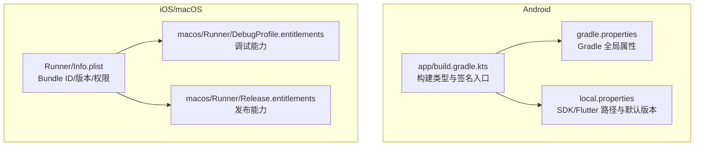
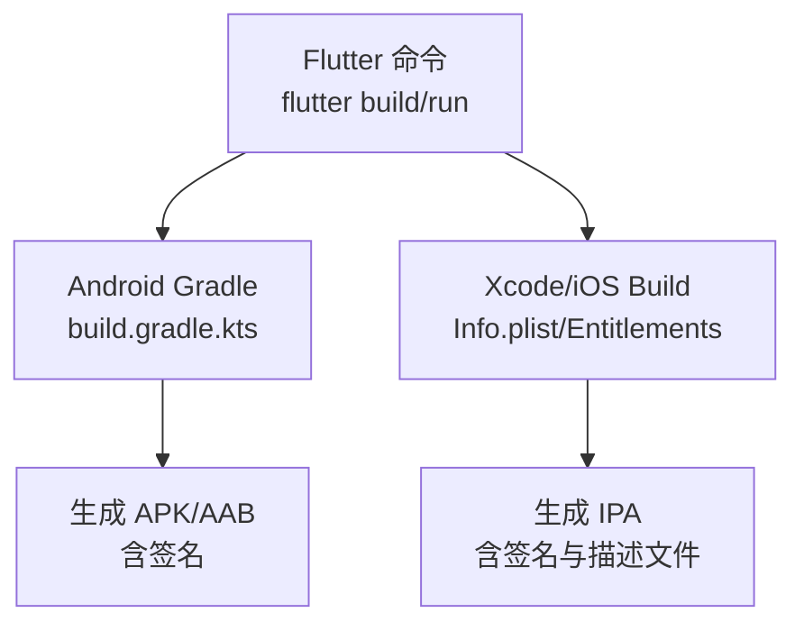
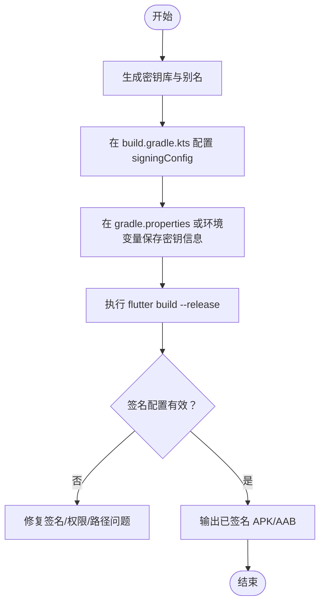
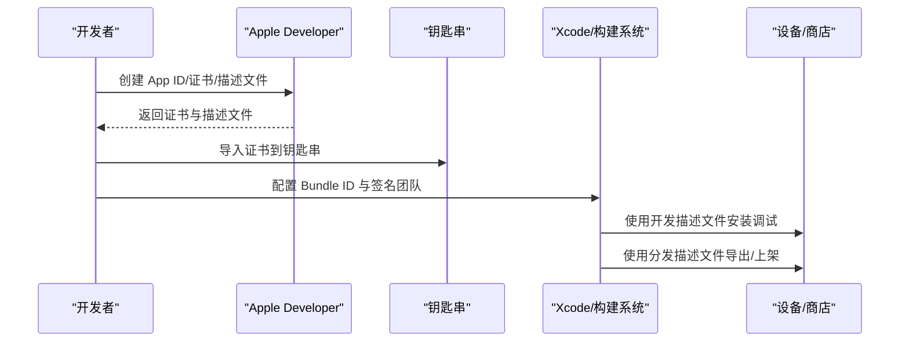
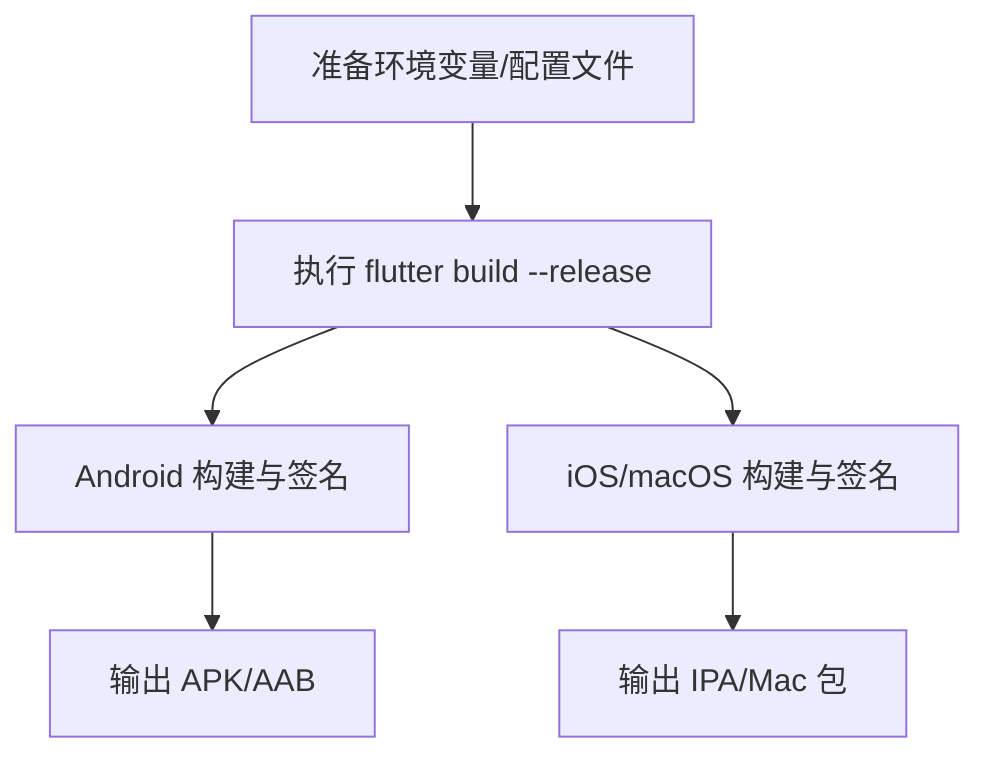
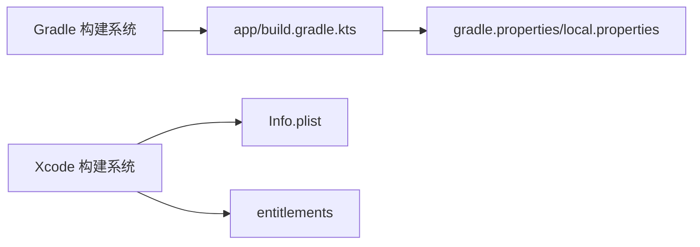

# 签名与证书管理

<cite>
**本文引用的文件**   
- [android/app/build.gradle.kts](file://android/app/build.gradle.kts)
- [android/gradle.properties](file://android/gradle.properties)
- [android/local.properties](file://android/local.properties)
- [ios/Runner/Info.plist](file://ios/Runner/Info.plist)
- [macos/Runner/DebugProfile.entitlements](file://macos/Runner/DebugProfile.entitlements)
- [macos/Runner/Release.entitlements](file://macos/Runner/Release.entitlements)
</cite>

## 目录
1. [简介](#简介)
2. [项目结构](#项目结构)
3. [核心组件](#核心组件)
4. [架构总览](#架构总览)
5. [详细组件分析](#详细组件分析)
6. [依赖分析](#依赖分析)
7. [性能考虑](#性能考虑)
8. [故障排查指南](#故障排查指南)
9. [结论](#结论)
10. [附录](#附录)

## 简介
本文件为“会迹”Flutter 项目的签名与证书管理指南，覆盖 Android 应用签名、iOS/macOS 应用签名与描述文件管理、Flutter 工程中的签名配置方法（命令行参数、配置文件、环境变量），以及密钥安全存储最佳实践与常见问题诊断。文档基于仓库中现有构建与平台配置文件进行说明，确保与实际工程一致。

## 项目结构
本项目为 Flutter 多端工程，Android 与 iOS/macOS 的签名相关配置分别位于各自平台目录：
- Android 侧通过 Gradle 构建脚本定义构建类型与签名配置入口，并通过 local.properties 指定 SDK 与 Flutter 路径等环境信息。
- iOS/macOS 侧通过 Info.plist 声明 Bundle 标识、版本信息与权限；macOS 侧使用 entitlements 文件声明沙箱与能力开关。

**图表来源** 
- [android/app/build.gradle.kts:1-60](file://android/app/build.gradle.kts#L1-L60)
- [android/gradle.properties:1-7](file://android/gradle.properties#L1-L7)
- [android/local.properties:1-5](file://android/local.properties#L1-L5)
- [ios/Runner/Info.plist:1-77](file://ios/Runner/Info.plist#L1-L77)
- [macos/Runner/DebugProfile.entitlements:1-13](file://macos/Runner/DebugProfile.entitlements#L1-L13)
- [macos/Runner/Release.entitlements:1-9](file://macos/Runner/Release.entitlements#L1-L9)

**章节来源**
- [android/app/build.gradle.kts:1-60](file://android/app/build.gradle.kts#L1-L60)
- [android/gradle.properties:1-7](file://android/gradle.properties#L1-L7)
- [android/local.properties:1-5](file://android/local.properties#L1-L5)
- [ios/Runner/Info.plist:1-77](file://ios/Runner/Info.plist#L1-L77)
- [macos/Runner/DebugProfile.entitlements:1-13](file://macos/Runner/DebugProfile.entitlements#L1-L13)
- [macos/Runner/Release.entitlements:1-9](file://macos/Runner/Release.entitlements#L1-L9)

## 核心组件
- Android 构建与签名
  - 构建类型：debug 与 release，release 当前复用 debug 签名以便快速验证。
  - 应用标识与版本：applicationId、versionCode、versionName 由 Gradle 与 Flutter 变量共同决定。
  - 构建模式与环境：通过 gradle.properties 与 local.properties 控制编译选项、SDK/Flutter 路径与默认版本。
- iOS/macOS 应用清单与能力
  - Info.plist 定义 Bundle Identifier、显示名称、版本号、权限声明（如麦克风）。
  - macOS entitlements 区分调试与发布的能力开关（如 JIT、网络服务、沙箱）。

**章节来源**
- [android/app/build.gradle.kts:17-48](file://android/app/build.gradle.kts#L17-L48)
- [android/gradle.properties:1-7](file://android/gradle.properties#L1-L7)
- [android/local.properties:1-5](file://android/local.properties#L1-L5)
- [ios/Runner/Info.plist:1-77](file://ios/Runner/Info.plist#L1-L77)
- [macos/Runner/DebugProfile.entitlements:1-13](file://macos/Runner/DebugProfile.entitlements#L1-L13)
- [macos/Runner/Release.entitlements:1-9](file://macos/Runner/Release.entitlements#L1-L9)

## 架构总览
下图展示 Flutter 应用在 Android 与 iOS/macOS 上的签名与构建关系：Flutter 调用平台构建系统（Gradle/Xcode），平台层读取各自的配置文件完成签名与打包。

[该图为概念性架构图，不直接映射具体代码文件]

## 详细组件分析

### Android 签名流程与配置
- 生成密钥库与别名
  - 使用 keytool 或 IDE 生成 .keystore 文件，记录别名、密码与有效期。
- 配置签名信息
  - 在 app/build.gradle.kts 的 buildTypes.release 中设置 signingConfig 指向自定义签名配置。
  - 将密钥库路径、别名与密码放入 gradle.properties 或 keystore.properties（推荐通过环境变量注入，避免入库）。
- 调试与发布签名的区别
  - debug：自动使用系统调试密钥，便于本地运行与联调。
  - release：必须使用正式密钥，关闭混淆/调试符号按需开启，用于上架与分发。
- 构建与运行
  - flutter run --release 会使用 release 签名（需正确配置）。
  - flutter build apk --release / flutter build appbundle --release 输出可分发包。

**图表来源** 
- [android/app/build.gradle.kts:42-48](file://android/app/build.gradle.kts#L42-L48)
- [android/gradle.properties:1-7](file://android/gradle.properties#L1-L7)
- [android/local.properties:1-5](file://android/local.properties#L1-L5)

**章节来源**
- [android/app/build.gradle.kts:17-48](file://android/app/build.gradle.kts#L17-L48)
- [android/gradle.properties:1-7](file://android/gradle.properties#L1-L7)
- [android/local.properties:1-5](file://android/local.properties#L1-L5)

### iOS/macOS 签名流程与描述文件管理
- 开发证书与分发证书
  - 在 Apple Developer 创建 App ID、证书（Development/Distribution）、Provisioning Profile（描述文件）。
  - 将证书导入钥匙串，并在 Xcode 中关联 Team 与 Bundle Identifier。
- 描述文件的创建与管理
  - Development：用于真机调试，绑定设备 UDID。
  - Ad Hoc/App Store：用于测试或上架，限制分发范围。
- 工程配置要点
  - Info.plist 中的 CFBundleIdentifier 需与 App ID 一致。
  - macOS 侧根据目标选择对应 entitlements（调试 vs 发布）。
- 构建与导出
  - Xcode 或 xcrun 配合描述文件完成签名与打包。

[该图为概念性流程图，不直接映射具体代码文件]

**章节来源**
- [ios/Runner/Info.plist:1-77](file://ios/Runner/Info.plist#L1-L77)
- [macos/Runner/DebugProfile.entitlements:1-13](file://macos/Runner/DebugProfile.entitlements#L1-L13)
- [macos/Runner/Release.entitlements:1-9](file://macos/Runner/Release.entitlements#L1-L9)

### Flutter 项目的签名配置方法
- 命令行参数
  - flutter build apk --release / flutter build appbundle --release
  - flutter build ios --release / flutter build macos --release
- 配置文件
  - Android：app/build.gradle.kts 的 buildTypes.release.signingConfig；gradle.properties 存放敏感信息。
  - iOS/macOS：Xcode 工程签名设置与 Info.plist/entitlements。
- 环境变量
  - 可通过环境变量注入密钥库路径、别名与密码，避免硬编码。
  - 示例：在 CI 中将密钥信息写入 gradle.properties 或通过 export 传入。

[该图为概念性流程图，不直接映射具体代码文件]

**章节来源**
- [android/app/build.gradle.kts:42-48](file://android/app/build.gradle.kts#L42-L48)
- [android/gradle.properties:1-7](file://android/gradle.properties#L1-L7)
- [android/local.properties:1-5](file://android/local.properties#L1-L5)
- [ios/Runner/Info.plist:1-77](file://ios/Runner/Info.plist#L1-L77)

### 证书与安全存储最佳实践
- 密钥管理
  - 使用受保护的硬件或企业级密钥管理服务（KMS）保管私钥。
  - 最小化密钥暴露面，仅 CI/CD 与签名机器持有。
- 权限控制
  - 限制对密钥库文件的访问权限，禁止提交至版本库。
  - 在 CI 中使用加密变量或密钥管理服务注入。
- 备份恢复
  - 离线备份密钥库与描述文件，采用加密存储与严格访问控制。
  - 定期演练恢复流程，确保灾难恢复可用。

[本节为通用指导，不直接分析具体文件]

### 常见签名问题的诊断与解决方法
- 证书过期
  - 现象：构建失败或安装失败，提示证书无效。
  - 处理：更新 Apple 证书与描述文件，重新导入钥匙串并刷新 Xcode 签名缓存。
- 权限不足
  - 现象：无法读取密钥库或写入输出目录。
  - 处理：检查文件权限、CI 用户权限与磁盘空间；确认密钥库路径正确。
- 平台不匹配
  - 现象：Bundle ID 与 App ID 不一致、描述文件与签名不匹配。
  - 处理：核对 Info.plist 的 Bundle Identifier、Xcode Team 与描述文件适用范围。
- Android 特定
  - 现象：release 仍使用 debug 签名或签名校验失败。
  - 处理：确认 buildTypes.release.signingConfig 指向正确的签名配置；清理重建。

**章节来源**
- [android/app/build.gradle.kts:42-48](file://android/app/build.gradle.kts#L42-L48)
- [ios/Runner/Info.plist:1-77](file://ios/Runner/Info.plist#L1-L77)

## 依赖分析
- Android 构建依赖
  - build.gradle.kts 依赖 Gradle 插件与 Flutter Gradle 插件，读取 local.properties 与 gradle.properties 的环境变量。
- iOS/macOS 构建依赖
  - Info.plist 提供 Bundle 元数据；entitlements 控制运行时能力；Xcode 负责证书与描述文件解析。

**图表来源** 
- [android/app/build.gradle.kts:1-60](file://android/app/build.gradle.kts#L1-L60)
- [android/gradle.properties:1-7](file://android/gradle.properties#L1-L7)
- [android/local.properties:1-5](file://android/local.properties#L1-L5)
- [ios/Runner/Info.plist:1-77](file://ios/Runner/Info.plist#L1-L77)
- [macos/Runner/DebugProfile.entitlements:1-13](file://macos/Runner/DebugProfile.entitlements#L1-L13)
- [macos/Runner/Release.entitlements:1-9](file://macos/Runner/Release.entitlements#L1-L9)

**章节来源**
- [android/app/build.gradle.kts:1-60](file://android/app/build.gradle.kts#L1-L60)
- [android/gradle.properties:1-7](file://android/gradle.properties#L1-L7)
- [android/local.properties:1-5](file://android/local.properties#L1-L5)
- [ios/Runner/Info.plist:1-77](file://ios/Runner/Info.plist#L1-L77)
- [macos/Runner/DebugProfile.entitlements:1-13](file://macos/Runner/DebugProfile.entitlements#L1-L13)
- [macos/Runner/Release.entitlements:1-9](file://macos/Runner/Release.entitlements#L1-L9)

## 性能考虑
- 构建缓存
  - 启用 Gradle 构建缓存与守护进程，减少重复构建时间。
- 并行构建
  - 合理设置 JVM 内存与线程数，避免 OOM 与频繁 GC。
- 增量构建
  - 保持模块解耦与依赖稳定，提升增量构建命中率。

[本节为通用指导，不直接分析具体文件]

## 故障排查指南
- 快速定位
  - 查看构建日志中的签名错误行，确认使用的签名配置与证书链。
- 常见症状
  - 证书无效/过期：更新证书与描述文件。
  - 权限不足：检查文件系统权限与 CI 用户上下文。
  - 平台不匹配：核对 Bundle ID、App ID 与描述文件范围。
- 回滚策略
  - 保留上一版成功构建产物与签名配置快照，必要时回滚。

**章节来源**
- [android/app/build.gradle.kts:42-48](file://android/app/build.gradle.kts#L42-L48)
- [ios/Runner/Info.plist:1-77](file://ios/Runner/Info.plist#L1-L77)

## 结论
通过对 Android 与 iOS/macOS 的签名与证书管理进行系统化梳理，结合项目现有配置文件，明确了调试与发布签名的差异、Flutter 工程的签名配置方法与密钥安全最佳实践。遵循本文档的流程与实践，可有效降低签名相关问题风险，保障构建与分发的稳定性与安全性。

## 附录
- 术语表
  - 密钥库（Keystore）：存储私钥与证书的容器文件。
  - 描述文件（Provisioning Profile）：iOS/macOS 应用的签名与授权描述。
  - 构建类型（Build Type）：如 debug/release，决定构建行为与签名策略。
- 参考路径
  - Android 签名入口：app/build.gradle.kts 的 buildTypes.release
  - iOS/macOS 清单与能力：Info.plist 与 entitlements

[本节为补充信息，不直接分析具体文件]