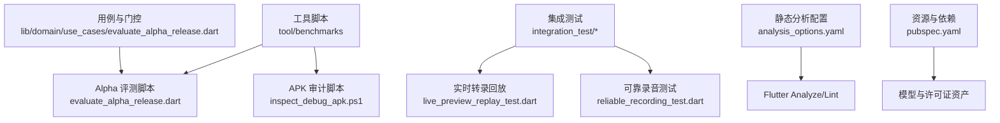
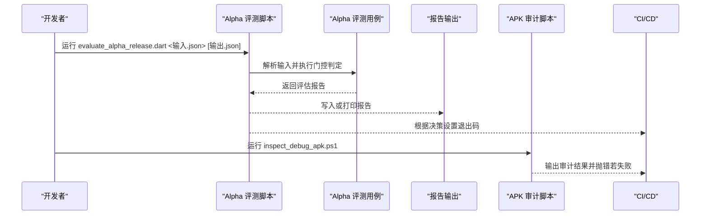
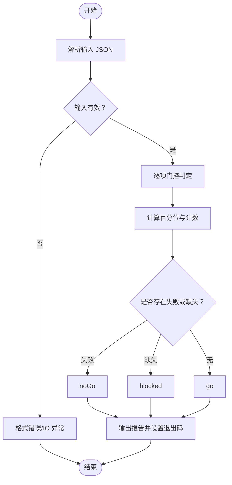
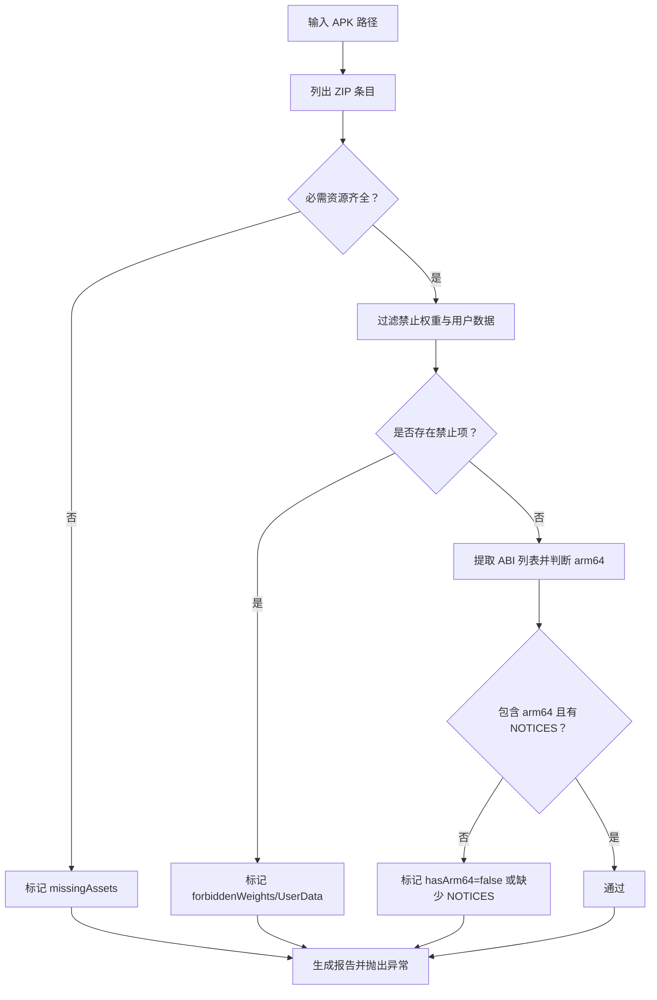
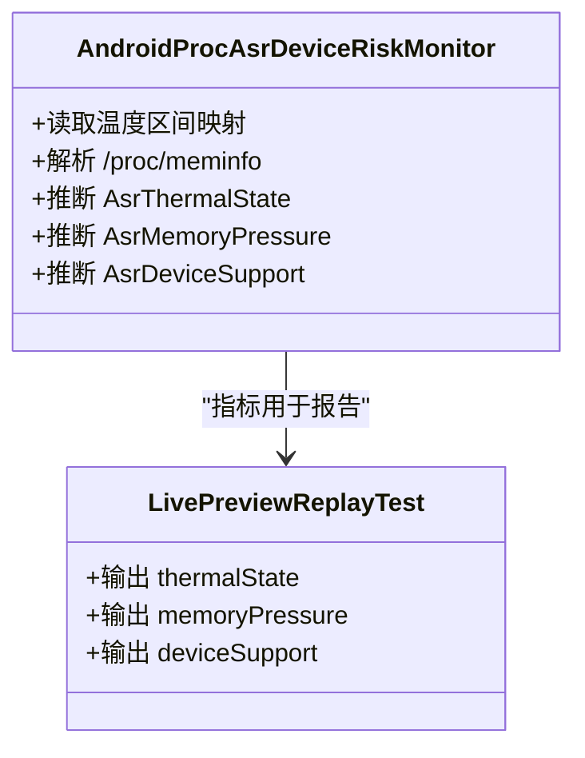
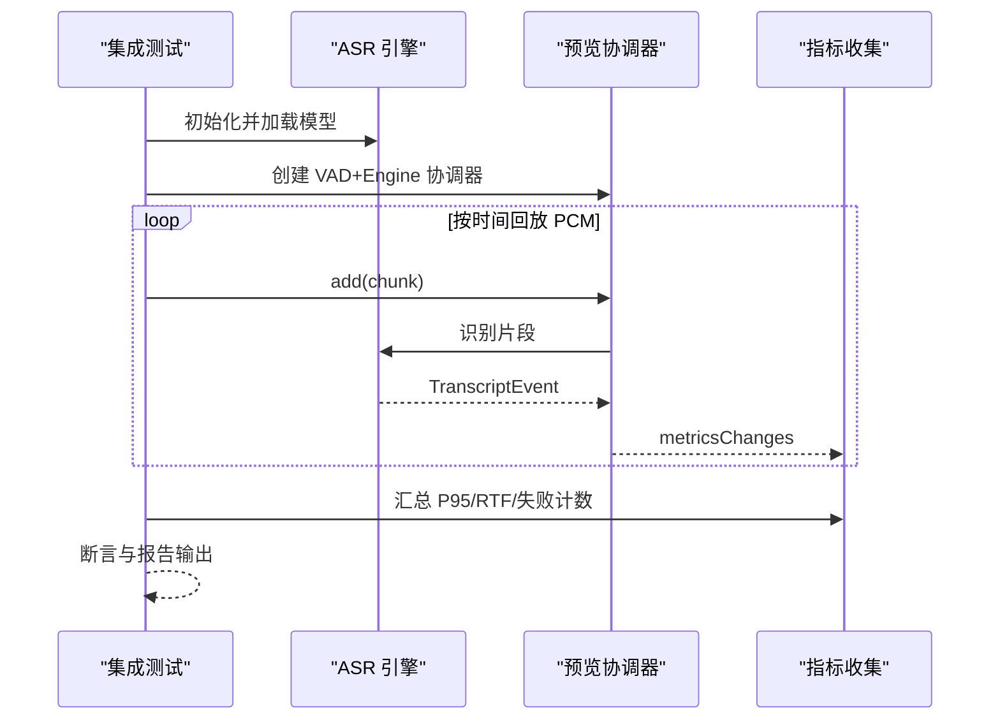
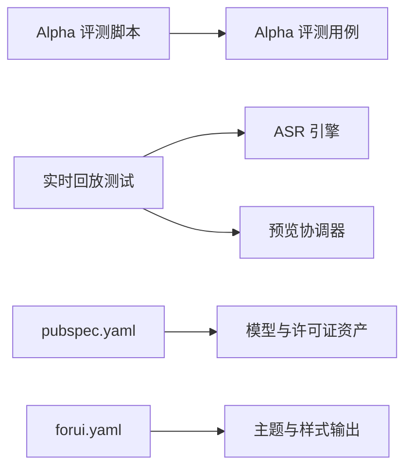

# 质量保证与评估

<cite>
**本文引用的文件**   
- [evaluate_alpha_release.dart](file://tool/benchmarks/evaluate_alpha_release.dart)
- [inspect_debug_apk.ps1](file://tool/benchmarks/inspect_debug_apk.ps1)
- [alpha_release_input.example.json](file://tool/benchmarks/alpha_release_input.example.json)
- [evaluate_alpha_release.dart](file://lib/domain/use_cases/evaluate_alpha_release.dart)
- [analysis_options.yaml](file://analysis_options.yaml)
- [pubspec.yaml](file://pubspec.yaml)
- [forui.yaml](file://forui.yaml)
- [live_preview_replay_test.dart](file://integration_test/live_preview_replay_test.dart)
- [reliable_recording_test.dart](file://integration_test/reliable_recording_test.dart)
- [android_proc_asr_device_risk_monitor.dart](file://lib/data/services/asr/android_proc_asr_device_risk_monitor.dart)
- [SKILL.md](file://.agents/skills/dart-collect-coverage/SKILL.md)
</cite>

## 目录
1. [简介](#简介)
2. [项目结构](#项目结构)
3. [核心组件](#核心组件)
4. [架构总览](#架构总览)
5. [详细组件分析](#详细组件分析)
6. [依赖关系分析](#依赖关系分析)
7. [性能考量](#性能考量)
8. [故障排查指南](#故障排查指南)
9. [结论](#结论)
10. [附录](#附录)

## 简介
本文件面向会迹（MeetTrace）项目的质量保证与评估，覆盖以下关键主题：
- 性能评估工具使用：Alpha 版本评估脚本、APK 分析工具、内存与热状态监控。
- 代码质量检查流程：静态分析规则、覆盖率统计、重复代码检测建议。
- 基准测试与性能回归：关键路径性能监控、用户体验指标收集。
- 调试与优化技巧：日志分析、瓶颈定位、内存泄漏检测。
- 质量门禁配置：自动化检查、失败处理、报告生成。
- 持续改进最佳实践与常见问题解决方案。

## 项目结构
本项目为 Flutter 多端应用，质量相关能力分布在如下位置：
- tool/benchmarks：发布前 Alpha 评测脚本与 APK 审计脚本。
- lib/domain/use_cases：Alpha 评测用例与门控判定逻辑。
- integration_test：集成测试用于真实设备回放与录音连续性验证。
- analysis_options.yaml：Dart 静态分析与 Lint 规则。
- pubspec.yaml：资源清单与依赖声明（含模型与许可证文件）。
- forui.yaml：UI 生成配置（与质量无关但影响构建产物）。
- .agents/skills：覆盖率采集技能文档（指导覆盖率工作流）。

**图示来源** 
- [evaluate_alpha_release.dart:1-51](file://tool/benchmarks/evaluate_alpha_release.dart#L1-L51)
- [inspect_debug_apk.ps1:1-61](file://tool/benchmarks/inspect_debug_apk.ps1#L1-L61)
- [evaluate_alpha_release.dart:1-532](file://lib/domain/use_cases/evaluate_alpha_release.dart#L1-L532)
- [live_preview_replay_test.dart:1-218](file://integration_test/live_preview_replay_test.dart#L1-L218)
- [reliable_recording_test.dart:1-86](file://integration_test/reliable_recording_test.dart#L1-L86)
- [analysis_options.yaml:1-35](file://analysis_options.yaml#L1-L35)
- [pubspec.yaml:1-112](file://pubspec.yaml#L1-L112)

**章节来源**
- [evaluate_alpha_release.dart:1-51](file://tool/benchmarks/evaluate_alpha_release.dart#L1-L51)
- [inspect_debug_apk.ps1:1-61](file://tool/benchmarks/inspect_debug_apk.ps1#L1-L61)
- [evaluate_alpha_release.dart:1-532](file://lib/domain/use_cases/evaluate_alpha_release.dart#L1-L532)
- [analysis_options.yaml:1-35](file://analysis_options.yaml#L1-L35)
- [pubspec.yaml:1-112](file://pubspec.yaml#L1-L112)

## 核心组件
- Alpha 版本评估脚本：读取输入 JSON，调用用例执行门控判定，输出结构化报告并设置退出码。
- Alpha 评测用例：定义输入模型、门控项、阈值与决策逻辑（go/noGo/blocked）。
- APK 审计脚本：校验 APK 包内资源完整性、禁止权重与用户数据、ABI 与通知文件。
- 集成测试：在真机上回放 PCM 测量 RTF/P95 延迟；验证前台/后台切换下录音连续性与原子封存。
- 静态分析：通过 analysis_options.yaml 启用严格模式与 Flutter Lints。
- 覆盖率采集：参考技能文档使用 coverage 工具链生成 LCOV。

**章节来源**
- [evaluate_alpha_release.dart:1-51](file://tool/benchmarks/evaluate_alpha_release.dart#L1-L51)
- [evaluate_alpha_release.dart:1-532](file://lib/domain/use_cases/evaluate_alpha_release.dart#L1-L532)
- [inspect_debug_apk.ps1:1-61](file://tool/benchmarks/inspect_debug_apk.ps1#L1-L61)
- [live_preview_replay_test.dart:1-218](file://integration_test/live_preview_replay_test.dart#L1-L218)
- [reliable_recording_test.dart:1-86](file://integration_test/reliable_recording_test.dart#L1-L86)
- [analysis_options.yaml:1-35](file://analysis_options.yaml#L1-L35)
- [SKILL.md:1-142](file://.agents/skills/dart-collect-coverage/SKILL.md#L1-L142)

## 架构总览
Alpha 评测与 APK 审计构成发布门禁的核心链路：输入 JSON 驱动用例计算门控结果，APK 审计确保包体合规，集成测试提供关键路径性能与稳定性证据。

**图示来源** 
- [evaluate_alpha_release.dart:1-51](file://tool/benchmarks/evaluate_alpha_release.dart#L1-L51)
- [evaluate_alpha_release.dart:239-396](file://lib/domain/use_cases/evaluate_alpha_release.dart#L239-L396)
- [inspect_debug_apk.ps1:1-61](file://tool/benchmarks/inspect_debug_apk.ps1#L1-L61)

## 详细组件分析

### Alpha 版本评估脚本与用例
- 输入格式：遵循 schemaVersion 3 的 JSON，包含语料、环境、SenseVoice 指标、验收证据与发布审计标志。
- 门控项：涵盖语料去敏与数量、设备标识、后台录音、中断恢复、可访问性、下载体积、RTF P95、句后出字延迟、最终转录时长、录音完整率、热状态、电量变化、温度、内存峰值、关键事实召回率、AT-01~AT-15 证据数、APK/iOS 构建审计、许可确认等。
- 决策：存在失败则 noGo，存在缺失则 blocked，否则 go。
- 输出：结构化 JSON，包含度量与门控明细。

**图示来源** 
- [evaluate_alpha_release.dart:1-51](file://tool/benchmarks/evaluate_alpha_release.dart#L1-L51)
- [evaluate_alpha_release.dart:239-396](file://lib/domain/use_cases/evaluate_alpha_release.dart#L239-L396)

**章节来源**
- [evaluate_alpha_release.dart:1-51](file://tool/benchmarks/evaluate_alpha_release.dart#L1-L51)
- [evaluate_alpha_release.dart:1-532](file://lib/domain/use_cases/evaluate_alpha_release.dart#L1-L532)
- [alpha_release_input.example.json:1-34](file://tool/benchmarks/alpha_release_input.example.json#L1-L34)

### APK 分析工具
- 功能：校验 APK 中必需资源是否存在、禁止权重与用户数据是否被打包、ABI 列表是否包含 arm64-v8a、Flutter 通知文件是否存在。
- 输出：JSON 报告，包含 apkPath、apkBytes、abis、hasArm64、requiredAssets、missingAssets、forbiddenWeights、forbiddenUserData 等。
- 失败条件：缺少 arm64、缺少 NOTICES、存在缺失资源、存在禁止权重或用户数据。

**图示来源** 
- [inspect_debug_apk.ps1:1-61](file://tool/benchmarks/inspect_debug_apk.ps1#L1-L61)

**章节来源**
- [inspect_debug_apk.ps1:1-61](file://tool/benchmarks/inspect_debug_apk.ps1#L1-L61)

### 内存使用与热状态监控
- Android 设备风险监测：从系统节点读取温度与内存信息，划分热状态等级与内存压力，并据此推断设备支持度。
- 集成测试中的设备风险字段：在回放报告中输出 memoryPressure、thermalState、deviceSupport 等，便于回溯与对比。

**图示来源** 
- [android_proc_asr_device_risk_monitor.dart:71-119](file://lib/data/services/asr/android_proc_asr_device_risk_monitor.dart#L71-L119)
- [live_preview_replay_test.dart:150-180](file://integration_test/live_preview_replay_test.dart#L150-L180)

**章节来源**
- [android_proc_asr_device_risk_monitor.dart:71-119](file://lib/data/services/asr/android_proc_asr_device_risk_monitor.dart#L71-L119)
- [live_preview_replay_test.dart:1-218](file://integration_test/live_preview_replay_test.dart#L1-L218)

### 基准测试与性能回归
- 实时转录回放测试：按真实时间回放 PCM，统计事件延迟 P95、窗口 RTF P95、累计 RTF、失败窗口数、最大队列延迟与预览滞后等。
- 可靠录音测试：验证前后台切换时 PCM 持续写入、原子封存、完整性比率与检查点状态。
- 回归策略：将 P95 延迟与 RTF 作为基线指标，CI 中比较历史基线，超阈即告警或阻断。

**图示来源** 
- [live_preview_replay_test.dart:34-202](file://integration_test/live_preview_replay_test.dart#L34-L202)
- [reliable_recording_test.dart:22-85](file://integration_test/reliable_recording_test.dart#L22-L85)

**章节来源**
- [live_preview_replay_test.dart:1-218](file://integration_test/live_preview_replay_test.dart#L1-L218)
- [reliable_recording_test.dart:1-86](file://integration_test/reliable_recording_test.dart#L1-L86)

### 代码质量检查流程
- 静态分析：通过 analysis_options.yaml 启用 strict-casts/inference/raw-types 与 flutter_lints，IDE 与命令行均可执行。
- 覆盖率：参考 dart-collect-coverage 技能文档，使用 coverage:test_with_coverage 生成 LCOV，支持忽略指令与函数/分支级覆盖率。
- 重复代码检测：建议使用 Dart/Flutter 生态工具（如 pana、custom scripts）结合 CI 进行扫描与告警。

**章节来源**
- [analysis_options.yaml:1-35](file://analysis_options.yaml#L1-L35)
- [SKILL.md:1-142](file://.agents/skills/dart-collect-coverage/SKILL.md#L1-L142)

### 质量门禁配置
- Alpha 评测门禁：脚本根据决策设置退出码（go=0, noGo=1, blocked=2），CI 中阻断失败分支。
- APK 审计门禁：脚本在发现问题时抛出异常，CI 捕获并失败。
- 报告生成：Alpha 评测输出 JSON 报告；APK 审计输出 .spike/results/apk-inspection.json。

**章节来源**
- [evaluate_alpha_release.dart:1-51](file://tool/benchmarks/evaluate_alpha_release.dart#L1-L51)
- [inspect_debug_apk.ps1:40-61](file://tool/benchmarks/inspect_debug_apk.ps1#L40-L61)

## 依赖关系分析
- 评测脚本依赖领域用例（AlphaReleaseEvaluationInput/EvaluateAlphaReleaseUseCase）。
- 集成测试依赖 ASR/VAD 引擎与预览协调器，输出设备风险与性能指标。
- 资源清单（pubspec.yaml）声明模型与许可证文件，确保构建产物一致性。
- UI 生成配置（forui.yaml）影响样式与主题输出路径。

**图示来源** 
- [evaluate_alpha_release.dart:1-51](file://tool/benchmarks/evaluate_alpha_release.dart#L1-L51)
- [evaluate_alpha_release.dart:1-532](file://lib/domain/use_cases/evaluate_alpha_release.dart#L1-L532)
- [live_preview_replay_test.dart:1-218](file://integration_test/live_preview_replay_test.dart#L1-L218)
- [pubspec.yaml:1-112](file://pubspec.yaml#L1-L112)
- [forui.yaml:1-13](file://forui.yaml#L1-L13)

**章节来源**
- [evaluate_alpha_release.dart:1-51](file://tool/benchmarks/evaluate_alpha_release.dart#L1-L51)
- [evaluate_alpha_release.dart:1-532](file://lib/domain/use_cases/evaluate_alpha_release.dart#L1-L532)
- [live_preview_replay_test.dart:1-218](file://integration_test/live_preview_replay_test.dart#L1-L218)
- [pubspec.yaml:1-112](file://pubspec.yaml#L1-L112)
- [forui.yaml:1-13](file://forui.yaml#L1-L13)

## 性能考量
- 关键指标：RTF P95、句后出字延迟 P95、最终转录时长、录音完整率、内存峰值、温度与电量变化。
- 基线与回归：以集成测试输出的 P95 与 RTF 作为基线，CI 中比较历史值，超阈触发告警。
- 设备差异：arm64 真机优先，关注低端设备与弱网场景下的表现。
- 资源控制：运行时下载体积限制、禁止权重打包入 APK，避免安装包膨胀。

[本节为通用指导，不直接分析具体文件]

## 故障排查指南
- Alpha 评测失败：检查输入 JSON 结构与必填字段，核对门控阈值与证据引用。
- APK 审计失败：确认必需资源存在、未打包禁止权重与用户数据、ABI 包含 arm64 且存在 NOTICES。
- 回放测试失败：核查 PCM 路径、模型 SHA256、VAD 模型路径与环境变量；检查事件延迟与失败窗口计数。
- 录音连续性失败：检查存储容量、前台生命周期、检查点持久化与完整性比率。
- 静态分析失败：修复 Lint 问题，必要时添加忽略注释并说明理由。
- 覆盖率不足：补充测试用例或使用忽略指令排除不可测代码。

**章节来源**
- [evaluate_alpha_release.dart:1-51](file://tool/benchmarks/evaluate_alpha_release.dart#L1-L51)
- [inspect_debug_apk.ps1:1-61](file://tool/benchmarks/inspect_debug_apk.ps1#L1-L61)
- [live_preview_replay_test.dart:1-218](file://integration_test/live_preview_replay_test.dart#L1-L218)
- [reliable_recording_test.dart:1-86](file://integration_test/reliable_recording_test.dart#L1-L86)
- [analysis_options.yaml:1-35](file://analysis_options.yaml#L1-L35)

## 结论
通过 Alpha 评测脚本、APK 审计与集成测试的组合，项目建立了完善的发布门禁与性能回归体系。配合静态分析与覆盖率采集，可有效保障代码质量与用户体验。建议在 CI 中固化上述流程，形成持续的质量反馈闭环。

[本节为总结，不直接分析具体文件]

## 附录
- 输入示例：见 alpha_release_input.example.json，用于构造评测输入。
- 覆盖率工作流：参考 dart-collect-coverage 技能文档，使用 coverage 工具链生成 LCOV 报告。
- 资源清单：pubspec.yaml 中声明模型与许可证文件，确保构建一致性与合规性。

**章节来源**
- [alpha_release_input.example.json:1-34](file://tool/benchmarks/alpha_release_input.example.json#L1-L34)
- [SKILL.md:1-142](file://.agents/skills/dart-collect-coverage/SKILL.md#L1-L142)
- [pubspec.yaml:1-112](file://pubspec.yaml#L1-L112)