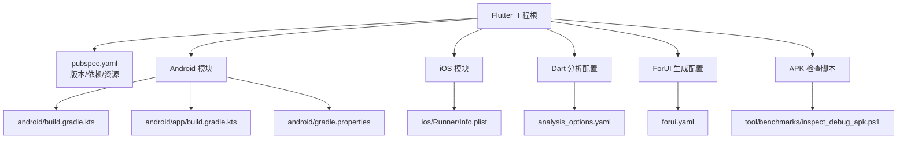
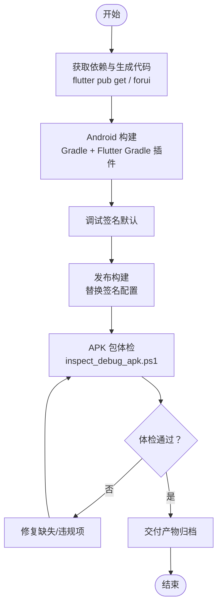
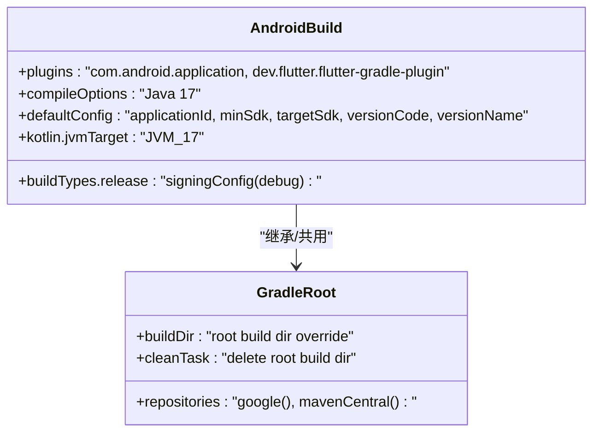
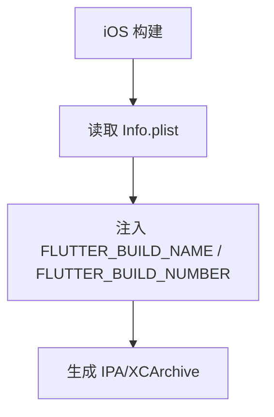
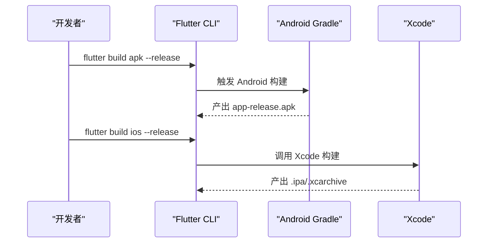
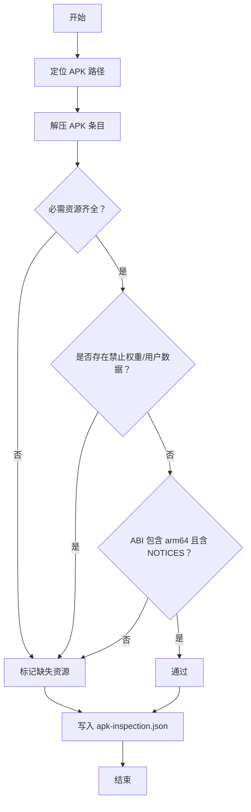
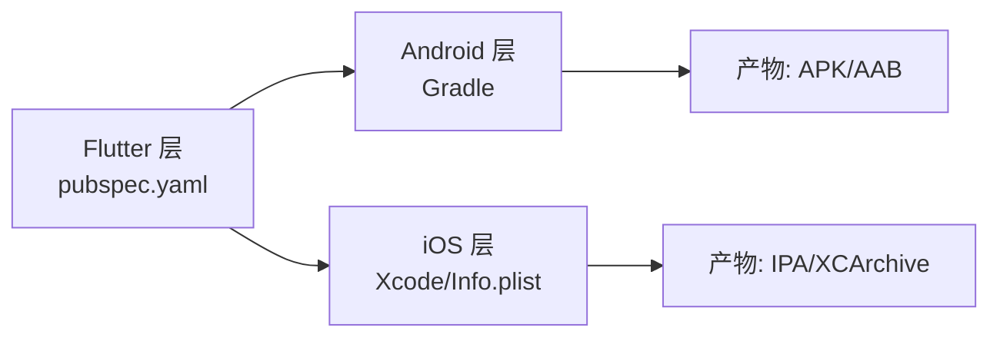

# 部署与分发

<cite>
**本文引用的文件**   
- [pubspec.yaml](file://pubspec.yaml)
- [android/build.gradle.kts](file://android/build.gradle.kts)
- [android/app/build.gradle.kts](file://android/app/build.gradle.kts)
- [android/gradle.properties](file://android/gradle.properties)
- [ios/Runner/Info.plist](file://ios/Runner/Info.plist)
- [analysis_options.yaml](file://analysis_options.yaml)
- [forui.yaml](file://forui.yaml)
- [tool/benchmarks/inspect_debug_apk.ps1](file://tool/benchmarks/inspect_debug_apk.ps1)
</cite>

## 目录
1. [简介](#简介)
2. [项目结构](#项目结构)
3. [核心组件](#核心组件)
4. [架构总览](#架构总览)
5. [详细组件分析](#详细组件分析)
6. [依赖分析](#依赖分析)
7. [性能考量](#性能考量)
8. [故障排查指南](#故障排查指南)
9. [结论](#结论)
10. [附录](#附录)

## 简介
本文件面向会迹（MeetTrace）项目的构建、签名、发布与质量保障，覆盖 Android Gradle 配置、iOS Xcode 配置、Flutter 构建脚本、持续集成流程、应用商店提交要求、版本管理、性能评估与质量检查工具使用，以及回滚策略与热更新方案。文档以仓库现有配置为依据，提供可操作的步骤与最佳实践建议。

## 项目结构
本项目为 Flutter 多端工程，包含 Android、iOS、macOS、Windows、Linux 与 Web 平台。与部署和分发直接相关的核心文件包括：
- Flutter 包元数据与资源清单：pubspec.yaml
- Android 构建配置：android/build.gradle.kts、android/app/build.gradle.kts、android/gradle.properties
- iOS 应用元数据：ios/Runner/Info.plist
- Dart 静态分析与 Lint：analysis_options.yaml
- ForUI 代码生成配置：forui.yaml
- APK 包体检查脚本：tool/benchmarks/inspect_debug_apk.ps1

**图表来源** 
- [pubspec.yaml:1-112](file://pubspec.yaml#L1-L112)
- [android/build.gradle.kts:1-25](file://android/build.gradle.kts#L1-L25)
- [android/app/build.gradle.kts:1-60](file://android/app/build.gradle.kts#L1-L60)
- [android/gradle.properties:1-7](file://android/gradle.properties#L1-L7)
- [ios/Runner/Info.plist:1-77](file://ios/Runner/Info.plist#L1-L77)
- [analysis_options.yaml:1-35](file://analysis_options.yaml#L1-L35)
- [forui.yaml:1-13](file://forui.yaml#L1-L13)
- [tool/benchmarks/inspect_debug_apk.ps1:1-61](file://tool/benchmarks/inspect_debug_apk.ps1#L1-L61)

**章节来源**
- [pubspec.yaml:1-112](file://pubspec.yaml#L1-L112)
- [android/build.gradle.kts:1-25](file://android/build.gradle.kts#L1-L25)
- [android/app/build.gradle.kts:1-60](file://android/app/build.gradle.kts#L1-L60)
- [android/gradle.properties:1-7](file://android/gradle.properties#L1-L7)
- [ios/Runner/Info.plist:1-77](file://ios/Runner/Info.plist#L1-L77)
- [analysis_options.yaml:1-35](file://analysis_options.yaml#L1-L35)
- [forui.yaml:1-13](file://forui.yaml#L1-L13)
- [tool/benchmarks/inspect_debug_apk.ps1:1-61](file://tool/benchmarks/inspect_debug_apk.ps1#L1-L61)

## 核心组件
- Flutter 包与版本：通过 pubspec.yaml 定义应用名称、描述、版本号与依赖；version 字段同时影响 Android 的 versionName/versionCode 与 iOS 的 CFBundleShortVersionString/CFBundleVersion。
- Android 构建：android/app/build.gradle.kts 中设置 applicationId、minSdk/targetSdk、buildTypes.release 的签名配置占位；android/build.gradle.kts 统一仓库源与构建目录；android/gradle.properties 配置 JVM 参数与 AndroidX。
- iOS 元数据：ios/Runner/Info.plist 声明显示名、Bundle ID、版本字符串、权限与后台模式等。
- 代码质量：analysis_options.yaml 启用严格类型推断与 Flutter Lints。
- ForUI 生成：forui.yaml 指定生成的样式、主题与字体输出路径。
- APK 检查：inspect_debug_apk.ps1 校验必要资源、禁止权重文件与用户数据打包情况，并输出报告。

**章节来源**
- [pubspec.yaml:1-112](file://pubspec.yaml#L1-L112)
- [android/app/build.gradle.kts:1-60](file://android/app/build.gradle.kts#L1-L60)
- [android/build.gradle.kts:1-25](file://android/build.gradle.kts#L1-L25)
- [android/gradle.properties:1-7](file://android/gradle.properties#L1-L7)
- [ios/Runner/Info.plist:1-77](file://ios/Runner/Info.plist#L1-L77)
- [analysis_options.yaml:1-35](file://analysis_options.yaml#L1-L35)
- [forui.yaml:1-13](file://forui.yaml#L1-L13)
- [tool/benchmarks/inspect_debug_apk.ps1:1-61](file://tool/benchmarks/inspect_debug_apk.ps1#L1-L61)

## 架构总览
下图展示从源码到可分发包的关键构建与验证环节，涵盖 Flutter 编译、Android Gradle 构建、iOS 元数据注入与 APK 包体检。

**图表来源** 
- [android/app/build.gradle.kts:1-60](file://android/app/build.gradle.kts#L1-L60)
- [android/build.gradle.kts:1-25](file://android/build.gradle.kts#L1-L25)
- [android/gradle.properties:1-7](file://android/gradle.properties#L1-L7)
- [tool/benchmarks/inspect_debug_apk.ps1:1-61](file://tool/benchmarks/inspect_debug_apk.ps1#L1-L61)

## 详细组件分析

### Android 构建与签名
- 构建入口与插件：android/app/build.gradle.kts 引入 com.android.application 与 dev.flutter.flutter-gradle-plugin，确保 Flutter 插件在 Android/Kotlin 插件之后应用。
- 编译与 NDK：compileSdk、ndkVersion 由 Flutter 模板提供；Java/Kotlin 目标版本设置为 17。
- 版本与包名：applicationId、minSdk、targetSdk、versionCode、versionName 由 defaultConfig 与 Flutter 属性驱动；支持通过环境变量或 target 参数为测试包添加后缀。
- 构建类型：release 构建当前使用 debug 签名占位，需替换为正式签名配置。
- 全局构建：android/build.gradle.kts 统一仓库源与构建目录，clean 任务清理根构建目录。
- Gradle 参数：android/gradle.properties 配置 JVM 内存与 AndroidX。

**图表来源** 
- [android/app/build.gradle.kts:1-60](file://android/app/build.gradle.kts#L1-L60)
- [android/build.gradle.kts:1-25](file://android/build.gradle.kts#L1-L25)
- [android/gradle.properties:1-7](file://android/gradle.properties#L1-L7)

**章节来源**
- [android/app/build.gradle.kts:1-60](file://android/app/build.gradle.kts#L1-L60)
- [android/build.gradle.kts:1-25](file://android/build.gradle.kts#L1-L25)
- [android/gradle.properties:1-7](file://android/gradle.properties#L1-L7)

### iOS 配置与元数据
- Info.plist 关键键值：CFBundleDisplayName、CFBundleIdentifier、CFBundleShortVersionString、CFBundleVersion、NSMicrophoneUsageDescription、UIBackgroundModes(audio) 等。
- 版本映射：CFBundleShortVersionString 与 CFBundleVersion 分别对应 Flutter 的 build-name 与 build-number。
- 界面方向与场景：UISupportedInterfaceOrientations、UIApplicationSceneManifest 等。

**图表来源** 
- [ios/Runner/Info.plist:1-77](file://ios/Runner/Info.plist#L1-L77)

**章节来源**
- [ios/Runner/Info.plist:1-77](file://ios/Runner/Info.plist#L1-L77)

### Flutter 构建脚本与资源
- 版本与依赖：pubspec.yaml 定义 version、dependencies、dev_dependencies 与 flutter.assets。
- ForUI 生成：forui.yaml 指定 snippet/style/theme/fonts 输出目录。
- 资源清单：assets/models 与 assets/licenses 下的 manifest.json 与许可文本被打包进应用。

**图表来源** 
- [pubspec.yaml:1-112](file://pubspec.yaml#L1-L112)
- [forui.yaml:1-13](file://forui.yaml#L1-L13)

**章节来源**
- [pubspec.yaml:1-112](file://pubspec.yaml#L1-L112)
- [forui.yaml:1-13](file://forui.yaml#L1-L13)

### 代码质量与静态分析
- analysis_options.yaml 启用 strict-casts、strict-inference、strict-raw-types，并包含 flutter_lints。
- 建议在 CI 中执行 flutter analyze 与自定义 lint 规则，阻断不合规代码合并。

**章节来源**
- [analysis_options.yaml:1-35](file://analysis_options.yaml#L1-L35)

### APK 包体检与模型权重管控
- inspect_debug_apk.ps1 检查 APK 是否包含必需资源、是否存在禁止的权重/用户数据文件、ABI 列表与 Flutter Notices。
- 失败条件：缺少 arm64、无 NOTICES.Z、缺失必需资源、存在禁止权重或用户数据文件。
- 输出：.spike/results/apk-inspection.json 报告。

**图表来源** 
- [tool/benchmarks/inspect_debug_apk.ps1:1-61](file://tool/benchmarks/inspect_debug_apk.ps1#L1-L61)

**章节来源**
- [tool/benchmarks/inspect_debug_apk.ps1:1-61](file://tool/benchmarks/inspect_debug_apk.ps1#L1-L61)

## 依赖分析
- 外部依赖：Flutter SDK、Android Gradle 插件、Kotlin 17、Xcode 与 iOS 工具链。
- 内部依赖：Flutter 层依赖由 pubspec.yaml 管理；Android 层依赖由 Gradle 管理；iOS 依赖由 Xcode 工程与 Pod 管理（如使用）。
- 构建目录隔离：android/build.gradle.kts 将构建产物集中至根 build 目录，便于 CI 缓存与清理。

**图表来源** 
- [pubspec.yaml:1-112](file://pubspec.yaml#L1-L112)
- [android/build.gradle.kts:1-25](file://android/build.gradle.kts#L1-L25)
- [android/app/build.gradle.kts:1-60](file://android/app/build.gradle.kts#L1-L60)
- [ios/Runner/Info.plist:1-77](file://ios/Runner/Info.plist#L1-L77)

**章节来源**
- [pubspec.yaml:1-112](file://pubspec.yaml#L1-L112)
- [android/build.gradle.kts:1-25](file://android/build.gradle.kts#L1-L25)
- [android/app/build.gradle.kts:1-60](file://android/app/build.gradle.kts#L1-L60)
- [ios/Runner/Info.plist:1-77](file://ios/Runner/Info.plist#L1-L77)

## 性能考量
- 构建性能：android/gradle.properties 已配置较大 JVM 堆与元空间，有助于大型项目构建；CI 中可启用 Gradle 守护进程与并行构建。
- 包体积控制：inspect_debug_apk.ps1 强制禁止将权重与用户数据打包进 APK，避免包体膨胀与合规风险。
- 运行时性能：录音与 ASR 相关能力涉及音频采集与本地推理，建议在真机上进行基准测试与内存分析（参考工具章节）。

[本节为通用指导，无需特定文件引用]

## 故障排查指南
- Android 构建失败：
  - 检查 Java/Kotlin 版本是否为 17；确认 compileSdk/targetSdk 与 NDK 版本匹配。
  - 若 release 构建报错，检查 signingConfig 是否正确配置。
- iOS 构建失败：
  - 核对 Info.plist 中的 Bundle ID、版本字符串与权限声明。
  - 确保 Xcode 工具链与签名证书可用。
- APK 体检失败：
  - 根据 inspect_debug_apk.ps1 报告修复缺失资源或移除禁止文件。
  - 确认 arm64 ABI 与 Flutter Notices 存在。

**章节来源**
- [android/app/build.gradle.kts:1-60](file://android/app/build.gradle.kts#L1-L60)
- [android/gradle.properties:1-7](file://android/gradle.properties#L1-L7)
- [ios/Runner/Info.plist:1-77](file://ios/Runner/Info.plist#L1-L77)
- [tool/benchmarks/inspect_debug_apk.ps1:1-61](file://tool/benchmarks/inspect_debug_apk.ps1#L1-L61)

## 结论
本项目具备清晰的 Flutter 构建与平台配置基础。为确保稳定发布，需在 Android 构建中完善签名配置，在 iOS 侧维护正确的元数据与签名流程，并在 CI 中集成静态分析、自动化测试与 APK 体检。结合版本管理与发布流水线，可实现高效、可控的分发与回滚。

[本节为总结性内容，无需特定文件引用]

## 附录

### 构建与签名操作要点
- Android 签名
  - 在 android/app/build.gradle.kts 的 buildTypes.release 中替换 signingConfig 为正式 keystore 配置。
  - 建议使用独立密钥库与别名，并通过环境变量传入密码，避免硬编码。
- iOS 签名
  - 在 Xcode 中配置 Signing & Capabilities，选择正确的 Team、Provisioning Profile 与证书。
  - 确保 Info.plist 的 Bundle Identifier 与 Apple Developer 账号一致。
- Flutter 构建命令
  - Android: flutter build apk --release 或 flutter build appbundle --release
  - iOS: flutter build ios --release --export-method=app-store 或 archive

**章节来源**
- [android/app/build.gradle.kts:1-60](file://android/app/build.gradle.kts#L1-L60)
- [ios/Runner/Info.plist:1-77](file://ios/Runner/Info.plist#L1-L77)

### 持续集成流程建议
- 代码检查：flutter analyze 与自定义 lint 规则。
- 自动化测试：单元测试、Widget 测试与 integration_test。
- 构建流水线：并行构建 Android 与 iOS，缓存依赖与 Gradle 构建结果。
- 质量门禁：APK 体检脚本作为必过关卡，失败则阻断发布。

[本节为通用指导，无需特定文件引用]

### 应用商店发布流程
- Google Play Store
  - 产物：AAB（推荐）或 APK；上传前完成签名。
  - 元数据：应用名称、描述、截图、隐私政策、分级信息。
  - 版本管理：versionCode 递增，versionName 语义化。
- App Store Connect
  - 产物：IPA 或 XCArchive；使用 Transporter/App Store Connect 上传。
  - 元数据：App 信息、屏幕截图、隐私标签、审核备注。
  - 版本管理：CFBundleShortVersionString 与 CFBundleVersion 同步 Flutter 构建参数。

[本节为通用指导，无需特定文件引用]

### 性能评估与质量检查工具
- APK 分析：inspect_debug_apk.ps1 用于包体检与合规检查。
- 内存分析：使用 Android Studio Profiler 与 Instruments 进行内存泄漏与 CPU 热点分析。
- 覆盖率报告：使用 dart test --coverage 与 coverage 工具生成 HTML 报告。

**章节来源**
- [tool/benchmarks/inspect_debug_apk.ps1:1-61](file://tool/benchmarks/inspect_debug_apk.ps1#L1-L61)

### 回滚策略与热更新方案
- 回滚策略
  - Android：保留历史 AAB/APK 与签名信息，必要时通过 Play Console 快速回滚到上一稳定版本。
  - iOS：通过 App Store Connect 的版本回滚或下架问题版本，配合紧急修复版本重新上架。
- 热更新方案
  - Flutter 官方不支持热更新；可使用第三方方案（如 CodePush 的 Flutter 适配），但需注意 Apple 审核对动态代码下发的限制。
  - 建议优先采用“小步快跑”的灰度发布与快速迭代，降低热更新需求。

[本节为通用指导，无需特定文件引用]