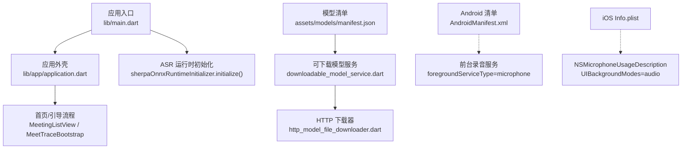
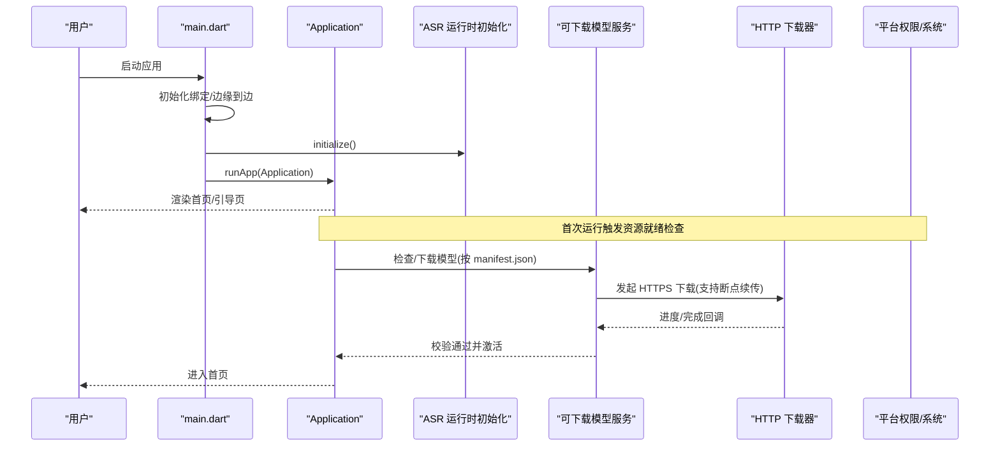
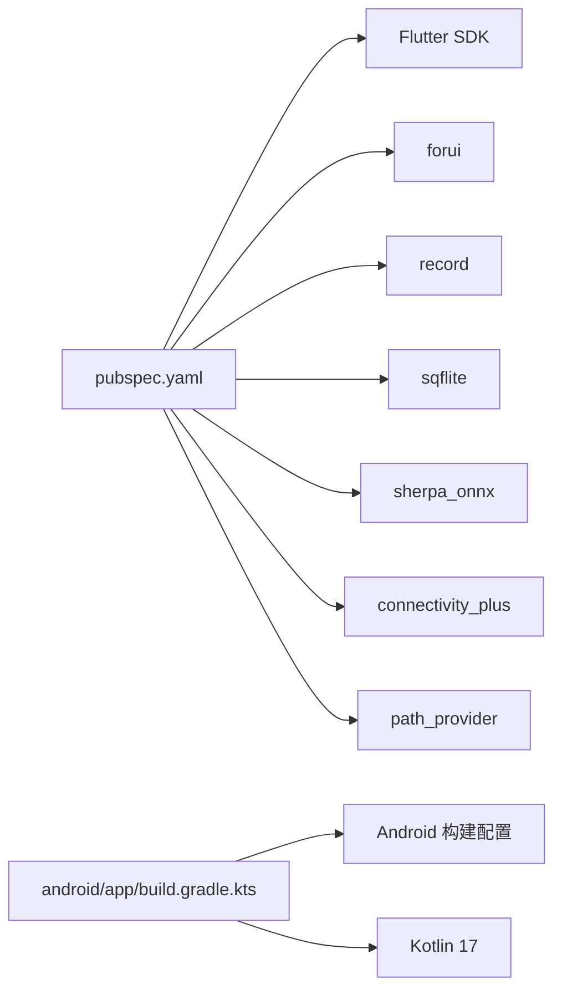

# 快速开始

<cite>
**本文引用的文件**   
- [README.md](file://README.md)
- [pubspec.yaml](file://pubspec.yaml)
- [lib/main.dart](file://lib/main.dart)
- [android/app/src/main/AndroidManifest.xml](file://android/app/src/main/AndroidManifest.xml)
- [ios/Runner/Info.plist](file://ios/Runner/Info.plist)
- [assets/models/manifest.json](file://assets/models/manifest.json)
- [android/app/build.gradle.kts](file://android/app/build.gradle.kts)
- [android/build.gradle.kts](file://android/build.gradle.kts)
- [android/local.properties](file://android/local.properties)
- [analysis_options.yaml](file://analysis_options.yaml)
- [lib/app/application.dart](file://lib/app/application.dart)
- [lib/domain/use_cases/initialize_runtime_assets.dart](file://lib/domain/use_cases/initialize_runtime_assets.dart)
- [lib/domain/models/runtime_initialization.dart](file://lib/domain/models/runtime_initialization.dart)
- [lib/data/services/models/downloadable_model_service.dart](file://lib/data/services/models/downloadable_model_service.dart)
- [lib/data/services/models/http_model_file_downloader.dart](file://lib/data/services/models/http_model_file_downloader.dart)
</cite>

## 目录
1. [简介](#简介)
2. [项目结构](#项目结构)
3. [核心组件](#核心组件)
4. [架构总览](#架构总览)
5. [详细组件分析](#详细组件分析)
6. [依赖分析](#依赖分析)
7. [性能注意事项](#性能注意事项)
8. [故障排查指南](#故障排查指南)
9. [结论](#结论)
10. [附录](#附录)

## 简介
会迹（MeetTrace）是一款本地优先的 Android + iOS 会议录音、端侧转录与证据化总结应用。首次启动时会依据固定清单下载并校验 SenseVoice 与 Silero VAD 模型，资源就绪前不会进入首页。本快速开始指南将帮助你在最短时间内完成环境搭建、权限配置、模型下载与运行调试。

## 项目结构
- 平台相关配置
  - Android：清单与 Gradle 构建脚本定义了最低 SDK、权限与前台服务类型等。
  - iOS：Info.plist 包含麦克风权限与后台音频模式声明。
- Flutter 工程
  - pubspec.yaml 声明了 Dart SDK 版本、Flutter 插件与第三方依赖。
  - lib/main.dart 为应用入口，初始化运行时并启动 UI。
- 模型与资源
  - assets/models/manifest.json 定义模型清单（ID、版本、文件大小、SHA256、下载地址）。
  - 许可证与通知文本位于 assets/licenses。

图表来源
- [lib/main.dart:7-12](file://lib/main.dart#L7-L12)
- [lib/app/application.dart:18-35](file://lib/app/application.dart#L18-L35)
- [assets/models/manifest.json:1-31](file://assets/models/manifest.json#L1-L31)
- [lib/data/services/models/downloadable_model_service.dart:169-177](file://lib/data/services/models/downloadable_model_service.dart#L169-L177)
- [lib/data/services/models/http_model_file_downloader.dart:17-40](file://lib/data/services/models/http_model_file_downloader.dart#L17-L40)
- [android/app/src/main/AndroidManifest.xml:1-57](file://android/app/src/main/AndroidManifest.xml#L1-L57)
- [ios/Runner/Info.plist:1-77](file://ios/Runner/Info.plist#L1-L77)

章节来源
- [README.md:1-11](file://README.md#L1-L11)
- [pubspec.yaml:21-47](file://pubspec.yaml#L21-L47)
- [lib/main.dart:7-12](file://lib/main.dart#L7-L12)
- [android/app/src/main/AndroidManifest.xml:1-57](file://android/app/src/main/AndroidManifest.xml#L1-L57)
- [ios/Runner/Info.plist:1-77](file://ios/Runner/Info.plist#L1-L77)
- [assets/models/manifest.json:1-31](file://assets/models/manifest.json#L1-L31)

## 核心组件
- 应用入口与主题
  - main.dart 负责初始化 Flutter 绑定、启用边缘到边显示、初始化 ASR 运行时，然后启动 Application。
  - application.dart 提供 Material/Forui 主题与根页面装配。
- 模型清单与下载
  - manifest.json 描述 SenseVoice 模型的文件、大小、哈希与下载地址。
  - downloadable_model_service.dart 实现下载前置检查（空间、网络）、断点续传、校验与激活。
  - http_model_file_downloader.dart 负责 HTTPS 下载、进度回调与取消令牌。
- 平台权限与后台
  - Android 清单声明麦克风、前台服务、通知等权限；前台服务类型为 microphone。
  - iOS Info.plist 声明麦克风用途与后台音频模式。

章节来源
- [lib/main.dart:7-12](file://lib/main.dart#L7-L12)
- [lib/app/application.dart:18-35](file://lib/app/application.dart#L18-L35)
- [assets/models/manifest.json:1-31](file://assets/models/manifest.json#L1-L31)
- [lib/data/services/models/downloadable_model_service.dart:169-177](file://lib/data/services/models/downloadable_model_service.dart#L169-L177)
- [lib/data/services/models/http_model_file_downloader.dart:17-40](file://lib/data/services/models/http_model_file_downloader.dart#L17-L40)
- [android/app/src/main/AndroidManifest.xml:1-57](file://android/app/src/main/AndroidManifest.xml#L1-L57)
- [ios/Runner/Info.plist:1-77](file://ios/Runner/Info.plist#L1-L77)

## 架构总览
下图展示了从应用启动到模型准备的关键调用链与数据流。

图表来源
- [lib/main.dart:7-12](file://lib/main.dart#L7-L12)
- [lib/app/application.dart:18-35](file://lib/app/application.dart#L18-L35)
- [assets/models/manifest.json:1-31](file://assets/models/manifest.json#L1-L31)
- [lib/data/services/models/downloadable_model_service.dart:169-177](file://lib/data/services/models/downloadable_model_service.dart#L169-L177)
- [lib/data/services/models/http_model_file_downloader.dart:17-40](file://lib/data/services/models/http_model_file_downloader.dart#L17-L40)

## 详细组件分析

### 环境与工具链准备
- 安装 Flutter SDK
  - 使用 fvm 或官方安装方式安装 Flutter SDK，并确保 flutter 命令可用。
  - 验证版本满足 pubspec.yaml 中声明的 Dart SDK 要求。
- Android 开发环境
  - 安装 Android Studio 与命令行工具，配置 Android SDK 路径至 local.properties。
  - 确保 NDK、Java 17 与 Gradle 版本满足 android/app/build.gradle.kts 的要求。
  - 在模拟器或真机上启用开发者选项与 USB 调试。
- iOS 开发环境
  - 安装 Xcode 与命令行工具，创建并选择签名证书与设备。
  - 确保 Info.plist 中的 Bundle Identifier 与签名一致。

章节来源
- [pubspec.yaml:21-22](file://pubspec.yaml#L21-L22)
- [android/app/build.gradle.kts:12-15](file://android/app/build.gradle.kts#L12-L15)
- [android/local.properties:1-5](file://android/local.properties#L1-L5)
- [ios/Runner/Info.plist:1-77](file://ios/Runner/Info.plist#L1-L77)

### 依赖包管理
- 获取依赖
  - 在项目根目录执行依赖拉取命令以安装所有依赖。
- 代码质量
  - analysis_options.yaml 启用了严格分析与 Lint 规则，可在 IDE 中查看问题。

章节来源
- [pubspec.yaml:30-47](file://pubspec.yaml#L30-L47)
- [analysis_options.yaml:1-35](file://analysis_options.yaml#L1-L35)

### 首次运行前的准备工作
- 模型清单与校验
  - 应用首次运行会根据 assets/models/manifest.json 下载 SenseVoice 模型文件，并进行 SHA256 校验。
  - 若空间不足或网络受限，将抛出相应异常并提示修复。
- 权限配置
  - Android：需允许麦克风、前台服务、通知与唤醒锁等权限。
  - iOS：需在 Info.plist 中声明麦克风用途与后台音频模式。
- 设备准备
  - 确保设备有足够存储空间（至少约 768 MiB 用于模型下载与校验）。
  - 建议使用稳定 Wi-Fi 进行首次模型下载。

章节来源
- [assets/models/manifest.json:1-31](file://assets/models/manifest.json#L1-L31)
- [lib/data/services/models/downloadable_model_service.dart:552-566](file://lib/data/services/models/downloadable_model_service.dart#L552-L566)
- [android/app/src/main/AndroidManifest.xml:1-57](file://android/app/src/main/AndroidManifest.xml#L1-L57)
- [ios/Runner/Info.plist:29-34](file://ios/Runner/Info.plist#L29-L34)

### 基本运行与调试步骤
- 连接设备
  - Android：使用 USB 调试或启动模拟器；iOS：连接真机或启动 iOS 模拟器。
- 运行应用
  - 在根目录执行运行命令以启动应用。
- 调试技巧
  - 使用 IDE 的断点与热重载功能；在 Android 上可通过日志查看前台服务状态。
  - 首次运行请留意模型下载进度与校验结果。

章节来源
- [lib/main.dart:7-12](file://lib/main.dart#L7-L12)
- [android/app/src/main/AndroidManifest.xml:35-38](file://android/app/src/main/AndroidManifest.xml#L35-L38)

### 常见初始化与配置问题及解决方案
- 空间不足导致下载失败
  - 现象：抛出“初始化至少需要 768 MiB 可用空间”的错误。
  - 解决：清理设备空间后重试。
- 移动网络限制
  - 现象：在蜂窝网络下被拒绝下载，需明确同意。
  - 解决：切换 Wi-Fi 或在应用中确认允许移动网络下载。
- HTTPS 限制
  - 现象：非 HTTPS 地址被拒绝。
  - 解决：确保模型下载 URL 为 HTTPS。
- 权限未授予
  - 现象：无法录音或前台服务崩溃。
  - 解决：在系统设置中授予麦克风与通知权限，Android 需开启前台服务类型。
- 平台配置不一致
  - 现象：iOS 签名不匹配或 Android SDK/NDK 路径错误。
  - 解决：核对 Info.plist Bundle ID 与签名；修正 local.properties 中的 sdk.dir。

章节来源
- [lib/data/services/models/downloadable_model_service.dart:552-566](file://lib/data/services/models/downloadable_model_service.dart#L552-L566)
- [lib/data/services/models/http_model_file_downloader.dart:25-30](file://lib/data/services/models/http_model_file_downloader.dart#L25-L30)
- [android/app/src/main/AndroidManifest.xml:1-57](file://android/app/src/main/AndroidManifest.xml#L1-L57)
- [ios/Runner/Info.plist:29-34](file://ios/Runner/Info.plist#L29-L34)
- [android/local.properties:1-5](file://android/local.properties#L1-L5)

### 验证安装成功的测试用例
- 单元测试
  - 运行单元测试以验证基础逻辑与依赖注入是否正确。
- 集成测试
  - 运行集成测试以验证录音生命周期与设备预检流程。
- 模型下载与校验
  - 观察首次运行时的下载进度与校验结果，确认无异常。

章节来源
- [lib/domain/use_cases/initialize_runtime_assets.dart:9-17](file://lib/domain/use_cases/initialize_runtime_assets.dart#L9-L17)
- [lib/domain/models/runtime_initialization.dart:1-47](file://lib/domain/models/runtime_initialization.dart#L1-L47)

## 依赖分析
- 关键依赖
  - Flutter SDK 与 forui 框架。
  - 录音与音频处理：record、audioplayers。
  - 数据库：sqflite、sqflite_common_ffi。
  - 网络与存储：connectivity_plus、path_provider、disk_space_2。
  - ASR：sherpa_onnx。
- 构建与工具
  - Flutter Gradle 插件、Kotlin 17、Android compileSdk/targetSdk。

图表来源
- [pubspec.yaml:30-47](file://pubspec.yaml#L30-L47)
- [android/app/build.gradle.kts:12-15](file://android/app/build.gradle.kts#L12-L15)

章节来源
- [pubspec.yaml:30-47](file://pubspec.yaml#L30-L47)
- [android/app/build.gradle.kts:12-15](file://android/app/build.gradle.kts#L12-L15)

## 性能注意事项
- 模型下载
  - 使用 HTTPS 与断点续传提升稳定性与速度。
  - 建议在 Wi-Fi 环境下进行首次下载。
- 内存与存储
  - 确保设备至少有 768 MiB 可用空间。
  - 避免同时运行多个大型任务。
- 录音与前台服务
  - Android 前台服务类型设置为 microphone，保证录音稳定性。
  - iOS 后台音频模式确保应用在后台继续录音。

章节来源
- [lib/data/services/models/http_model_file_downloader.dart:17-40](file://lib/data/services/models/http_model_file_downloader.dart#L17-L40)
- [lib/data/services/models/downloadable_model_service.dart:552-566](file://lib/data/services/models/downloadable_model_service.dart#L552-L566)
- [android/app/src/main/AndroidManifest.xml:35-38](file://android/app/src/main/AndroidManifest.xml#L35-L38)
- [ios/Runner/Info.plist:31-34](file://ios/Runner/Info.plist#L31-L34)

## 故障排查指南
- 常见问题定位
  - 查看日志输出，关注模型下载阶段与权限请求。
  - 检查设备存储空间与网络状态。
- 恢复策略
  - 清理临时目录并重新下载模型。
  - 重置权限并在系统设置中重新授权。
- 平台特定
  - Android：确认前台服务类型与权限已正确声明。
  - iOS：确认 Info.plist 中麦克风与后台音频配置。

章节来源
- [lib/data/services/models/downloadable_model_service.dart:552-566](file://lib/data/services/models/downloadable_model_service.dart#L552-L566)
- [android/app/src/main/AndroidManifest.xml:1-57](file://android/app/src/main/AndroidManifest.xml#L1-L57)
- [ios/Runner/Info.plist:29-34](file://ios/Runner/Info.plist#L29-L34)

## 结论
按照本指南完成环境搭建、权限配置与模型下载后，即可在 Android 与 iOS 设备上成功运行会迹（MeetTrace）。如遇问题，请参考故障排查指南逐步定位与解决。

## 附录
- 常用命令
  - 获取依赖：在根目录执行依赖拉取命令。
  - 运行应用：在根目录执行运行命令以启动应用。
  - 分析代码：执行静态分析与 Lint 检查。
- 参考文档
  - README.md 提供产品背景与文档索引。
  - 技术文档位于 docs 目录，涵盖架构与技术方案。

章节来源
- [README.md:1-11](file://README.md#L1-L11)
- [analysis_options.yaml:1-35](file://analysis_options.yaml#L1-L35)