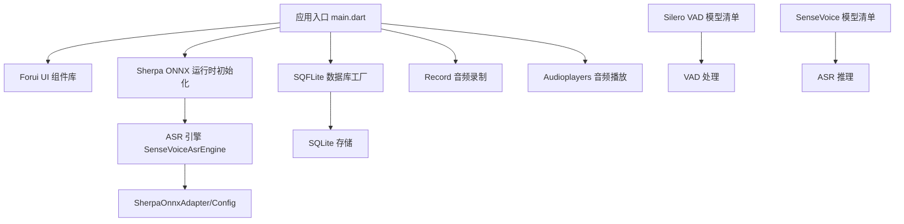
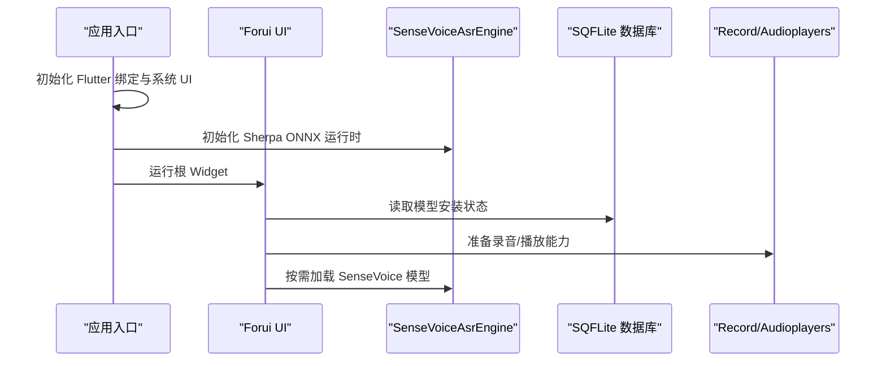
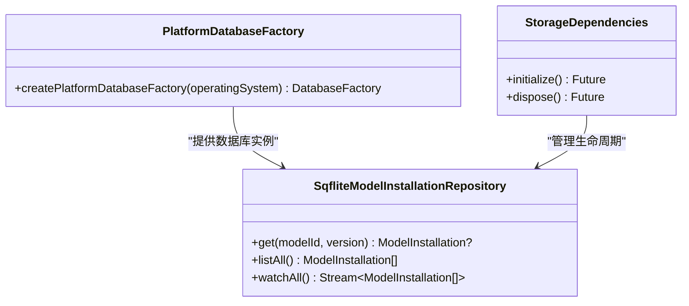
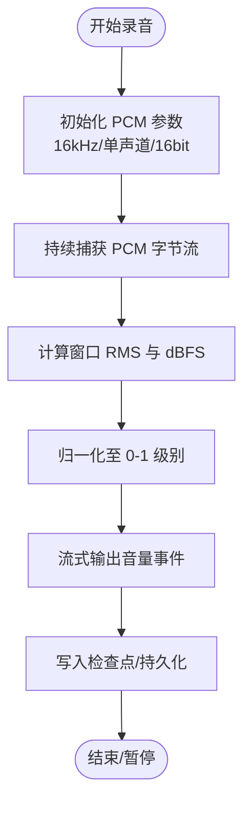
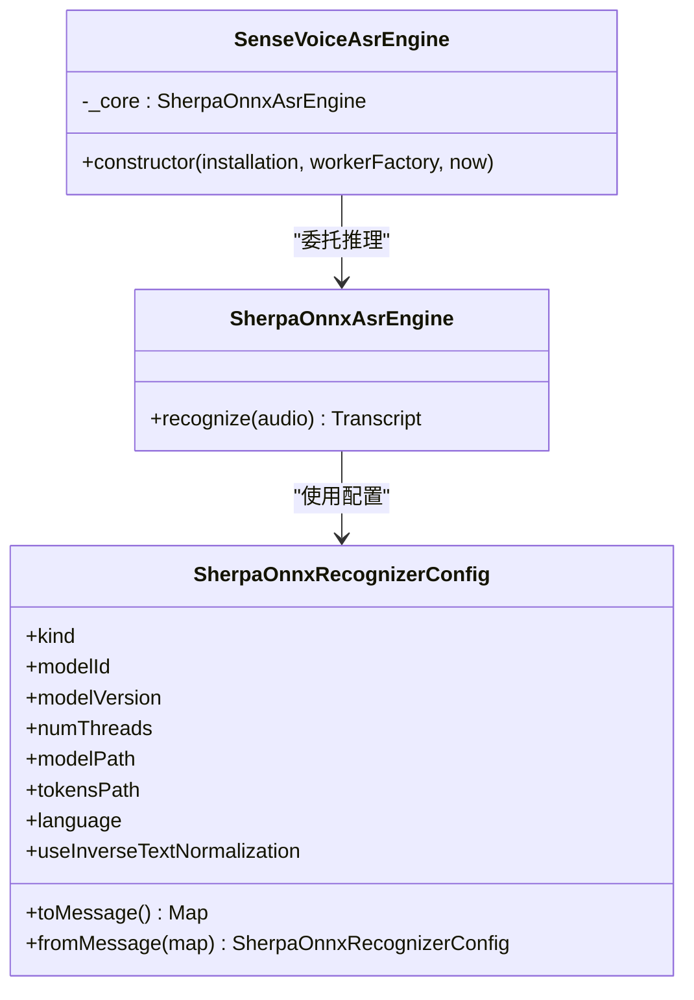
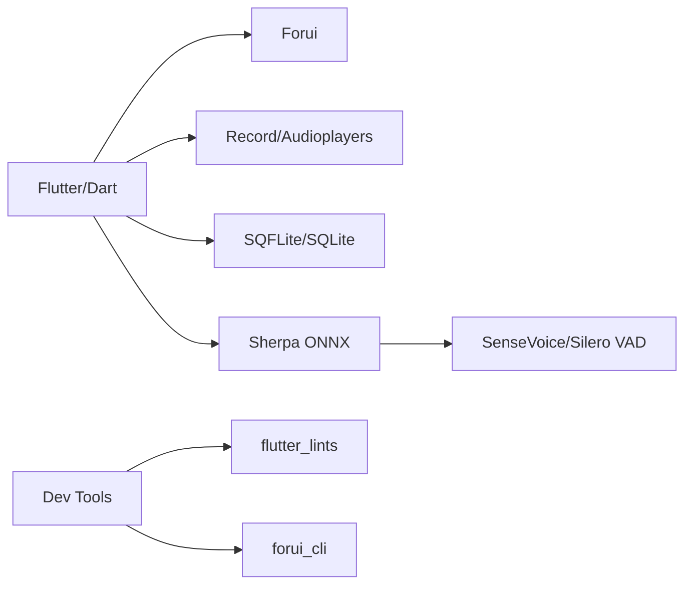

# 技术栈概览

<cite>
**本文引用的文件**   
- [pubspec.yaml](file://pubspec.yaml)
- [forui.yaml](file://forui.yaml)
- [analysis_options.yaml](file://analysis_options.yaml)
- [README.md](file://README.md)
- [main.dart](file://lib/main.dart)
- [platform_database_factory.dart](file://lib/data/services/storage/platform_database_factory.dart)
- [sqflite_model_installation_repository.dart](file://lib/data/repositories/sqflite_model_installation_repository.dart)
- [meettrace_storage_dependencies.dart](file://lib/app/meettrace_storage_dependencies.dart)
- [recording.dart](file://lib/domain/models/recording.dart)
- [pcm_audio_level_meter.dart](file://lib/data/services/audio/pcm_audio_level_meter.dart)
- [sense_voice_asr_engine.dart](file://lib/data/services/asr/sense_voice_asr_engine.dart)
- [sherpa_onnx_adapter.dart](file://lib/data/services/asr/sherpa_onnx/sherpa_onnx_adapter.dart)
- [sherpa_onnx_config_test.dart](file://test/data/services/asr/sherpa_onnx/sherpa_onnx_config_test.dart)
- [reliable_recording_service_test.dart](file://test/data/services/audio/reliable_recording_service_test.dart)
- [AppDelegate.swift](file://ios/Runner/AppDelegate.swift)
- [main.cpp](file://windows/runner/main.cpp)
- [manifest.json](file://assets/models/manifest.json)
- [silero-vad-manifest.json](file://assets/models/silero-vad-manifest.json)
- [sense-voice-NOTICE.txt](file://assets/licenses/sense-voice-NOTICE.txt)
</cite>

## 目录
1. [简介](#简介)
2. [项目结构](#项目结构)
3. [核心组件](#核心组件)
4. [架构总览](#架构总览)
5. [详细组件分析](#详细组件分析)
6. [依赖关系分析](#依赖关系分析)
7. [性能考量](#性能考量)
8. [故障排查指南](#故障排查指南)
9. [结论](#结论)
10. [附录](#附录)

## 简介
会迹（MeetTrace）是一款本地优先的 Android + iOS 会议录音、端侧转录与证据化总结应用。其技术栈围绕 Flutter 跨平台框架与 Dart 语言构建，UI 采用 Forui 组件库；数据存储使用 SQFLite + SQLite；音频采集与播放分别基于 Record 与 Audioplayers；语音识别通过 Sherpa ONNX 引擎驱动 SenseVoice ASR 模型，并结合 Silero VAD 进行语音活动检测。开发工具链包含 Flutter Lints 静态分析与 Forui CLI 配置，确保代码质量与 UI 生成一致性。

**章节来源**
- [README.md:1-11](file://README.md#L1-L11)

## 项目结构
- 入口与初始化：应用启动时初始化 Flutter 绑定、系统 UI 设置与 Sherpa ONNX 运行时，随后运行根 Widget。
- 数据层：以 SQFLite 为核心，提供跨平台数据库工厂（Windows 使用 FFI），封装仓库实现持久化与会话状态管理。
- 音频层：PCM 采样率、通道与位深固定为 16kHz/单声道/16bit，音量计按 RMS 计算并流式输出。
- ASR 层：SenseVoiceAsrEngine 作为对外接口，内部通过 SherpaOnnxAsrEngine 调用 sherpa_onnx 包执行推理。
- 资源与模型：Manifest 描述模型清单，首次启动按清单下载并校验 SenseVoice 与 Silero VAD。

**图表来源**
- [main.dart:1-13](file://lib/main.dart#L1-L13)
- [pubspec.yaml:31-46](file://pubspec.yaml#L31-L46)
- [platform_database_factory.dart:1-17](file://lib/data/services/storage/platform_database_factory.dart#L1-L17)
- [sense_voice_asr_engine.dart:1-46](file://lib/data/services/asr/sense_voice_asr_engine.dart#L1-L46)
- [sherpa_onnx_adapter.dart:1-82](file://lib/data/services/asr/sherpa_onnx/sherpa_onnx_adapter.dart#L1-L82)

**章节来源**
- [pubspec.yaml:1-112](file://pubspec.yaml#L1-L112)
- [forui.yaml:1-13](file://forui.yaml#L1-L13)
- [analysis_options.yaml:1-35](file://analysis_options.yaml#L1-L35)

## 核心组件
- Flutter + Dart：统一跨平台 UI 与业务逻辑，SDK 版本锁定在 ^3.12.2，保证稳定性与特性一致。
- Forui：声明式 UI 组件库，配合 forui.yaml 控制代码生成路径（snippet/style/theme/fonts）。
- SQFLite + SQLite：轻量级嵌入式数据库，Windows 平台通过 sqflite_common_ffi 启用 FFI 支持。
- Record：高可靠 PCM 音频采集，结合检查点与前台任务保障录音连续性。
- Audioplayers：本地音频回放，用于波形预览与证据回放。
- Sherpa ONNX：跨平台推理引擎，适配 SenseVoice 多语种 ASR 模型。
- SenseVoice ASR：端侧多语种语音识别，默认开启反向文本归一化（ITN）。
- Silero VAD：端侧语音活动检测，提升实时转录效率与降噪效果。

**章节来源**
- [pubspec.yaml:31-46](file://pubspec.yaml#L31-L46)
- [forui.yaml:1-13](file://forui.yaml#L1-L13)
- [platform_database_factory.dart:1-17](file://lib/data/services/storage/platform_database_factory.dart#L1-L17)
- [sense_voice_asr_engine.dart:1-46](file://lib/data/services/asr/sense_voice_asr_engine.dart#L1-L46)
- [sherpa_onnx_adapter.dart:1-82](file://lib/data/services/asr/sherpa_onnx/sherpa_onnx_adapter.dart#L1-L82)

## 架构总览
应用启动流程：
- 初始化 Flutter 绑定与系统 UI（沉浸式边缘到边）。
- 初始化 Sherpa ONNX 运行时。
- 运行根 Widget（MeetTraceBootstrap），加载 Forui 主题与路由。

数据与模型：
- 首次启动根据 assets/models/manifest.json 与 silero-vad-manifest.json 下载并校验模型。
- 使用 SQFLite 持久化安装记录、会议元数据与转录结果。

**图表来源**
- [main.dart:1-13](file://lib/main.dart#L1-L13)
- [pubspec.yaml:74-81](file://pubspec.yaml#L74-L81)
- [platform_database_factory.dart:1-17](file://lib/data/services/storage/platform_database_factory.dart#L1-L17)

**章节来源**
- [main.dart:1-13](file://lib/main.dart#L1-L13)
- [pubspec.yaml:74-81](file://pubspec.yaml#L74-L81)

## 详细组件分析

### Flutter 与 Forui UI
- 依赖声明：Flutter SDK 与 forui 版本锁定，确保 UI 组件稳定可用。
- 代码生成：forui.yaml 指定 snippet/style/theme/fonts 的输出目录，便于集中管理与复用。
- 优势：声明式 UI、跨平台一致体验、可维护的主题与样式体系。

**章节来源**
- [pubspec.yaml:31-38](file://pubspec.yaml#L31-L38)
- [forui.yaml:1-13](file://forui.yaml#L1-L13)

### 后端与数据处理（SQFLite + SQLite）
- 平台适配：Windows 通过 sqflite_common_ffi 初始化 FFI 数据库工厂，其他平台使用默认 factory。
- 仓库实现：SqfliteModelInstallationRepository 负责模型安装记录的增删查与变更流。
- 生命周期：StorageDependencies 统一管理数据库与会话仓库的创建与释放，异常时回滚清理。

**图表来源**
- [platform_database_factory.dart:1-17](file://lib/data/services/storage/platform_database_factory.dart#L1-L17)
- [sqflite_model_installation_repository.dart:1-44](file://lib/data/repositories/sqflite_model_installation_repository.dart#L1-L44)
- [meettrace_storage_dependencies.dart:74-115](file://lib/app/meettrace_storage_dependencies.dart#L74-L115)

**章节来源**
- [platform_database_factory.dart:1-17](file://lib/data/services/storage/platform_database_factory.dart#L1-L17)
- [sqflite_model_installation_repository.dart:1-44](file://lib/data/repositories/sqflite_model_installation_repository.dart#L1-L44)
- [meettrace_storage_dependencies.dart:74-115](file://lib/app/meettrace_storage_dependencies.dart#L74-L115)

### 音频处理（Record 与 Audioplayers）
- 录音参数：16kHz、单声道、PCM16，确保与 ASR 模型输入对齐。
- 音量计量：基于窗口内样本平方和计算 RMS，转换为 dBFS 并归一化为 0-1 级别，流式输出。
- 可靠性：测试覆盖前台生命周期、检查点恢复与连续录制场景，保障中断恢复。

**图表来源**
- [recording.dart:1-43](file://lib/domain/models/recording.dart#L1-L43)
- [pcm_audio_level_meter.dart:69-99](file://lib/data/services/audio/pcm_audio_level_meter.dart#L69-L99)
- [reliable_recording_service_test.dart:1-37](file://test/data/services/audio/reliable_recording_service_test.dart#L1-L37)

**章节来源**
- [recording.dart:1-43](file://lib/domain/models/recording.dart#L1-L43)
- [pcm_audio_level_meter.dart:69-99](file://lib/data/services/audio/pcm_audio_level_meter.dart#L69-L99)
- [reliable_recording_service_test.dart:1-37](file://test/data/services/audio/reliable_recording_service_test.dart#L1-L37)

### 语音识别（Sherpa ONNX + SenseVoice）
- 引擎封装：SenseVoiceAsrEngine 暴露统一的 AsrEngine 接口，内部委托 SherpaOnnxAsrEngine。
- 配置对象：SherpaOnnxRecognizerConfig.senseVoice 固定语言为 auto，开启 ITN，线程数默认 2。
- 跨隔离区：配置支持 toMessage/fromMessage，便于在 isolate 间传递。

**图表来源**
- [sense_voice_asr_engine.dart:1-46](file://lib/data/services/asr/sense_voice_asr_engine.dart#L1-L46)
- [sherpa_onnx_adapter.dart:1-82](file://lib/data/services/asr/sherpa_onnx/sherpa_onnx_adapter.dart#L1-L82)
- [sherpa_onnx_config_test.dart:1-44](file://test/data/services/asr/sherpa_onnx/sherpa_onnx_config_test.dart#L1-L44)

**章节来源**
- [sense_voice_asr_engine.dart:1-46](file://lib/data/services/asr/sense_voice_asr_engine.dart#L1-L46)
- [sherpa_onnx_adapter.dart:1-82](file://lib/data/services/asr/sherpa_onnx/sherpa_onnx_adapter.dart#L1-L82)
- [sherpa_onnx_config_test.dart:1-44](file://test/data/services/asr/sherpa_onnx/sherpa_onnx_config_test.dart#L1-L44)

### 机器学习模型（SenseVoice ASR 与 Silero VAD）
- 模型清单：assets/models/manifest.json 与 silero-vad-manifest.json 定义模型版本与校验信息。
- 许可证与来源：SenseVoice 模型 NOTICE 指明来源与许可证文件位置。
- 初始化策略：首次启动按清单下载并校验，未就绪前不进入首页，确保功能可用性。

**章节来源**
- [pubspec.yaml:74-81](file://pubspec.yaml#L74-L81)
- [sense-voice-NOTICE.txt:1-9](file://assets/licenses/sense-voice-NOTICE.txt#L1-L9)

### 开发工具与配置（分析选项与 Forui）
- 分析选项：启用严格类型推断与原始类型检查，继承 flutter_lints 推荐规则。
- Forui 配置：统一 snippet/style/theme/fonts 输出路径，提升 UI 资产一致性。
- 平台原生：iOS AppDelegate 与 Windows main.cpp 展示 Flutter 引擎集成方式。

**章节来源**
- [analysis_options.yaml:1-35](file://analysis_options.yaml#L1-L35)
- [forui.yaml:1-13](file://forui.yaml#L1-L13)
- [AppDelegate.swift:1-16](file://ios/Runner/AppDelegate.swift#L1-L16)
- [main.cpp:1-43](file://windows/runner/main.cpp#L1-L43)

## 依赖关系分析
- 运行时依赖：audioplayers、record、sherpa_onnx、sqflite、sqflite_common_ffi、path_provider、flutter_foreground_task 等。
- 开发依赖：flutter_test、integration_test、sqlite3、flutter_lints、forui_cli。
- 资源依赖：模型清单与许可证文件打包进应用。

**图表来源**
- [pubspec.yaml:31-61](file://pubspec.yaml#L31-L61)

**章节来源**
- [pubspec.yaml:31-61](file://pubspec.yaml#L31-L61)

## 性能考量
- 音频采样与量化：固定 16kHz/单声道/16bit 降低 CPU 与内存占用，匹配 ASR 输入要求。
- 推理线程：默认 numThreads=2，平衡吞吐与功耗，可根据设备调整。
- 数据库访问：使用流式查询与变更通知减少轮询开销，避免主线程阻塞。
- 资源加载：模型按需下载与校验，首屏延迟可控，失败快速降级。

[本节为通用指导，无需特定文件引用]

## 故障排查指南
- 数据库初始化失败：检查 Windows 平台 FFI 初始化是否成功，确认 sqfliteFfiInit 调用。
- 录音中断或崩溃：验证前台任务权限、检查点恢复逻辑与 PCM 边界对齐。
- ASR 推理异常：核对模型路径、tokens 路径与语言配置，确认 ITN 开关与线程数合法。
- 模型未就绪：检查 manifest 下载与校验流程，确保资源完整性后再进入首页。

**章节来源**
- [platform_database_factory.dart:1-17](file://lib/data/services/storage/platform_database_factory.dart#L1-L17)
- [reliable_recording_service_test.dart:1-37](file://test/data/services/audio/reliable_recording_service_test.dart#L1-L37)
- [sherpa_onnx_config_test.dart:1-44](file://test/data/services/asr/sherpa_onnx/sherpa_onnx_config_test.dart#L1-L44)

## 结论
会迹（MeetTrace）以 Flutter + Dart 为核心，结合 Forui UI、SQFLite/SQLite、Record/Audioplayers、Sherpa ONNX + SenseVoice 与 Silero VAD，构建了本地优先、高可靠的会议录音与端侧转录方案。通过严格的分析选项与 Forui 配置，保障了代码质量与 UI 一致性；通过模型清单与初始化策略，确保了功能可用性与用户体验。整体架构清晰、模块职责明确，具备良好的可维护性与扩展性。

[本节为总结性内容，无需特定文件引用]

## 附录
- 产品与交互文档：PRODUCT.md、DESIGN.md 提供产品上下文与设计规范。
- 技术文档：docs/technical 与 docs/quality 包含端侧转录技术方案与稳定性实践。
- 许可证与来源：assets/licenses 下包含各模型许可证与说明文件。

[本节为补充信息，无需特定文件引用]