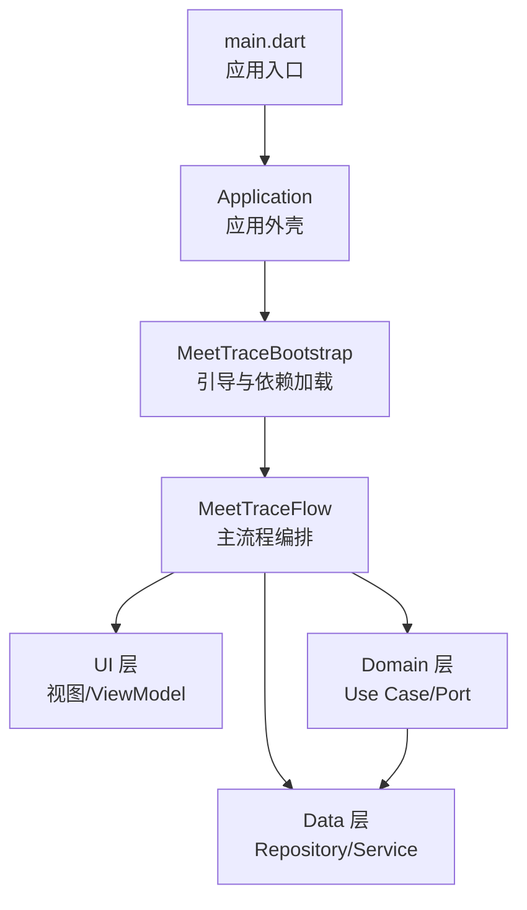
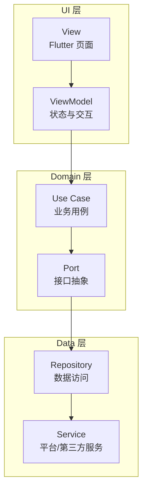
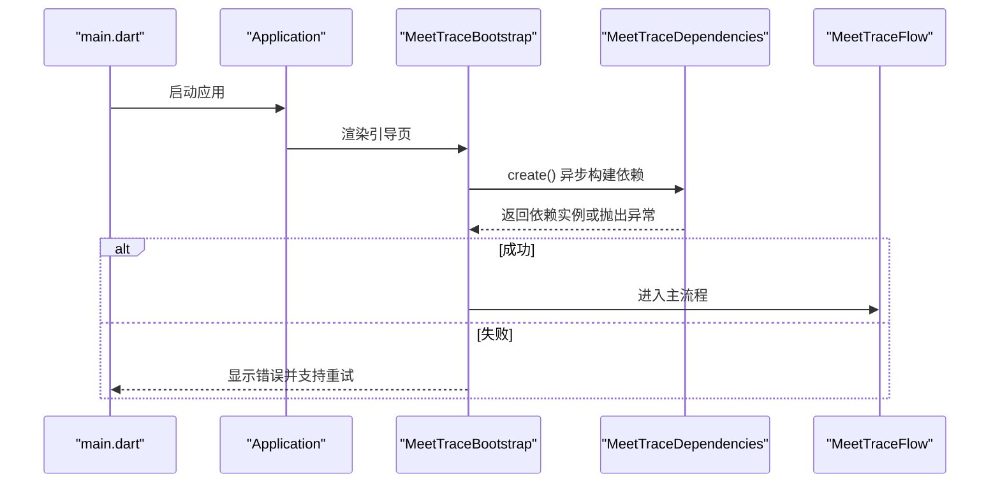
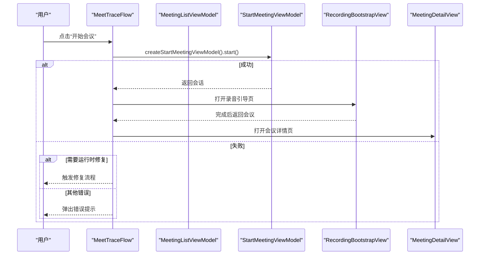
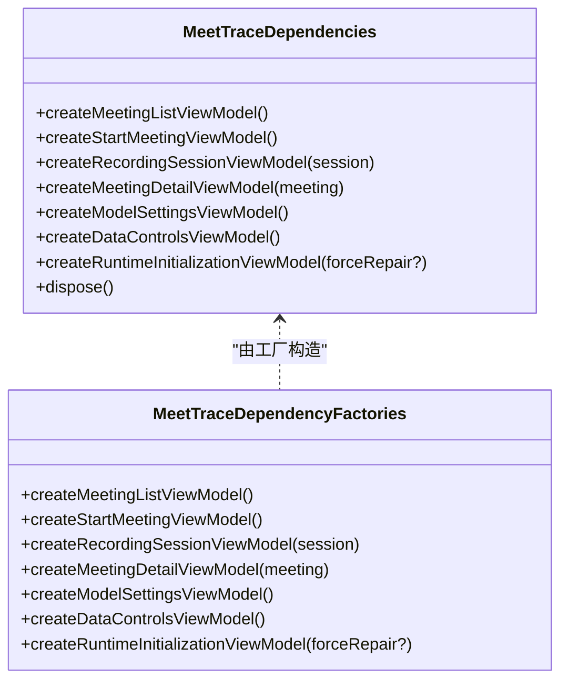
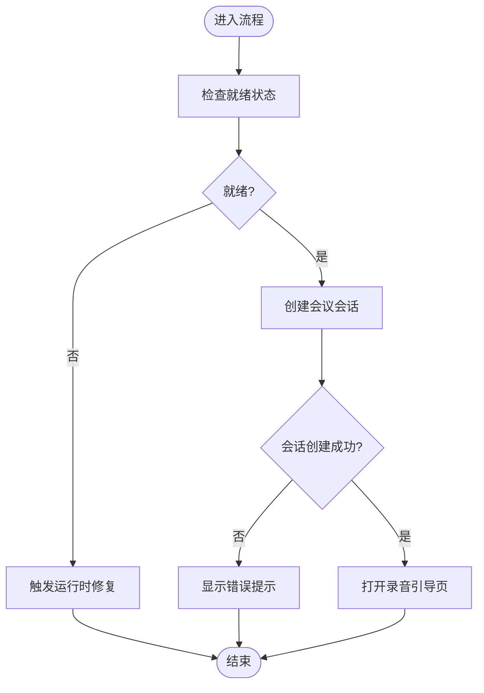
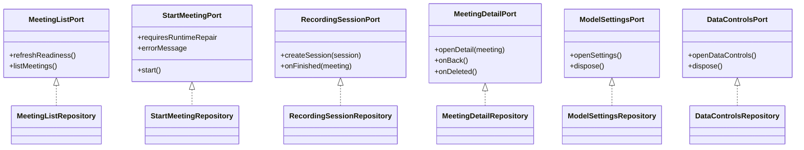
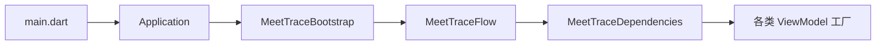

# 架构设计理念

<cite>
**本文引用的文件**   
- [lib/main.dart](file://lib/main.dart)
- [lib/app/application.dart](file://lib/app/application.dart)
- [lib/app/meettrace_flow.dart](file://lib/app/meettrace_flow.dart)
- [lib/app/meettrace_dependencies.dart](file://lib/app/meettrace_dependencies.dart)
- [lib/app/meettrace_dependency_factories.dart](file://lib/app/meettrace_dependency_factories.dart)
- [pubspec.yaml](file://pubspec.yaml)
</cite>

## 目录
1. [简介](#简介)
2. [项目结构](#项目结构)
3. [核心组件](#核心组件)
4. [架构总览](#架构总览)
5. [详细组件分析](#详细组件分析)
6. [依赖关系分析](#依赖关系分析)
7. [性能考量](#性能考量)
8. [故障排查指南](#故障排查指南)
9. [结论](#结论)
10. [附录](#附录)

## 简介
本文件面向会迹（MeetTrace）项目的架构设计理念，围绕分层架构与 MVVM 模式展开，重点说明 UI、Domain、Data 三层的职责边界与交互方式；阐述 MeetTraceDependencies 的依赖注入机制与配置；总结工厂模式、状态机模式、接口抽象等设计模式的应用；并给出架构图与数据流图以辅助理解。文档力求对非技术读者友好，同时为开发者提供可追溯的代码级依据。

## 项目结构
MeetTrace 采用 Flutter 工程组织，核心代码位于 lib 目录，按职责划分为 app、data、domain、theme、ui 等子模块：
- main.dart 负责应用启动、全局初始化与根 Widget 装配
- app 层承载应用外壳、引导流程与依赖注入入口
- ui 层包含视图与 ViewModel，遵循 MVVM 模式
- domain 层定义领域模型、用例与端口（接口）
- data 层实现 Repository 与具体服务（如数据库、ASR、存储等）
- theme 层管理主题与国际化资源

图表来源 
- [lib/main.dart:1-13](file://lib/main.dart#L1-L13)
- [lib/app/application.dart:1-37](file://lib/app/application.dart#L1-L37)
- [lib/app/meettrace_flow.dart:1-265](file://lib/app/meettrace_flow.dart#L1-L265)

章节来源
- [lib/main.dart:1-13](file://lib/main.dart#L1-L13)
- [lib/app/application.dart:1-37](file://lib/app/application.dart#L1-L37)
- [pubspec.yaml:1-112](file://pubspec.yaml#L1-L112)

## 核心组件
- Application：应用外壳，统一主题、本地化与根页面装配，不承载业务逻辑
- MeetTraceBootstrap：引导阶段，异步创建 MeetTraceDependencies，处理错误与重试
- MeetTraceFlow：主流程编排，协调 ViewModel 生命周期、路由跳转与运行时修复
- MeetTraceDependencies：依赖注入容器，集中暴露各 ViewModel/服务的工厂方法
- MeetTraceDependencyFactories：依赖工厂集合，按场景组装具体实现

章节来源
- [lib/app/application.dart:1-37](file://lib/app/application.dart#L1-L37)
- [lib/app/meettrace_flow.dart:1-265](file://lib/app/meettrace_flow.dart#L1-L265)
- [lib/app/meettrace_dependencies.dart](file://lib/app/meettrace_dependencies.dart)
- [lib/app/meettrace_dependency_factories.dart](file://lib/app/meettrace_dependency_factories.dart)

## 架构总览
MeetTrace 采用“分层 + MVVM”的混合架构：
- UI 层：Flutter 视图与 ViewModel，仅关注展示与用户交互
- Domain 层：用例（Use Case）与端口（Port），封装业务规则与跨层契约
- Data 层：仓库（Repository）与服务（Service），屏蔽平台差异与外部依赖

数据流向遵循 View → ViewModel → Use Case/Port → Repository 的单向流，保证 UI 与业务解耦、测试友好。

图表来源 
- [lib/app/meettrace_flow.dart:114-265](file://lib/app/meettrace_flow.dart#L114-L265)

## 详细组件分析

### 应用启动与引导流程
- main.dart 完成 Flutter 绑定、边缘到边设置、ASR 运行时初始化，并启动 Application
- Application 装配主题、本地化与根页面（生产环境为 MeetTraceBootstrap）
- MeetTraceBootstrap 异步创建 MeetTraceDependencies，失败时显示引导错误并提供重试
- 成功后进入运行时初始化门控，再进入 MeetTraceFlow 主流程

图表来源 
- [lib/main.dart:1-13](file://lib/main.dart#L1-L13)
- [lib/app/application.dart:1-37](file://lib/app/application.dart#L1-L37)
- [lib/app/meettrace_flow.dart:19-65](file://lib/app/meettrace_flow.dart#L19-L65)

章节来源
- [lib/main.dart:1-13](file://lib/main.dart#L1-L13)
- [lib/app/application.dart:1-37](file://lib/app/application.dart#L1-L37)
- [lib/app/meettrace_flow.dart:19-65](file://lib/app/meettrace_flow.dart#L19-L65)

### 主流程与会话编排
- MeetTraceFlow 持有 MeetingListViewModel，监听应用生命周期并在恢复时刷新就绪状态
- 点击开始会议时，通过 dependencies.createStartMeetingViewModel().start() 启动会话
- 若需要运行时修复则回调 onRuntimeRepairRequired，否则打开录音引导页
- 会议详情与设置页均通过 dependencies 提供的工厂创建对应 ViewModel

图表来源 
- [lib/app/meettrace_flow.dart:128-265](file://lib/app/meettrace_flow.dart#L128-L265)

章节来源
- [lib/app/meettrace_flow.dart:128-265](file://lib/app/meettrace_flow.dart#L128-L265)

### 依赖注入与工厂模式
- MeetTraceDependencies 作为依赖容器，对外暴露 createXxxViewModel()/createXxxService() 等方法
- MeetTraceDependencyFactories 提供具体工厂实现，按运行环境与配置组装依赖
- 通过工厂模式，UI 层无需感知具体实现，便于替换与测试

图表来源 
- [lib/app/meettrace_dependencies.dart](file://lib/app/meettrace_dependencies.dart)
- [lib/app/meettrace_dependency_factories.dart](file://lib/app/meettrace_dependency_factories.dart)

章节来源
- [lib/app/meettrace_dependencies.dart](file://lib/app/meettrace_dependencies.dart)
- [lib/app/meettrace_dependency_factories.dart](file://lib/app/meettrace_dependency_factories.dart)

### MVVM 数据流与状态机
- View 仅订阅 ViewModel 的状态变化，不直接操作数据
- ViewModel 调用 Use Case/Port，将领域逻辑与 UI 解耦
- 关键业务流程（如启动会议、运行时初始化）使用状态机模式管理状态转换，避免分支爆炸

图表来源 
- [lib/app/meettrace_flow.dart:176-204](file://lib/app/meettrace_flow.dart#L176-L204)

章节来源
- [lib/app/meettrace_flow.dart:176-204](file://lib/app/meettrace_flow.dart#L176-L204)

### 接口抽象与领域契约
- Domain 层通过 Port 定义跨层契约，Data 层实现具体 Repository
- 这种抽象使得 UI 与 Data 完全解耦，便于替换实现（如不同数据库、不同 ASR 引擎）

图表来源 
- [lib/app/meettrace_flow.dart:128-265](file://lib/app/meettrace_flow.dart#L128-L265)

章节来源
- [lib/app/meettrace_flow.dart:128-265](file://lib/app/meettrace_flow.dart#L128-L265)

## 依赖关系分析
- 应用入口 main.dart 依赖 Application 与 MeetTraceBootstrap
- Application 依赖主题与国际化资源
- MeetTraceFlow 依赖 MeetTraceDependencies 提供的各类 ViewModel 工厂
- 所有 UI 组件通过 ViewModel 间接依赖 Domain/Data 层，避免直接耦合

图表来源 
- [lib/main.dart:1-13](file://lib/main.dart#L1-L13)
- [lib/app/application.dart:1-37](file://lib/app/application.dart#L1-L37)
- [lib/app/meettrace_flow.dart:114-265](file://lib/app/meettrace_flow.dart#L114-L265)
- [lib/app/meettrace_dependencies.dart](file://lib/app/meettrace_dependencies.dart)

章节来源
- [lib/main.dart:1-13](file://lib/main.dart#L1-L13)
- [lib/app/application.dart:1-37](file://lib/app/application.dart#L1-L37)
- [lib/app/meettrace_flow.dart:114-265](file://lib/app/meettrace_flow.dart#L114-L265)
- [lib/app/meettrace_dependencies.dart](file://lib/app/meettrace_dependencies.dart)

## 性能考量
- 启动优化：在 main.dart 中尽早初始化必要的运行时（如 ASR），减少后续延迟
- 懒加载：依赖按需创建，避免一次性构建全部对象
- 生命周期管理：在页面销毁时释放 ViewModel 与观察者，防止内存泄漏
- 错误快速失败：引导阶段捕获异常并提示重试，避免阻塞主流程

[本节为通用指导，不直接分析具体文件]

## 故障排查指南
- 启动失败：检查 MeetTraceBootstrap 的错误分支，确认设备空间与旧版本数据迁移提示
- 运行时修复：当 startMeeting 需要修复时，触发 onRuntimeRepairRequired 重新初始化
- 依赖构建失败：检查 MeetTraceDependencies.create() 是否抛出异常，必要时回退到默认首页

章节来源
- [lib/app/meettrace_flow.dart:31-65](file://lib/app/meettrace_flow.dart#L31-L65)
- [lib/app/meettrace_flow.dart:176-204](file://lib/app/meettrace_flow.dart#L176-L204)

## 结论
MeetTrace 通过分层架构与 MVVM 模式实现了清晰的职责分离与稳定的数据流；依赖注入与工厂模式提升了可测试性与可扩展性；状态机与接口抽象保障了复杂流程的可维护性。整体设计兼顾了性能、可靠性与可演进性，适合持续迭代与多端适配。

[本节为总结性内容，不直接分析具体文件]

## 附录
- 包依赖与环境：参见 pubspec.yaml，明确 SDK 版本与第三方库约束
- 主题与国际化：Application 中统一装配，确保一致的用户体验

章节来源
- [pubspec.yaml:1-112](file://pubspec.yaml#L1-L112)
- [lib/app/application.dart:1-37](file://lib/app/application.dart#L1-L37)