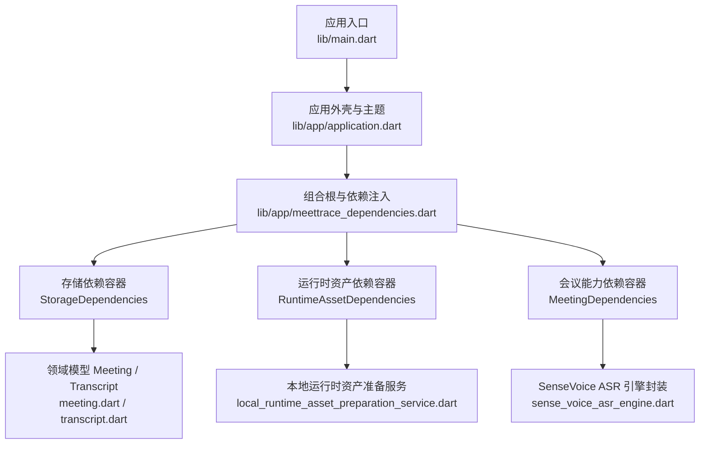
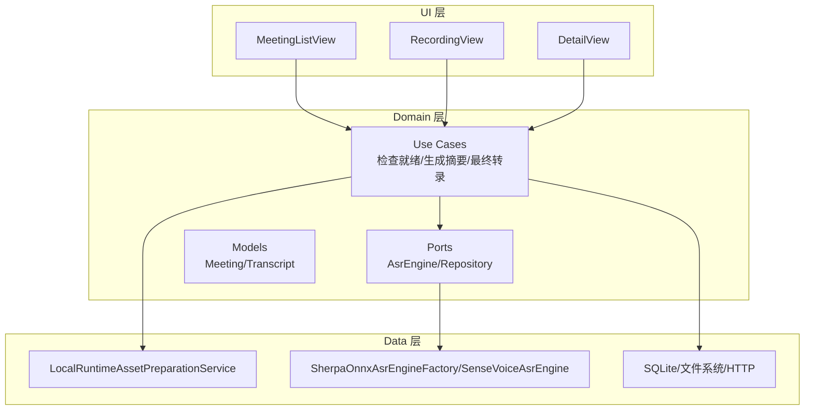
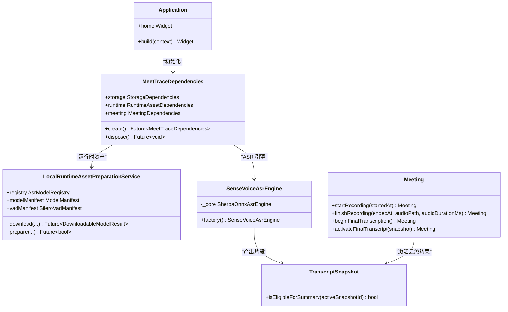

# 项目介绍

<cite>
**本文引用的文件**   
- [README.md](file://README.md)
- [PRODUCT.md](file://PRODUCT.md)
- [DESIGN.md](file://DESIGN.md)
- [pubspec.yaml](file://pubspec.yaml)
- [lib/main.dart](file://lib/main.dart)
- [lib/app/application.dart](file://lib/app/application.dart)
- [lib/app/meettrace_dependencies.dart](file://lib/app/meettrace_dependencies.dart)
- [lib/app/meettrace_meeting_dependencies.dart](file://lib/app/meettrace_meeting_dependencies.dart)
- [lib/data/services/models/local_runtime_asset_preparation_service.dart](file://lib/data/services/models/local_runtime_asset_preparation_service.dart)
- [lib/data/services/asr/sense_voice_asr_engine.dart](file://lib/data/services/asr/sense_voice_asr_engine.dart)
- [lib/domain/models/meeting.dart](file://lib/domain/models/meeting.dart)
- [lib/domain/models/transcript.dart](file://lib/domain/models/transcript.dart)
- [docs/technical/端侧_SenseVoice_转录技术方案.md](file://docs/technical/端侧_SenseVoice_转录技术方案.md)
- [docs/quality/Step_07_可靠录音与崩溃恢复.md](file://docs/quality/Step_07_可靠录音与崩溃恢复.md)
- [docs/quality/Step_12_Silero_VAD与预览队列.md](file://docs/quality/Step_12_Silero_VAD与预览队列.md)
</cite>

## 目录
1. [引言](#引言)
2. [项目结构](#项目结构)
3. [核心组件](#核心组件)
4. [架构总览](#架构总览)
5. [关键特性详解](#关键特性详解)
6. [平台与 Alpha 约束](#平台与-alpha-约束)
7. [目标用户与使用场景](#目标用户与使用场景)
8. [依赖关系分析](#依赖关系分析)
9. [性能与可靠性要点](#性能与可靠性要点)
10. [故障排查指南](#故障排查指南)
11. [结语](#结语)

## 引言
会迹（MeetTrace）是一款本地优先的 Android + iOS 会议录音、端侧转录与证据化总结应用。其核心价值主张是：以“事实音频”为唯一真实来源，在设备端完成可靠的录音、离线转录与可追溯的 AI 总结，确保在弱网或推理变慢时依然能完整记录会议内容，并在会后提供带时间戳的证据链，让用户从结论回溯到原文与音频片段。

- 本地事实音频优先，实时转录变慢或失败时录音继续。
- 首次初始化按固定 Manifest 下载并校验 SenseVoice 与 Silero VAD；资源未就绪前不进入首页。
- AI 总结只基于最终转录，关键结论保留时间戳证据。
- Android + iOS Alpha 不提供登录或跨设备同步，分别遵循两端原生交互与后台生命周期。

**章节来源**
- [README.md:1-11](file://README.md#L1-L11)
- [PRODUCT.md:19-40](file://PRODUCT.md#L19-L40)

## 项目结构
项目采用 Flutter 多端工程组织，核心代码位于 lib/，领域模型、用例、数据服务分层清晰；Android/iOS 原生壳与插件配置分别在 android/ 与 ios/ 下；产品与设计文档集中在 docs/ 与根级 PRODUCT.md、DESIGN.md。

**图表来源**
- [lib/main.dart:1-13](file://lib/main.dart#L1-L13)
- [lib/app/application.dart:1-37](file://lib/app/application.dart#L1-L37)
- [lib/app/meettrace_dependencies.dart:1-47](file://lib/app/meettrace_dependencies.dart#L1-L47)
- [lib/data/services/models/local_runtime_asset_preparation_service.dart:1-161](file://lib/data/services/models/local_runtime_asset_preparation_service.dart#L1-L161)
- [lib/data/services/asr/sense_voice_asr_engine.dart:1-46](file://lib/data/services/asr/sense_voice_asr_engine.dart#L1-L46)
- [lib/domain/models/meeting.dart:1-233](file://lib/domain/models/meeting.dart#L1-L233)
- [lib/domain/models/transcript.dart:1-133](file://lib/domain/models/transcript.dart#L1-L133)

**章节来源**
- [pubspec.yaml:1-112](file://pubspec.yaml#L1-L112)
- [lib/main.dart:1-13](file://lib/main.dart#L1-L13)

## 核心组件
- 应用外壳与主题：负责主题、本地化与根页面组装，不承载业务逻辑。
- 组合根与依赖注入：按 Storage/Runtime/Meeting 三个子容器装配依赖，保证 UI 仅通过 Use Case/Port 访问底层实现。
- 运行时资产准备：按固定 Manifest 下载并校验 SenseVoice 与 Silero VAD，支持断点续传、原子激活与快速离线启动。
- ASR 引擎封装：SenseVoice 通过 sherpa_onnx 官方包在独立 isolate 中运行，统一 16 kHz 单声道 PCM16 输入，支持全局时间轴事件与确定性排队。
- 领域模型：Meeting 管理会议状态机与模型锁定；Transcript 维护片段、快照与排序，保障证据一致性。

**章节来源**
- [lib/app/application.dart:1-37](file://lib/app/application.dart#L1-L37)
- [lib/app/meettrace_dependencies.dart:1-47](file://lib/app/meettrace_dependencies.dart#L1-L47)
- [lib/data/services/models/local_runtime_asset_preparation_service.dart:1-161](file://lib/data/services/models/local_runtime_asset_preparation_service.dart#L1-L161)
- [lib/data/services/asr/sense_voice_asr_engine.dart:1-46](file://lib/data/services/asr/sense_voice_asr_engine.dart#L1-L46)
- [lib/domain/models/meeting.dart:1-233](file://lib/domain/models/meeting.dart#L1-L233)
- [lib/domain/models/transcript.dart:1-133](file://lib/domain/models/transcript.dart#L1-L133)

## 架构总览
系统围绕“事实音频优先、端侧转录、结论可追溯”展开。UI 层通过 View → ViewModel → Use Case/Port 访问 Domain，Data 层实现 Repository/Service，ASR/VAD 与存储、网络解耦。

**图表来源**
- [lib/app/meettrace_dependencies.dart:1-47](file://lib/app/meettrace_dependencies.dart#L1-L47)
- [lib/data/services/models/local_runtime_asset_preparation_service.dart:1-161](file://lib/data/services/models/local_runtime_asset_preparation_service.dart#L1-L161)
- [lib/data/services/asr/sense_voice_asr_engine.dart:1-46](file://lib/data/services/asr/sense_voice_asr_engine.dart#L1-L46)
- [lib/domain/models/meeting.dart:1-233](file://lib/domain/models/meeting.dart#L1-L233)
- [lib/domain/models/transcript.dart:1-133](file://lib/domain/models/transcript.dart#L1-L133)

## 关键特性详解

### 本地优先与证据化总结
- 事实音频是唯一真实源，所有转录与总结必须基于完整本地音频。
- 最终转录完成后，AI 总结仅读取当前激活的最终转录快照，每条关键结论和行动项都保留带时间戳的转录证据，可从结论回溯到原文与对应音频片段。

**章节来源**
- [PRODUCT.md:32-40](file://PRODUCT.md#L32-L40)
- [lib/domain/models/transcript.dart:65-110](file://lib/domain/models/transcript.dart#L65-L110)

### 实时转录变慢或失败时录音继续
- 会中转录是可降级、可重建的临时结果，不得冒充最终转录。
- 当 ASR 积压、失败或不可用时，系统进入 recordingOnly 模式，停止后续预览推理，但事实录音继续写入，确保长会议至少覆盖连续 30 分钟。

**章节来源**
- [PRODUCT.md:66-70](file://PRODUCT.md#L66-L70)
- [docs/quality/Step_12_Silero_VAD与预览队列.md:18-22](file://docs/quality/Step_12_Silero_VAD与预览队列.md#L18-L22)

### SenseVoice 与 Silero VAD 的离线部署
- 权重不随 APK/IPA 分发，首次初始化通过固定 HTTPS Manifest 下载、续传、校验并原子激活。
- 第二次启动可完全离线快速通过；资源未就绪前首页保持阻断。
- 固定总量不超过 300 MB，严格校验文件大小与 SHA-256，多余文件视为失败。

**章节来源**
- [docs/technical/端侧_SenseVoice_转录技术方案.md:11-21](file://docs/technical/端侧_SenseVoice_转录技术方案.md#L11-L21)
- [docs/technical/端侧_SenseVoice_转录技术方案.md:54-71](file://docs/technical/端侧_SenseVoice_转录技术方案.md#L54-L71)
- [lib/data/services/models/local_runtime_asset_preparation_service.dart:119-161](file://lib/data/services/models/local_runtime_asset_preparation_service.dart#L119-L161)

### 会议主链与会中 UI
- 开始会议直接使用设置中的全局默认模型；录音开始后本场模型锁定，不自动切换或混合输出。
- 新会议先使用“待生成标题”，最终转录完成后由 AI 总结生成会议标题并替换。

**章节来源**
- [PRODUCT.md:46-52](file://PRODUCT.md#L46-L52)
- [lib/domain/models/meeting.dart:73-103](file://lib/domain/models/meeting.dart#L73-L103)

### 时间戳证据追溯
- 每条关键结论和行动项必须保留带时间戳的转录证据，点击证据播放对应片段的准确时间区间。
- 若证据段缺失或无效，结论标记为“待核对”。

**章节来源**
- [PRODUCT.md:68-69](file://PRODUCT.md#L68-L69)
- [test/ui/features/meetings/views/detail/meeting_detail_view_test.dart:241-278](file://test/ui/features/meetings/views/detail/meeting_detail_view_test.dart#L241-L278)

## 平台与 Alpha 约束
- 双平台自适应：Android 与 iOS 共享业务能力，界面结构与导航遵循各自原生惯例。
- Alpha 基线以 Android 为准；iOS 尚未形成等价的录音、端侧 ASR、后台生命周期、模型分发与真机验收证据。
- 不提供登录、账号、跨设备同步、团队协作、日历机器人、自动入会或多人在线编辑。
- Web 和桌面端不在当前产品范围。

**章节来源**
- [PRODUCT.md:56-64](file://PRODUCT.md#L56-L64)

## 目标用户与使用场景
- 主要用户：使用普通话或中英混合会议的 Android 与 iOS 个人用户。
- 典型场景：临时讨论、日常工作会议、研究同步或长时间会议；希望无需注册或稳定网络，即可可靠留下完整录音并获得可核对的转录与总结。
- 用户诉求：在准确率、模型体积、耗电和设备性能之间做出明确选择，但不需理解底层 ASR 细节，也不承担系统静默切换模型带来的混淆。

**章节来源**
- [PRODUCT.md:9-17](file://PRODUCT.md#L9-L17)

## 依赖关系分析
- UI 层通过 Forui 组件与主题令牌构建，功能 UI 不直接访问 ONNX、存储或 HTTP。
- Domain 层通过 Ports 抽象 ASR、存储与网络；Data 层实现具体 Service/Repository。
- 运行时资产准备服务协调下载、校验与原子激活；ASR 引擎封装屏蔽 sherpa_onnx 细节。

**图表来源**
- [lib/app/application.dart:1-37](file://lib/app/application.dart#L1-L37)
- [lib/app/meettrace_dependencies.dart:1-47](file://lib/app/meettrace_dependencies.dart#L1-L47)
- [lib/data/services/models/local_runtime_asset_preparation_service.dart:1-161](file://lib/data/services/models/local_runtime_asset_preparation_service.dart#L1-L161)
- [lib/data/services/asr/sense_voice_asr_engine.dart:1-46](file://lib/data/services/asr/sense_voice_asr_engine.dart#L1-L46)
- [lib/domain/models/meeting.dart:1-233](file://lib/domain/models/meeting.dart#L1-L233)
- [lib/domain/models/transcript.dart:65-110](file://lib/domain/models/transcript.dart#L65-L110)

**章节来源**
- [PRODUCT.md:77-80](file://PRODUCT.md#L77-L80)

## 性能与可靠性要点
- 事实录音主链独立于 ASR 推理，PCM 块按“文件写入并 flush → 双代 checkpoint → preview”提交，preview sink 有界且非阻塞。
- 支持权限与空间预检、暂停/恢复、显式 flush、停止与临时文件原子封存；异常退出残留尾字节可恢复。
- 预览队列按时长计量，超限时丢弃最旧窗口，回落到低水位后恢复；Engine 或 VAD 失败后进入 recordingOnly。
- 安装包与供应链门禁：Manifest 解析拒绝 HTTP、路径穿越、重复文件、空哈希、错误总量和不兼容 schema；APK/IPA 不包含权重。

**章节来源**
- [docs/quality/Step_07_可靠录音与崩溃恢复.md:11-23](file://docs/quality/Step_07_可靠录音与崩溃恢复.md#L11-L23)
- [docs/quality/Step_12_Silero_VAD与预览队列.md:11-22](file://docs/quality/Step_12_Silero_VAD与预览队列.md#L11-L22)
- [docs/technical/端侧_SenseVoice_转录技术方案.md:99-105](file://docs/technical/端侧_SenseVoice_转录技术方案.md#L99-L105)

## 故障排查指南
- 初始化页停留：无网络或未同意移动流量；空间不足显示精确缺口并允许重试；SHA/文件集失败进入修复；第二次启动文件缺失/大小异常进入修复并完整校验。
- Engine 初始化或推理失败：不自动切换；录音继续，显示修复/重试。
- 预览积压：丢最旧预览任务，绝不丢录音；最终转录失败保留事实音频和旧活动快照。
- 证据缺失：未知证据 ID 被丢弃且结论标记为待核对。

**章节来源**
- [docs/technical/端侧_SenseVoice_转录技术方案.md:86-98](file://docs/technical/端侧_SenseVoice_转录技术方案.md#L86-L98)
- [docs/quality/Step_12_Silero_VAD与预览队列.md:18-22](file://docs/quality/Step_12_Silero_VAD与预览队列.md#L18-L22)
- [test/domain/use_cases/generate_summary_test.dart:74-93](file://test/domain/use_cases/generate_summary_test.dart#L74-L93)

## 结语
会迹（MeetTrace）以“事实音频优先、端侧转录、结论可追溯”为核心，确保在复杂环境与弱网条件下也能可靠记录会议内容，并提供带时间戳的证据链，帮助用户从结论回溯到原文与音频片段。Alpha 阶段聚焦 Android 基线与端到端质量证据，未来将持续完善 iOS 等价能力与体验。

[本节不直接分析具体文件，故无章节来源]