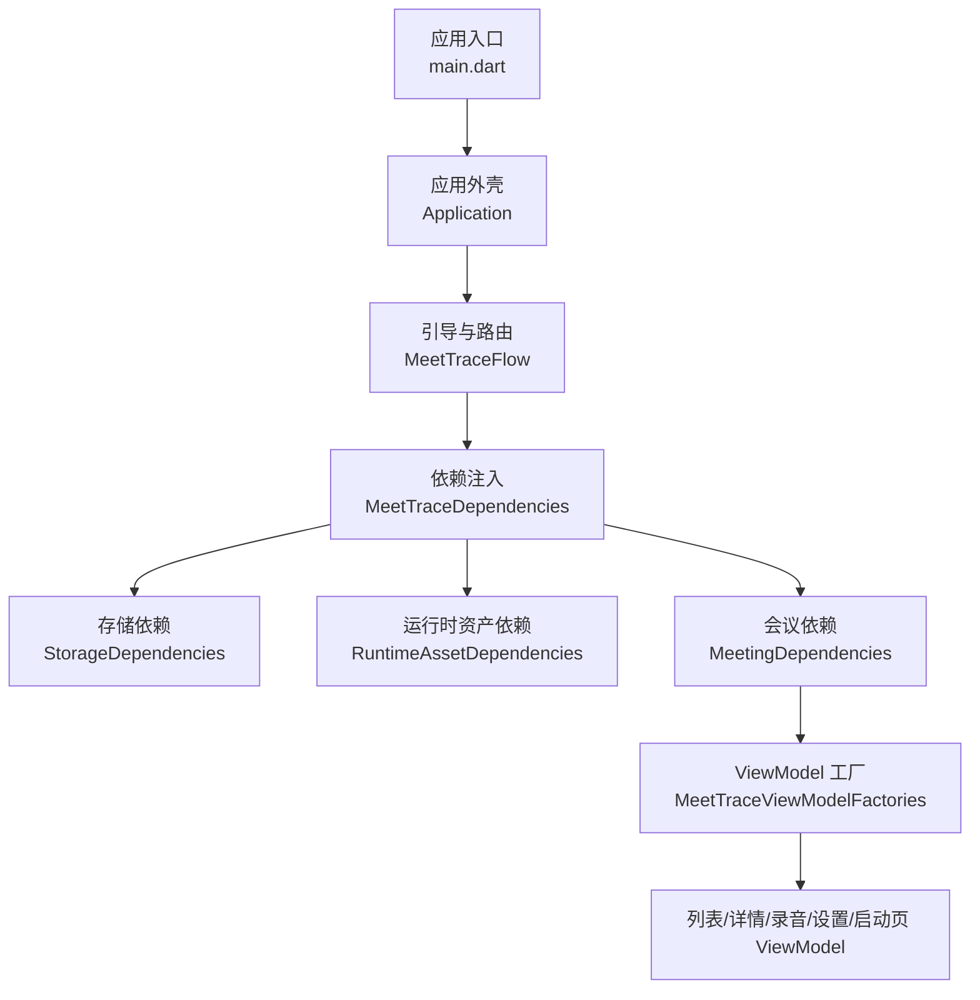
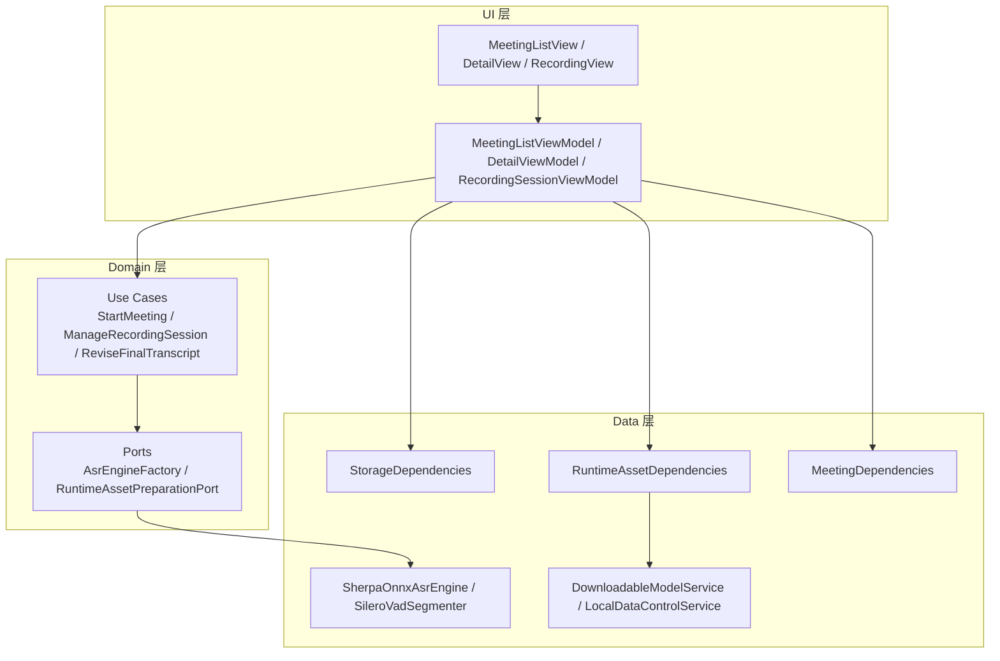
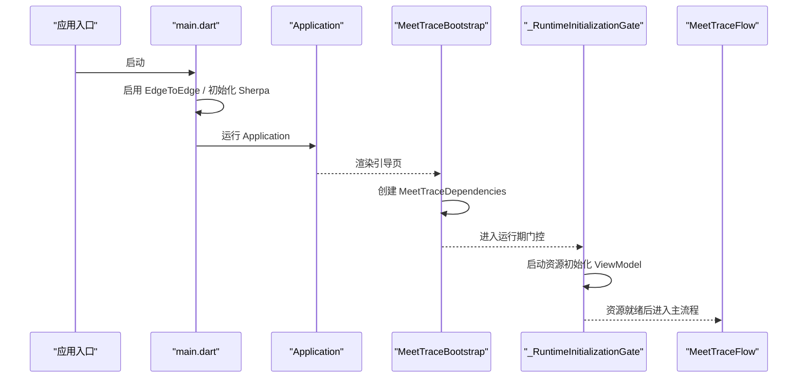
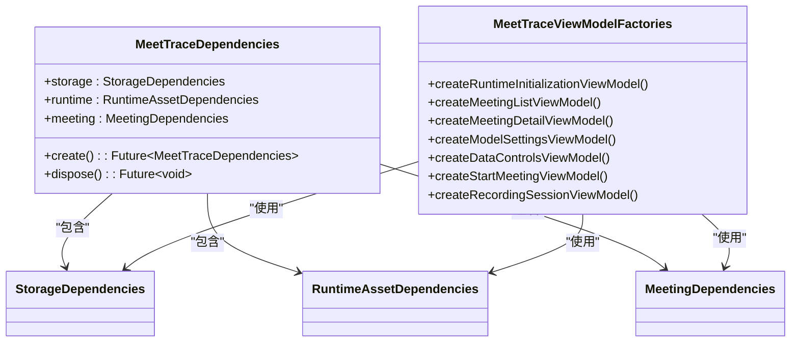
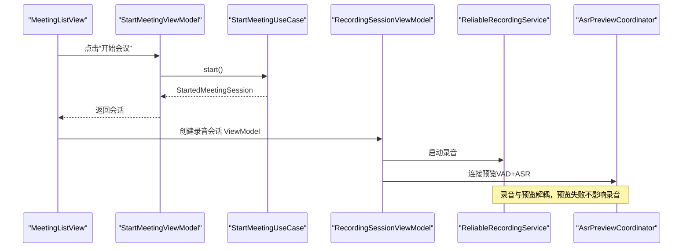
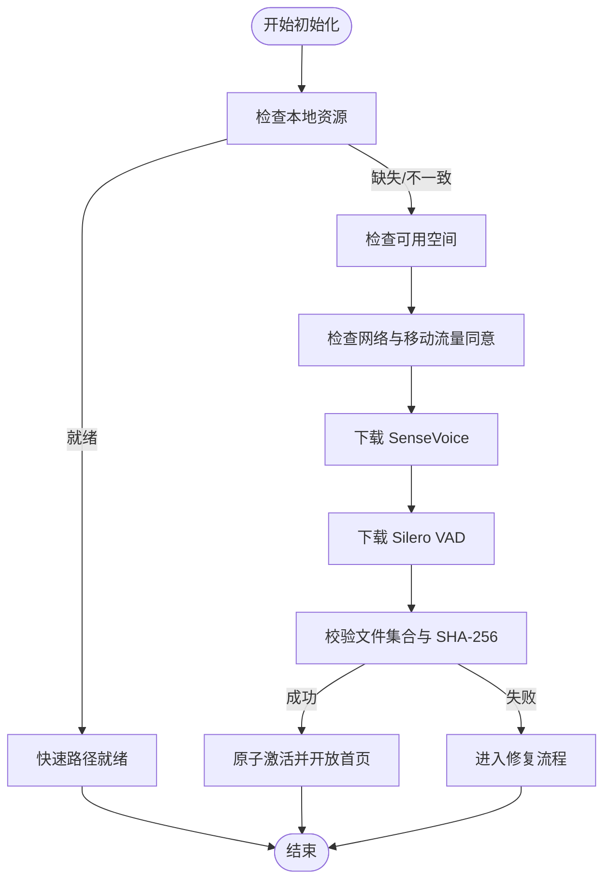
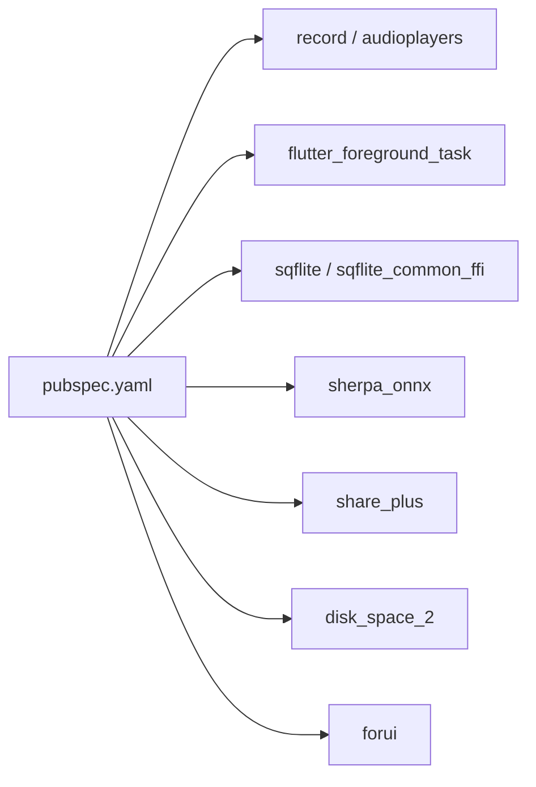

# 项目概述

<cite>
**本文引用的文件**   
- [README.md](file://README.md)
- [PRODUCT.md](file://PRODUCT.md)
- [DESIGN.md](file://DESIGN.md)
- [pubspec.yaml](file://pubspec.yaml)
- [lib/main.dart](file://lib/main.dart)
- [lib/app/application.dart](file://lib/app/application.dart)
- [lib/app/meettrace_flow.dart](file://lib/app/meettrace_flow.dart)
- [lib/app/meettrace_dependencies.dart](file://lib/app/meettrace_dependencies.dart)
- [lib/app/meettrace_dependency_factories.dart](file://lib/app/meettrace_dependency_factories.dart)
- [docs/technical/端侧_SenseVoice_转录技术方案.md](file://docs/technical/端侧_SenseVoice_转录技术方案.md)
</cite>

## 目录
1. [简介](#简介)
2. [项目结构](#项目结构)
3. [核心组件](#核心组件)
4. [架构总览](#架构总览)
5. [详细组件分析](#详细组件分析)
6. [依赖分析](#依赖分析)
7. [性能考量](#性能考量)
8. [故障排查指南](#故障排查指南)
9. [结论](#结论)
10. [附录：快速开始](#附录快速开始)

## 简介
会迹（MeetTrace）是一款本地优先的 Android + iOS 会议录音、端侧转录与证据化总结应用。其核心价值主张是“事实音频优先、端侧转录、结论可追溯”：
- 本地事实音频优先，实时转录变慢或失败时录音继续。
- 首次初始化按固定 Manifest 下载并校验 SenseVoice 与 Silero VAD；资源未就绪前不进入首页。
- AI 总结只基于最终转录，关键结论保留时间戳证据。
- Alpha 版本不提供登录或跨设备同步，遵循两端原生交互与后台生命周期。

这些特性确保在弱网、断网、推理积压等场景下，用户仍能获得完整可靠的会议记录闭环。

**章节来源**
- [README.md:1-11](file://README.md#L1-L11)
- [PRODUCT.md:19-76](file://PRODUCT.md#L19-L76)

## 项目结构
项目采用 Flutter 多平台工程组织，核心代码位于 lib 目录，按分层职责划分：
- app：应用外壳、启动流程、依赖注入与路由编排
- data：数据层服务（存储、ASR、VAD、模型下载、分享等）
- domain：领域模型、用例与端口定义
- ui：界面与视图模型（MVVM）
- theme：主题与系统 UI 适配

**图表来源**
- [lib/main.dart:7-12](file://lib/main.dart#L7-L12)
- [lib/app/application.dart:18-36](file://lib/app/application.dart#L18-L36)
- [lib/app/meettrace_flow.dart:114-156](file://lib/app/meettrace_flow.dart#L114-L156)
- [lib/app/meettrace_dependencies.dart:17-42](file://lib/app/meettrace_dependencies.dart#L17-L42)
- [lib/app/meettrace_dependency_factories.dart:29-163](file://lib/app/meettrace_dependency_factories.dart#L29-L163)

**章节来源**
- [lib/main.dart:7-12](file://lib/main.dart#L7-L12)
- [lib/app/application.dart:18-36](file://lib/app/application.dart#L18-L36)
- [lib/app/meettrace_flow.dart:114-156](file://lib/app/meettrace_flow.dart#L114-L156)
- [lib/app/meettrace_dependencies.dart:17-42](file://lib/app/meettrace_dependencies.dart#L17-L42)
- [lib/app/meettrace_dependency_factories.dart:29-163](file://lib/app/meettrace_dependency_factories.dart#L29-L163)

## 核心组件
- 应用外壳与主题：统一 Material 与 Forui 主题、本地化与根页面装配
- 启动引导与运行期门控：依赖创建、资源初始化、修复与重试
- 依赖注入与工厂：按层拆分 Storage/Runtime/Meeting 依赖，提供 ViewModel 工厂
- 录音与会话管理：可靠录音服务、预览协调器、会话生命周期用例
- 模型与资产准备：SenseVoice 与 Silero VAD 的下载、校验、原子激活
- 数据存储与共享：SQLite、文件系统布局、文本分享服务

这些组件共同实现“本地优先、端侧推理、证据可追溯”的产品目标。

**章节来源**
- [lib/app/application.dart:18-36](file://lib/app/application.dart#L18-L36)
- [lib/app/meettrace_flow.dart:19-112](file://lib/app/meettrace_flow.dart#L19-L112)
- [lib/app/meettrace_dependencies.dart:6-47](file://lib/app/meettrace_dependencies.dart#L6-L47)
- [lib/app/meettrace_dependency_factories.dart:29-163](file://lib/app/meettrace_dependency_factories.dart#L29-L163)
- [docs/technical/端侧_SenseVoice_转录技术方案.md:22-78](file://docs/technical/端侧_SenseVoice_转录技术方案.md#L22-L78)

## 架构总览
整体采用分层设计（UI → Domain → Data），结合 MVVM 与依赖注入：
- UI 层通过 ViewModel 暴露状态与行为，不直接访问 ONNX、存储或网络
- Domain 层定义端口（Port）与用例（Use Case），屏蔽底层实现细节
- Data 层封装 ASR/VAD、模型下载、存储、分享等具体实现
- 启动阶段完成资源准备与校验，未就绪则阻断进入首页

**图表来源**
- [lib/app/meettrace_flow.dart:114-156](file://lib/app/meettrace_flow.dart#L114-L156)
- [lib/app/meettrace_dependency_factories.dart:122-163](file://lib/app/meettrace_dependency_factories.dart#L122-L163)
- [docs/technical/端侧_SenseVoice_转录技术方案.md:22-45](file://docs/technical/端侧_SenseVoice_转录技术方案.md#L22-L45)

**章节来源**
- [lib/app/meettrace_flow.dart:114-156](file://lib/app/meettrace_flow.dart#L114-L156)
- [lib/app/meettrace_dependency_factories.dart:122-163](file://lib/app/meettrace_dependency_factories.dart#L122-L163)
- [docs/technical/端侧_SenseVoice_转录技术方案.md:22-45](file://docs/technical/端侧_SenseVoice_转录技术方案.md#L22-L45)

## 详细组件分析

### 启动与运行期门控
- 应用入口初始化 EdgeToEdge 与 Sherpa Onnx 运行时
- Application 装配主题、本地化与根页面
- MeetTraceBootstrap 负责依赖创建与错误处理，进入启动页或运行期门控
- _RuntimeInitializationGate 驱动资源初始化，必要时触发修复流程

**图表来源**
- [lib/main.dart:7-12](file://lib/main.dart#L7-L12)
- [lib/app/application.dart:18-36](file://lib/app/application.dart#L18-L36)
- [lib/app/meettrace_flow.dart:19-112](file://lib/app/meettrace_flow.dart#L19-L112)

**章节来源**
- [lib/main.dart:7-12](file://lib/main.dart#L7-L12)
- [lib/app/application.dart:18-36](file://lib/app/application.dart#L18-L36)
- [lib/app/meettrace_flow.dart:19-112](file://lib/app/meettrace_flow.dart#L19-L112)

### 依赖注入与 ViewModel 工厂
- MeetTraceDependencies 按 Storage/Runtime/Meeting 三层组装，统一创建与释放
- MeetTraceViewModelFactories 为各页面与功能提供 ViewModel，注入 Use Case、Port 与服务
- 录音会话通过 ReliableRecordingService 与 AsrPreviewCoordinator 组合，保证录音连续性与预览降级

**图表来源**
- [lib/app/meettrace_dependencies.dart:6-47](file://lib/app/meettrace_dependencies.dart#L6-L47)
- [lib/app/meettrace_dependency_factories.dart:29-163](file://lib/app/meettrace_dependency_factories.dart#L29-L163)

**章节来源**
- [lib/app/meettrace_dependencies.dart:6-47](file://lib/app/meettrace_dependencies.dart#L6-L47)
- [lib/app/meettrace_dependency_factories.dart:29-163](file://lib/app/meettrace_dependency_factories.dart#L29-L163)

### 录音与会话管理
- StartMeetingViewModel 调用 StartMeetingUseCase，完成会议创建与会话启动
- RecordingSessionViewModel 组合 ReliableRecordingService 与 AsrPreviewCoordinator
- 录音服务独立于 ASR 推理，即使预览积压或失败也不影响事实音频写入

**图表来源**
- [lib/app/meettrace_flow.dart:176-195](file://lib/app/meettrace_flow.dart#L176-L195)
- [lib/app/meettrace_dependency_factories.dart:122-163](file://lib/app/meettrace_dependency_factories.dart#L122-L163)

**章节来源**
- [lib/app/meettrace_flow.dart:176-195](file://lib/app/meettrace_flow.dart#L176-L195)
- [lib/app/meettrace_dependency_factories.dart:122-163](file://lib/app/meettrace_dependency_factories.dart#L122-L163)

### 模型与资产准备（SenseVoice 与 Silero VAD）
- 首次初始化按固定 Manifest 下载并严格校验，支持暂停续传与原子激活
- 快速路径仅检查安装记录、版本与文件大小，避免每次启动大文件 SHA 计算
- 移动网络同意与空间检查前置，失败时明确提示与恢复路径

**图表来源**
- [docs/technical/端侧_SenseVoice_转录技术方案.md:47-78](file://docs/technical/端侧_SenseVoice_转录技术方案.md#L47-L78)

**章节来源**
- [docs/technical/端侧_SenseVoice_转录技术方案.md:47-78](file://docs/technical/端侧_SenseVoice_转录技术方案.md#L47-L78)

### 设计与交互原则
- 以“安静的事实账本”为创意北极星，强调连续时间轨道与灰阶语义
- 录音计时器是唯一允许超大字号的动态数字，波形忠实反映 PCM 音量
- 双平台共享视觉令牌，但保留各自原生导航、手势与安全区

**章节来源**
- [DESIGN.md:147-165](file://DESIGN.md#L147-L165)
- [DESIGN.md:224-239](file://DESIGN.md#L224-L239)
- [DESIGN.md:307-316](file://DESIGN.md#L307-L316)

## 依赖分析
- 外部依赖包括录音、播放、前台任务、SQLite、ONNX 推理、分享与磁盘空间检测
- 包清单仅声明 Manifest 与许可证，模型权重不随安装包分发
- 依赖关系清晰：UI 不直接访问 ONNX/存储/HTTP，通过 Port/Use Case 隔离

**图表来源**
- [pubspec.yaml:30-46](file://pubspec.yaml#L30-L46)

**章节来源**
- [pubspec.yaml:30-46](file://pubspec.yaml#L30-L46)
- [pubspec.yaml:74-81](file://pubspec.yaml#L74-L81)

## 性能考量
- 录音与推理分离，确保 ASR 积压或失败不影响事实音频写入
- 预览队列丢最旧任务，绝不丢录音；最终转录失败保留事实音频与旧快照
- 第二次启动走快速路径，避免重复大文件校验，提升冷启动速度
- 固定窗口与确定性排队降低延迟抖动，便于监控 RTF 与结果延迟

**章节来源**
- [docs/technical/端侧_SenseVoice_转录技术方案.md:72-98](file://docs/technical/端侧_SenseVoice_转录技术方案.md#L72-L98)

## 故障排查指南
- 启动失败：检查依赖创建是否抛出异常，查看引导页错误提示与重试按钮
- 资源未就绪：确认存储空间、网络与移动流量同意；进入设置执行修复
- 录音问题：检查麦克风权限、前台服务与系统增强效果；观察波形与状态通知
- 模型问题：查看安装记录与校验结果；必要时重新下载并原子激活
- 数据库升级：旧版本将阻断进入当前版本，需先导出录音再卸载或清除数据

**章节来源**
- [lib/app/meettrace_flow.dart:31-65](file://lib/app/meettrace_flow.dart#L31-L65)
- [docs/technical/端侧_SenseVoice_转录技术方案.md:86-98](file://docs/technical/端侧_SenseVoice_转录技术方案.md#L86-L98)

## 结论
会迹以“本地优先、端侧转录、结论可追溯”为核心，通过分层架构、MVVM 与依赖注入，实现了稳定可靠的会议录音与转录体验。Alpha 版本聚焦 Android/iOS 双平台基础能力与质量门禁，后续将在保持本地边界的前提下持续优化性能与可用性。

## 附录：快速开始
- 环境要求
  - Flutter SDK 3.12.2+
  - Android 与 iOS 开发环境（真机调试建议）
- 安装步骤
  - 拉取仓库并安装依赖
  - 构建并运行 Android/iOS 目标
- 基本使用方法
  - 首次启动进行资源初始化（SenseVoice 与 Silero VAD）
  - 进入首页后点击“开始会议”，完成录音与会中预览
  - 结束后查看最终转录、AI 总结与时间戳证据

**章节来源**
- [pubspec.yaml:21-23](file://pubspec.yaml#L21-L23)
- [README.md:1-11](file://README.md#L1-L11)
- [PRODUCT.md:43-52](file://PRODUCT.md#L43-L52)