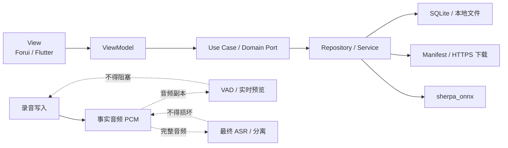

<div align="center">
  
  <h1>会迹（MeetTrace）</h1>
  <p><strong>本地优先、可核对、不会为推理牺牲录音的会议记录应用。</strong></p>
  <p>Flutter · Android / iOS · 端侧 ASR · 本地事实音频</p>
</div>

会迹是一款采用 MIT License、面向个人会议记录的开源 Flutter 应用。它在设备上持续保存事实音频，并使用端侧模型生成实时预览和最终转录。网络、模型、实时转录或说话人分离出现问题时，录音仍必须继续。

> [!WARNING]
> **项目处于 Alpha 阶段，尚未达到生产发布条件。** 当前可运行实现和质量证据以 Android 为基线；iOS 尚未完成等价的录音、后台生命周期、模型分发和真机验收。官方 `sherpa_onnx` Dart 说话人分离接口还存在完整波形原生缓冲区未释放的问题，因此生产组合根暂时关闭自动说话人分离，并明确降级为单一说话人结果。

## 为什么是会迹

- **事实音频优先**：录音写入与 ASR 解耦；推理积压、变慢或失败不会中断录音。
- **默认本地处理**：音频、转录、模型和派生数据保存在应用私有目录，不依赖账号或云端服务。
- **结果可以核对**：最终片段保留时间范围，可回到对应的本地事实音频。
- **降级必须明确**：能力不可用时保留事实数据、说明当前状态，并提供真实的恢复或重试入口。
- **选择不会静默改变**：会议开始后模型与配置锁定，不自动切换模型，也不混合不同模型的输出。

## 当前能力

| 能力 | 当前状态 |
|---|---|
| 本地会议录音、检查点与异常恢复 | Android Alpha 已实现；录音是唯一事实源 |
| SenseVoice 会中预览与完整音频最终转录 | 已实现，使用官方 `sherpa_onnx` Flutter/Dart 包 |
| Silero VAD 与有界预览队列 | 已实现；队列可丢弃预览任务，但不能丢失录音 |
| 首次初始化下载、断点续传、哈希校验与修复 | 已实现；全部固定资源就绪前阻断首页 |
| Pyannote + 3D-Speaker 离线说话人分离 | 适配器与自动化已完成；生产自动运行受上游内存缺陷阻断 |
| 最终快照、重试与说话人显示标签修订 | 已实现；分离失败时发布单一说话人降级结果 |
| 文本分享与音频分享 | 独立操作；音频需二次确认并生成临时 WAV，不改写源录音 |
| 登录、云同步、AI 总结、日历机器人 | 不在当前 Alpha 范围 |

完整范围和验收标准以 [Alpha PRD](docs/product/Alpha_PRD_无登录版.md) 为准。

## 隐私与数据边界

- 应用不提供登录或跨设备同步。
- 当前不接入业务分析埋点或云端总结服务；Release 默认启用 Sentry 崩溃、性能与遮罩遥测，且不主动附加事实音频或转录快照。
- 只有用户主动分享文本，或确认“分享音频”后，数据才会进入系统分享面板。
- 音频分享使用事实 PCM 只读生成临时 WAV；完成、取消或失败后清理临时副本。
- 删除会议会级联删除该会议的音频、转录、标签和处理记录。
- 卸载应用可能永久删除应用私有目录中的全部会议和模型数据。
- Alpha 的数据代升级采用全清策略；检测到不兼容数据代时会清空旧 Alpha 数据并重新初始化。不要把当前版本用于不可恢复的重要录音。

## 支持范围

| 平台 | 最低目标 | 状态 |
|---|---:|---|
| Android | API 24 / Android 7.0 | 当前开发与验证基线 |
| iOS | iOS 13.0 | 目标平台，尚缺 macOS/Xcode 与真机闭环证据 |
| Web / Windows / Linux / macOS | — | 仅保留 Flutter 工程壳，不属于 Alpha 支持面 |

## 技术架构

项目遵循 `View → ViewModel → Use Case / Port → Repository / Service` 的分层方式。Domain 保持纯 Dart，不反向依赖 Data；UI 不直接访问 SQLite、HTTP、录音插件或 ONNX。



核心目录：

```text
lib/
├── app/                         # 组合根、启动与应用流程
├── domain/
│   ├── models/                  # 业务模型
│   ├── ports/                   # 纯 Dart 能力边界
│   └── use_cases/               # 可复用业务编排
├── data/
│   ├── models/                  # 持久化和传输模型
│   ├── repositories/            # Port 实现
│   └── services/                # 录音、ASR、模型、存储与网络
├── ui/
│   ├── core/                    # 共享 Forui 组件
│   └── features/                # 页面与 ViewModel
└── theme/                       # 主题和设计令牌

test/                            # 镜像源码结构的单元与组件测试
docs/                            # 产品、技术、质量与项目文档
assets/models/                   # 固定 Manifest，不包含模型权重
assets/licenses/                 # 第三方模型许可与 NOTICE
```

## 运行时模型

模型权重不会进入 APK 或 IPA。干净安装首次启动时，应用按仓库中的固定 Manifest 从 `https://mt.zhangheng.eu.org` 下载并严格校验资源。

| 资源 | 下载大小 | 用途 |
|---|---:|---|
| SenseVoice INT8 | 239,549,735 B | 多语言端侧 ASR |
| Silero VAD INT8 | 212,860 B | 语音活动检测 |
| Pyannote INT8 + 3D-Speaker | 46,552,205 B | 离线说话人分离 |
| **总计** | **286,314,800 B** | 首次初始化固定资源集合 |

初始化前要求应用所在卷至少有 `1 GiB` 可用空间。Wi-Fi 可自动下载；移动或未知网络必须先显示总量并获得用户同意。文件大小、SHA-256、安装白名单和许可信息见：

- [SenseVoice Manifest](assets/models/manifest.json)
- [Silero VAD Manifest](assets/models/silero-vad-manifest.json)
- [说话人分离 Manifest](assets/models/speaker-diarization-manifest.json)
- [运行时模型初始化与发布门槛](docs/quality/运行时模型初始化与发布门槛.md)

## 开始开发

### 环境要求

- Flutter stable（当前仓库开发环境：Flutter `3.44.8`、Dart `3.12.2`）
- Android：Android SDK、JDK 17；目标设备需为支持的 Android 设备或模拟器
- iOS：macOS、Xcode、CocoaPods 和 iOS 13+ 设备或模拟器
- 首次完整初始化约需下载 286.3 MB，并要求至少 1 GiB 可用空间

### 获取代码

```bash
git clone https://github.com/zhangheng2022/meetily_ai.git
cd meetily_ai
flutter pub get
```

### 运行

先查看可用设备：

```bash
flutter devices
```

然后运行应用：

```bash
flutter run -d <device-id>
```

首次进入时应用会自动执行资源检查和下载；不需要手动把 ONNX 文件放入项目或安装包。

### 构建调试产物

```bash
# Android
flutter build apk --debug

# iOS（需要 macOS/Xcode）
flutter build ios --debug --no-codesign
```

> Android `release` 不再回退到调试签名。没有显式注入正式 keystore 时只可用于无签名构建诊断；正式 Alpha 只从统一 `Alpha Release` 入口生成，其中 Android job 完成签名、证书校验并暂存到 Draft。维护者完成双平台验收后，在唯一的 `github-release` 批准步骤决定是否公开。

## 测试与质量检查

提交变更前至少运行：

```bash
dart format lib test
flutter analyze
flutter test
```

版本候选与 GitHub Pre-release 的维护者操作见 [GitHub Alpha 版本发布流程](docs/project/GitHub_版本发布流程.md)。双平台同 SHA 验收后，当前公开源码仓库的 Pre-release 提供已验收的 Android arm64 APK；iOS 仅通过 TestFlight 分发，GitHub 不提供 IPA。

重点自动化范围包括可靠录音逻辑、模型校验与续传、会议模型锁定、预览积压恢复、最终快照原子切换、说话人降级、音频分享清理和数据代迁移。当前仓库不包含设备集成测试；真实录音、真实模型的 RTF、延迟、内存、能耗、温控和准确率必须在目标 arm64 真机上按质量文档人工验收，自动化 Fake 不能替代发布证据。

## 参与贡献

欢迎通过 Issue 和 Pull Request 参与。开始修改前请先阅读：

1. [项目文档中心](docs/README.md)：全部活动文档和权威关系。
2. [Alpha PRD](docs/product/Alpha_PRD_无登录版.md)：当前产品范围和验收标准。
3. [技术方案](docs/technical/端侧_SenseVoice_转录技术方案.md)：录音、ASR、初始化、存储和降级契约。
4. [交互与视觉规范](DESIGN.md)：Forui、主题、响应式和双平台 UI 规则。
5. [仓库协作指南](AGENTS.md)：架构、测试、审查和安全要求。

贡献约定：

- 产品范围或 P0 验收变化必须先更新 PRD。
- UI 只依赖 Domain Port、Use Case 和模型；不要从 UI 直接调用 Data Service。
- sherpa-onnx 只通过官方 `sherpa_onnx` Flutter/Dart 包接入，不新增私有 JNI、FFI 或原生桥接。
- 行为变更应补充单元测试或组件测试；UI 变更请提供亮色、暗色和必要的紧凑布局截图。
- PR 请说明用户影响、关联文档、验证命令、目标平台结果以及仍然保留的风险。
- 不要提交录音、下载后的模型、密钥、`build/` 或 `coverage/`。

## 项目状态与发布阻塞

当前 Alpha 仍需完成：

- 等待官方 `sherpa_onnx` 修复 Dart 说话人分离完整波形缓冲区释放问题，并完成 30 分钟重复任务内存复验。
- 使用不少于 60 分钟的普通话 2/3/4 人标注语料校准分离阈值并验证 DER、人数误差和 RTF。
- 完成 Android 目标设备的长会议、后台录音、能耗、温控、分享接收端播放和清理证据。
- 在 macOS/Xcode 环境完成 iOS 构建、签名、后台生命周期、模型分发和真机验收。

最新状态以 [质量证据索引](docs/quality/README.md) 和 [运行时模型初始化与发布门槛](docs/quality/运行时模型初始化与发布门槛.md) 为准。

## 上游项目与第三方许可

会迹建立在以下项目和模型之上：

- [Flutter](https://github.com/flutter/flutter)
- [Forui](https://github.com/forus-labs/forui)
- [sherpa-onnx](https://github.com/k2-fsa/sherpa-onnx)
- [SenseVoice](https://huggingface.co/csukuangfj/sherpa-onnx-sense-voice-zh-en-ja-ko-yue-2024-07-17)
- [Silero VAD](https://github.com/snakers4/silero-vad)
- [Pyannote segmentation](https://github.com/k2-fsa/sherpa-onnx/releases/tag/speaker-segmentation-models)
- [3D-Speaker](https://github.com/modelscope/3D-Speaker)

第三方模型的来源、固定哈希、NOTICE 和许可文本位于 [assets/licenses](assets/licenses/)；这些资产继续受各自许可证约束，不因项目代码采用 MIT License 而改变。

## 许可证

会迹项目代码基于 [MIT License](LICENSE) 开源。第三方依赖、模型与资源文件可能适用不同的许可条款，使用或再分发前请同时查阅 [assets/licenses](assets/licenses/) 及相应上游项目的许可证。

---

产品与技术决策从 [docs/README.md](docs/README.md) 进入；历史方案由 Git 保存，活动文档只维护当前结论。
