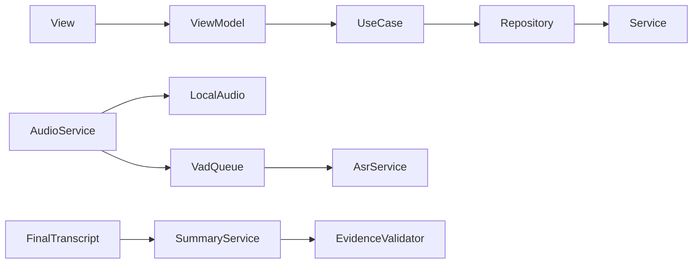
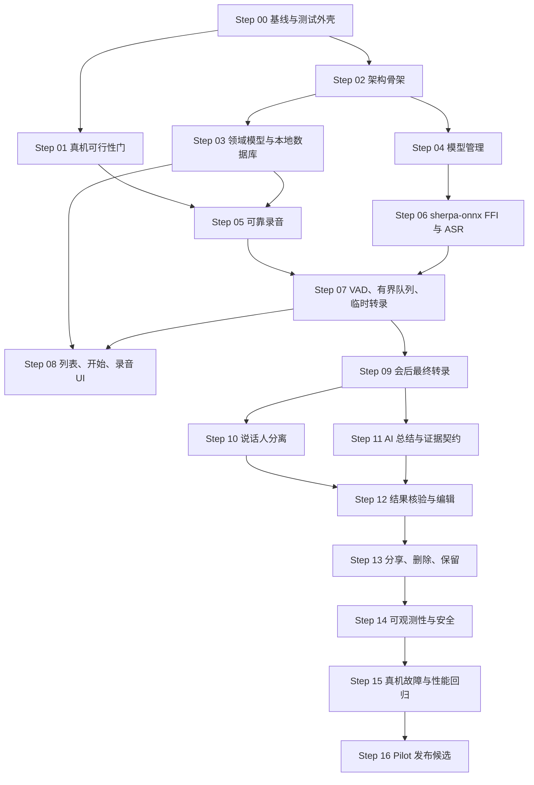

# Meetily Android Alpha：Codex 开发步骤

> 文档状态：可执行草案  
> 生成日期：2026-07-23  
> 适用范围：无登录、Android、本地优先、Qwen3-ASR 0.6B INT8 端侧转录 Alpha  
> 需求基线：[研会 AI Alpha PRD（无登录版）](./研会_AI_Alpha_PRD_无登录版.md)  
> 技术基线：[Qwen3-ASR 离线转录技术方案](./Qwen3-ASR离线转录技术方案.md)

## 1. 文档用途

本文把 PRD、离线转录技术方案、`AGENTS.md` 和当前代码状态转换为可逐项交给 Codex 执行的开发步骤。每个步骤只处理一个可验证增量，完成后再进入依赖它的步骤。

本文不修改 P0 范围。发现性能、依赖或验收冲突时，必须停在对应决策门，更新 PRD 或技术决策后再继续。

## 2. 当前仓库基线

截至 2026-07-23，项目仍处于 Flutter/Forui 脚手架阶段：

| 范围 | 当前状态 | 结论 |
|---|---|---|
| Flutter 外壳 | `MaterialApp` 外层承载 `FTheme`、`FToaster` 和 `FTooltipGroup` | 已有最小外壳，可继续使用 |
| 主题 | 已生成 Forui 明暗主题文件 | 已有基础令牌，功能 UI 尚未建立 |
| 页面 | 仅显示 `Meetily AI` 占位文本 | 所有 P0 页面待实现 |
| 测试 | 仅有应用外壳组件测试 | 业务单测、组件测试、真机集成测试均待建立 |
| Android | 默认 `MainActivity` 和默认 Manifest | 麦克风权限、音频采集、原生桥接均待实现 |
| 本地数据 | 无数据库与仓储实现 | 待建立 |
| 模型管理 | 无模型下载、校验、安装实现 | 待建立 |
| ASR | 无 sherpa-onnx、VAD、Qwen3-ASR 接入 | 待建立 |
| AI 总结 | 无后端协议、客户端或结构化结果模型 | 待建立 |
| 分享/删除 | 无实现 | 待建立 |

现有 `docs/云端实时转录技术方案.md` 不属于当前 Alpha 主链。它可以保留为备选研究材料，但不得把 Gateway、腾讯云实时 ASR、音频分段上传或云端最终转录引入本计划。

## 3. 不可破坏的约束

1. 本地音频是唯一事实源。
2. 录音写盘与 ASR 推理解耦；推理慢、失败或队列满时，录音仍必须继续。
3. 有界队列只能丢弃或暂停实时预览任务，不得丢弃已经采集的本地音频。
4. 会中内容是临时转录；AI 总结只能读取会后最终转录。
5. 音频、临时转录、最终转录和说话人分离默认留在本机；云端总结只接收最终文本。
6. 核心讨论、结论、行动项和未决问题必须绑定本地转录片段与时间戳。
7. 不增加登录、同步、团队、项目、iOS、Web、公开链接或更多总结模板。
8. UI 遵循 `View → ViewModel → Repository → Service`，不得直接调用 ONNX、数据库、文件系统或 HTTP。
9. 功能组件优先使用 Forui 和 `context.theme`；Material 仅限应用外壳、平台集成或已记录的能力缺口。
10. sherpa-onnx FFI 绑定必须从头文件生成，不手写 ABI 声明。

## 4. `$grill-me` 审查结论

### 4.1 已确认决策

- 模型固定为 `Qwen3-ASR-0.6B INT8`，两周内不切换 1.7B、不训练、不微调。
- “实时”固定为 VAD 分句后的句级近实时，不模拟逐字流式字幕。
- Alpha 只承诺 Android 10+ 的 3–5 台指定测试设备。
- Alpha 可要求 App 保持前台，不默认实现或宣称锁屏/后台录音。
- 会后最终转录重新读取完整本地音频，不直接拼接临时文本。
- 说话人分离属于可降级步骤，失败不得阻塞最终转录、总结和结果查看。

### 4.2 必须显式处理的冲突

| 冲突 | 本计划处理方式 |
|---|---|
| PRD 把说话人分离列入 P0；技术方案允许不达标时降为 P1 | 先做 Day 1/Day 7 性能验证。失败时保留“发言人待确认”和手动重命名能力，但不得自行把 FR-021 移出 P0；必须发起范围复审 |
| FR-020 要求 30 分钟会议在 5 分钟内获得最终转录和 AI 总结；AT-02 只明确最终转录 5 分钟，联网后继续总结 | 分别记录 `final_transcript_latency` 和 `summary_latency`；发布门按更严格的 FR-020 检查，若云端总结不可控则回到 PRD 复审 |
| PRD 的证据定位误差为 ≤ 3 秒；技术方案内部目标为 ≤ 1 秒 | 实现与回归以 ≤ 1 秒为工程目标，最终产品验收保持 ≤ 3 秒 |
| 离线方案建议优先使用 sherpa-onnx Dart API，仓库规则要求 ffigen 和 Native Assets | 先用 ffigen 从 sherpa-onnx 头文件生成绑定并隔离在 Service；若生命周期或稳定性不足，再用 Kotlin 承载模型并通过平台事件回传 |

### 4.3 尚未确定的外部输入

这些内容不能由 Codex 猜测：

| 输入 | 最晚确定时间 | 未确定时允许做什么 |
|---|---|---|
| 3–5 台目标设备及最低档设备 | Step 01 前 | 只能搭建测试脚本，不能通过性能门 |
| 20 段真实会议评测音频及使用授权 | Step 01 前 | 可以使用合成/公开样本验证流程，不能判断准确率 |
| 模型文件下载地址、版本、大小、SHA-256、许可说明 | Step 04 前 | 可以实现 Manifest 和下载器假实现，不能完成真实安装 |
| 说话人分离模型清单、哈希与许可 | Step 10 前 | 可以完成接口和降级状态，不能承诺 FR-021 |
| AI 总结服务的 Base URL、鉴权、超时、结构化协议、删除协议、24 小时清理证明 | Step 11 前 | 可以完成接口、Fake Service 和契约测试，不能完成真实全链路 |
| Android Application ID、签名与 Alpha 分发方式 | Step 16 前 | 可使用调试包，不能生成发布候选包 |

### 4.4 需要补进技术决策记录的问题

- 本地数据库方案和迁移策略。
- 录音文件容器及异常恢复策略：建议分块 PCM 临时文件 + 完成后封装 WAV，避免长录音中途损坏整个文件。
- 模型下载是否允许移动网络，以及断点续传策略。
- 原始音频默认 7 天到期后，证据入口应显示“录音已清理”，但仍保留转录时间戳。
- 总结请求是由自建轻量后端代理，还是直接使用现有服务；永久供应商密钥不得进入 APK。

## 5. 目标架构

```text
lib/
  app/
    application.dart
    app_dependencies.dart
  theme/
  ui/
    core/
    features/
      meetings/{views,view_models}/
      recording/{views,view_models}/
      processing/{views,view_models}/
      meeting_result/{views,view_models}/
      settings/{views,view_models}/
  domain/
    models/
    use_cases/
  data/
    models/
    repositories/
    services/
      audio/
      asr/
      model_manager/
      persistence/
      summary/
      sharing/
android/
  app/src/main/kotlin/<application-id>/
integration_test/
test/
  ui/
  domain/
  data/
```

核心依赖方向：



禁止反向依赖。`audio/` 不依赖 UI，`asr/` 不持有页面状态，`summary/` 不读取临时转录。

## 6. 执行方式

每次只让 Codex 执行一个 Step。开始前要求它：

1. 阅读 `AGENTS.md`、本文件、对应 PRD 条目和直接相关技术章节。
2. 列出本 Step 的范围、非范围和预计修改文件。
3. 保留工作区中与本 Step 无关的用户改动。
4. 实现代码与测试，不顺手扩展后续功能。
5. 运行本 Step 的验证命令并报告结果。
6. 若命中决策门或缺少外部输入，停下并给出证据，不使用占位凭证伪装完成。

建议每个 Step 单独提交。提交标题使用中文祈使语气，并在提交或 PR 描述中引用对应 FR/AT 编号。

## 7. 依赖总览



## 8. Codex 开发步骤

### Step 00：建立可重复的工程基线

**目标**

- 把当前脚手架变成可持续开发的基线，不实现业务功能。
- 保证 `Application`/`FTheme` 测试外壳可复用。
- 建立 `integration_test/`、测试辅助工具、日志接口和依赖注入入口。

**必须使用**

- `flutter-apply-architecture-best-practices`
- `flutter-add-widget-test`
- `dart-run-static-analysis`

**工作项**

- 将应用外壳从 `main.dart` 拆到 `lib/app/`，`main.dart` 只负责启动。
- 将 Android 最低版本显式设为 API 29（Android 10），与 Alpha 支持边界一致。
- 建立可替换依赖容器，测试中可注入 Fake Repository/Service。
- 建立统一的 `Result`/失败类型，至少区分录音、模型、ASR、持久化、总结和分享错误。
- 更新默认组件测试，移除只验证占位文字的断言。
- 建立 `integration_test/README.md`，记录必须在真机执行的测试。

**完成条件**

- 空应用可启动并显示 Forui 外壳。
- 测试可以替换 Service，不访问真实麦克风、文件系统、模型或网络。
- `flutter analyze`、`flutter test` 和 `flutter build apk --debug` 通过。

### Step 01：Day 1 真机可行性与强制退出门

**目标**

在写大量产品代码前，证明指定设备可以承担 Qwen3-ASR 0.6B INT8 主链。

**工作项**

- 固定低、中、高三档目标设备与系统版本。
- 在设备上运行 sherpa-onnx 官方 Qwen3-ASR 示例。
- 对同一批样本记录模型加载时间、峰值内存、RTF P50/P95、发热、降频、崩溃/ANR 和识别质量。
- 同时运行 30 分钟 AudioRecord 写盘测试，确认推理不会破坏录音。
- 验证 VAD 片段起止时间能够支持回放定位。
- 把原始结果写入 `docs/verification/day1_device_feasibility.md`，不得只写“通过”。

真机安装、采样环境和人工准确率判断需要测试人员参与；Codex 可以编写脚本、采集指标和整理报告，但不能用模拟器或推测数据替代真机结论。

**退出门**

以下任一成立时暂停后续 ASR 功能：

- 中档设备无法加载模型。
- 最低目标设备 RTF P95 ≥ 1。
- 推理导致录音缺口、ANR、崩溃或系统杀进程。
- 30 分钟最终转录无法进入 5 分钟目标。
- 真实会议准确率不足以支持总结。

**完成条件**

- 形成设备矩阵、样本清单、测量脚本和可复查数据。
- 明确 `GO`、`调整设备基线` 或 `范围复审`，不允许模糊通过。

### Step 02：建立分层目录与接口边界

**目标**

建立业务代码骨架，锁定 UI、领域、仓储和服务的依赖方向。

**必须使用**

- `flutter-apply-architecture-best-practices`
- `dart-add-unit-test`

**工作项**

- 建立第 5 节目录。
- 定义 Repository 接口：会议、转录、总结、模型安装、设置。
- 定义 Service 接口：音频、ASR、文件、数据库、HTTP、分享、安全存储。
- ViewModel 只依赖 Use Case/Repository 抽象。
- 为依赖边界和主要状态转换增加单元测试。

**完成条件**

- UI 层没有 ONNX、SQL、文件和 HTTP import。
- Fake 实现可驱动各页面状态。
- 后续替换 Dart FFI/Kotlin 桥接时不改 View/ViewModel。

### Step 03：领域模型、状态机与本地数据库

**目标**

先固化本地事实模型，再接入录音和 ASR。

**建议模型**

- `Meeting`
- `MeetingStatus`
- `RecordingStatus`
- `ProcessingStage`
- `TranscriptSegment`
- `TranscriptSnapshot`
- `SpeakerLabel`
- `SummaryDocument`
- `SummaryItem`
- `EvidenceReference`
- `PendingCleanup`
- `ModelInstallation`

**工作项**

- 建立本地数据库与版本迁移。
- 会议状态覆盖：录音中、处理中、最终转录可用、总结待确认、已完成、处理失败、待恢复。
- 临时转录和最终转录使用不同存储身份，最终快照不得被临时事件覆盖。
- 保存 `start_ms/end_ms/source/is_final/speaker_id/text`。
- 最终快照写入与会议状态更新在同一事务。
- App 启动时扫描未完成会议并产生恢复任务。

**重点测试**

- 状态转换合法性。
- 不同会议不串数据。
- 最终快照原子替换。
- 异常退出后的未完成会议恢复。
- 数据库升级不删除已有会议。

**映射**

- FR-001、FR-020、FR-032、FR-042
- AT-01、AT-05、AT-12

### Step 04：模型下载、校验、安装与回滚

**目标**

安全管理约 1 GB 级模型，不把模型打进 APK。

**工作项**

- 定义版本化模型 Manifest：文件名、URL、字节数、SHA-256、所需空间、许可信息。
- 下载前检查网络类型和至少 2 GB 可用空间。
- 支持进度、取消、失败重试和安全重新开始；若实现断点续传，必须验证服务端 Range 行为。
- 下载到临时目录，逐文件校验后原子重命名。
- 新版本安装失败时保留上一可用版本。
- 模型未安装不阻塞用户查看已有会议。

**重点测试**

- 哈希不匹配。
- 文件缺失或截断。
- 空间不足。
- 下载中断。
- 原子安装失败。
- 旧版本回滚。

**决策门**

没有正式模型 URL、大小、哈希与许可清单时，只能完成 Fake 流程，不能标记本 Step 完成。

### Step 05：可靠录音、增量落盘与恢复

**目标**

首先保证 30 分钟本地录音完整；ASR 尚未接通也必须满足该目标。

**工作项**

- Android 侧使用 `AudioRecord` 采集 16 kHz、mono、PCM16。
- 采集线程只读音频并分发，不执行推理、SQL 或 HTTP。
- 采用可恢复的增量写入；每个块或分段记录长度、偏移、时间和校验信息。
- 完成会议时封存并校验音频，再生成可播放容器。
- 实现麦克风权限拒绝、录音设备异常、存储不足和写盘失败状态。
- Alpha 保持前台；不要在本 Step 擅自增加锁屏/后台承诺。

**必须使用**

- `flutter-add-integration-test`
- `dart-add-unit-test`

**重点验证**

- 连续录制 30 分钟。
- 强制终止 App 后恢复已有音频。
- 存储空间不足时安全封存。
- 模拟 ASR 长时间阻塞，录音仍无缺口。

**映射**

- FR-002、FR-010、FR-012
- AT-03、AT-04、AT-05

### Step 06：sherpa-onnx FFI、Qwen3-ASR 与生命周期

**目标**

通过模型无关接口接入 Qwen3-ASR，确保 Native 资源可初始化、复用和释放。

**必须使用**

- `dart-use-ffigen`
- `dart-setup-ffi-assets`
- `dart-add-unit-test`

**工作项**

- 从固定版本 sherpa-onnx 头文件生成绑定。
- 配置 Android `arm64-v8a` Native Assets 和打包验证。
- 实现 `AsrEngine`，至少支持初始化、接受音频、事件流、会议结束和释放。
- 把 sherpa-onnx 结构转换为领域层 `TranscriptSegment`，不让 Native 类型越过 Service 层。
- 明确单实例/多实例策略、工作线程数和页面切换时的生命周期。
- 若 Dart FFI 的长时间稳定性不达标，用 Kotlin 承载模型生命周期，通过标准事件桥接；领域接口保持不变。

**重点测试**

- 初始化成功/失败/取消。
- 重复初始化。
- Native 异常转换为领域失败。
- 释放后不再发送事件。
- APK 中 ABI 与动态库完整。

### Step 07：VAD、有界队列与句级临时转录

**目标**

构建录音旁路上的句级近实时转录，积压时可降级且不影响音频事实源。

**初始参数**

| 参数 | 初始值 |
|---|---:|
| VAD 最短语音 | 200 ms |
| 结束静音 | 500 ms |
| 单段最大时长 | 10 s |
| 前后上下文 | 各 200 ms |
| ASR 工作线程 | 2 |

**工作项**

- 生成全局单调 `start_ms/end_ms`。
- 到静音或 10 秒上限时封段。
- 进入有界 ASR 队列；队列达到阈值后暂停预览接收或丢弃可重建的预览任务。
- 永久保留录音块与会后重算能力。
- 临时片段不可变、按时间排序并明确 `is_final=false`。
- 记录封段到文字出现的延迟和积压深度。

**重点测试**

- 长讲话强制切段。
- 边界重叠去重。
- 乱序解码结果按时间落库。
- 队列满、推理失败、恢复后继续。
- ASR 失败期间录音写盘没有停顿。

**映射**

- FR-011、FR-012
- AT-02、AT-03、AT-04

### Step 08：会议列表、开始会议与录音页

**目标**

用真实状态完成最短可用 UI 主链。

**必须使用**

- `flutter-add-widget-test`
- `flutter-build-responsive-layout`

**工作项**

- 会议列表：空状态、处理中、失败、完成、默认标题。
- 开始会议：可选标题、同意提示、权限请求、模型未安装入口、空间检查。
- 录音页：计时、录音安全状态、临时转录、负载降级、结束确认。
- 录音状态必须比转录状态更醒目；关键状态不能只用颜色表达。
- 所有功能组件使用 Forui；新增通用视觉值放入 `lib/theme/`。

**组件测试**

- 全新安装空列表。
- 权限拒绝及再次授权。
- 模型未安装。
- 正常录音。
- 转录延迟但录音正常。
- 录音写盘失败。
- 结束会议确认。

**映射**

- FR-001、FR-002、FR-010、FR-011、FR-012
- AT-01、AT-04

### Step 09：会后最终转录与处理编排

**目标**

基于完整音频生成最终快照，并支持阶段级重试。

**工作项**

- 结束会议后先封存和校验音频。
- 从完整音频重新运行 VAD 和顺序 ASR。
- 支持会议标题、人名和产品名热词。
- 合并短片段并去除边界重复。
- 事务性保存最终快照并整体替换 UI 中的临时结果。
- 处理页按“最终转录 → 说话人整理 → AI 总结”展示离散阶段。
- 每个阶段保存可恢复状态和错误原因。
- 如果完整二次转录超时，只有按技术方案明确降级并记录原因后，才可重用无风险临时片段。

**重点测试**

- 最终转录只读取完整音频。
- 临时片段不能触发总结。
- 处理阶段独立重试。
- App 重启后继续未完成处理。
- 30 分钟会议最终转录延迟。

**映射**

- FR-020
- AT-02、AT-04、AT-05

### Step 10：离线说话人分离与降级

**目标**

在不阻塞主链的前提下，为最终片段分配匿名说话人编号。

**工作项**

- 以可替换 `SpeakerDiarizationService` 隔离模型。
- 按时间重叠最长原则对齐 ASR 片段和说话人区间。
- 低置信或重叠说话标记“发言人待确认”。
- 支持同一说话人编号整场批量重命名。
- 不注册声纹、不推断真实姓名、不跨会议记忆。
- 失败时最终转录和总结继续，UI 显示可理解的降级状态。

**决策门**

若两人会议无法产生基本可用的区分，记录性能证据并发起 FR-021 范围复审，不得静默删除该需求。

**映射**

- FR-021
- AT-06

### Step 11：AI 总结客户端、结构化契约与证据校验

**目标**

只用最终转录生成稳定的五段式总结，并在本机验证证据。

**工作项**

- 定义版本化请求/响应 DTO，不把领域模型直接序列化到网络。
- 请求只包含最终文本、片段 ID、时间戳、匿名说话人和必要会议标题。
- 首次上传最终文本前清楚说明上传内容、用途与最长保留时间，并获得用户确认。
- 五段式结构始终存在：概述、核心讨论、已确认结论、行动项、未决问题。
- 负责人和截止时间允许空值。
- 每个关键条目返回至少一个 `segment_id`，本机校验其存在且时间范围合法。
- 无效证据、未知片段或模型补写字段时拒绝保存为可确认结果。
- 使用安装范围随机凭证隔离任务；永久供应商密钥不得进入 APK。
- 实现超时、重试、幂等键、结果确认和清理请求。

**必须使用**

- `flutter-use-http-package`
- `flutter-implement-json-serialization`
- `dart-add-unit-test`

**重点测试**

- 临时转录请求被拒绝。
- 五段缺失或字段类型错误。
- 负责人/截止时间空值。
- 无效 `segment_id`。
- 超时、重试与重复响应。
- 两个安装实例不能读取对方结果。

**决策门**

真实服务的鉴权、结构化协议、删除接口和保留证明缺失时，仅允许 Fake Service 和契约测试通过。

**映射**

- FR-030、FR-031
- AT-07、AT-08、AT-11

### Step 12：结果页、证据回放、编辑与确认

**目标**

让用户能核验、修正并确认最终结果。

**工作项**

- 结果页展示五段式总结和最终转录。
- 点击总结项定位到对应片段；点击片段从 `max(0, start_ms - 500)` 附近播放。
- 播放时高亮相近片段。
- 支持说话人批量重命名、总结条目编辑/删除、整份重新生成。
- 区分 AI 生成、用户已编辑和用户已确认。
- 重新生成前保护未保存编辑。
- 原始音频到期后保留证据文字入口，并清楚显示录音不可用。

**组件/单元测试**

- 证据映射和越界保护。
- 音频跳转目标。
- 重命名整场更新。
- 编辑持久化。
- 删除总结条目不删除转录。
- 重新生成覆盖确认。

**映射**

- FR-021、FR-032、FR-040
- AT-06、AT-08

### Step 13：分享、单场删除、全部清理与保留策略

**目标**

完成无账号产品的数据出口和删除闭环。

**工作项**

- 通过 Android 系统分享纯文本/Markdown。
- 默认包含标题、时间和五段式总结；可选附完整转录。
- 分享内容移除内部 ID、凭证、提示词和调试信息。
- 删除单场会议时清除本地音频、转录、总结、编辑和索引。
- 清除全部数据时逐项处理，并保留失败可重试状态。
- 若存在云端临时总结任务，同时请求清理；失败时记录 `PendingCleanup`。
- 实现本地录音默认 7 天保留与用户设置。

**重点测试**

- Markdown 快照测试。
- 至少一个目标 App 的系统分享真机测试。
- 删除后的文件与数据库回查。
- 云端清理失败后重试。
- 全部清理中途失败后的幂等恢复。

**映射**

- FR-041、FR-042
- AT-09、AT-10、AT-12

### Step 14：可观测性、隐私与安全检查

**目标**

每个失败可定位阶段，同时不记录会议正文和敏感凭证。

**工作项**

- 记录录音启动/停止、写盘失败、VAD 封段、队列深度、ASR 延迟、最终转录延迟、总结延迟、重试和清理结果。
- 日志只包含阶段、耗时、错误码和匿名关联 ID。
- 禁止记录完整音频、完整转录、总结正文、Token、永久密钥。
- 安装凭证放入 Android 安全存储。
- 检查 APK、构建日志和 Git 差异中不存在密钥、模型和录音。
- 为用户可见错误建立稳定错误码到中文文案映射。

**完成条件**

- 每个 AT 失败都能定位到具体阶段。
- APK 静态搜索没有永久凭证。
- 两台设备的临时任务隔离测试通过。

### Step 15：真机故障注入、性能与验收回归

**目标**

在发布候选前用真实设备证明可靠性，而不是只通过 Fake 测试。

**必须使用**

- `flutter-add-integration-test`
- `dart-collect-coverage`
- `dart-run-static-analysis`

**测试矩阵**

- 3–5 台指定 Android 10+ 设备。
- 每台至少 10 次主路径；关键设备执行 30 分钟连续录音。
- 断网 3 分钟。
- ASR 线程阻塞和队列满。
- 强制终止 App。
- 存储空间不足。
- 模型缺失、损坏和安装中断。
- 说话人分离失败。
- AI 总结超时、无效结构、无效证据。
- 分享失败、清理失败。

**发布门**

- 录音完整率 100%。
- 全链路完成率 ≥ 90%。
- 句后出字 P95 ≤ 3 秒。
- 30 分钟会议满足最终处理时间目标。
- 关键项证据可追溯率 100%。
- 无不可恢复录音丢失。
- 所有 AT-01 至 AT-12 有可复查结果。

### Step 16：Pilot 发布候选与 Go / No-Go

**目标**

生成封闭 Alpha 包，完成 20 场真实会议验证。

**工作项**

- 固定 Application ID、版本号、签名、模型 Manifest 和 AI 服务配置。
- 构建 Release Candidate，保存构建命令和校验值。
- 给 5–10 名用户分发，收集 20 场、每场 10–30 分钟数据。
- 只采集阶段、耗时、错误码与用户质量标签，不采集完整会议正文。
- 每日复盘失败漏斗与高优缺陷。
- 统计全链路完成率、录音完整率、总结可用率、证据可追溯率和再次使用意愿。

**Go 条件**

- 全链路完成率 ≥ 90%。
- 录音完整率 100%。
- 总结“无需修改 + 轻微修改” ≥ 70%。
- 关键项证据可追溯率 100%。
- 至少 50% 测试用户愿意继续使用。

出现不可恢复录音丢失、最终转录长期不稳定、总结可用率低于 50% 或严重数据隔离/删除缺陷时，结论必须为 `NO-GO` 或 `修复后重测`。

## 9. 两周并行安排

前提：2 名工程师并行；同一文件的重叠修改必须提前约定所有权。

| 日程 | 工程师 A：录音与客户端 | 工程师 B：模型、ASR 与 AI | 共同质量门 |
|---|---|---|---|
| Day 1 | Step 00、Step 02、录音压力脚本 | Step 01、官方模型真机评测 | Day 1 GO/NO-GO |
| Day 2 | Step 03 本地状态与恢复 | Step 04 模型管理 | 基础单测 |
| Day 3 | Step 05 可靠录音 | Step 06 FFI/ASR | 录音与推理解耦 |
| Day 4 | Step 08 前半：开始/录音 UI | Step 07 VAD/有界队列 | 队列满录音不丢 |
| Day 5 | Step 08 完成 | Step 09 最终转录 | 3 场内部冒烟 |
| Day 6 | Step 12 前半：播放与证据 | Step 10 说话人分离 | 定位误差验证 |
| Day 7 | Step 12 编辑确认、Step 13 | Step 11 总结契约 | 主链端到端 |
| Day 8 | Step 14 客户端安全与错误态 | Step 14 服务协议与清理 | 设备矩阵回归 |
| Day 9 | Step 15 缺陷修复 | Step 15 性能调优 | Pilot RC |
| Day 10 | Step 16 分发与支持 | Step 16 指标与服务固化 | Go / No-Go |

如果 Step 01、Step 04 或 Step 11 的外部输入未就绪，这张日程自动失效；不得用 Mock 结果宣称真实 Alpha 已完成。

## 10. 每个 Step 的统一验证命令

按改动范围执行：

```powershell
dart format lib test integration_test
flutter analyze
flutter test
flutter test integration_test -d <device-id>
flutter build apk --debug
```

补充规则：

- `integration_test/` 尚不存在时，Step 00 负责建立；之后不得从格式化和验证命令中删除。
- FFI/Native Assets 改动必须在 `arm64-v8a` 真机安装 APK，桌面单测不能替代。
- UI 改动必须执行真实 `Application`/`FTheme` 外壳下的组件测试，并附关键状态截图。
- 行为变更至少有一个先失败后通过的回归测试。
- 交付前必须使用 `dart-run-static-analysis` 技能并处理分析结果。

## 11. Codex 单步任务模板

将 `<STEP>` 替换为一个步骤编号，不要一次要求 Codex 实现多个步骤：

```text
请执行 docs/Codex_Alpha_开发步骤.md 的 <STEP>。

开始前：
1. 阅读 AGENTS.md、该 Step、它映射的 PRD 条目和直接相关技术章节。
2. 汇报当前仓库状态、Step 范围、非范围、依赖与预计修改文件。
3. 使用该 Step 指定的技能；若属于新增功能，必须使用
   flutter-apply-architecture-best-practices。

实现要求：
- 遵循 View → ViewModel → Repository → Service。
- Forui 优先，禁止在功能组件中硬编码设计值。
- 录音事实源和 ASR 推理解耦。
- 只实现本 Step，不提前扩展后续功能。
- 为行为变更补充单元测试、组件测试或真机集成测试。

结束前：
1. 运行该 Step 的验证命令。
2. 对照完成条件和相关 FR/AT 逐项报告。
3. 列出未完成项、真实阻塞和风险。
4. 不要提交密钥、录音、模型、build/ 或 coverage/。

遇到文档中的决策门时立即停止，不要自行修改 P0 或伪造外部输入。
```

## 12. Alpha 完成检查表

- [ ] Step 01 有真实设备性能证据并通过。
- [ ] 模型可下载、校验、原子安装和回滚。
- [ ] 30 分钟录音完整，ASR 阻塞不影响写盘。
- [ ] 异常终止后可发现并恢复未完成会议。
- [ ] 句级临时转录 P95 ≤ 3 秒。
- [ ] 完整音频可生成最终转录快照。
- [ ] 最终快照覆盖临时文本，临时文本不能触发总结。
- [ ] 说话人分离失败不阻塞主链，FR-021 的范围处理有记录。
- [ ] 五段式总结结构稳定，未知负责人/截止时间为空。
- [ ] 所有关键条目具有有效片段证据。
- [ ] 证据能跳转至相近录音，产品验收误差 ≤ 3 秒。
- [ ] 编辑、确认、分享、单场删除和全部清理均可恢复。
- [ ] 两个安装实例不能互读总结任务。
- [ ] APK 不含永久密钥、录音和下载模型。
- [ ] AT-01 至 AT-12 全部有真机结果。
- [ ] 20 场 Pilot 达到 Go 门槛，或明确记录 No-Go 原因。
