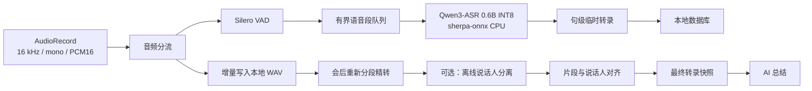

# 研会 AI：Qwen3-ASR 离线转录技术方案

> Android 无登录 Alpha｜端侧转录主链｜2026-07-23

## 1. 技术决策

| 项目 | 决策 |
|---|---|
| ASR 模型 | `Qwen3-ASR-0.6B INT8` |
| 端侧推理 | `sherpa-onnx 1.13.4+` |
| 目标平台 | Android `arm64-v8a`，Alpha 只覆盖指定测试机型 |
| 会中体验 | Silero VAD 分句后的“句级近实时转录” |
| 会后精转 | 基于本地完整录音重新分段并生成最终转录 |
| 时间戳 | Alpha 使用 VAD 片段起止时间，不承诺词级时间戳 |
| 说话人 | 会议结束后离线分离，不进入实时链路 |
| AI 总结 | 只读取最终转录；Alpha 可调用云端大模型 |
| 数据原则 | 音频和转录默认留在本机；云端总结只上传最终文本 |

**结论：Qwen3-ASR 可以作为研会 AI 的离线转录模型，但产品必须将“实时转录”定义为句级近实时，而不是逐字流式字幕。**

Qwen 官方发布了 0.6B 和 1.7B 两个 ASR 模型，支持离线与流式推理、30 种语言及 22 种中文方言。官方 Python 工具中的真正流式推理目前依赖 vLLM，且流式模式不返回时间戳。sherpa-onnx 已提供 Qwen3-ASR 0.6B INT8 的 ONNX 转换、Dart/Kotlin API、Android APK 和 VAD + ASR 示例，但该实现属于非流式识别器，通过 VAD 分段模拟实时体验。

## 2. 为什么选择 0.6B INT8

不在手机上使用 1.7B 模型，原因是 Alpha 的首要目标是跑通端侧闭环，而不是追求最高离线基准分数。

sherpa-onnx 官方转换模型包含：

| 文件 | 大小 |
|---|---:|
| `conv_frontend.onnx` | 约 42 MB |
| `encoder.int8.onnx` | 约 174 MB |
| `decoder.int8.onnx` | 约 721 MB |
| tokenizer | 约 4.2 MB |
| 合计 | 约 941 MB |

因此模型不打入基础 APK。App 首次使用转录功能时单独下载模型，下载完成后校验 SHA-256，再通过原子重命名安装。

安装前至少检查：

- 当前网络是否允许大文件下载，默认建议 Wi-Fi；
- App 私有目录至少有 2 GB 可用空间，以覆盖压缩包、解压临时文件和最终模型；
- 模型版本、文件大小和 SHA-256 是否与清单一致；
- 下载中断后能否断点续传或安全重新开始；
- 升级失败时是否仍能使用上一版模型。

## 3. 能力边界

### 3.1 Alpha 可以承诺

- Android 手机完全断网时仍可录音和转录；
- 支持普通话、中英混合及 Qwen3-ASR 已覆盖的中文方言；
- 一句话结束后生成带标点的确认文本；
- 会议结束后根据完整本地音频生成最终转录；
- 每个转录片段绑定可回放的音频时间区间；
- 支持热词提示，用于会议标题、人名和产品名；
- 转录失败不破坏本地录音。

### 3.2 Alpha 不承诺

- 说话过程中逐字滚动且不断修订的真流式字幕；
- Qwen3-ASR 端侧输出词级时间戳；
- 多人重叠说话的准确转录与准确分离；
- 所有 Android 机型都能流畅运行；
- 1.7B 模型在手机端运行；
- AI 总结完全离线。

## 4. 端侧处理链路



录音写盘和推理必须解耦：

- `AudioRecord` 线程只负责读取音频并交付，不执行模型推理；
- WAV 增量落盘优先级高于转录；
- VAD 与 Qwen3-ASR 在后台 Isolate 或原生工作线程运行；
- 推理队列有界，积压时暂停近实时转录，但不能丢弃本地录音；
- Flutter UI 只消费标准化转录事件，不直接管理 ONNX Runtime 生命周期。

推荐优先使用 sherpa-onnx Dart API完成 Flutter 接入；如果前后台生命周期、内存释放或长时间录音稳定性不达标，则将模型生命周期下沉到 Kotlin，通过 `EventChannel` 向 Flutter 发送结果。

## 5. 句级近实时转录

### 5.1 分段策略

Alpha 初始参数：

| 参数 | 初始值 | 目的 |
|---|---:|---|
| 采样率 | 16 kHz | 与模型输入一致 |
| 声道 | 单声道 | 控制计算和存储 |
| VAD 最短语音 | 200 ms | 过滤瞬时噪声 |
| VAD 结束静音 | 500 ms | 控制出字等待 |
| 单段最大时长 | 10 s | 防止连续讲话长期不出字 |
| 前后上下文 | 各 200 ms | 减少切词 |
| ASR 工作线程 | 初始 2 个 | 先控制内存和发热 |

流程：

1. VAD 检测到语音开始，记录全局 `start_ms`。
2. 检测到 500 ms 静音或达到 10 秒上限后封段。
3. 后台队列调用 Qwen3-ASR 解码。
4. 解码完成后输出一个不可变的临时片段。
5. 连续讲话被强制切段时，使用少量重叠音频，并在文本层去除边界重复。

界面不显示虚假的逐字输出。录音页显示：

- 当前状态：“正在聆听”或“正在识别”；
- 已完成语句；
- 最近片段的识别等待状态；
- 设备负载过高时：“实时文字稍有延迟，录音仍在继续”。

### 5.2 时间戳

sherpa-onnx 当前 Qwen3-ASR 0.6B INT8 示例结果中的模型时间戳数组为空，因此 Alpha 不依赖模型词级时间戳。

每段保存：

```json
{
  "segment_id": "seg_000123",
  "start_ms": 12840,
  "end_ms": 19420,
  "text": "我们先确认本周的发布范围。",
  "source": "qwen3_asr_live",
  "is_final": false
}
```

证据回放使用 VAD 片段起点，并向前预留约 500 ms。该粒度足够支持“点击总结条目跳回相关录音”，但不能宣称精确到每个字。

## 6. 会后最终转录

结束会议后：

1. 先封存并校验本地 WAV；
2. 从完整音频重新运行 VAD，不直接拼接会中临时文本；
3. 使用相同 Qwen3-ASR 模型顺序处理全部片段；
4. 根据会议标题和用户提供的热词重新识别；
5. 合并短片段、去除边界重复，形成最终转录快照；
6. 最终快照整体替换临时转录，AI 总结只能读取最终版本。

如果目标设备无法在验收时间内完成二次精转，可降级为：

- 保留会中已确认片段；
- 只重跑积压、失败或置信风险较高的片段；
- 明确标记“已完成本地整理”，不能伪装成完整二次精转。

## 7. 说话人分离

Qwen3-ASR 不负责说话人分离。Alpha 使用 sherpa-onnx 离线 diarization：

- segmentation：`pyannote` 或 `reverb-diarization-v1` 转换模型；
- embedding：中文优先测试 3D-Speaker；
- clustering：自动估计或设置最大说话人数；
- 运行时机：会议结束后；
- 输出：`speaker_1`、`speaker_2`，用户可批量重命名。

对齐规则：

1. 获取说话人时间区间；
2. 计算每个 ASR 片段与各说话人区间的重叠时长；
3. 取重叠最长者作为片段说话人；
4. 重叠说话或低置信片段标记为“发言人待确认”。

说话人分离失败不得阻塞最终转录和 AI 总结。

## 8. Flutter / Android 模块

```text
lib/
  features/recording/
  features/transcription/
    asr_engine.dart
    qwen3_asr_engine.dart
    transcription_event.dart
    transcript_repository.dart
  features/model_manager/
    model_manifest.dart
    model_downloader.dart
    model_integrity_checker.dart

android/
  app/src/main/kotlin/.../
    RecordingService.kt
    QwenAsrBridge.kt          # 仅在 Dart 方案不稳定时启用
```

接口保持模型无关：

```dart
abstract interface class AsrEngine {
  Future<void> initialize();
  Stream<TranscriptEvent> get events;
  Future<void> acceptAudio(
    Float32List samples, {
    required int sampleRate,
    required int startMs,
  });
  Future<void> finalizeMeeting();
  Future<void> dispose();
}
```

这样后续更换量化模型或切换原生桥接时，不需要重写录音页、结果页和本地数据库。

## 9. 性能验收门槛

正式进入 Alpha 前，在低、中、高三档指定设备上完成：

| 指标 | 门槛 |
|---|---|
| 连续录音 | 30 分钟无崩溃、ANR、音频缺口 |
| 解码实时率 | 最低目标设备 RTF P95 `< 0.7` |
| 句后出字 | 语音段封闭至文字出现 P95 `≤ 3 s` |
| 会后处理 | 30 分钟会议结束后 `≤ 5 min` 形成最终转录 |
| 模型初始化 | 失败可重试，不阻塞访问已有会议 |
| 内存 | 不被系统 Low Memory Killer终止 |
| 温控 | 30 分钟过程中无持续严重降频导致队列失控 |
| 断网 | 录音、近实时转录、最终转录均可完成 |
| 证据定位 | 点击片段后播放位置误差 `≤ 1 s`，以 VAD 时间为准 |

官方文档展示的 Qwen3-ASR INT8 RTF 数据来自桌面环境，不能直接作为 Android 性能承诺。Android 是否达标必须由指定真机测试决定。

准确率使用至少 20 段真实会议音频评测，覆盖：

- 安静会议室；
- 手机距离说话人 0.5 米、1.5 米和 3 米；
- 中英混合；
- 数字、人名、产品名；
- 两人交替和短时重叠；
- 空调、键盘、翻纸和走动噪声。

## 10. 两周实施顺序

| 日程 | 交付 |
|---|---|
| Day 1 | 在目标 Android 设备安装官方 Qwen3-ASR APK，测 RTF、内存、发热和准确率 |
| Day 2 | Flutter 接入模型管理、下载、校验和初始化 |
| Day 3 | AudioRecord、本地 WAV、Silero VAD 与句级转录串联 |
| Day 4 | 有界队列、异常恢复、断网和长讲话强制分段 |
| Day 5 | 会后重新精转、热词和最终快照 |
| Day 6 | 片段时间戳、音频跳转和证据映射 |
| Day 7 | 离线说话人分离 PoC；不达标则降为 P1 |
| Day 8 | AI 总结、Markdown 导出和本地数据清理 |
| Day 9 | 三档设备 30 分钟回归和性能调参 |
| Day 10 | Pilot 包、20 场测试任务和 Go / No-Go |

### Day 1 强制判断

出现以下任一情况，不继续堆叠功能，先调整设备基线或端侧实现：

- 指定中档设备无法加载模型；
- RTF P95 不小于 1；
- 连续识别导致频繁 ANR、崩溃或系统杀进程；
- 模型运行内存使录音链路不稳定；
- 真实会议样本准确率不能支持总结。

模型仍固定为 Qwen3-ASR；如果 0.6B INT8 在低端设备不达标，Alpha 应缩小支持机型，不在两周内切换到 1.7B。

## 11. 参考资料

- [Qwen3-ASR 官方仓库](https://github.com/QwenLM/Qwen3-ASR)
- [sherpa-onnx：Qwen3-ASR 预训练模型](https://k2-fsa.github.io/sherpa/onnx/qwen3-asr/pretrained.html)
- [sherpa-onnx：导出 Qwen3-ASR](https://k2-fsa.github.io/sherpa/onnx/qwen3-asr/export.html)
- [sherpa-onnx：Android 模拟流式 APK](https://k2-fsa.github.io/sherpa/onnx/android/apk-simulate-streaming-asr.html)
- [sherpa-onnx：VAD + 非流式 ASR APK](https://k2-fsa.github.io/sherpa/onnx/vad/apk-asr.html)
- [sherpa-onnx 发布记录：Qwen3-ASR Dart/Kotlin 支持](https://github.com/k2-fsa/sherpa-onnx/releases)

