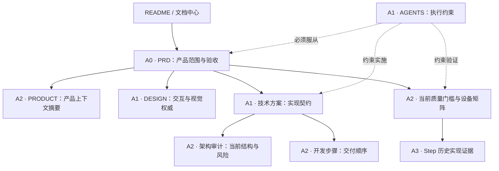

# 会迹（MeetTrace）项目文档中心

> 状态：活动；项目 Markdown 文档唯一导航入口
>
> 盘点日期：2026-08-04
>
> 盘点范围：仓库根目录 `*.md` 与 `docs/**/*.md`，共 22 份
>
> 维护原则：活动文档只保留当前结论，历史版本由 Git 保存

## 1. 如何使用本文档中心

- 新成员：先读根目录 [README](../README.md)，再读 [PRD](./product/Alpha_PRD_无登录版.md)、[产品上下文](../PRODUCT.md)和[设计系统](../DESIGN.md)。
- 产品变更：先修改 PRD，再同步产品上下文、设计系统、技术方案、质量门槛和仓库指南。
- 开发实现：按 PRD 确认范围，以技术方案和架构审计确定边界，再按开发步骤实施。
- 测试发布：从[质量证据索引](./quality/README.md)进入，核对发布门槛、设备矩阵和历史实现证据。
- 冲突处理：先按下方权威链判定上游，再修订所有受影响的下游文档；不得用历史测试结果覆盖当前要求。

## 2. 文档权威链与优先级

| 级别 | 含义 | 冲突处理 |
|---|---|---|
| A0 | 产品唯一事实源 | PRD 决定做什么、边界和验收；其他文档不得扩展 P0 |
| A1 | 专业领域权威 | DESIGN 约束 UI，技术方案约束实现，AGENTS 约束协作；均须服从 PRD |
| A2 | 当前执行与派生资料 | 用于交付、质量和上下文说明；上游变化后必须同步 |
| A3 | 带日期的历史证据 | 仅证明特定代码、环境和日期下的结果，不代表当前发布状态 |
| A4 | 导航资料 | 帮助定位信息，不定义产品、技术或质量结论 |

发生冲突时使用以下顺序：

1. 产品范围与验收：PRD（A0）。
2. 交互视觉问题：PRD → DESIGN。
3. 技术实现问题：PRD → 技术方案 → 当前代码与自动化。
4. 发布判断：PRD → 当前质量门槛/设备矩阵 → 最新带环境和日期的证据。
5. 执行流程：PRD/技术/质量要求 → AGENTS 与项目管理约定。

## 3. 完整文档目录

### 3.1 导航与项目概览

| ID | 文档名称 | 路径 | 核心内容摘要 | 作用 | 状态 / 级别 |
|---|---|---|---|---|---|
| NAV-01 | [项目 README](../README.md) | `README.md` | 产品一句话定位、核心边界和文档入口 | 仓库首页和新成员第一入口 | 活动 / A4 |
| NAV-02 | [项目文档中心](./README.md) | `docs/README.md` | 全部文档清单、权威链、阅读路径和维护规范 | 文档体系唯一导航入口 | 活动 / A4 |

### 3.2 产品需求与产品上下文

| ID | 文档名称 | 路径 | 核心内容摘要 | 作用 | 状态 / 级别 |
|---|---|---|---|---|---|
| PRD-01 | [Android + iOS Alpha 产品需求文档（无登录版）](./product/Alpha_PRD_无登录版.md) | `docs/product/Alpha_PRD_无登录版.md` | V0.9 产品目标、固定 ASR/说话人模型、P0、FR、AT 和完成定义 | 产品范围与验收标准的唯一事实源 | 活动，2026-08-03 / A0 |
| PROD-01 | [产品上下文](../PRODUCT.md) | `PRODUCT.md` | 用户、定位、能力边界、品牌承诺、产品原则和可访问性 | 为设计与实现工具提供 PRD 摘要，不独立扩展范围 | 活动，随 PRD 同步 / A2 |

### 3.3 设计规范

| ID | 文档名称 | 路径 | 核心内容摘要 | 作用 | 状态 / 级别 |
|---|---|---|---|---|---|
| DES-01 | [交互与视觉设计系统](../DESIGN.md) | `DESIGN.md` | 设计令牌、视觉语言、布局、组件、动效、响应式与双平台规范 | UI 与交互设计的唯一权威 | 活动 / A1 |

### 3.4 技术实现与架构

| ID | 文档名称 | 路径 | 核心内容摘要 | 作用 | 状态 / 级别 |
|---|---|---|---|---|---|
| TECH-01 | [端侧 SenseVoice 与说话人分离技术方案](./technical/端侧_SenseVoice_转录技术方案.md) | `docs/technical/端侧_SenseVoice_转录技术方案.md` | 全部固定资源、初始化、官方 Engine、联合最终快照、分享、数据库和降级 | V0.9 目标实现契约 | 活动，2026-08-04 / A1 |
| ARCH-01 | [代码架构与冗余审计](./architecture/代码架构与冗余审计.md) | `docs/architecture/代码架构与冗余审计.md` | 当前分层、已收敛冗余、保留设计、剩余风险和验证结果 | 架构维护与后续重构的当前快照 | 活动维护快照，2026-08-04 / A2 |

### 3.5 质量保证与发布证据

#### 当前质量文档

| ID | 文档名称 | 路径 | 核心内容摘要 | 作用 | 状态 / 级别 |
|---|---|---|---|---|---|
| QA-00 | [质量证据索引](./quality/README.md) | `docs/quality/README.md` | 当前门槛、设备矩阵和 Step 证据入口 | 质量文档的二级导航 | 活动，2026-08-03 / A2 |
| QA-01 | [运行时模型初始化与发布门槛](./quality/运行时模型初始化与发布门槛.md) | `docs/quality/运行时模型初始化与发布门槛.md` | ASR/VAD/说话人固定资产、仓库门禁、Android/iOS 外部门禁及阻塞项 | 当前 Go/No-Go 检查表 | 活动；仓库实现与真机证据阻塞，2026-08-04 / A2 |
| QA-02 | [Android Alpha 设备矩阵](./quality/Android_Alpha_设备矩阵.md) | `docs/quality/Android_Alpha_设备矩阵.md` | Android 平台基线、设备角色和必验指标 | Android 真机验收计划与证据状态 | 活动；目标设备阻塞，2026-08-03 / A2 |
| QA-03 | [iOS Alpha 设备矩阵](./quality/iOS_Alpha_设备矩阵.md) | `docs/quality/iOS_Alpha_设备矩阵.md` | iOS 工具链、设备矩阵、签名和发布门槛 | iOS 构建与真机验收计划 | 活动；macOS/Xcode/真机阻塞，2026-08-03 / A2 |
| QA-04 | [iOS 无签名构建规格](../spec/spec-process-cicd-ios-unsigned.md) | `spec/spec-process-cicd-ios-unsigned.md` | GitHub Actions 触发、构建、审计、产物合同、失败路径和版本追溯 | 无本地 macOS 时的 iOS 构建自动化规范 | 活动；首次云端运行已成功，2026-08-06 / A2 |
| QA-05 | [GitHub Alpha 发布规格](../spec/spec-process-cicd-release-finalize.md) | `spec/spec-process-cicd-release-finalize.md` | 双平台同 SHA 候选、Environment 审批、tag 与 Pre-release 合同 | 版本最终发布自动化规范 | 活动；Environment 已配置，等待 Secrets、Ruleset 与首次候选，2026-08-06 / A2 |

#### 历史实现证据

| ID | 文档名称 | 路径 | 核心内容摘要 | 作用 | 状态 / 级别 |
|---|---|---|---|---|---|
| QA-H07 | [Step 07：可靠录音与崩溃恢复](./quality/Step_07_可靠录音与崩溃恢复.md) | `docs/quality/Step_07_可靠录音与崩溃恢复.md` | 事实录音、checkpoint、恢复、后台录音和当时的 Mi 10 证据 | 追溯可靠录音主链的建立过程 | 历史证据，2026-07-24 / A3 |
| QA-H12 | [Step 12：Silero VAD 与预览队列](./quality/Step_12_Silero_VAD与预览队列.md) | `docs/quality/Step_12_Silero_VAD与预览队列.md` | VAD、窗口规划、预览队列、积压和仅录音降级 | 追溯预览链与录音隔离实现 | 历史证据；分发口径更新至 2026-08-03 / A3 |
| QA-H13 | [Step 13：会议主链与会中 UI](./quality/Step_13_会议主链与会中_UI.md) | `docs/quality/Step_13_会议主链与会中_UI.md` | 会议创建、会中状态、录音封存和模拟器证据 | 追溯会议主链；模型覆盖描述已过时 | 历史证据，2026-07-24 / A3 |
| QA-H14 | [Step 14：最终转录快照](./quality/Step_14_最终转录快照.md) | `docs/quality/Step_14_最终转录快照.md` | 完整音频重处理、快照 CAS、失败保留和重转录 | 追溯最终转录一致性设计 | 历史证据，2026-07-25 / A3 |
| QA-H15 | [Step 15：说话人分离降级](./quality/Step_15_说话人分离降级.md) | `docs/quality/Step_15_说话人分离降级.md` | 旧版分离端口、单说话人降级、人工标签和能力关闭 | 历史证据；真实模型要求已由 V0.9 替代 | 历史证据，2026-07-25 / A3 |
| QA-H16 | [Step 16：AI 总结与证据链](./quality/Step_16_AI总结与证据链.md) | `docs/quality/Step_16_AI总结与证据链.md` | 旧版总结输入、证据映射、隐私和网关关闭 | 历史证据；AI 总结已移出 V0.9 | 历史证据，2026-07-25 / A3 |
| QA-H17 | [Step 17：结果页与数据控制](./quality/Step_17_结果页与数据控制.md) | `docs/quality/Step_17_结果页与数据控制.md` | 旧版修订、播放、文本分享、删除、诊断与隐私 | 追溯可复用结果页基础；音频分享由 V0.9 新增 | 历史证据，2026-07-25 / A3 |

### 3.6 项目管理与执行治理

| ID | 文档名称 | 路径 | 核心内容摘要 | 作用 | 状态 / 级别 |
|---|---|---|---|---|---|
| PM-01 | [Alpha 开发步骤](./project/Alpha_开发步骤.md) | `docs/project/Alpha_开发步骤.md` | V0.9 串行阶段、阻塞清单、完成证据和双平台门槛 | 单人开发与交付操作清单 | 活动，2026-08-04 / A2 |
| PM-02 | [Git 分支与 Worktree 约定](./project/Git_分支与_Worktree_约定.md) | `docs/project/Git_分支与_Worktree_约定.md` | 分支职责、worktree 布局、标准流程和安全规则 | 团队 Git 协作规范 | 活动，2026-08-03 / A2 |
| PM-03 | [GitHub Alpha 版本发布流程](./project/GitHub_版本发布流程.md) | `docs/project/GitHub_版本发布流程.md` | PR 门禁、双平台候选、签名分发、同 SHA 最终发布与撤回 | 维护者发布 Runbook | 活动；Environment 已配置，等待 Secrets、Ruleset 与首次候选，2026-08-06 / A2 |
| GOV-01 | [仓库协作指南](../AGENTS.md) | `AGENTS.md` | 产品边界、架构规则、技能流程、质量门槛和安全约束 | AI 代理与仓库协作者的执行规则 | 活动，随上游同步 / A1 |

## 4. 时效性与维护状态

| 状态 | 判定标准 | 维护方式 |
|---|---|---|
| 活动 | 当前决策、规范、计划或门槛仍然生效 | 相关变更必须同一提交更新；注明版本或更新日期 |
| 活动维护快照 | 描述当前代码结构，可能随重构变化 | 架构或依赖边界显著变化后重跑审计并更新数据 |
| 历史实现证据 | 记录特定日期、代码和环境的实现结果 | 默认冻结；只允许修正事实错误或补充“已被替代”说明 |
| 阻塞 | 文档仍活动，但要求的外部环境或证据未完成 | 明确阻塞条件，不得写成已通过或已发布 |

当前结论：

- 15 份活动或活动维护文档：导航 2、产品 2、设计 1、技术/架构 2、质量 4、项目管理/治理 4；其中导航不承担权威结论。
- 7 份 Step 文档为历史实现证据，不应滚动修改测试数量、APK 大小或设备结果。
- V0.9 仓库实现、Android 完整设备矩阵与 iOS 证据均未闭环，当前发布状态为 `blocked`。
- `graphify-out/`、`.agents/`、`spec/` 内技能或流程规格和构建产物不属于本次 22 份正式项目文档盘点。

## 5. 命名与目录规范

1. 根目录只保留工具和平台约定的稳定名称：`README.md`、`PRODUCT.md`、`DESIGN.md`、`AGENTS.md`。
2. `docs/` 按职责使用小写英文目录：`product/`、`technical/`、`architecture/`、`quality/`、`project/`。
3. 文件名保持版本无关，版本、日期和状态写在正文元数据中，避免每次升级造成全仓链接变更。
4. 中文语义名称优先；英文产品或技术名保留标准大小写，如 `SenseVoice`、`Silero_VAD`、`Worktree`。
5. 空格不进入文件名；结构化前缀使用下划线，例如 `Step_14_最终转录快照.md`。
6. 禁止使用“最终版”“最新版”“新版”“备份”“副本”等模糊后缀；活动文档不并列保存旧方案。
7. Markdown 一级标题统一包含“会迹（MeetTrace）”和具体职责，不能只写 `Product`、`Design` 或“说明”。

## 6. 文档变更联动矩阵

| 变更内容 | 必须同步检查 |
|---|---|
| P0、FR、AT、平台或模型范围 | PRD、PRODUCT、DESIGN、技术方案、质量门槛、AGENTS |
| Manifest、下载、空间、网络同意或模型锁定 | PRD、技术方案、运行时模型发布门槛、相关设备矩阵 |
| UI 结构、令牌、组件或响应式规则 | DESIGN、PRODUCT、相关组件测试；必要时 PRD |
| 分层、Port、Repository、组合根或持久化结构 | 技术方案、架构审计、AGENTS、自动化架构守卫 |
| 发布工具链、设备、签名或性能指标 | 对应设备矩阵、发布门槛、开发步骤 |
| 分支、提交、OCR 或交付流程 | AGENTS、Git/Worktree 约定、开发步骤 |

## 7. 维护检查清单

- [ ] 新文档已归入既有类别；确有新职责时才新增目录。
- [ ] 一级标题、文件名、状态、版本/日期和上游链接完整。
- [ ] 文档没有重新定义上游范围，也没有复制一份可独立漂移的产品事实。
- [ ] 历史证据明确标注日期、环境和非当前发布状态。
- [ ] 重命名或移动后已更新全仓引用并完成 Markdown 本地链接检查。
- [ ] 产品或代码变更已按联动矩阵同步相关文档。
- [ ] 修改代码后已运行 `graphify update .`；仅改 Markdown 时明确检查语义图同步状态。

## 8. 辅助资源

- `.impeccable/design.json`：`DESIGN.md` 的机器可读设计 Sidecar；修改设计系统时同轮更新。
- `forui.yaml` 与 `lib/theme/`：设计令牌的工程落点，不属于 Markdown 文档。
- `graphify-out/`：自动生成的知识图谱、报告和查询记忆，只用于导航，不进入事实源链。
- Git 历史：所有旧方案、旧文件名和历史版本的唯一追溯来源。
