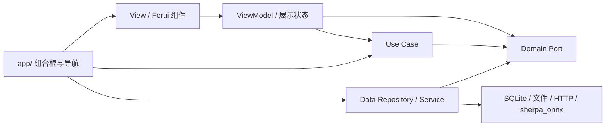

# 会迹（MeetTrace）代码架构与冗余审计

> 审计日期：2026-08-04
> 状态：活动维护快照
>
> 范围：`lib/`、`test/`、`integration_test/`、根级产品/设计文档与 `docs/`  
> 性质：当前实现审计与收敛建议，不扩展 P0 产品范围

## 1. 结论

当前项目的主干分层正确：Domain 不反向依赖 Data，功能 UI 不直接依赖 Repository/Service 具体实现，录音写入与 ASR 预览保持解耦。2026-08-03 回归复核发现，资源下载接口与具体服务之间重新形成 2 节点 import 环，而原循环守卫漏掉了不带 `./` 的同目录相对 import；因此旧版“data import 图无环”的结论不成立。现已同时修复依赖方向和守卫解析缺口。

审计问题已按依赖风险分五阶段收敛：先恢复质量门槛和删除旧入口，再打破循环、统一业务事实源与安装事务，最后拆分组合根和 UI 组件边界。本文同时保留原问题、处置结果和仍需产品决策的历史数据项，作为后续架构维护入口。

PRD V0.9 已在本审计之后重置产品范围，因此“代码结构健康”不等于“当前产品已实现”。阶段 1 已删除 AI 总结并落地确定性标题，阶段 2 已接入四类首次初始化阻断资产，阶段 4 已实现联合最终快照，阶段 5 的独立 WAV 分享主链与 Android 插件缓存清理已实现，双端标识也已统一为 `com.meettrace.app`；官方修复版本上的真实离线说话人 Engine 验证、分享真机证据与正式签名仍未完成，仓库发布门禁保持 `blocked`。

### 1.1 修复状态

| 阶段 | 结果 | 自动化保护 |
|---|---|---|
| 1. 质量门槛与旧入口 | 修正 Manifest 哈希断言；删除 7 个 data facade，内部代码直接依赖 domain | 分层、纯 Dart、旧路径禁用测试 |
| 2. 循环依赖 | `SileroVadManifest` 下沉；共享下载类型独立为 `model_download_types.dart` | 覆盖 package、`./`、`../` 与裸相对路径的 import cycle 检测 |
| 3. 单一事实源 | 开始会议只消费 readiness 结果；最终转录只使用本场锁定模型 | 启动、锁定、重试与快照测试 |
| 4. 安装与组合根 | ASR/VAD 共用安装事务；组合根拆为 Storage/Runtime/Meeting 子容器 | 安装事务回归、顶层扇出守卫 |
| 5. UI 边界 | 统一对话框；录音页 3 个 `part` 改为显式 Widget library | 对话框与会议页面组件测试 |

### 1.2 V0.9 产品差距

| 差距 | 当前实现 | V0.9 目标 | 处理原则 |
|---|---|---|---|
| AI 总结 | 已从 Domain、Data、UI、schema 和测试删除 | 完整删除，不保留隐藏入口 | 已完成 |
| 会议标题 | 创建时按本地时间确定性生成 | 创建时按本地时间确定性生成 | 已完成 |
| 说话人分离 | 只有端口、协调器、降级与 fake；生产固定不可用 | 官方 `OfflineSpeakerDiarization` + Pyannote INT8 + 3D-Speaker | 保留 Port/Use Case，替换 Data 实现并补模型安装 |
| 最终结果 | ASR/分离并行且只发布一次联合快照 | ASR/分离并行，结束后一次发布；分离失败写单一说话人降级 | 已完成 |
| 音频分享 | 独立入口、二次确认、临时 WAV、全路径清理 | 主链、应用临时目录及 Android 插件缓存清理已实现 | 模拟器取消/冷启动子项通过；待双平台真机接收端播放与清理证据 |
| 运行时初始化 | 已阻断 SenseVoice、Silero VAD、Pyannote 与 3D-Speaker，执行 300 MB 上限和 1 GiB 空间门槛 | 四类资产，300 MB 上限，1 GiB 空间门槛 | 已完成供应链与启动门槛 |
| 应用标识 | Android/iOS 生产标识均为 `com.meettrace.app` | 双端 `com.meettrace.app` | 已完成；待签名与真机证据 |

## 2. 当前结构



分阶段修复完成后，五个分层目录共 158 个 Dart 文件；加上 `lib/main.dart`，`lib/` 共 159 个 Dart 文件：

| 层 | 文件数 | 总行数 | 观察 |
|---|---:|---:|---|
| `app/` | 7 | 734 | 组合根已按存储、运行时和会议能力拆分，顶层仅负责装配 |
| `domain/` | 42 | 3,620 | 端口与用例边界清楚，已移除重复模型选择用例与请求模型/回退原因字段 |
| `data/` | 54 | 7,299 | ASR、下载和存储实现最密集；共享安装事务、下载契约类型与数据代门已提取 |
| `ui/` | 49 | 7,574 | 已有共享组件与响应式骨架，少量高耦合 `part` 文件仍待后续迁移 |
| `theme/` | 6 | 648 | 颜色、排版、间距和尺寸令牌集中 |

当前依赖图没有跨层反向导入，补强后的架构守卫也确认 `data` 本地 import 图没有循环。审计期间先后发现过两组源码循环：

```text
runtime_asset_installers.dart
  → downloadable_silero_vad_model.dart
    → runtime_asset_installers.dart

downloadable_model_service.dart
  → runtime_asset_installers.dart
    → downloadable_model_service.dart
```

## 3. 保留的正确设计

- `AsrEngine`、`AsrPreviewSession`、Repository Port 与 Use Case 不是可删除的“多余层”；它们隔离原生推理、存储和 UI，并支撑 fake 测试。
- `InitializeRuntimeAssetsUseCase` 虽然目前主要转发 Port，但保持 ViewModel 不依赖 Data 实现，属于有边界价值的薄层。
- `AsrModelUiStatus` 与领域安装状态相似，但额外表达“空间不足”等展示语义；应保留显式映射，而不是让 View 解释错误码。
- `app/` 同时依赖 UI、Domain 与 Data 是组合根职责，不算分层违规。
- 录音事实链与有界预览队列的分离符合产品最高优先级，不应为减少类数量而合并。

## 4. 冗余与风险

### 已修复：资源安装接口依赖具体 VAD 实现

`lib/data/services/models/runtime_asset_installers.dart` 为声明 `RuntimeVadInstaller`，直接导入 `downloadable_silero_vad_model.dart` 中的 `SileroVadManifest`；后者又实现该接口，形成循环依赖。接口层因此无法独立于具体实现演进，也让 ASR/VAD 通用安装事务难以复用。

`SileroVadManifest`、Parser 与固定契约已移到 `lib/data/models/runtime/`；安装接口只依赖数据模型。架构测试会遍历 data 本地 import 图并拒绝任何循环。

### 已修复：下载共享类型造成反向依赖，且循环守卫漏检

`runtime_asset_installers.dart` 曾为复用 `DownloadableModelResult`、`ModelDownloadCancellationToken` 和进度回调而导入具体实现 `downloadable_model_service.dart`；后者又为实现 `RuntimeAsrModelInstaller` 反向导入接口文件，形成 2 节点环。Dart 可编译该结构，因此没有直接运行时故障，但接口层不再独立于实现。

更严重的是，`layer_boundaries_test.dart` 只解析 `package:meettrace/...` 和以 `.` 开头的相对 import，漏掉 Dart 合法且项目广泛使用的 `import 'sibling.dart'`。所以旧版 328 项测试即使全部通过，也不能证明 data 图无环。

共享阶段、进度、结果、取消令牌与取消异常现已移至 `model_download_types.dart`；接口与服务分别单向依赖该类型文件。循环守卫同时改为解析所有不含 URI scheme 的本地 import，并增加一个使用裸相对路径构造 2 节点环的自验证用例。

### 已修复：旧导入兼容层仍是主路径

仓库有 7 个仅用于“兼容旧导入路径”的转发文件：Repository、ASR Engine、ASR Preview、录音会话、证据播放、最终转录和说话人分离。它们目前仍被生产代码导入 20 次、全仓导入 52 次；其中 `repository_contracts.dart` 单独有 11 个生产导入，`data/services/asr/asr_engine.dart` 有 6 个。

生产代码、测试与集成测试已全部迁移到 domain port/use case，7 个转发文件及实现文件中的二次 export 已删除；架构测试同时检查文件不得恢复、源码不得重新导入旧路径。

### 已修复：首页准备状态与开始会议重复查询模型可用性

`MeetingListViewModel`、`StartMeetingViewModel` 和 `StartMeetingUseCase` 分别读取或映射准备状态。开始会议时，ViewModel 先通过安装流构造 `availableVersions`，Use Case 随后又通过 `MeetingReadinessChecker` 查询安装与激活版本，再用传入 Map 二次校验。重复状态源增加竞态窗口和测试夹具数量。

`StartMeetingUseCase.execute()` 不再接收 ViewModel 计算的 `availableVersions`。`CheckMeetingReadinessUseCase` 在一次检查中返回默认模型 ID、锁定版本与可用状态；启动 ViewModel 不再订阅安装流或维护第二份 Map。

### 已收敛活动分支：单模型基线遗留字段已删除

当前 Registry 只有 SenseVoice，但 `Meeting`/SQLite 仍同时保存 requested/recording model 与 `modelFallbackReason`，最终转录服务仍支持选择“另一已安装模型”，测试夹具大量使用 Paraformer/Qwen/standard 等旧标识。生产 UI 因 Registry 单项而没有暴露这些入口，但无效分支继续扩大 schema、模型校验和测试矩阵，也容易让后续实现误判为已批准能力。

无回退行为的 `ResolveMeetingModelSelection` 已删除；详情页、ViewModel、Port 与最终转录服务均不再接受替代模型，重转录只能使用本场锁定模型生成独立快照。统一 `AsrEngine`/Factory 端口继续保留，用于隔离推理实现。

2026-08-03 清理冲刺项 1 已完成遗留字段删除：当时的产品决策采用 Alpha 升级全清数据策略（见当前 PRD FR-004）。`LocalDataGenerationGate` 在打开数据库与初始化运行资源之前校验数据代标记，缺失或内容不一致时清空整个数据根目录并重走首次初始化；文件系统读取异常只阻断启动、不执行清理。schema 随后升至 v7、数据代升至 3，并删除 `requested_model_id`、`model_fallback_reason` 与总结结构；`Meeting` 模型同步移除遗留字段，阶段 4 的联合结果继续复用最终快照 CAS 事务。架构守卫（`legacy_schema_guard_test`，带自验证夹具）禁止遗留列名重新进入 `lib/`，数据库层对旧 schema 保留拒绝作为兜底。

### 已修复：组合根成为高扇出 God Object

`MeetTraceDependencies` 直接导入 56 个本地文件，同时持有数据库、仓储、模型下载、推理、总结、说话人和页面工厂。组合根允许依赖具体实现，但当前规模会让任一 feature 变化触发中心文件修改，也增加生命周期遗漏风险。

组合根已拆为独立文件中的 `StorageDependencies`、`RuntimeAssetDependencies`、`MeetingDependencies`；顶层文件只有 4 个本地导入，负责顺序创建和 Meeting → Runtime → Storage 逆序释放。页面工厂也已从组合根 library 中分离。

### 已修复：ASR/VAD 安装流程存在平行事务

`DownloadableModelService` 为 739 行，`DownloadableSileroVadModelService` 为 298 行；两者都处理临时目录、下载、取消、完整性校验、失败清理和原子切换。当前共享了 downloader、verifier 与 cancellation token，但没有共享安装事务，后续修复很容易只落到一条路径。

新增 `RuntimeArtifactInstallTransaction`，统一文件续传、路径约束、严格校验、损坏临时目录清理和原子目录切换。ASR 的安装记录、lease、网络预检与 VAD 的错误文案仍留在各自服务中。

### 部分修复：文件拆分未形成真实组件边界

会议详情 ViewModel 使用 5 个 `part`，会议列表与详情 View 也大量使用 `part of`。这降低单文件长度，却让私有字段和函数在整个 library 内互相可见，编译依赖与认知边界仍等同于一个大文件。

录音页事实面板、实时转录面板和底部控制器已由 `part` 改成显式 Widget library，通过构造参数传递 ViewModel 与动作。详情 ViewModel 与结果页仍有紧密共享状态的 `part`，后续应按稳定区段逐步迁移，不在同一轮大规模改写高风险处理链。

### 部分修复：重复 UI 骨架尚未全部进入共享组件

8 行归一化窗口扫描发现 71 组跨文件重复候选，最集中的是：

- 3 处相同的 Forui 确认对话框骨架；
- 4 处账本行底部分隔线与 Padding 组合；
- 多个 ViewModel 重复 `_disposed + _notify + subscription.cancel` 生命周期模板；
- 详情页多个 FCard 使用相同标题、说明和间距结构。

确认与提示对话框已统一为 `app_dialog.dart`，并由真实 `Application`/`FTheme` 组件测试覆盖。账本已有 `AppLedgerRow` 共享语义；ViewModel 生命周期模板继续保持组合，不引入脆弱继承基类。

### 已修复：架构守卫覆盖面不足

已加入 Data→UI/App、Domain Flutter/Forui、旧 facade、data import cycle、具体 Engine 泄漏和顶层组合根扇出检查。2026-08-03 回归复核又补齐裸相对 import 解析，并用独立夹具证明守卫本身能捕获循环；后续不能只以“测试进程为绿”替代对守卫覆盖面的审计。

### 已修复：固定 Manifest 哈希与单测断言漂移

当前 Manifest 和技术方案的 SenseVoice `model.int8.onnx` SHA-256 均以 `c71f0ce…` 开头，但 `local_runtime_asset_preparation_service_test.dart:101` 仍断言旧前缀 `c45ba1`。这使全量测试稳定失败，并让“移动网络同意绑定资源集合”的发布门槛失去自动化绿灯。

断言已更新为当前发布 Manifest 的 `c71f0c…`，全量测试门槛恢复为绿色。

## 5. UI/设计系统审计摘要

| 维度 | 分数 | 结论 |
|---|---:|---|
| Accessibility | 3/4 | 关键状态有 Semantics、live region、最小触控尺寸与字体缩放处理；仍需真机 VoiceOver/TalkBack 顺序验证 |
| Performance | 3/4 | 长列表和波形已有隔离/动画降级；启动阶段依赖创建与资源检查仍是主要性能风险 |
| Appearance & Theming | 4/4 | 功能 UI 未发现原始颜色、字号、圆角和重复间距硬编码，浅/深色令牌集中 |
| Platform Conformance | 3/4 | 保留系统返回、SafeArea 和平台返回图形；Forui/Material 组合仍需 iOS 边缘返回与原生手感真机验证 |
| Adaptivity | 3/4 | 有内容驱动断点、手机/平板布局、文本缩放分支；iPad Split View 与折叠/多窗口尚无设备证据 |
| **总分** | **16/20** | **Good；主要缺口是外部设备证据，不是视觉令牌漂移** |

没有发现 P0/P1 UI 阻断项。不要为了“去冗余”删除现有 SafeArea、Semantics、Reduce Motion 或响应式包装。

## 6. 已执行顺序

1. 恢复 Manifest 测试并删除旧 data facade。
2. 移出 VAD Manifest，增加依赖环检测。
3. 统一开始会议 readiness；删除替代模型最终转录入口。
4. 抽取运行资源安装事务；拆分三个依赖子容器。
5. 统一对话框；将录音页稳定区段迁出 `part`。
6. 执行格式化、静态检查、全量测试、平台构建、OCR 与 Graphify 更新。

## 7. 旧代码快照验证

- `dart format lib test integration_test`：248 个文件，无格式漂移。
- `flutter analyze`：0 issue。
- `flutter test`：350 项全部通过；其中包括数据代门 7 项、启动阻断态 2 项、遗留列守卫 3 项（含自验证夹具）、v5 数据库拒绝、裸相对 import 守卫自验证，以及 8 项 `SherpaOnnxAsrEngine` 核心路径单元测试。
- `flutter build apk --debug`：成功生成调试 APK；仅保留 `flutter_foreground_task` 关于未来 Kotlin Gradle Plugin 兼容性的非阻断警告。
- Markdown 本地链接检查：0 个失效链接。
- OCR workspace review：清理冲刺项 1 共 35 个源码及测试文件进入审查（`.qoder/repowiki` 生成物按生成文件排除），携带数据删除与录音连续性产品边界上下文；修复后复审无未解决的 Critical/High。
- `graphify update .`：代码图更新为 5,941 nodes / 7,450 edges / 487 communities。代码关系已同步；CLI 仍提示 Markdown 语义更新需要 AI 管线，且 490 个既有标签与当前 communities 不一致，不能把文档语义图视为完全同步。

## 8. 文档关系

- 产品范围：[PRD V0.9](../product/Alpha_PRD_无登录版.md)
- 技术实现：[端侧 SenseVoice 与说话人分离技术方案](../technical/端侧_SenseVoice_转录技术方案.md)
- 交付顺序：[Alpha 开发步骤](../project/Alpha_开发步骤.md)
- 发布证据：[质量证据索引](../quality/README.md)
- 视觉规范：[DESIGN.md](../../DESIGN.md)

本审计的结构统计与验证结果描述 V0.9 实现前的代码快照，只能证明旧代码在当时环境下通过，不代表当前产品门禁。V0.9 按开发步骤完成后必须重跑统计、验证、OCR 与 Graphify，再更新本文件。
