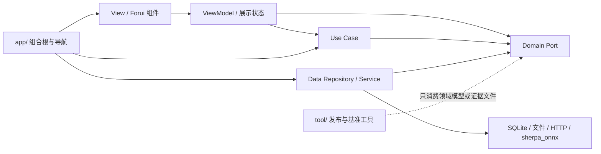

# 会迹（MeetTrace）代码架构与冗余审计

> 审计日期：2026-08-08
>
> 状态：活动维护快照
>
> 范围：`lib/`、`test/`、`tool/`、根级产品/设计文档、`docs/` 与 `graphify-out/` 版本控制边界
>
> 产品基线：PRD V1.0；本审计不扩展 P0

## 1. 当前结论

项目继续遵循 `View → ViewModel → Use Case / Port → Repository / Service`。Domain 未反向依赖 Data，UI 功能代码未直接调用 ONNX、数据库或 HTTP；事实录音与推理链仍保持隔离。`lib/` 当前共有 168 个 Dart 文件、23,444 行，结构性冗余本轮按六个阶段收敛，并在复查中继续删除伪边界与失效实现。

本轮确认并处理的重点不是“文件数量”，而是所有权与事实源：删除失去产品入口的录音 Spike；把最终转录和说话人分离的时间段映射统一到一个 Domain 算法；把发布评估器移出运行时 Domain；把会议列表与详情 View 从共享私有作用域的 `part` 拆成显式 library；把循环回指的详情子 ViewModel 收敛为单一状态拥有者；删除无生产入口的说话人降级类与预览 FanOut；统一存储字节与时长格式化；移除已退出产品范围的 AI 总结历史文档和查询记忆；停止跟踪 Graphify 缓存和日期备份。

当前没有已知的分层反向依赖或上述重复实现。发布状态仍由质量门槛决定：Android/iOS 同一 SHA 的真机验收、说话人 DER/RTF、SenseVoice 性能及正式分发证据未因本次结构清理自动变为通过。

## 2. 当前结构

| 层 | Dart 文件数 | 总行数 | 当前职责 |
|---|---:|---:|---|
| `app/` | 7 | 807 | 组合根、导航和平台装配 |
| `domain/` | 43 | 3,096 | 业务模型、Port、纯 Dart 用例和共享映射算法 |
| `data/` | 60 | 9,297 | 存储、下载、音频、ASR 与说话人实现 |
| `ui/` | 51 | 9,555 | Forui 页面、展示状态和显式功能组件 |
| `theme/` | 6 | 668 | 主题生成物与集中设计令牌 |

`theme/` 和 `ui/features/meetings/previews/` 中仍有少量 `part`。前者是同一主题生成单元，后者只组织预览 fixture；它们没有把生产业务状态或处理算法藏在共享私有作用域中，当前保留。

## 3. 本轮分阶段收敛

### 阶段 1：版本控制与失效入口

- 删除 `graphify-out/cache/` 下 216 个已跟踪缓存文件和 `graphify-out/2026-07-27/` 下 5 个日期备份；`.gitignore` 已明确忽略可再生成缓存和日期目录。
- 删除没有 UI、Use Case 或组合根入口的录音连续性 Spike 及其孤立测试。真实录音连续性仍由生产录音链、恢复逻辑和对应测试负责。

### 阶段 2：说话人映射单一事实源

- 新增 `domain/use_cases/map_speaker_turns.dart`，集中处理转录片段与说话人时间段的重叠、排序和并列决策。
- 最终转录与会后说话人分离调用同一个函数，不再维护两份 `_bestSpeaker` / `_comesBefore`。
- 两条路径共用 `validateSpeakerTurns` 校验事实音频边界和说话人 ID，不再复制服务结果校验算法。
- 单元测试固定无重叠、最大重叠、并列和输入顺序无关四类行为。

### 阶段 3：发布评估工具归位

- `EvaluateAlphaReleaseUseCase` 不属于应用运行时业务，不再放在 `lib/domain/use_cases/`。
- 评估器现位于 `tool/benchmarks/src/alpha_release_evaluator.dart`，CLI 与测试从工具层直接引用；应用产物不会把发布证据评估误认为 Domain 能力。

### 阶段 4：消除“假拆分”

- 会议列表和详情 View 的 9 个 `part` 已迁为普通 library，页面通过公开 Widget 与构造参数组合。
- 详情 ViewModel 的状态和操作全部由 `MeetingDetailViewModel` 持有；原转录、音频、结果动作子 ViewModel 只是回指 owner 的 facade，现已删除，不再制造循环依赖或暴露可变内部协作字段。
- 拆分后的边界可被 Dart 分析器独立检查；移动文件不再等同于扩大同一个 library。
- 架构测试现检查完整 `lib/` import 图，并禁止预览 fixture 之外的功能代码使用 `part`，防止同类问题回归。

### 阶段 5：当前文档去污染

- 删除已退出 V1.0 且没有实现入口的 `Step_16_AI总结与证据链.md`；其历史只由 Git 保存。
- 文档中心与质量索引只列出仍对当前实现追溯有价值的 6 份 Step 证据。
- Graphify 日期备份、缓存和旧查询记忆不再进入版本控制；活动文档与历史 Step 证据可能同时进入本地语义图谱，但图谱不改变文档权威级别，A3 历史证据不得覆盖活动文档与当前源码。已删除的总结方案和 12 份旧查询记忆仍只由 Git 历史追溯。

### 阶段 6：审计与图谱刷新

- 本文替换 2026-08-05 的 V0.9 前快照，统计、产品版本和未完成风险均以 2026-08-08 工作树为准。
- 最终格式化、全量静态检查、测试、OCR 与当轮 Graphify 刷新结果记录于下节；当前图谱规模应实时调用 MCP `graph_stats`，不得沿用带日期的历史数字。

## 4. 应保留的边界

- `AsrEngine`、`AsrPreviewSession`、Repository Port 和 Use Case 隔离原生推理、存储与 UI，并支持 fake 测试，不是待删除的薄层。
- 音频写入和有界 ASR 预览队列必须独立；预览任务可降级，事实 PCM 不可丢失。
- `app/` 同时依赖 UI、Domain 和 Data 是组合根职责，不属于分层违规。
- ViewModel 生命周期代码保持组合，不为减少少量重复而引入脆弱继承基类。
- 主题生成单元与预览 fixture 的 `part` 没有生产业务共享状态，除非出现实际维护问题，不做机械迁移。

## 5. 剩余风险

| 风险 | 影响 | 后续动作 |
|---|---|---|
| 说话人分离缺少目标设备 DER、人数误差、RTF、内存和温控证据 | 不能证明真实会议中的标签质量和持续运行能力 | 按设备矩阵补录统一样本和指标 |
| SenseVoice 缺少当前候选的双平台 RTF、延迟、能耗与事实召回率 | 不能据此公开 Alpha | 同一 SHA 在 Android/iOS 完成门槛 |
| 音频分享缺少双平台接收端播放和异常清理证据 | 临时 WAV 清理与互操作性仍是发布风险 | 真机覆盖完成、取消、空间不足和冷启动清理 |
| 当前工作树改动面较大 | 容易让生成物删除掩盖源码审查 | OCR 显式排除可再生成 Graphify 路径，并审查其余全部文件 |

## 6. 验证状态

截至审计编写时已通过：

- 说话人时间段映射及最终转录/分离相关 28 项测试。
- 发布评估器与发布工作流守卫 19 项测试；缺证据输入按设计返回阻断退出码。
- 会议列表 17 项、会议详情 21 项 Widget 测试。
- 详情 ViewModel 9 项状态与行为测试。
- 拆分目录定向 `dart analyze` 均为 0 issue。

本轮收尾验证：

- `dart format lib test tool`：276 个文件，无格式漂移。
- `flutter analyze`：0 issue。
- `flutter test`：468 项全部通过。
- Markdown 本地链接检查与 `git diff --check`：通过。
- OCR workspace review：10 个 Dart 源码与测试文件进入规则审查，2 个 Markdown 文档单独核验；Graphify 生成物精确排除；无未解决的 Critical/High。
- 2026-08-08 执行 `graphify update .` 后，当轮图谱为 5,530 nodes / 7,511 edges / 355 communities；本轮共享校验已进入图谱，节点 ID 无重复且边不存在悬空端点，自动日期备份继续由 `.gitignore` 排除。该数字仅是带日期的验证证据，不代表当前活动图谱规模。

这些结果证明当前工作树的自动化门槛通过，不能替代目标设备和双平台发布证据。

## 7. 文档关系

- 产品范围：[PRD V1.0](../product/Alpha_PRD_无登录版.md)
- 技术实现：[端侧 SenseVoice 与说话人分离技术方案](../technical/端侧_SenseVoice_转录技术方案.md)
- 交付顺序：[Alpha 开发步骤](../project/Alpha_开发步骤.md)
- 发布证据：[质量证据索引](../quality/README.md)
- 视觉规范：[DESIGN.md](../../DESIGN.md)

本文是当前结构快照，不代表候选版本已通过 Android/iOS 发布验收；代码边界显著变化后必须重跑统计、验证、OCR，并按 [Graphify 本地代码图谱](../project/Graphify_本地代码图谱.md) 刷新与复核活动图谱。
