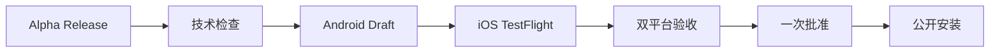

# 会迹（MeetTrace）GitHub Alpha 版本发布流程

> 状态：活动；统一发布入口已落地，需确认 Environments、Secrets、Ruleset 后首次运行
>
> 上游需求：[Android + iOS Alpha PRD V1.0](../product/Alpha_PRD_无登录版.md)
>
> 行为规格：[统一 Alpha 发布规格](../../spec/spec-process-cicd-alpha-release.md)

## 1. 最简发布模型

Actions 页面只需要手动运行 `Alpha Release`。Android、iOS 和最终公开均为该 YML 内的 job，不再保留独立发布 workflow 文件：

1. 输入发布标识，例如 `v1.0.0-alpha.1`；发布说明和 TestFlight 外部链接可不填。
2. 自动执行格式、静态分析和测试。
3. 自动构建正式签名的 Android arm64 APK，并暂存到不可见 Draft Release。
4. 自动构建签名 iOS IPA 并上传 TestFlight；IPA 不进入 GitHub。
5. 工作流停在 `Approve and deploy public Alpha`。维护者下载两个候选并完成双平台验收。
6. 在 `github-release` Environment 点击 `Approve and deploy`，原 Draft 随即公开为 GitHub Pre-release。

`expected_sha`、`gate_input_path` 和候选 run ID 均不需要填写。`docs/quality/alpha_release_input.json` 及 benchmark 工具仍可用于留存质量记录，但不会阻断发布工作流。

## 2. 版本与分发合同

| 项目 | 规则 |
|---|---|
| Release ID/tag | `v<pubspec marketing version>-alpha.<正整数>` |
| 双平台构建号 | 从已有 Release 候选清单的最大构建号连续 `+1`；同一 Draft 重跑复用原号，Android 与 iOS 始终一致 |
| Android | 正式签名、仅 `arm64-v8a`，公开附件名为 `meettrace-<release-id>-android-arm64.apk` |
| iOS | 仅 TestFlight，不上传 IPA 到 Actions Artifact 或 GitHub Release |
| 候选身份 | Android 与 iOS 必须来自同一 annotated tag 和提交 SHA |
| 首次启动资源 | Release 说明明确约下载 286.3 MB |

Draft 阶段同一发布标识可以重跑：工作流复用原 annotated tag、候选 SHA 和已分配构建号，并替换 Draft 候选资产。新候选从所有已有 Draft/公开候选清单的最大构建号连续加一；当前双平台构建号为 `401`，下一候选为 `402`。Draft 一旦公开，标签、APK 和候选清单不可覆盖；代码或二进制修复必须使用新的 Alpha 序号向前发布。

## 3. GitHub 配置

### Environments

| Environment | 人工审批 | 用途 |
|---|---|---|
| `android-alpha` | 无 | 保存 Android keystore 与证书摘要 |
| `testflight` | 无 | 保存 Apple distribution、profile、Team 与 API Key |
| `github-release` | 一名 required reviewer；允许 self review | 唯一公开批准 |

所有 Environment 仅允许 `master`。如果旧配置给 `android-alpha` 或 `testflight` 设置了 reviewer，需要移除，否则流程会出现额外审批。

Android Secrets：

- `ANDROID_KEYSTORE_BASE64`
- `ANDROID_KEYSTORE_PASSWORD`
- `ANDROID_KEY_ALIAS`
- `ANDROID_KEY_PASSWORD`
- `ANDROID_SIGNING_CERT_SHA256`

iOS Secrets：

- `IOS_DISTRIBUTION_P12_BASE64`
- `IOS_DISTRIBUTION_P12_PASSWORD`
- `IOS_PROVISIONING_PROFILE_BASE64`
- `APPLE_TEAM_ID`
- `APP_STORE_CONNECT_KEY_ID`
- `APP_STORE_CONNECT_ISSUER_ID`
- `APP_STORE_CONNECT_API_KEY_P8_BASE64`

### Rulesets 与权限

- `master` 要求 PR、线性历史，并阻止 force push/deletion。
- `v*` 标签禁止更新和删除；允许发布 Actions 身份创建。
- 仓库必须公开，Workflow permissions 允许 `GITHUB_TOKEN` 写入当前仓库 Release。

## 4. 运行与验收

在 `master` 的 Actions 页面打开 `Alpha Release`，只填写：

- `release_id`：必填，例如 `v1.0.0-alpha.1`；
- `release_notes`：可选；
- `ios_testflight_external_url`：可选，格式为 `https://testflight.apple.com/join/<code>`。

Android job 成功后，仓库维护者可从 Draft Release 下载确切 APK；iOS job 成功后从 TestFlight 安装同一候选。完成所需的 AT-01～AT-18 真机检查后，回到等待中的 `Approve and publish` job 批准公开。自动化会再次校验：

- annotated tag、release ID、marketing version 与 candidate SHA；
- 两份候选清单来自本次统一运行且 SHA 一致；
- Draft APK 名称、字节数和 SHA-256 未变化；
- Release 仍是 Draft prerelease。

任一技术校验失败都不会公开 Draft。人工质量结论由批准人负责，不再由 JSON 门禁判定。

## 5. 后补 TestFlight 外部链接

链接未获批时可先公开，Release 说明显示“iOS TestFlight 外部测试链接：待提供”。获批后：

1. 再次运行 `Alpha Release`；
2. 使用完全相同的 `release_id`；
3. 填写外部测试链接，可选填新的补充说明；
4. 通过同一个 `github-release` 批准。

工作流会自动进入 `metadata` 模式，验证现有公开 APK 和双平台清单后只更新说明，不运行构建，也不覆盖任何资产。

## 6. 撤回与恢复

- Draft 阶段失败：修复 Secrets、Apple 配置或工作流后，用同一发布标识重跑。
- 已公开严重问题：保留 Release、tag 和 APK，在说明顶部标记“已撤回，不建议安装”。
- 修复版本：合并新提交，提高 Alpha 序号并重新运行。
- 不删除、不移动、不覆盖已公开版本的身份或资产。

## 7. 首次启用检查

- [ ] `android-alpha` 已配置全部 Secrets，且没有 required reviewer。
- [ ] `testflight` 已配置全部 Secrets，且没有 required reviewer。
- [ ] `github-release` 已配置一名 required reviewer，并允许 self review。
- [ ] `master` 与 `v*` Ruleset 已启用。
- [ ] Workflow permissions 允许 Actions 写 Release。
- [ ] Actions 页面只有 `Alpha Release` 作为手动正式发版入口。
- [ ] 首次 `v1.0.0-alpha.1` 候选完成双平台实际验收后再批准公开。
