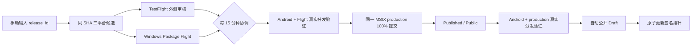

# 会迹（MeetTrace）GitHub Alpha 自动发布流程

> 适用范围：Android arm64 APK、iOS TestFlight、Windows x64 Microsoft Store MSIX 的统一 Alpha 候选与公开。

## 1. 操作模型

维护者正常发布时只在 Actions 手动运行一次 `Alpha Release`，必填项只有 `release_id`，例如 `v1.0.0-alpha.6`；`release_notes` 可选。不要填写内部的 `resume_run_id` 或 `orchestration_run_id`。

此后自动化按顺序推进：

1. 创建 annotated tag 和 GitHub Draft Pre-release，分配从 `2001` 开始连续递增的共享构建号。
2. 构建、签名并审计同一 SHA 的 Android arm64 APK、iOS IPA 和 Windows x64 Store MSIX。
3. Android APK 暂存 Draft；iOS 上传固定 TestFlight 外测组、自动通知并提交 Beta App Review；Windows MSIX 提交固定 Package Flight。
4. `Alpha Release Reconciler` 立即查询一次，之后每 15 分钟查询 App Store Connect 和 Microsoft Store。等待外部审核是正常状态，不需要人工批准。
5. TestFlight 同一 build 审核通过并进入 `Testing` 后，Windows Flight 必须为 `Published`。`Candidate Distribution Validation` 在 Firebase ARM 原样安装 Android APK，并在专用 Windows Store 机器安装、启动和卸载 Flight。
6. Flight 验证通过后，协调器把同一 MSIX 提交 100% non-flighted production submission。正式 submission 达到 `Published/Public` 后，再次执行 Android 与正式 Store 安装验证。
7. 全部不可变回执通过后，协调器生成发布门禁，并以内部输入恢复 `Alpha Release`。最终 job 自动公开原 Draft 为 Pre-release，再原子前移签名更新指针。



正常路径没有 `github-release` 或 `windows-store-validation` required reviewer，也没有最终审批评论。Environment 仍用于隔离 Secret 和限制来源分支。

## 2. 不可变发布合同

| 平台/环节 | 合同 |
| --- | --- |
| Android | 正式签名、仅 `arm64-v8a`，保留 `--split-per-abi`；公开文件固定为 `meettrace-<release-id>-android-arm64.apk` |
| iOS | Bundle ID `com.meettrace.app`；只进入 TestFlight，不上传 GitHub Release；固定外测组、稳定 public link、Beta App Review `APPROVED`、build 进入 `Testing` |
| Windows | Store ID `9PHHSJMWK06G`、Identity `zhangheng2026.MeetTrace`、Publisher `CN=E5BC0A60-65F7-46C4-9A30-653FFCF9619B`、x64 MSIX；不上传 GitHub Release |
| 共享版本 | Android 实测 `versionCode`、iOS build number 和 Windows `1.0.<build>.0` 中的 build 必须相同；序列从 `2001` 连续递增 |
| 候选来源 | 三平台必须来自同一 annotated tag、release ID、candidate SHA、source run 和共享构建号 |
| 公开门禁 | TestFlight Testing、Flight Published、production Published/Public、Flight 与 production 两次真实分发验证全部匹配同一候选 |

Draft 阶段可用相同发布标识恢复，但必须复用已经成功且身份匹配的候选，不能重建后冒充同一候选。Draft 公开后不得覆盖 APK、移动 tag、删除/撤回版本或回退构建号。

## 3. 一次性 bootstrap

自动化 PR 合并到 `master` 后，由仓库管理员在本地执行一次：

先创建 `microsoft-store` Environment，并把现有四项 Partner Center Secret 重新录入该 Environment。GitHub 不允许读取 Secret 明文，因此脚本不能从旧 `github-release` Environment 自动复制；脚本确认新位置齐全后会删除旧位置的冗余副本。

```powershell
gh api repos/<owner>/<repo>/environments/microsoft-store --method PUT `
  -F 'deployment_branch_policy[protected_branches]=true' `
  -F 'deployment_branch_policy[custom_branch_policies]=false'
gh secret set PARTNER_CENTER_TENANT_ID --repo <owner>/<repo> --env microsoft-store
gh secret set PARTNER_CENTER_SELLER_ID --repo <owner>/<repo> --env microsoft-store
gh secret set PARTNER_CENTER_CLIENT_ID --repo <owner>/<repo> --env microsoft-store
gh secret set PARTNER_CENTER_CLIENT_SECRET --repo <owner>/<repo> --env microsoft-store
```

随后先执行不带 `-Apply` 的 dry-run，再执行一次正式 bootstrap：

```powershell
./tool/release/bootstrap_release_automation.ps1 `
  -TestFlightExternalGroup '<固定外测组名>' `
  -TestFlightPublicLink 'https://testflight.apple.com/join/<固定代码>' `
  -PartnerCenterFlightId '<固定 Package Flight ID>' `
  -Apply
```

脚本先校验关键 Secret/Variable 并设置固定 Variable，所有预检成功后才清除六个发布 Environment 的 wait timer 和 required reviewer，同时保留分支部署策略。脚本不读取、复制或输出 Secret；缺失 Secret 必须用 `gh secret set --env <environment> <name>` 单独配置。

环境配置如下：

| Environment | Secret / Variable | 用途 |
| --- | --- | --- |
| `android-alpha` | Android keystore、alias/password、Sentry token、Firebase App ID | APK 正式签名、符号与候选分发 |
| `testflight` | App Store Connect key ID、issuer ID、P8 Base64、iOS signing、Sentry；`TESTFLIGHT_EXTERNAL_GROUP`、`TESTFLIGHT_PUBLIC_LINK` | 上传、外测审核、状态查询 |
| `windows-alpha` | Windows Store signing PFX、password | 构建固定身份 MSIX |
| `microsoft-store` | Partner Center tenant/seller/client/secret；`PARTNER_CENTER_FLIGHT_ID` | Flight/production 提交与只读状态核验 |
| `windows-store-validation` | 无发布 Secret | 专用自托管机隔离边界，不设 reviewer |
| `github-release` | `APP_UPDATE_SIGNING_PRIVATE_KEY_BASE64`；固定 TestFlight group/link 与 Store Flight ID | 最终重验协调门禁并签名指针；不设 reviewer |

Partner Center 必须先人工完成一次产品、listing、年龄分级、定价/可用性、固定 Flight 和自动认证后发布配置。TestFlight 必须先创建固定外测组并启用稳定 public link。这些是一次性商店 bootstrap，不是逐版本审批。

## 4. 自动协调与失败关闭

`.github/workflows/alpha-release-reconcile.yml` 支持候选完成后的即时 `repository_dispatch` 和 `*/15 * * * *` 定时轮询。它只处理仍为 Draft 的最新合法 Alpha 候选，并核对 tag、SHA、source run、候选清单和商店返回包身份。

以下状态只等待，不公开，也不创建新候选：

- TestFlight 正在处理、等待 Beta App Review 或审核中；
- Microsoft Store 正在 commit、processing、certification 或 publishing；
- 已调度的专用机验证仍在执行。

以下情况失败关闭并创建或更新带 `release-blocked` 标签的 Issue：

- TestFlight processing `FAILED/INVALID` 或 Beta App Review `REJECTED`；
- Store 对同一包返回失败、拒绝或未知状态；
- 外部 API 查询失败、字段缺失、状态歧义或回执身份不匹配；
- 候选 tag/SHA/build、包名、版本、架构、摘要或来源运行不一致。

阻断时 Draft、公开 Release、tag 和旧 `updates/alpha/alpha.json` 均保持不变。外部状态恢复后，下一次协调会复用原候选继续；全部门禁通过时自动关闭对应 Issue。

## 5. 真实分发验证

`Candidate Distribution Validation` 只接受 `repository_dispatch`，且要求默认分支和不可变候选合同：

1. Android 从 Draft Release 下载确切 APK，核对 SHA-256，在 Firebase Test Lab ARM 设备使用 `--no-resign` 原样安装并启动。
2. Windows 只能在带 `self-hosted, Windows, X64, meettrace-store` 标签的专用机运行。Flight 阶段与 production 阶段分别从 Store 安装、验证版本、启动并卸载。
3. 两阶段必须生成不同 validation run ID；production 不能复用 Flight 回执。
4. 所有回执都绑定 release ID、candidate SHA、source run、reconcile run 和验证阶段。

公开后仍可按 [平台分发纵向验证规格](../../spec/spec-process-cicd-platform-distribution-validation.md)运行 `Platform Distribution Validation`，验证签名更新指针、公开 APK 和 Store 生命周期。它是发布后的纵向审计，不替代公开前候选门禁。

## 6. 恢复、修复与撤回

- 候选构建失败：修复配置或工作流后，以相同 Draft `release_id` 重跑；只有身份匹配的成功候选可复用。
- 外部审核等待：不要重跑。协调器每 15 分钟自动继续。
- 外部拒审：按 `release-blocked` Issue 修复商店元数据；若二进制或代码改变，必须使用新的 release ID 和更高构建号。
- 最终公开 job 失败：协调器保留的门禁可自动再次恢复；内部 `resume_run_id` 与 `orchestration_run_id` 不由维护者正常填写。
- Release 已公开但指针写入失败：同一 `release_id` 运行元数据修复，选择 `repair_update_pointer`；不重建、不覆盖资产。
- 严重问题撤回：同一公开 `release_id` 选择 `withdraw_update`。保留 Release、tag、APK 和 Store submission，仅把签名指针改为 `withdrawn`；修复使用新版本前进。

元数据修复和撤回是已公开版本的维护操作，不经过候选商店重提交流程，也不要求最终人工审批。私钥只从 `github-release` Environment 读取，不进入命令行、日志、Artifact、Release 或生成分支。

## 7. 发布前检查

- [ ] 自动发布变更已合并到 `master`，一次性 bootstrap 已成功执行。
- [ ] 默认分支保护和 required checks 正常；发布 Environment 没有 required reviewer 或 wait timer。
- [ ] TestFlight 固定外测组、公测链接、Beta App Review 联系信息和出口合规信息已完成。
- [ ] Partner Center 产品与固定 Flight 已初始化，production submission 配置为认证通过后自动发布，目标为 100% 而非渐进发布。
- [ ] `microsoft-store` Entra 应用拥有该产品提交、查询所需的最小权限。
- [ ] 专用 Windows Store runner 在线，标签为 `self-hosted, Windows, X64, meettrace-store`，其 Microsoft Store 登录账号属于固定 Flight 测试受众，且只接受默认分支的 repository dispatch。
- [ ] Firebase WIF 与 ARM 设备矩阵可用。
- [ ] 运行 `Alpha Release` 时只填写新的 `release_id` 和可选说明。

任何门禁失败都不得手工公开 Draft 或手工前移更新指针。
