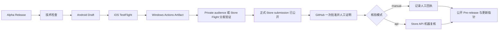

# 会迹（MeetTrace）GitHub Alpha 版本发布流程

> 状态：活动 Runbook；正式工作流已完成限定受众、首次 Store 正式认证、受保护人工证明、三平台统一公开和签名更新指针的首次生产闭环，并保留可选 Partner Center API 机器核验；Windows 安装、卸载和 Store 更新纵向自动化闭环前必须显示“规划中/未就绪”
>
> 上游需求：[Android + iOS + Windows Alpha PRD V1.2](../product/Alpha_PRD_无登录版.md)

## 1. 最简发布模型

Actions 页面只需要手动运行 `Alpha Release`。Android、iOS、Windows 和最终公开均为该 YML 内的 job，不再保留独立发布 workflow 文件：

1. 输入发布标识，例如 `v1.0.0-alpha.1`；发布说明和 TestFlight 外部链接可不填，Store 核验默认选择 `manual`。
2. 自动执行格式、静态分析和测试。
3. 自动构建正式签名的 Android arm64 APK，并暂存到不可见 Draft Release。
4. 自动构建签名 iOS IPA 并上传 TestFlight；IPA 不进入 GitHub。
5. 自动构建固定 Store 身份的 Windows x64 MSIX，完成内容审计和 provenance，将包体及证据上传 Actions Artifact；不上传 GitHub Release。
6. 维护者下载确切 Windows Artifact 并逐字节核对 SHA-256。首次 Store 发布把同一包提交到 Private audience；已有公开版本的后续更新提交 Package Flight。等待认证并完成 Windows 分发验证。
7. 将同一包用于正式 non-flighted submission：首次发布把 audience 改为 Public，后续版本从 Flight 拉取已验证包。完成正式认证和发布，并确认 Store 产品页可安装该版本。
8. 工作流仍停在 `Approve and deploy public Alpha`。维护者在 Partner Center 核对正式 submission 为 `Published`、`Public`、同版本且唯一包为已上传的 x64 MSIX，再把 Windows job 摘要给出的 `STORE <Store ID> Published Public <版本> x64 <MSIX SHA-256>` 全文复制到 `github-release` 审批评论后点击批准。默认 `manual` 模式会通过 GitHub API 复核本次运行的环境、审批状态、审批人和精确评论，再记录人工证明；有 Entra 租户时可选择 `api`，由官方 Store CLI 在审批后再次机器核验。两种模式都只保留标明证据来源的脱敏回执，通过后原 Draft 才公开为 GitHub Pre-release 并前移更新 Manifest。



`expected_sha`、`gate_input_path` 和候选 run ID 均不需要填写。发布流程只读取构建、自动化、包审计和分发状态。

## 2. 版本与分发合同

| 项目 | 规则 |
|---|---|
| Release ID/tag | `v<pubspec marketing version>-alpha.<正整数>` |
| 三平台构建号 | 既有候选之后把下一共享构建号统一提升到 `2001`，此后从已有 Release 候选清单的最大构建号连续 `+1`；同一 Draft 重跑复用原号，Android 实际 `versionCode`、iOS `CFBundleVersion` 与 Windows Store 第三段始终一致 |
| Android | 正式签名、仅 `arm64-v8a`，保留 `--split-per-abi`，公开附件名为 `meettrace-<release-id>-android-arm64.apk`；传给 Flutter 的包基础构建号等于共享构建号减 `2000`，由 Flutter 默认 ARM64 ABI 偏移还原为相同的实际 `versionCode`。首个新候选输入 `1`、产出 `2001`；候选清单保存基础构建号和实测 `versionCode`，客户端不自行计算偏移 |
| iOS | 仅 TestFlight，不上传 IPA 到 Actions Artifact 或 GitHub Release |
| Windows | Windows 10 22H2/11、仅 x64；固定 Store ID `9PHHSJMWK06G`，MSIX 只进入 Actions Artifact 与 Partner Center |
| Windows Store 包版本 | `1.0.<共享发布构建号>.0`；共享构建号不超过 `65535`，营销版本另行记录，第一段不得为 `0`，Store 保留的第四段固定为 `0` |
| 候选身份 | Android、iOS 与 Windows 必须来自同一 annotated tag、提交 SHA、release ID 和构建号 |
| Release 资产 | GitHub Release 只保留 Android APK 与单一公开候选清单；IPA、Windows MSIX 和详细检查证据不进入 Release |
| 自动更新 | 单一 Alpha 频道；`updates/alpha` 分支只保存当前 `alpha.json` 签名指针，三平台批准并公开 Release 后原子前移，不允许降级 |
| 首次启动资源 | Release 说明明确约下载 286.3 MB |

Draft 阶段同一发布标识可以重跑：工作流复用原 annotated tag、候选 SHA、已分配构建号和身份匹配的不可变 Android/iOS/Windows 候选，不覆盖已成功资产。新候选从所有已有 Draft/公开候选清单的最大构建号连续加一。Draft 一旦公开，标签、APK 和公开候选清单不可覆盖；Private audience、Flight 与正式 Store submission 必须复用同一候选包，代码或二进制修复必须使用新的 Alpha 序号向前发布。

共享构建号低于 `2001` 时，下一候选一次性从 `2001` 开始；随后按 `2002 → 2003` 连续递增。Android 的包基础构建号分别为 `1 → 2 → 3`，实际系统版本码与 iOS、Windows 的共享构建号一致。同一 Draft 重跑必须复用原号。既有 Alpha.5 的 Android 系统版本码为 `2405`，不能直接安装系统版本码 `2001` 的新序列首包；本次决策不提供旧 Alpha 升级兼容。新序列内继续支持自动更新。

## 3. GitHub 配置

### Environments

| Environment | 人工审批 | 用途 |
|---|---|---|
| `android-alpha` | 无 | 保存 Android keystore 与证书摘要 |
| `testflight` | 无 | 保存 Apple distribution、profile、Team 与 API Key |
| `windows-alpha` | 无 | 当前不保存凭据；Store 身份是仓库中的非敏感固定配置，包体由维护者手工上传 Partner Center |
| `github-release` | 一名 required reviewer；允许 self review | 唯一公开批准、Store 正式 submission 人工证明、更新指针签名和可选 API 只读核验 |
| `windows-store-validation` | 一名 required reviewer | 仅允许 `master` 在专用自托管 Windows 账号执行当前用户 Store 安装、更新和卸载；不保存 Secret |

所有 Environment 仅允许 `master`。如果旧配置给 `android-alpha`、`testflight` 或 `windows-alpha` 设置了 reviewer，需要移除，否则流程会出现额外审批。`github-release` 的最终批准不得早于 Windows 限定受众/Flight 分发验证、正式 Store 认证与公开可安装检查。

Android Secrets：

- `ANDROID_KEYSTORE_BASE64`
- `ANDROID_KEYSTORE_PASSWORD`
- `ANDROID_KEY_ALIAS`
- `ANDROID_KEY_PASSWORD`
- `ANDROID_SIGNING_CERT_SHA256`

iOS Secrets：

- `IOS_DISTRIBUTION_P12_BASE64`
- `IOS_DISTRIBUTION_P12_PASSWORD`
- `IOS_PROVISIONING_PROFILE_BASE64`
- `APPLE_TEAM_ID`
- `APP_STORE_CONNECT_KEY_ID`
- `APP_STORE_CONNECT_ISSUER_ID`
- `APP_STORE_CONNECT_API_KEY_P8_BASE64`

最终公开 Secrets（仅 `github-release` Environment）：

- `APP_UPDATE_SIGNING_PRIVATE_KEY_BASE64`：32 字节 Ed25519 私钥 seed 的 Base64；客户端只内置对应公钥和 key ID，私钥不得出现在日志、Artifact、Release 或仓库历史中。
- 以下四项仅在选择 `api` 模式时配置；默认 `manual` 模式不得读取，也不要求空占位：
  - `PARTNER_CENTER_TENANT_ID`：Partner Center 关联的 Microsoft Entra tenant ID。
  - `PARTNER_CENTER_SELLER_ID`：Partner Center seller ID。
  - `PARTNER_CENTER_CLIENT_ID`：具备查询目标应用 submission 所需最小权限的 Microsoft Entra application/client ID。
  - `PARTNER_CENTER_CLIENT_SECRET`：上述应用的 client secret；不得进入日志、Artifact、Release 或仓库历史。

Windows 候选 job 不调用 Partner Center API，也不保存 Windows Secrets；维护者仍从 Actions Artifact 下载经校验的 Store MSIX，首次发布手工提交 Private audience，后续版本手工提交 Package Flight，并让正式 non-flighted submission 复用同一包。Windows job 摘要会根据候选清单生成唯一审批评论；默认 `manual` 模式下，最终公开 job 必须从本次运行的 GitHub 审批 API 找到该精确评论和 `github-release` 环境后，才生成绑定审批人和候选身份的人工回执，不能用普通批准或空评论替代。`api` 模式才读取四项 Partner Center Secrets，并且只查询、不创建、提交、修改或撤回 Store 状态；原始响应可能包含短期下载地址，核验后立即删除。两种模式都上传不含凭据和 URL 的 `windows-store-production-receipt.json`，且 `verificationMode` 必须准确。任何路线都不得重新打包或签名，也不得把自签名 PFX、USB Token 私钥或可导出的正式私钥放入 Secrets。

### Rulesets 与权限

- `master` 要求 PR、线性历史，并阻止 force push/deletion。
- `v*` 标签禁止更新和删除；允许发布 Actions 身份创建。
- 仓库必须公开，Workflow permissions 允许 `GITHUB_TOKEN` 写入当前仓库 Release。
- `updates/alpha` 是自动生成分支，禁止人工改写、删除或 force push；`alpha.json` 的每次变化必须由 `Alpha Release` 生成且保留提交历史。
- 当前 Windows 只通过 Store 发布，未认证的 Actions Artifact 不得作为公开安装包。SignPath 申请仍在审核，但不属于当前发布门禁。

### SignPath Foundation 待审核材料（非当前发布路线）

申请使用以下公开事实，不创建自签名或个人证书兜底：

| 项目 | 值 |
|---|---|
| 仓库 | `https://github.com/zhangheng2022/meet_trace`（Public） |
| 开源许可 | MIT，根目录 `LICENSE` |
| 已发布版本 | `https://github.com/zhangheng2022/meet_trace/releases` |
| Code signing policy | `https://github.com/zhangheng2022/meet_trace/blob/master/CODE_SIGNING_POLICY.md` |
| 隐私政策 | `https://github.com/zhangheng2022/meet_trace/blob/master/PRIVACY.md` |
| Committer / Reviewer / Approver | `https://github.com/zhangheng2022`；单维护者阶段角色重叠，但外部贡献仍须审查 |
| 正式签名范围 | Windows 10 22H2/11 x64 MSIX；不签模型权重或上游独立二进制 |
| 遥测 | SignPath Windows 候选固定 `SENTRY_ENABLED=false` |

上述材料仅为已提交申请保留。收到审核结果时只记录，不把 Organization、Project、Signing Policy、Artifact Configuration 或证书 Subject 写入当前 `windows-alpha`。若未来考虑启用 GitHub MSIX，必须先证明证书 Subject 与 Store 包身份兼容，评估升级和本地数据连续性，更新 PRD，并明确停止 Store 路线；否则继续只使用 Microsoft Store。

## 4. 运行与分发验证

在 `master` 的 Actions 页面打开 `Alpha Release`，只填写：

- `release_id`：必填，例如 `v1.0.0-alpha.1`；
- `release_notes`：可选；
- `ios_testflight_external_url`：可选，格式为 `https://testflight.apple.com/join/<code>`；
- `resume_run_id`：仅在 Android、iOS、Windows 候选均成功而最终公开失败时填写原运行 ID；正常发布留空。
- `withdraw_update`：仅撤回已公开版本时选择；正常发布和元数据修复保持关闭。
- `repair_update_pointer`：仅 GitHub Release 已公开、但签名指针发布失败或需要幂等修复时选择；不能与 `withdraw_update` 同时选择。
- `store_verification_mode`：默认 `manual`；只有已关联 Entra 应用并配置四项 Secrets 时才选择 `api`。

Android job 成功后，仓库维护者可从 Draft Release 下载确切 APK；iOS job 成功后从 TestFlight 安装同一候选；Windows 从 `meettrace-windows-store-<run>-<attempt>` Artifact 取得确切 MSIX，并核对候选清单 SHA-256。首次发布使用 Private audience，后续版本使用 Package Flight；自动化、构建审计与分发门禁通过后，让正式 non-flighted submission 复用同一包并发布。确认 Store 产品页已可安装该版本后，审批人必须把 Partner Center 中的状态、可见性、文件名、版本、架构和上传状态与候选清单逐项比对，再从 Windows job 摘要复制唯一审批合同到等待中的 `Approve and deploy public Alpha` job 评论并批准；不要手工改写、缩短或留空。该步骤不要求目标设备人工证据。批准后、公开前，工作流始终校验：

- annotated tag、release ID、marketing version 与 candidate SHA；
- Android、iOS 与 Windows 候选证据属于指定运行和同一 SHA、版本与构建号；复用的不可变候选可来自更早的暂存运行；
- Draft APK 与 Windows Store 候选的名称、包身份、字节数、SHA-256 和来源证据未变化；
- Release 仍是 Draft prerelease。
- Store 回执属于产品 `9PHHSJMWK06G`，绑定本次候选、来源运行和唯一 x64 MSIX；`manual` 回执标明 `manualEnvironmentApproval`，`api` 回执标明 `partnerCenterApi`；
- `manual` 回执来自本次运行的 `github-release` 已批准记录，审批评论逐字匹配 `STORE 9PHHSJMWK06G Published Public <版本> x64 <MSIX SHA-256>`，并记录审批人和评论摘要；
- `api` 模式的查询结果必须证明正式 submission 为 `Published` 和 `Public`，且唯一包的文件名、`1.0.<共享发布构建号>.0` 版本、x64 架构与 `Uploaded` 状态全部匹配候选；
- 公开更新 Manifest 当前仍指向旧版本，且新指针只会在 Store 证明和本次批准后写入。
- Android 候选清单包含包名和发布证书 SHA-256；签名更新 payload 固定记录三平台入口、同一构建号、数据代和候选 SHA。

任一技术校验失败都不会公开 Draft。批准人依据构建、自动化、包审计和分发状态作出公开决定；流程不读取额外 JSON 质量输入。

### 4.1 公开后的平台分发纵向验证

`Alpha Release` 仍是 Actions 页面唯一手动入口。版本已经公开且签名 `updates/alpha` 指针完成前移后，由具备仓库操作权限的维护者发送 `repository_dispatch` 事件 `platform-distribution-validation`。以下 PowerShell 示例先触发首次 `InstallUninstall`；值必须替换为当前公开候选：

```powershell
$payload = @{
  event_type = 'platform-distribution-validation'
  client_payload = @{
    release_id = 'v1.0.0-alpha.5'
    previous_android_release_id = 'v1.0.0-alpha.2'
    source_run_id = '32362248666'
    publish_run_id = '32362248666'
    windows_validation_mode = 'InstallUninstall'
    windows_previous_version = ''
    android_device_model = 'MediumPhone.arm'
    android_version = '35'
  }
} | ConvertTo-Json -Depth 4
$payload | gh api repos/zhangheng2022/meet_trace/dispatches `
  --method POST --input -
```

事件 payload 字段：

- `release_id`：当前公开版本；
- `previous_android_release_id`：更低构建号、同签名身份的公开 Android 版本；
- `source_run_id`：生成当前三平台候选且候选 job 成功的 `Alpha Release` 运行；
- `publish_run_id`：生成 Store 生产回执并成功完成公开 job 的实际运行；恢复发布时它与 `source_run_id` 不同，普通发布通常相同；
- `windows_validation_mode`：首次验证选 `InstallUninstall`；已为下一版本保留旧版专用机快照时选 `Update`；
- `windows_previous_version`：仅 `Update` 填写专用机已安装的确切 `1.0.<build>.0`；
- Android Firebase ARM 模型与版本通常保持默认 `MediumPhone.arm` / `35`。

工作流先使用客户端同一 Ed25519 公钥验签 `updates/alpha`，再把公开 APK、iOS/Windows 候选、来源运行和 Windows Published/Public 回执绑定到同一提交、版本和构建号。随后：

1. Android 从 GitHub Release 下载确切 arm64 APK，核对 SHA-256，在 Firebase Test Lab ARM 设备以 `--no-resign` 原样安装并启动。验证器对 schema 1 遗留包核对共享构建号与默认 ARM64 ABI 偏移，对 schema 2 新包核对清单记录的 Android 基础构建号和真实 `versionCode`。该步骤证明当前公开包可安装启动并核对包名与发布证书世系；不把跨序列检查表述为系统级 APK 旧版升级。
2. iOS 复核来源运行的签名 TestFlight 候选和成功上传 job，任何 IPA 出现在证据目录都会失败。当前不调用 App Store Connect 查询处理完成或终端安装状态。
3. Windows 只调度 `[self-hosted, Windows, X64, meettrace-store]` 专用机和 `windows-store-validation` Environment。脚本只从 `msstore` 安装或更新产品 `9PHHSJMWK06G`，核对固定包身份、x64 和确切版本，连续启动两次验证单实例，最后只卸载当前运行器账号的包。

仓库已配置受保护 Environment 和该专用运行器，但基础设施就绪不等于纵向闭环。必须先完成 `InstallUninstall` 成功运行；真实 `Update` 还需要在下一版本公开前保留旧版 Store 安装或虚拟机快照。两个 Windows 模式及最终三平台 Gate 全部成功前，Windows 仍显示“规划中/未就绪”。详细合同见[平台分发纵向验证规格](../../spec/spec-process-cicd-platform-distribution-validation.md)。

## 5. 后补 TestFlight 外部链接

链接未获批时可先公开，Release 说明显示“iOS TestFlight 外部测试链接：待提供”。获批后：

1. 再次运行 `Alpha Release`；
2. 使用完全相同的 `release_id`；
3. 填写外部测试链接，可选填新的补充说明；
4. 通过同一个 `github-release` 批准。

工作流会自动进入 `metadata` 模式，验证现有公开 APK、MSIX/Store 身份和候选清单后更新说明，并用同一 release/build 重签当前指针以修复 TestFlight 链接；不运行构建、不覆盖资产，也不能把已撤回版本重新公开。

## 6. 撤回与恢复

- Draft 阶段构建失败：修复 Secrets、Apple 配置或工作流后，用同一发布标识重跑。
- Android、iOS 与 Windows 均成功、仅最终公开失败：修复工作流后新建一次手动运行，填写同一 `release_id` 和原 `resume_run_id`。恢复模式只复核原候选并进入公开批准，不重新构建，也不重复上传 TestFlight 或 Store 限定受众/Flight。
- GitHub Pre-release 已公开、但 `alpha.json` 写入失败：再次运行同一 `release_id`，只选择 `repair_update_pointer` 并完成审批；工作流复核公开 APK 和候选证据，以旧 blob SHA 幂等重签并写入，不重建或覆盖资产。
- SignPath 审核结果到达：记录结果，当前 Store 路线不变；不得在同一版本或未更新 PRD时启用第二个 Windows 包身份。
- 已公开严重问题：再次运行同一 `release_id`，选择 `withdraw_update` 并通过 `github-release` 审批。工作流保留 Release、tag、APK 和 MSIX/Store submission，在说明中标记“已撤回，不建议安装”，把签名指针状态改为 `withdrawn`；客户端停止发现该版本，既不自动降级也不退出已安装版本。
- 修复版本：合并新提交，提高 Alpha 序号并重新运行。
- 不删除、不移动、不覆盖已公开版本的身份或资产。

## 7. 发版前检查

- [ ] `android-alpha` 已配置全部 Secrets，且没有 required reviewer。
- [ ] `testflight` 已配置全部 Secrets，且没有 required reviewer。
- [ ] `windows-alpha` 没有 required reviewer、Windows Secrets 或可导出私钥。
- [ ] `github-release` 已配置一名 required reviewer，并允许 self review。
- [ ] `windows-store-validation` 已限制为 `master` 并配置一名 required reviewer；环境中没有 Store、Partner Center 或签名 Secret。
- [ ] `github-release` 已配置 `APP_UPDATE_SIGNING_PRIVATE_KEY_BASE64`，公钥与客户端固定 key ID 对应。
- [ ] 默认 `manual` 模式不配置 Partner Center 空 Secrets；若选择 `api`，`github-release` 已配置四项 Partner Center Secrets，且 Entra 应用具备读取目标产品 submission 的最小权限。
- [ ] `master` 与 `v*` Ruleset 已启用。
- [ ] Workflow permissions 允许 Actions 写 Release。
- [ ] Actions 页面只有 `Alpha Release` 作为手动正式发版入口。
- [ ] Microsoft Store 产品已完成 Partner Center 初始配置，固定身份与当前候选完全一致；首次 Private audience 或后续 Package Flight 分发验证已完成，正式 Store submission 已认证、公开且可安装同一包。
- [ ] `manual` 审批人已逐项核对 Store 状态/可见性/文件名/版本/x64/上传状态，并准备从 Windows job 摘要逐字复制审批评论；或 `api` 模式已准备好执行同一机器合同。
- [ ] 当前候选已按[质量与验收](../quality/README.md)通过三平台构建、自动化和分发门禁，再批准公开。
- [ ] 公开更新 Manifest 仍指向旧版 Store 候选，且更新动作位于最终批准之后；仓库和 Release 不存在 `.appinstaller` 或 MSIX。
- [ ] `updates/alpha` 无人工提交，当前 `alpha.json` 可通过客户端内置 Ed25519 公钥验签，构建号未回退。
- [ ] 需要评估 Windows 就绪状态时，专用自托管运行器已分别完成真实 `InstallUninstall` 和后续版本 `Update`，且 `Platform Distribution Validation` 最终 Gate 成功；未完成时继续标记“规划中/未就绪”。
