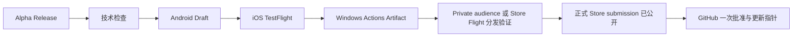

# 会迹（MeetTrace）GitHub Alpha 版本发布流程

> 状态：活动 Runbook；正式工作流已生成固定 Microsoft Store 身份的 Windows 候选，Store 限定受众/Flight、正式认证、公开发布和自动更新端到端尚未验收，完成前不得宣称 Windows 受支持
>
> 上游需求：[Android + iOS + Windows Alpha PRD V1.2](../product/Alpha_PRD_无登录版.md)

## 1. 最简发布模型

Actions 页面只需要手动运行 `Alpha Release`。Android、iOS、Windows 和最终公开均为该 YML 内的 job，不再保留独立发布 workflow 文件：

1. 输入发布标识，例如 `v1.0.0-alpha.1`；发布说明和 TestFlight 外部链接可不填。
2. 自动执行格式、静态分析和测试。
3. 自动构建正式签名的 Android arm64 APK，并暂存到不可见 Draft Release。
4. 自动构建签名 iOS IPA 并上传 TestFlight；IPA 不进入 GitHub。
5. 自动构建固定 Store 身份的 Windows x64 MSIX，完成内容审计和 provenance，将包体及证据上传 Actions Artifact；不上传 GitHub Release。
6. 维护者下载确切 Windows Artifact 并逐字节核对 SHA-256。首次 Store 发布把同一包提交到 Private audience；已有公开版本的后续更新提交 Package Flight。等待认证并完成 Windows 分发验证。
7. 将同一包用于正式 non-flighted submission：首次发布把 audience 改为 Public，后续版本从 Flight 拉取已验证包。完成正式认证和发布，并确认 Store 产品页可安装该版本。
8. 工作流仍停在 `Approve and deploy public Alpha`。维护者核对三个候选的构建、自动化和分发状态后，在 `github-release` Environment 点击批准，原 Draft 才公开为 GitHub Pre-release；公开更新 Manifest 只指向已公开 Store 产品，不读取 Draft、Private audience 或 Package Flight。

`expected_sha`、`gate_input_path` 和候选 run ID 均不需要填写。发布流程只读取构建、自动化、包审计和分发状态。

## 2. 版本与分发合同

| 项目 | 规则 |
|---|---|
| Release ID/tag | `v<pubspec marketing version>-alpha.<正整数>` |
| 三平台构建号 | 从已有 Release 候选清单的最大构建号连续 `+1`；同一 Draft 重跑复用原号，Android、iOS 与 Windows 始终一致 |
| Android | 正式签名、仅 `arm64-v8a`，公开附件名为 `meettrace-<release-id>-android-arm64.apk` |
| iOS | 仅 TestFlight，不上传 IPA 到 Actions Artifact 或 GitHub Release |
| Windows | Windows 10 22H2/11、仅 x64；固定 Store ID `9PHHSJMWK06G`，MSIX 只进入 Actions Artifact 与 Partner Center |
| Windows Store 包版本 | `1.0.<共享发布构建号>.0`；共享构建号不超过 `65535`，营销版本另行记录，第一段不得为 `0`，Store 保留的第四段固定为 `0` |
| 候选身份 | Android、iOS 与 Windows 必须来自同一 annotated tag、提交 SHA、release ID 和构建号 |
| Release 资产 | GitHub Release 只保留 Android APK 与单一公开候选清单；IPA、Windows MSIX 和详细检查证据不进入 Release |
| 自动更新 | 单一 Alpha 频道；公开 Manifest 只在三平台批准后指向更高版本，不允许降级 |
| 首次启动资源 | Release 说明明确约下载 286.3 MB |

Draft 阶段同一发布标识可以重跑：工作流复用原 annotated tag、候选 SHA、已分配构建号和身份匹配的不可变 Android/iOS/Windows 候选，不覆盖已成功资产。新候选从所有已有 Draft/公开候选清单的最大构建号连续加一。Draft 一旦公开，标签、APK 和公开候选清单不可覆盖；Private audience、Flight 与正式 Store submission 必须复用同一候选包，代码或二进制修复必须使用新的 Alpha 序号向前发布。

## 3. GitHub 配置

### Environments

| Environment | 人工审批 | 用途 |
|---|---|---|
| `android-alpha` | 无 | 保存 Android keystore 与证书摘要 |
| `testflight` | 无 | 保存 Apple distribution、profile、Team 与 API Key |
| `windows-alpha` | 无 | 当前不保存凭据；Store 身份是仓库中的非敏感固定配置，包体由维护者手工上传 Partner Center |
| `github-release` | 一名 required reviewer；允许 self review | 唯一公开批准 |

所有 Environment 仅允许 `master`。如果旧配置给 `android-alpha`、`testflight` 或 `windows-alpha` 设置了 reviewer，需要移除，否则流程会出现额外审批。`github-release` 的最终批准不得早于 Windows 限定受众/Flight 分发验证、正式 Store 认证与公开可安装检查。

Android Secrets：

- `ANDROID_KEYSTORE_BASE64`
- `ANDROID_KEYSTORE_PASSWORD`
- `ANDROID_KEY_ALIAS`
- `ANDROID_KEY_PASSWORD`
- `ANDROID_SIGNING_CERT_SHA256`

iOS Secrets：

- `IOS_DISTRIBUTION_P12_BASE64`
- `IOS_DISTRIBUTION_P12_PASSWORD`
- `IOS_PROVISIONING_PROFILE_BASE64`
- `APPLE_TEAM_ID`
- `APP_STORE_CONNECT_KEY_ID`
- `APP_STORE_CONNECT_ISSUER_ID`
- `APP_STORE_CONNECT_API_KEY_P8_BASE64`

当前 Windows job 不调用 Partner Center API，也不需要 Windows Secrets。维护者从 Actions Artifact 下载经校验的 Store MSIX，首次发布手工提交 Private audience，后续版本手工提交 Package Flight，并让正式 non-flighted submission 复用同一包；不得重新打包或签名。未来如自动化 Store 提交，只能使用 Partner Center 最小权限凭据，并需另行审查权限、撤回和重试边界。任何路线都不得把自签名 PFX、USB Token 私钥或可导出的正式私钥放入 Secrets。

### Rulesets 与权限

- `master` 要求 PR、线性历史，并阻止 force push/deletion。
- `v*` 标签禁止更新和删除；允许发布 Actions 身份创建。
- 仓库必须公开，Workflow permissions 允许 `GITHUB_TOKEN` 写入当前仓库 Release。
- 当前 Windows 只通过 Store 发布，未认证的 Actions Artifact 不得作为公开安装包。SignPath 申请仍在审核，但不属于当前发布门禁。

### SignPath Foundation 待审核材料（非当前发布路线）

申请使用以下公开事实，不创建自签名或个人证书兜底：

| 项目 | 值 |
|---|---|
| 仓库 | `https://github.com/zhangheng2022/meet_trace`（Public） |
| 开源许可 | MIT，根目录 `LICENSE` |
| 已发布版本 | `https://github.com/zhangheng2022/meet_trace/releases` |
| Code signing policy | `https://github.com/zhangheng2022/meet_trace/blob/master/CODE_SIGNING_POLICY.md` |
| 隐私政策 | `https://github.com/zhangheng2022/meet_trace/blob/master/PRIVACY.md` |
| Committer / Reviewer / Approver | `https://github.com/zhangheng2022`；单维护者阶段角色重叠，但外部贡献仍须审查 |
| 正式签名范围 | Windows 10 22H2/11 x64 MSIX；不签模型权重或上游独立二进制 |
| 遥测 | SignPath Windows 候选固定 `SENTRY_ENABLED=false` |

上述材料仅为已提交申请保留。收到审核结果时只记录，不把 Organization、Project、Signing Policy、Artifact Configuration 或证书 Subject 写入当前 `windows-alpha`。若未来考虑启用 GitHub MSIX，必须先证明证书 Subject 与 Store 包身份兼容，评估升级和本地数据连续性，更新 PRD，并明确停止 Store 路线；否则继续只使用 Microsoft Store。

## 4. 运行与分发验证

在 `master` 的 Actions 页面打开 `Alpha Release`，只填写：

- `release_id`：必填，例如 `v1.0.0-alpha.1`；
- `release_notes`：可选；
- `ios_testflight_external_url`：可选，格式为 `https://testflight.apple.com/join/<code>`；
- `resume_run_id`：仅在 Android、iOS、Windows 候选均成功而最终公开失败时填写原运行 ID；正常发布留空。

Android job 成功后，仓库维护者可从 Draft Release 下载确切 APK；iOS job 成功后从 TestFlight 安装同一候选；Windows 从 `meettrace-windows-store-<run>-<attempt>` Artifact 取得确切 MSIX，并核对候选清单 SHA-256。首次发布使用 Private audience，后续版本使用 Package Flight；自动化、构建审计与分发门禁通过后，让正式 non-flighted submission 复用同一包并发布。确认 Store 产品页已可安装该版本后，回到等待中的 `Approve and deploy public Alpha` job 批准 GitHub 公开。该步骤不要求目标设备人工证据；自动化会再次校验：

- annotated tag、release ID、marketing version 与 candidate SHA；
- Android、iOS 与 Windows 候选证据属于指定运行和同一 SHA、版本与构建号；复用的不可变候选可来自更早的暂存运行；
- Draft APK 与 Windows Store 候选的名称、包身份、字节数、SHA-256 和来源证据未变化；
- Release 仍是 Draft prerelease。
- Store 产品已公开同一候选；公开更新 Manifest 当前仍指向旧版本，且新指针只会在本次批准后写入。

任一技术校验失败都不会公开 Draft。批准人依据构建、自动化、包审计和分发状态作出公开决定；流程不读取额外 JSON 质量输入。

## 5. 后补 TestFlight 外部链接

链接未获批时可先公开，Release 说明显示“iOS TestFlight 外部测试链接：待提供”。获批后：

1. 再次运行 `Alpha Release`；
2. 使用完全相同的 `release_id`；
3. 填写外部测试链接，可选填新的补充说明；
4. 通过同一个 `github-release` 批准。

工作流会自动进入 `metadata` 模式，验证现有公开 APK、MSIX/Store 身份和候选清单后只更新说明，不运行构建，也不覆盖任何资产或更新指针。

## 6. 撤回与恢复

- Draft 阶段构建失败：修复 Secrets、Apple 配置或工作流后，用同一发布标识重跑。
- Android、iOS 与 Windows 均成功、仅最终公开失败：修复工作流后新建一次手动运行，填写同一 `release_id` 和原 `resume_run_id`。恢复模式只复核原候选并进入公开批准，不重新构建，也不重复上传 TestFlight 或 Store 限定受众/Flight。
- SignPath 审核结果到达：记录结果，当前 Store 路线不变；不得在同一版本或未更新 PRD时启用第二个 Windows 包身份。
- 已公开严重问题：保留 Release、tag、APK 和 MSIX/Store submission，在说明与公开更新 Manifest 顶部标记“已撤回，不建议安装”；不得让新安装自动降级。
- 修复版本：合并新提交，提高 Alpha 序号并重新运行。
- 不删除、不移动、不覆盖已公开版本的身份或资产。

## 7. 发版前检查

- [ ] `android-alpha` 已配置全部 Secrets，且没有 required reviewer。
- [ ] `testflight` 已配置全部 Secrets，且没有 required reviewer。
- [ ] `windows-alpha` 没有 required reviewer、Windows Secrets 或可导出私钥。
- [ ] `github-release` 已配置一名 required reviewer，并允许 self review。
- [ ] `master` 与 `v*` Ruleset 已启用。
- [ ] Workflow permissions 允许 Actions 写 Release。
- [ ] Actions 页面只有 `Alpha Release` 作为手动正式发版入口。
- [ ] Microsoft Store 固定身份与当前候选完全一致；首次 Private audience 或后续 Package Flight 分发验证已完成，正式 Store submission 已认证、公开且可安装同一包。
- [ ] 当前候选已按[质量与验收](../quality/README.md)通过三平台构建、自动化和分发门禁，再批准公开。
- [ ] 公开更新 Manifest 仍指向旧版 Store 候选，且更新动作位于最终批准之后；仓库和 Release 不存在 `.appinstaller` 或 MSIX。
