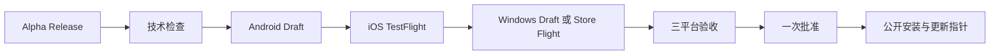

# 会迹（MeetTrace）GitHub Alpha 版本发布流程

> 状态：目标 Runbook；Windows job、签名与自动更新尚未实现，完成前不得按三平台流程发布
>
> 上游需求：[Android + iOS + Windows Alpha PRD V1.1](../product/Alpha_PRD_无登录版.md)

## 1. 最简发布模型

目标状态下，Actions 页面只需要手动运行 `Alpha Release`。Android、iOS、Windows 和最终公开均为该 YML 内的 job，不再保留独立发布 workflow 文件。当前 `.github/workflows/alpha-release.yml` 尚未包含 Windows，实施完成前以工作流真实行为为准，并禁止声称满足 PRD V1.1：

1. 输入发布标识，例如 `v1.0.0-alpha.1`；发布说明和 TestFlight 外部链接可不填。
2. 自动执行格式、静态分析和测试。
3. 自动构建正式签名的 Android arm64 APK，并暂存到不可见 Draft Release。
4. 自动构建签名 iOS IPA 并上传 TestFlight；IPA 不进入 GitHub。
5. 自动构建 Windows x64 MSIX。首选提交 SignPath Foundation 完成人工批准签名并暂存 Draft；若 SignPath 申请失败，提交 Microsoft Store Package Flight 并等待认证。
6. 工作流停在 `Approve and deploy public Alpha`。维护者安装三个候选并完成三平台验收。
7. 在 `github-release` Environment 点击 `Approve and deploy`，原 Draft 公开为 GitHub Pre-release，并在 Windows Store 兜底路线公开已认证 submission。
8. 最后原子更新公开更新 Manifest 与 `.appinstaller`；自动更新从不读取 Draft 或 Package Flight。

`expected_sha`、`gate_input_path` 和候选 run ID 均不需要填写。`docs/quality/alpha_release_input.json` 及 benchmark 工具仍可用于留存质量记录，但不会阻断发布工作流。

## 2. 版本与分发合同

| 项目 | 规则 |
|---|---|
| Release ID/tag | `v<pubspec marketing version>-alpha.<正整数>` |
| 三平台构建号 | 从已有 Release 候选清单的最大构建号连续 `+1`；同一 Draft 重跑复用原号，Android、iOS 与 Windows 始终一致 |
| Android | 正式签名、仅 `arm64-v8a`，公开附件名为 `meettrace-<release-id>-android-arm64.apk` |
| iOS | 仅 TestFlight，不上传 IPA 到 Actions Artifact 或 GitHub Release |
| Windows | Windows 10 22H2/11、仅 x64；首选 SignPath 签名 `meettrace-<release-id>-windows-x64.msix`，失败时使用 Microsoft Store MSIX |
| 候选身份 | Android、iOS 与 Windows 必须来自同一 annotated tag、提交 SHA、release ID 和构建号 |
| Release 资产 | SignPath 路线保留 Android APK、Windows MSIX 与 `candidate-manifest.json`；Store 路线不重复上传另一个 Windows 包身份；签名与包检查证据放在 Actions Artifact |
| 自动更新 | 单一 Alpha 频道；公开 Manifest 只在三平台批准后指向更高版本，不允许降级 |
| 首次启动资源 | Release 说明明确约下载 286.3 MB |

Draft 阶段同一发布标识可以重跑：工作流复用原 annotated tag、候选 SHA、已分配构建号和身份匹配的不可变 Android/Windows 候选，不覆盖已成功资产。新候选从所有已有 Draft/公开候选清单的最大构建号连续加一。Draft 一旦公开，标签、APK、MSIX 和候选清单不可覆盖；代码或二进制修复必须使用新的 Alpha 序号向前发布。

## 3. GitHub 配置

### Environments

| Environment | 人工审批 | 用途 |
|---|---|---|
| `android-alpha` | 无 | 保存 Android keystore 与证书摘要 |
| `testflight` | 无 | 保存 Apple distribution、profile、Team 与 API Key |
| `windows-alpha` | 无 | 保存 SignPath API 身份或 Microsoft Store 提交凭据；不保存可导出的代码签名私钥 |
| `github-release` | 一名 required reviewer；允许 self review | 唯一公开批准 |

所有 Environment 仅允许 `master`。如果旧配置给 `android-alpha`、`testflight` 或 `windows-alpha` 设置了 reviewer，需要移除，否则流程会出现额外审批。SignPath 自身要求的每次签名人工批准不等同于 GitHub Environment 的最终公开批准。

Android Secrets：

- `ANDROID_KEYSTORE_BASE64`
- `ANDROID_KEYSTORE_PASSWORD`
- `ANDROID_KEY_ALIAS`
- `ANDROID_KEY_PASSWORD`
- `ANDROID_SIGNING_CERT_SHA256`

iOS Secrets：

- `IOS_DISTRIBUTION_P12_BASE64`
- `IOS_DISTRIBUTION_P12_PASSWORD`
- `IOS_PROVISIONING_PROFILE_BASE64`
- `APPLE_TEAM_ID`
- `APP_STORE_CONNECT_KEY_ID`
- `APP_STORE_CONNECT_ISSUER_ID`
- `APP_STORE_CONNECT_API_KEY_P8_BASE64`

Windows 凭据名称在签名路线选定并完成供应商探针后固定：SignPath 路线只保存短期 API 身份和项目标识，由 SignPath HSM 持有私钥；Microsoft Store 路线只保存 Partner Center 提交所需的最小权限凭据。任何路线都不得把自签名 PFX、USB Token 私钥或可导出的正式私钥放入 Secrets。

### Rulesets 与权限

- `master` 要求 PR、线性历史，并阻止 force push/deletion。
- `v*` 标签禁止更新和删除；允许发布 Actions 身份创建。
- 仓库必须公开，Workflow permissions 允许 `GITHUB_TOKEN` 写入当前仓库 Release。
- SignPath 免费 OSS 签名要求仓库启用 MFA、公开 Code signing policy，并明确 committer、reviewer 与 approver；申请未通过前不得公开 Windows 安装包。

## 4. 运行与验收

在 `master` 的 Actions 页面打开 `Alpha Release`，只填写：

- `release_id`：必填，例如 `v1.0.0-alpha.1`；
- `release_notes`：可选；
- `ios_testflight_external_url`：可选，格式为 `https://testflight.apple.com/join/<code>`；
- `resume_run_id`：仅在 Android、iOS、Windows 候选均成功而最终公开失败时填写原运行 ID；正常发布留空。

Android job 成功后，仓库维护者可从 Draft Release 下载确切 APK；iOS job 成功后从 TestFlight 安装同一候选；Windows 使用 Draft MSIX 或指定 Store Package Flight 安装。完成 AT-01～AT-26 的适用项后，回到等待中的 `Approve and publish` job 批准公开。自动化会再次校验：

- annotated tag、release ID、marketing version 与 candidate SHA；
- Android、iOS 与 Windows 候选证据属于指定运行和同一 SHA、版本与构建号；复用的不可变候选可来自更早的暂存运行；
- Draft APK/MSIX 或 Store submission 的名称、包身份、字节数、SHA-256 和签名证据未变化；
- Release 仍是 Draft prerelease。
- 公开更新 Manifest 当前仍指向旧版本，且新指针只会在本次批准后写入。

任一技术校验失败都不会公开 Draft。人工质量结论由批准人负责，不再由 JSON 门禁判定。

## 5. 后补 TestFlight 外部链接

链接未获批时可先公开，Release 说明显示“iOS TestFlight 外部测试链接：待提供”。获批后：

1. 再次运行 `Alpha Release`；
2. 使用完全相同的 `release_id`；
3. 填写外部测试链接，可选填新的补充说明；
4. 通过同一个 `github-release` 批准。

工作流会自动进入 `metadata` 模式，验证现有公开 APK、MSIX/Store 身份和候选清单后只更新说明，不运行构建，也不覆盖任何资产或更新指针。

## 6. 撤回与恢复

- Draft 阶段构建失败：修复 Secrets、Apple 配置或工作流后，用同一发布标识重跑。
- Android、iOS 与 Windows 均成功、仅最终公开失败：修复工作流后新建一次手动运行，填写同一 `release_id` 和原 `resume_run_id`。恢复模式只复核原候选并进入公开批准，不重新构建、不重复签名，也不重复上传 TestFlight/Store Flight。
- SignPath 拒绝项目申请：停止 GitHub MSIX 路线，固定 Microsoft Store 包身份并完成 Store 基线/Flight；不得在同一版本临时改用自签名包。
- 已公开严重问题：保留 Release、tag、APK 和 MSIX/Store submission，在说明与公开更新 Manifest 顶部标记“已撤回，不建议安装”；不得让新安装自动降级。
- 修复版本：合并新提交，提高 Alpha 序号并重新运行。
- 不删除、不移动、不覆盖已公开版本的身份或资产。

## 7. 发版前检查

- [ ] `android-alpha` 已配置全部 Secrets，且没有 required reviewer。
- [ ] `testflight` 已配置全部 Secrets，且没有 required reviewer。
- [ ] `windows-alpha` 已配置选定路线的最小权限凭据，且没有 required reviewer 或可导出私钥。
- [ ] `github-release` 已配置一名 required reviewer，并允许 self review。
- [ ] `master` 与 `v*` Ruleset 已启用。
- [ ] Workflow permissions 允许 Actions 写 Release。
- [ ] Actions 页面只有 `Alpha Release` 作为手动正式发版入口。
- [ ] SignPath 已接受项目并完成签名策略配置，或 Microsoft Store 兜底路线已完成包身份和 Flight 验证。
- [ ] 当前候选已按[质量与验收](../quality/README.md)完成三平台适用项，再批准公开。
- [ ] 公开更新 Manifest 与 `.appinstaller` 仍指向旧版，且更新动作位于最终批准之后。
