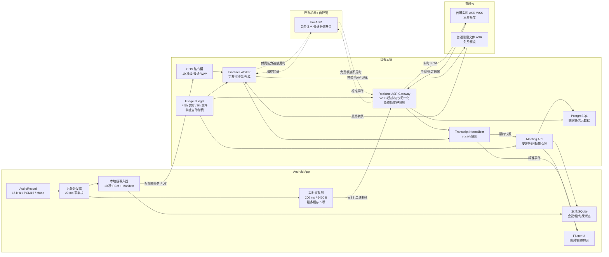
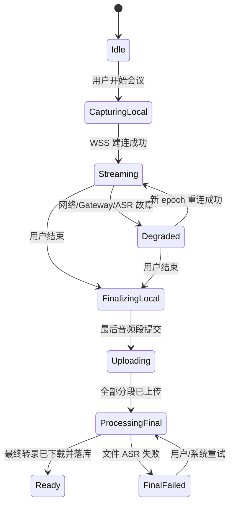

# 研会 AI：云端实时转录技术方案

> **历史方案，不再作为 Alpha 默认实现。** 2026-07-23 起，转录主链改为 `Qwen3-ASR-0.6B INT8 + sherpa-onnx` 端侧离线方案。当前有效方案见 [Qwen3-ASR 离线转录技术方案](./Qwen3-ASR离线转录技术方案.md)。本文仅保留为云端备选路线参考。

> 面向 Android 线下面对面会议｜两周封闭 Alpha

| 项目 | 内容 |
|---|---|
| 版本 | V0.1 |
| 日期 | 2026-07-23 |
| 对应 PRD | `研会_AI_Alpha_PRD_无登录版.md` |
| 推荐方案 | Android 原生采集 + 自有 WebSocket ASR Gateway + 腾讯云普通引擎免费额度 |
| 音频事实源 | Android 本地分段 PCM |
| 实时协议 | App ↔ Gateway：WSS；Gateway ↔ ASR：WSS |
| 最终转录 | 免费文件 ASR优先；增值能力收费时切换自托管 FunASR |
| 身份模式 | 无用户账号；安装凭证 + 单场会议短期令牌 |
| 成本原则 | 不自动进入后付费；免费额度接近上限时停止云端实时转录 |

## 0. 结论

Alpha 推荐采用“免费额度优先、双链路、双结果”架构：

1. **录音链路：**Android 使用 `AudioRecord` 采集 16 kHz、16-bit、单声道 PCM，持续写入本地 10 秒音频段；此链路不等待网络。
2. **实时链路：**同一份 PCM 每 200 ms 形成一个 6400 字节帧，经自有 WebSocket Gateway 按实时速率转发给腾讯云普通实时 ASR；不启用无免费额度的大模型或实时说话人分离。
3. **最终链路：**本地 10 秒音频段异步上传对象存储；会议结束后由云端合成完整 WAV，优先提交普通文件 ASR。若说话人分离会产生额外费用，则切换自托管 FunASR完成最终转录和分离。
4. **结果规则：**实时文本只用于会中展示；文件 ASR 结果整体替换实时文本，作为 AI 总结、证据回溯和导出的唯一输入。
5. **故障规则：**网络、Gateway 或 ASR 故障只允许影响实时字幕，不允许阻塞或破坏本地录音。

### 0.1 为什么选“自有 Gateway”

腾讯云实时 ASR 使用 SecretKey 生成 WebSocket 签名。供应商官方会议示例同样采用“客户端 → 后端 → 腾讯云”的双层 WebSocket 桥接，并明确指出密钥不能暴露在前端。

自有 Gateway 还提供以下能力：

- 不在 APK 中存放云厂商永久密钥；
- 统一无账号模式下的安装凭证、限流和任务隔离；
- 将供应商返回转换成稳定的产品协议；
- 集中处理重连、错误码、指标和审计；
- 后续替换 ASR 供应商时不修改客户端协议；
- 避免客户端直接依赖云厂商 SDK 的结果模型和版本。

### 0.2 明确代价

实时和文件 ASR 会分别消耗各自额度，相当于每分钟会议产生两次识别用量。PCM 经过 Gateway 中转也会产生一份额外网络流量。

腾讯云当前普通实时识别每月免费 5 小时、普通录音文件识别每月免费 10 小时；大模型实时/文件识别和实时说话人分离没有免费额度。两周 Alpha 不开启后付费，Gateway 在免费额度接近上限时硬停止新的云端实时会话。

20 场会议若平均 15 分钟，实时识别总量正好为 5 小时；若平均 30 分钟，则实时识别需要 10 小时，不能完全落在免费额度内。免费优先时必须缩短会议、减少场次，或将溢出流量切换到自托管 FunASR。

---

## 1. 当前工程现状

当前仓库仍是 Flutter 默认脚手架：

- `pubspec.yaml` 只有 Flutter 和图标依赖；
- `lib/main.dart` 仍是默认计数器页面；
- Android Manifest 尚未声明麦克风、网络、通知和前台服务权限；
- 尚无原生录音服务、本地数据库、上传队列或 WebSocket 客户端；
- 尚无后端目录和云端部署配置。

因此，两周计划必须先打通录音、实时转录和最终转录的技术主链，不能同时建设通用客户端架构或复杂业务模块。

---

## 2. 设计目标

### 2.1 功能目标

- 会中展示实时临时转录；
- 正常网络下首字延迟 P95 不超过 3 秒；
- 实时服务故障时本地录音继续；
- 断网恢复后继续新的实时会话，并补传本地音频；
- 会议结束后生成完整最终转录；
- 最终转录带句级/词级时间戳和说话人编号；
- 30 分钟会议结束后 5 分钟内生成最终转录；
- 最终结果可以定位回本地录音时间点。

### 2.2 技术目标

- 录音线程永不等待网络；
- 云端密钥永不进入 APK；
- 所有上传和结束操作可幂等重试；
- 每个音频段可独立校验、上传和恢复；
- 实时结果采用 upsert，不通过字符串追加猜测状态；
- 最终转录以完整快照覆盖实时结果；
- 云端不长期保存用户会议历史；
- 日志和指标不包含完整音频或完整转录。

### 2.3 非目标

- 不做端侧 ASR；
- 不做离线实时字幕；
- 不跨 WebSocket 会话恢复历史实时字幕；
- 不在实时链路追求逐字无损；
- 不直接把云厂商 SDK 集成到 Flutter UI；
- 不建设账号、团队、多端同步或云端会议工作区；
- 不在 Alpha 中实现多云自动容灾；
- 不把实时说话人标签视为最终身份。

---

## 3. 技术选型

### 3.1 Alpha 默认供应商：腾讯云普通 ASR

选择依据：

- 实时接口采用 WSS，支持 16 kHz/16-bit/单声道 PCM；
- 官方建议每 200 ms 发送 200 ms 音频，即 6400 字节 PCM；
- 返回结果包含句子序号、起止时间、非稳态/稳态状态和词级时间戳；
- 文件 ASR 支持音频 URL、时间戳和说话人分离；
- 官方提供 Go 服务端 SDK与“后端 WebSocket 桥接”示例；
- 对象存储可使用短期预签名 URL 进行指定对象上传。

免费模式只使用计费页明确标注“有免费额度”的普通实时识别和普通录音文件识别。以下能力默认关闭：

- 大模型 1.0/2.0 实时识别；
- 大模型 1.0/2.0 录音文件识别；
- 实时说话人分离；
- 语义分段；
- 口语转书面语；
- 角色分离；
- 情绪识别。

> 供应商选择必须以 Day 1 的真实会议音频评测和控制台实际扣费项目为最终依据。官方功能支持不等于免费，也不等于远场识别效果达标。

### 3.2 推荐技术栈

| 层 | 推荐实现 | 原因 |
|---|---|---|
| Flutter UI | Flutter/Dart | 当前工程基础 |
| 音频采集 | Kotlin `AudioRecord` + Flutter Platform Channel | 对音频线程、前台服务和设备切换具有直接控制 |
| 本地状态 | SQLite/Drift | 会议、音频段、上传状态和转录快照可恢复 |
| 安全存储 | Android Keystore 封装 | 保存安装凭证和会议短期令牌 |
| 实时 Gateway | Go 单体服务 | 官方会议示例和服务端 SDK为 Go，WebSocket 并发模型简单 |
| 云端元数据 | PostgreSQL | 保存临时任务、段清单、处理状态和幂等键 |
| 对象存储 | 腾讯云 COS 私有桶 | 承载本地音频段和合成后的最终 WAV |
| 最终转录 | 腾讯云普通录音文件识别；FunASR 备用 | 优先消耗免费额度，避免增值功能自动计费 |
| 活跃会话状态 | Gateway 内存；必要时 Redis | Alpha 单实例足够，Redis 作为扩展点 |
| 后台任务 | Go 进程内 worker | Alpha 流量低；通过数据库状态保证任务可重入 |

### 3.3 免费额度与硬限制

根据腾讯云当前官方计费页：

| 服务 | 每月免费额度 | Alpha 策略 |
|---|---:|---|
| 普通实时语音识别 | 5 小时 | 主实时链路 |
| 普通录音文件识别 | 10 小时 | 主最终转录链路 |
| 大模型实时识别 | 无 | 禁止启用 |
| 大模型录音文件识别 | 无 | 禁止启用 |
| 实时说话人分离 | 无 | 禁止启用 |

服务端增加 `usage_budget`：

```text
realtime_free_hard_stop = 4.5 h
batch_free_hard_stop    = 9.0 h
warning_threshold       = 80%
```

预留 10% 额度用于重试、测试误差和控制台统计延迟。

达到实时硬停止线后：

- 不再创建新的腾讯云实时会话；
- App 仍正常本地录音；
- UI 显示“本月免费实时额度已用尽，会后仍可生成转录”；
- 如果 FunASR 可用，Gateway 自动切换到 `funasr-free`；
- 如果 FunASR 不可用，不自动进入后付费。

达到文件识别硬停止线后：

- 优先切换 FunASR 最终转录；
- FunASR 不可用时保留本地音频并提示稍后处理；
- 不自动提交付费文件 ASR。

控制台侧：

- 确认后付费已关闭；
- 设置免费额度 50%/80%/90% 告警；
- 使用独立子账号和独立项目；
- 禁止拥有启用付费大模型或增值识别的权限。

### 3.4 开源免费备用：FunASR

FunASR 是开源语音识别工具包，官方仓库提供流式 Paraformer、VAD、标点、时间戳和说话人相关模型，也提供服务化部署方式。

推荐组件：

| 能力 | 模型/组件 |
|---|---|
| 流式中文识别 | `paraformer-zh-streaming` |
| 最终中文识别 | `paraformer-zh` |
| VAD | `fsmn-vad` |
| 标点 | `ct-punc` |
| 时间戳 | `fa-zh` |
| 说话人 | `cam++` 或 FunASR 支持的 diarization pipeline |

注意：

- 开源软件免费不代表云计算资源免费；
- 只有已有可用电脑、GPU 或服务器时，FunASR 才能做到接近零新增现金成本；
- 自托管会增加模型下载、部署、并发、监控和故障恢复工作；
- 两周 Alpha 先在开发机上部署为溢出和最终说话人分离备用，不把它当作高可用生产服务；
- 所有 FunASR能力必须通过同一 Provider Adapter 暴露，客户端不感知供应商变化。

### 3.5 不推荐的首版方案

#### App 直接连接云厂商

不推荐。原因：

- 永久密钥不能进入 APK；
- 即使使用临时凭证，客户端仍与供应商协议强耦合；
- 难以统一安装凭证、限流、指标和返回结构；
- 供应商切换成本高；
- 客户端需要处理更多云厂商特有错误。

#### 只使用实时 ASR 结果作为最终稿

不推荐。实时流断线后无法无损恢复，且中间文本、分句和说话人结果可能变化，不能满足最终总结和证据链要求。

#### 会议结束后一次性上传完整文件

不推荐。30 分钟 PCM 约 57.6 MB，弱网下一次性上传失败的恢复成本高；App 异常退出时也更难判断已安全上传的范围。

---

## 4. 总体架构



### 4.1 不变量

1. `AudioRecord → 本地段写入器` 是最高优先级路径。
2. 网络队列满时丢弃实时帧，不丢弃本地音频。
3. Gateway 不在内存中保存整场音频。
4. 未确认所有本地音频段上传完成前，不提交最终文件 ASR。
5. AI 总结只能读取最终转录版本。
6. 云端最终转录下载到设备并落库后，才允许进入云端清理流程。

---

## 5. Android 音频采集

### 5.1 采集参数

| 参数 | Alpha 值 |
|---|---|
| Sample rate | 16000 Hz |
| Bit depth | PCM signed 16-bit little-endian |
| Channels | Mono |
| 采集粒度 | 20 ms，640 字节 |
| 实时发送粒度 | 200 ms，6400 字节 |
| 本地分段 | 10 秒，320000 字节原始 PCM |
| 本地段命名 | `{meeting_id}/{segment_index:06d}.pcm` |
| 校验 | SHA-256 |

计算：

```text
16000 samples/s × 2 bytes × 1 channel = 32000 bytes/s
200 ms = 6400 bytes
10 s = 320000 bytes
30 min = 57.6 MB
```

### 5.2 原生模块边界

建议新增 Kotlin 原生模块：

```text
android/app/src/main/kotlin/.../audio/
├── MeetingRecordingService.kt
├── PcmCaptureEngine.kt
├── SegmentWriter.kt
├── RealtimeFrameBuffer.kt
├── AudioDeviceMonitor.kt
└── RecordingBridge.kt
```

职责：

- `MeetingRecordingService`：管理录音生命周期和前台通知；
- `PcmCaptureEngine`：创建、启动和读取 `AudioRecord`；
- `SegmentWriter`：将 20 ms 块写入 10 秒段并原子提交；
- `RealtimeFrameBuffer`：聚合为 200 ms 实时帧；
- `AudioDeviceMonitor`：监听麦克风设备、静音和采集配置变化；
- `RecordingBridge`：通过 MethodChannel/EventChannel 与 Flutter 通信。

### 5.3 缓冲策略

`AudioRecord.getMinBufferSize()` 只给出能够创建录音对象的最小缓冲区，不保证系统负载下不会 overrun。

建议：

```text
audioRecordBufferBytes = max(getMinBufferSize(...)*2, 25600)
```

其中 25600 字节约为 800 ms PCM。采集线程每次读取 20 ms，不在采集线程执行网络、数据库、哈希或 UI 操作。

### 5.4 本地段提交

每个 10 秒段采用两阶段提交：

1. 写入 `000001.pcm.tmp`；
2. `flush` 并更新段元数据；
3. 计算 SHA-256；
4. 原子重命名为 `000001.pcm`；
5. SQLite 将段状态从 `WRITING` 更新为 `READY_TO_UPLOAD`。

最后不足 10 秒的段在会议结束时按实际字节数提交。

Manifest 至少包含：

```json
{
  "meeting_id": "m_01...",
  "sample_rate": 16000,
  "channels": 1,
  "encoding": "pcm_s16le",
  "segment_ms": 10000,
  "last_committed_segment": 17,
  "captured_duration_ms": 179840,
  "capture_started_at_ms": 1784790000000
}
```

### 5.5 音频源选择

Day 1 使用真实会议录音对以下输入源做 A/B 测试：

- `MediaRecorder.AudioSource.VOICE_RECOGNITION`
- 设备支持时的 `MediaRecorder.AudioSource.UNPROCESSED`

选择标准：

- 远场人声字错率；
- 回声和噪声表现；
- 不同厂商设备一致性；
- 是否出现过度降噪、断字或音量泵动。

不能只凭单人近讲测试决定输入源。

### 5.6 前台服务

如果 Alpha 允许用户锁屏或切换 App，录音必须运行在 Android microphone foreground service 中：

- 声明 `RECORD_AUDIO`；
- 声明 `FOREGROUND_SERVICE`；
- Android 11+ 声明 `foregroundServiceType="microphone"`；
- Android 14+ 声明 `FOREGROUND_SERVICE_MICROPHONE`；
- 必须由可见页面在用户点击开始后启动；
- 必须持续显示不可误解的录音通知。

如果两周内没有完整验证后台/锁屏录音，则产品只能宣称“前台录音”。

### 5.7 麦克风竞争与设备切换

Android 可能因来电、语音助手、蓝牙设备或其他 App 抢占麦克风而改变采集配置或返回静音。

必须：

- 注册音频录制配置变化回调；
- 监控读取字节数和音量是否长时间为零；
- 记录输入设备变化；
- UI 显示“麦克风被占用/输入设备已变化”；
- 不把全零音频当作正常静音无限上传。

---

## 6. App 与 Gateway 的实时协议

### 6.1 建立会议

```http
POST /v1/meetings
Authorization: Bearer <installation_token>
Idempotency-Key: <uuid>
Content-Type: application/json

{
  "client_meeting_id": "01J...",
  "capture": {
    "sample_rate": 16000,
    "channels": 1,
    "encoding": "pcm_s16le",
    "frame_ms": 200
  }
}
```

响应：

```json
{
  "meeting_id": "m_01J...",
  "meeting_token": "<short-lived-token>",
  "realtime_url": "wss://api.example.com/v1/realtime",
  "token_expires_at": "2026-07-23T16:30:00Z",
  "max_duration_sec": 3600
}
```

规则：

- `installation_token` 在首次启动时匿名激活获得；
- `meeting_token` 只允许访问单个 `meeting_id`；
- Alpha 令牌有效期建议 2 小时；
- Token 放在 `Authorization` Header，不放入 URL Query，避免代理日志泄露；
- `Idempotency-Key` 保证重试不会创建重复会议。

### 6.2 WebSocket 开始事件

```json
{
  "type": "stream.start",
  "protocol_version": 1,
  "meeting_id": "m_01J...",
  "connection_epoch": 1,
  "first_frame_seq": 0,
  "capture_started_at_ms": 1784790000000,
  "last_received_event_seq": 0
}
```

Gateway 返回：

```json
{
  "type": "stream.accepted",
  "event_seq": 1,
  "connection_epoch": 1,
  "server_time_ms": 1784790000150,
  "provider": "tencent",
  "provider_session_id": "redacted"
}
```

### 6.3 二进制音频帧

每个 WebSocket binary message：

```text
Offset  Size  Field
0       4     Magic = "MTLY"
4       1     Protocol version = 1
5       1     Flags
6       2     connection_epoch, uint16
8       4     frame_seq, uint32
12      8     capture_offset_ms, uint64
20      4     payload_length, uint32
24      N     PCM payload，Alpha 固定 6400 bytes
```

约束：

- `frame_seq` 在一场会议中单调递增，不因重连归零；
- `capture_offset_ms` 相对本场录音开始时间；
- Gateway 根据 `frame_seq` 丢弃重复帧；
- 同一连接中 WebSocket 保序，不额外重排；
- 如果帧间隔异常，Gateway 记录 gap，不阻塞后续帧；
- Gateway 转发给供应商时保持 1:1 实时速率。

### 6.4 标准转录事件

```json
{
  "type": "transcript.upsert",
  "event_seq": 42,
  "meeting_id": "m_01J...",
  "connection_epoch": 1,
  "segment_id": "rt:1:17",
  "revision": 3,
  "start_ms": 12400,
  "end_ms": 15880,
  "text": "我们先确认一下交付时间。",
  "is_final": false,
  "speaker_label": "S1",
  "source": "realtime"
}
```

客户端合并规则：

- `segment_id` 是 upsert 主键；
- 同一 `segment_id` 只接受更大的 `revision`；
- `is_final=false` 可以被替换；
- `is_final=true` 后实时层不再修改该段；
- `event_seq` 用于识别服务端事件丢失；
- App 不把新文本盲目追加到旧字符串。

### 6.5 心跳

- App 每 10 秒发送 `stream.ping`；
- Gateway 在 5 秒内返回 `stream.pong`；
- 连续 20 秒无响应，App 关闭连接并重连；
- 正常录音时音频帧本身也是活跃信号；
- 静音期间仍发送真实静音 PCM，不能停止超过供应商允许的等待时间。

### 6.6 正常结束

App：

```json
{
  "type": "stream.end",
  "last_frame_seq": 8999,
  "captured_duration_ms": 1800000
}
```

Gateway：

1. 将 `{"type":"end"}` 发送给供应商；
2. 等待供应商 `final=1`；
3. 发送 `stream.closed`；
4. 关闭实时连接；
5. 会议进入 `WAITING_SEGMENTS`。

---

## 7. Gateway 与腾讯云实时 ASR

### 7.1 供应商参数

Alpha 建议：

| 参数 | 建议 |
|---|---|
| 音频 | 16 kHz / 16-bit / mono PCM |
| 数据包 | 200 ms，6400 字节 |
| 引擎 | 免费普通引擎 `16k_zh` |
| 说话人分离 | 实时层关闭 |
| 分句策略 | 单句模式优先，降低稳定句等待时间 |
| VAD | 开启 |
| 标点 | 保留 |
| 语气词过滤 | 实时层关闭 |
| 领域增强 | 通用会议先保持默认 |

免费模式下，实时 UI 只显示连续字幕，不显示说话人编号。说话人标签只来自会后最终转录。

如果 `16k_zh` 对中英混合、口音或远场会议的效果不达标：

1. 先评测 FunASR 流式模型；
2. 再评估是否缩小 Alpha 会议语言范围；
3. 最后才申请开启付费大模型；
4. 未经明确批准不得在服务端切换到收费引擎。

### 7.2 Provider Adapter

Gateway 内部禁止直接向业务层暴露腾讯云结构。

```go
type RealtimeASR interface {
    Start(ctx context.Context, cfg SessionConfig) error
    SendPCM(frame AudioFrame) error
    Events() <-chan ProviderEvent
    End(ctx context.Context) error
    Close() error
}

type ProviderEvent struct {
    ProviderSegmentID string
    Revision          int
    StartMS           int64
    EndMS             int64
    Text              string
    Stable            bool
    SpeakerID         string
    ProviderCode      string
}
```

适配器负责：

- WebSocket 签名；
- `voice_id` 生命周期；
- 供应商 `slice_type` 到 `is_final` 的映射；
- 供应商句子序号到 `segment_id` 的映射；
- 供应商时间戳加上当前 `connection_epoch` 的全局偏移；
- 错误码归一化；
- SecretKey 只从服务端 Secret Manager 或环境注入。

### 7.3 实时时间轴

每次重连都会创建新的供应商 `voice_id`。供应商时间戳会从新会话的零点重新计算，因此 Gateway 必须维护：

```text
global_start_ms = epoch_base_offset_ms + provider_start_ms
global_end_ms   = epoch_base_offset_ms + provider_end_ms
```

`epoch_base_offset_ms` 取新连接第一帧的 `capture_offset_ms`。

实时转录段主键：

```text
rt:{connection_epoch}:{provider_sentence_index}
```

最终文件 ASR 完成后不再复用这些实时段 ID。

---

## 8. 重连、降级与背压

### 8.1 客户端状态机



### 8.2 重连策略

```text
0.5 s → 1 s → 2 s → 5 s → 10 s（上限）
```

加 0–20% 随机抖动，避免大量客户端同时重连。

每次重连：

- `connection_epoch += 1`；
- 创建新的供应商 `voice_id`；
- 从当前实时帧开始发送；
- 不向实时 ASR 快速重放断线积压；
- UI 在断线区间显示实时字幕缺口；
- 完整缺口由会后文件 ASR 覆盖。

### 8.3 为什么不回放实时积压

实时 ASR要求按接近 1:1 的速度发送音频。快速发送积压可能触发服务端错误；过长发送间隔也可能使服务端主动断开。

因此：

- 本地音频必须完整保存；
- 实时链路追求“现在能看”；
- 最终链路负责“完整且可核验”；
- 两条链路不能混为同一可靠性等级。

### 8.4 背压策略

实时帧队列最多缓存 5 秒：

```text
25 frames × 200 ms = 5 s
25 × 6400 bytes = 160 KB / session
```

队列满时：

1. 标记实时链路 `DEGRADED_BACKPRESSURE`；
2. 丢弃最旧的未发送实时帧；
3. 不阻塞采集线程；
4. 不删除对应本地段；
5. 记录 `realtime_dropped_frames_total`。

### 8.5 错误分类

| 错误 | 用户状态 | 自动动作 |
|---|---|---|
| 网络不可用 | 实时转录暂停，录音继续 | 指数退避重连 |
| Gateway 连接失败 | 实时转录暂停，录音继续 | 切换新 epoch |
| 供应商鉴权失败 | 实时转录不可用，录音继续 | 不无限重试，告警服务端配置 |
| 供应商等待音频超时 | 实时转录已重启 | 创建新 `voice_id` |
| 实时帧队列溢出 | 实时字幕可能缺失 | 丢实时帧，保本地音频 |
| 本地写入失败 | 录音失败 | 立即阻断并安全封存已有段 |
| 存储空间不足 | 即将停止录音 | 提前预警，安全结束 |

---

## 9. 音频段上传

### 9.1 上传流程

每个 10 秒段独立上传：

```http
POST /v1/meetings/{meeting_id}/segments/{segment_index}/upload-intent
Authorization: Bearer <meeting_token>
Idempotency-Key: <meeting_id>:<segment_index>:<sha256>

{
  "byte_length": 320000,
  "sha256": "...",
  "duration_ms": 10000
}
```

服务端返回绑定到精确对象 Key 的短期预签名 PUT URL：

```json
{
  "object_key": "meetings/ab/cd/m_01J.../000017.pcm",
  "upload_url": "https://...",
  "expires_in_sec": 600
}
```

上传成功后：

```http
POST /v1/meetings/{meeting_id}/segments/{segment_index}/complete
Authorization: Bearer <meeting_token>
Idempotency-Key: <meeting_id>:<segment_index>:<sha256>
```

### 9.2 为什么上传小对象

对象存储的预签名简单上传本身不提供分块续传。将会议拆成 10 秒小对象可以：

- 每段独立重试；
- 避免完整 57.6 MB 文件失败后重传；
- App 异常终止后准确恢复；
- 服务端按段校验完整性；
- 上传进度与本地段清单一致。

### 9.3 服务端完整性检查

收到会议结束请求：

```json
{
  "total_segments": 180,
  "last_segment_bytes": 128000,
  "captured_duration_ms": 1800000,
  "manifest_sha256": "..."
}
```

服务端必须确认：

- 段索引为 `0..total_segments-1`，没有缺号；
- 每段对象存在；
- 对象长度与声明一致；
- SHA-256 一致；
- 总字节数与录音时长误差在允许范围内；
- 最后一个段允许短于 10 秒；
- 同一段不同哈希视为冲突，不静默覆盖。

缺段时返回：

```json
{
  "status": "WAITING_SEGMENTS",
  "missing_segments": [17, 18, 93]
}
```

---

## 10. 会后最终转录

### 10.1 音频合成

Finalizer Worker：

1. 按 `segment_index` 顺序读取 PCM 对象；
2. 以流式方式拼接，不把整场音频载入内存；
3. 写入标准 WAV Header；
4. 校验时长、采样率、声道数和数据长度；
5. 将完整 WAV 保存到私有对象存储；
6. 生成仅供 ASR 拉取的短期签名 URL；
7. 提交文件 ASR 任务。

### 10.2 文件 ASR 参数

Alpha 建议：

| 参数 | 值 |
|---|---|
| Engine | 免费普通引擎 `16k_zh` |
| ChannelNum | 1 |
| SourceType | URL |
| SpeakerDiarization | 控制台确认不触发增值计费后设为 1；否则使用 FunASR |
| SpeakerNumber | 0，自动 |
| Result format | 词级时间戳 + 标点 |
| 语气词过滤 | 关闭，保留事实原文 |
| 临时热词 | Alpha 默认关闭，作为后续优化 |

不建议首版使用“口语转书面语”结果作为最终原文，因为改写可能降低证据逐字可核验性。书面化应由 AI 总结层完成，最终转录应尽量忠实。

提交任务前，Budget Guard 必须检查：

- 当前月份普通文件识别已用时长；
- 请求引擎是否属于免费产品；
- 请求参数是否启用了增值能力；
- 后付费是否关闭；
- 预计会议时长是否会跨越硬停止线。

任一检查不通过时，任务进入 `WAITING_FREE_BACKEND`，由 FunASR Worker 接管；FunASR 不可用时保留音频等待，不自动产生费用。

### 10.3 任务处理

云端状态：

```text
WAITING_SEGMENTS
→ ASSEMBLING_AUDIO
→ SUBMITTING_BATCH_ASR
→ BATCH_ASR_RUNNING
→ NORMALIZING
→ FINAL_READY
→ DELIVERED_TO_DEVICE
→ CLEANUP_PENDING
→ CLEANED
```

文件 ASR 为异步任务。Alpha 可以：

- 每 2 秒轮询一次，30 秒后退避到每 5 秒；
- 最大等待 5 分钟；
- 超时后状态变为 `FINAL_DELAYED`，而不是立即判定数据丢失；
- 对可重试错误最多自动重试 3 次；
- 使用业务 `meeting_id` 作为内部唯一标识，不依赖供应商 TaskId 唯一性。

### 10.4 最终转录标准模型

```json
{
  "meeting_id": "m_01J...",
  "version": 1,
  "source": "batch",
  "audio_duration_ms": 1800000,
  "segments": [
    {
      "id": "final:000001",
      "start_ms": 1200,
      "end_ms": 4380,
      "speaker_label": "S1",
      "text": "我们先确认今天的目标。",
      "words": [
        {
          "text": "我们",
          "start_ms": 1200,
          "end_ms": 1540
        }
      ]
    }
  ]
}
```

### 10.5 替换规则

最终转录就绪时：

- 不尝试逐句修补实时文本；
- 服务端生成一个完整 `final_transcript_version`；
- App 在事务中保存最终快照；
- UI 从“临时转录”切换到“最终转录”；
- 实时段可以保留在调试环境，用户界面不再展示；
- AI 总结任务只接受最终版本号；
- 证据 ID 只引用 `final:*` 段。

---

## 11. 无账号鉴权与安全

### 11.1 安装凭证

首次启动：

```http
POST /v1/installations/activate

{
  "installation_id": "<random-128-bit-id>",
  "app_version": "1.0.0",
  "platform": "android"
}
```

返回：

```json
{
  "installation_token": "<opaque-or-jwt-token>",
  "expires_at": "2026-08-22T00:00:00Z"
}
```

规则：

- `installation_id` 随机生成，不读取 IMEI、手机号、广告 ID 或联系人；
- Token 保存到 Android Keystore；
- Token 只代表一次 App 安装，不代表自然人身份；
- 每个安装默认只允许 1 个活跃实时会议；
- 可按安装和 IP 限流；
- Alpha 不支持安装凭证恢复。

### 11.2 单场会议令牌

`meeting_token` 权限限定为：

- 连接该会议的实时 Gateway；
- 申请该会议的段上传 URL；
- 上报段完成；
- 结束该会议；
- 查询和下载该会议最终结果；
- 删除该会议云端临时数据。

不能：

- 枚举其他会议；
- 上传到其他对象 Key；
- 获取云厂商密钥；
- 读取其他安装的数据。

### 11.3 云厂商密钥

- 永久 SecretId/SecretKey 只存在于服务端 Secret Manager；
- APK、Flutter assets、日志和崩溃报告中不得出现；
- Gateway 为每个供应商会话生成独立签名；
- COS 预签名 URL 绑定精确对象 Key、HTTP Method 和短过期时间；
- 对象桶保持私有读写；
- 最终音频 URL 只允许 ASR 服务在短时间内读取。

### 11.4 数据最小化

- 对象 Key 不包含会议标题、设备名称或其他可读信息；
- 日志只记录 ID、字节数、时延、错误码和状态；
- 不记录完整转录；
- 错误采样中的文本默认关闭；
- 调试环境需要文本时必须显式开启并设置短期清理；
- 云端结果确认下发后进入 7 天内清理流程。

---

## 12. 云端数据模型

### 12.1 meetings

| 字段 | 类型 | 说明 |
|---|---|---|
| id | UUID/ULID | 云端会议 ID |
| installation_hash | string | 安装凭证哈希 |
| client_meeting_id | string | 客户端幂等 ID |
| state | enum | 云端处理状态 |
| capture_started_at | timestamp | 采集开始 |
| captured_duration_ms | bigint | 客户端声明时长 |
| total_segments | int | 最终段数 |
| final_transcript_version | int | 最终转录版本 |
| created_at | timestamp | 创建时间 |
| expires_at | timestamp | 云端清理截止时间 |

### 12.2 audio_segments

| 字段 | 类型 | 说明 |
|---|---|---|
| meeting_id | FK | 会议 |
| segment_index | int | 从 0 递增 |
| object_key | string | 私有对象 Key |
| byte_length | int | 字节数 |
| duration_ms | int | 时长 |
| sha256 | string | 内容校验 |
| state | enum | INTENT/UPLOADED/VERIFIED |
| created_at | timestamp | 创建时间 |

唯一键：

```text
(meeting_id, segment_index)
```

### 12.3 transcript_events

实时事件可以只保留最近窗口或仅用于调试。至少记录：

- `meeting_id`
- `event_seq`
- `connection_epoch`
- `segment_id`
- `revision`
- `start_ms`
- `end_ms`
- `is_final`
- `speaker_label`
- `text`（Alpha 可暂存，结果下发后清理）

### 12.4 processing_jobs

- `job_type`
- `meeting_id`
- `idempotency_key`
- `state`
- `attempt`
- `provider_task_id`
- `next_attempt_at`
- `last_error_code`
- `created_at`
- `updated_at`

唯一键：

```text
(job_type, idempotency_key)
```

---

## 13. 幂等与一致性

### 13.1 必须幂等的操作

- 创建会议；
- 申请同一段上传；
- 确认同一段上传完成；
- 结束会议；
- 合成音频；
- 提交文件 ASR；
- 保存最终转录；
- 下发最终转录；
- 删除云端数据。

### 13.2 关键规则

- 同一 `meeting_id + segment_index + sha256` 重试返回同一结果；
- 同一段索引出现不同哈希时返回冲突；
- `finish` 可以重复调用，但 `total_segments` 不能静默变化；
- 文件 ASR 提交使用稳定幂等键，避免重复计费；
- 最终转录按版本写入，不覆盖更高版本；
- App 保存最终快照和更新会议状态必须在同一 SQLite 事务内完成；
- 客户端确认已落库前，服务端不得立即删除最终结果。

---

## 14. 可观测性

### 14.1 核心指标

| 指标 | 说明 |
|---|---|
| `recording_started_total` | 本地录音成功启动 |
| `audio_write_failure_total` | 本地音频写入失败 |
| `realtime_first_text_ms` | 首个临时文字延迟 |
| `realtime_ws_reconnect_total` | 每场会议重连次数 |
| `realtime_dropped_frames_total` | 因背压丢弃的实时帧 |
| `realtime_frame_gap_ms` | 实时帧缺口 |
| `provider_error_total{code}` | ASR错误码 |
| `segment_upload_latency_ms` | 音频段上传耗时 |
| `segment_retry_total` | 段上传重试 |
| `final_asr_latency_ms` | 文件 ASR耗时 |
| `final_pipeline_latency_ms` | 结束会议到最终转录可用 |
| `live_final_text_distance` | 实时稳定文本与最终文本差异 |
| `cleanup_lag_seconds` | 超过清理截止时间的延迟 |
| `free_realtime_used_seconds` | 当月普通实时免费额度用量 |
| `free_batch_used_seconds` | 当月普通文件识别免费额度用量 |
| `paid_request_blocked_total` | 被 Budget Guard 拦截的付费请求 |
| `funasr_fallback_total` | 切换到开源备用的任务数 |

### 14.2 日志字段

允许：

- `meeting_id`
- `installation_hash`
- `connection_epoch`
- `frame_seq`
- `segment_index`
- `provider_request_id`
- `provider_error_code`
- `bytes`
- `duration_ms`
- `retry_count`

禁止：

- 永久密钥；
- 安装 Token 或会议 Token；
- 完整音频；
- 完整转录；
- 会议标题；
- 用户分享内容。

### 14.3 告警

Alpha 至少配置：

- 5 分钟内实时建连失败率 > 10%；
- 5 分钟内供应商鉴权错误 > 0；
- 音频段校验失败 > 0；
- 最终 ASR P95 > 5 分钟；
- 清理任务延迟 > 1 小时；
- 单安装并发会议数 > 1；
- Gateway 内存或 goroutine 持续增长。
- 免费实时额度达到 50%/80%/90%；
- 免费文件识别额度达到 50%/80%/90%；
- 任意收费 SKU 请求被创建；
- 后付费状态被开启。

---

## 15. 容量与成本估算

### 15.1 单会话

```text
PCM ingress: 32 KB/s ≈ 256 kbps
30 分钟实时流量: 57.6 MB
5 秒实时队列: 160 KB
10 秒本地/云端音频段: 320 KB
30 分钟段数: 180
```

### 15.2 Alpha 并发

10 路同时会议：

```text
App → Gateway: 约 2.56 Mbps
Gateway → ASR: 约 2.56 Mbps
实时队列内存: 约 1.6 MB + 连接开销
```

单个小型 Gateway 实例足以承载 Alpha。限制因素更可能是：

- 云厂商识别质量；
- Android 录音稳定性；
- 弱网上传；
- 最终 ASR 时延；
- 第三方计费配置。

### 15.3 免费额度预算

| Pilot 方案 | 场次 × 平均时长 | 实时用量 | 文件用量 | 是否完全覆盖 |
|---|---:|---:|---:|---|
| 免费推荐 | 20 × 15 分钟 | 5 小时 | 5 小时 | 是 |
| 长会测试 | 10 × 30 分钟 | 5 小时 | 5 小时 | 是 |
| 原 20 场长会 | 20 × 30 分钟 | 10 小时 | 10 小时 | 实时超出 5 小时 |

因此，完全免费 Pilot 应选择以下之一：

- 20 场会议，平均时长控制在 15 分钟；
- 10 场 30 分钟会议；
- 20 场 30 分钟会议，但后 5 小时实时流切换 FunASR；
- 超额会议只保留本地录音和免费文件转录，不提供实时字幕。

### 15.4 成本构成

- 实时 ASR 分钟数；
- 文件 ASR 分钟数；
- 说话人分离或大模型引擎增值费用；
- 对象存储容量和请求；
- App → Gateway 和 Gateway → ASR 流量；
- 最终 WAV 的短期存储；
- Gateway 与数据库实例。

免费优先并不等于整个系统绝对零成本：

- 如果没有现成服务器，Gateway、数据库和对象存储仍可能产生小额云资源费用；
- FunASR 软件免费，但需要已有 CPU/GPU 计算资源；
- 对象存储和公网流量可能不包含在 ASR 免费额度内。

Alpha 最省钱的部署方式：

1. Gateway、PostgreSQL 和 FunASR 暂时部署在现有开发机或已有服务器；
2. 使用腾讯云普通 ASR 免费额度；
3. 使用对象存储免费额度或生命周期极短的私有桶；
4. 关闭所有后付费 ASR；
5. 服务端 Budget Guard 拦截收费 SKU；
6. 达到免费上限时降级，不自动扣费。

---

## 16. 测试方案

### 16.1 Day 1 供应商评测

准备至少 10 段真实线下会议样本：

- 1 人近讲；
- 2 人面对面；
- 3–5 人圆桌；
- 安静会议室；
- 空调/键盘噪声；
- 远端说话人；
- 中英混合；
- 口音；
- 说话重叠；
- 30 分钟连续录音。

评测：

- 首字延迟；
- 稳定句延迟；
- 字错误；
- 人名/数字/英文术语；
- 说话人分离；
- 时间戳；
- 30 分钟最终处理时长；
- API 错误和重连行为；
- 单分钟成本。
- 普通免费引擎是否满足中文会议门槛；
- 说话人分离参数是否产生增值计费；
- 控制台后付费是否已关闭；
- FunASR 在现有机器上的实时率和并发。

### 16.2 可重复音频注入

Gateway 测试不依赖人工说话。使用固定 PCM 文件按 1:1 实时速率注入：

```text
每 200 ms 发送 6400 bytes
```

用于：

- 协议回归；
- 中间/稳定结果合并；
- 重连；
- 供应商错误模拟；
- 并发测试；
- 指标验证。

### 16.3 故障注入

| 场景 | 预期 |
|---|---|
| App 断网 3 分钟 | 本地录音完整，实时降级，段上传恢复 |
| Gateway 重启 | 新 epoch 重连，实时出现缺口，最终文本完整 |
| ASR 返回错误 | 关闭旧供应商会话，新会话重建 |
| 帧发送过慢 | 记录 gap，重建实时会话 |
| 实时队列满 | 丢实时帧，不影响本地段 |
| 段重复上传 | 幂等成功 |
| 同段不同哈希 | 返回冲突 |
| 缺少中间段 | 不提交最终 ASR，返回缺段清单 |
| Finalizer 重启 | 任务从数据库状态恢复 |
| 文件 ASR 超时 | 状态为延迟，可继续轮询/重试 |
| App 被杀 | 重新打开恢复未完成段上传 |
| 麦克风被其他 App 抢占 | 检测静音/配置变化并警告 |

### 16.4 安全测试

- APK 中搜索 SecretId、SecretKey 和存储桶永久凭证；
- 使用设备 A 的令牌访问设备 B 的会议；
- 修改预签名 URL 的对象 Key；
- 使用过期会议 Token；
- 同一安装并发建立两场会议；
- 重放已完成的上传请求；
- 验证日志没有 Token 和转录正文；
- 验证清理任务能够删除对象与临时文本。
- 尝试请求大模型或实时说话人分离，确认 Budget Guard 拒绝；
- 将免费用量模拟到硬停止线，确认不会进入后付费；
- 关闭 FunASR 后耗尽免费额度，确认系统只降级而不扣费。

---

## 17. 两周实现计划

### Week 1：主链

#### Day 1：技术尖峰

- 用真实 PCM 调通腾讯云实时 WSS；
- 验证 200 ms 数据包、稳定/非稳定结果和结束协议；
- 验证文件 ASR、时间戳和说话人分离；
- 只启用普通免费引擎，确认大模型和实时说话人分离均未开启；
- 关闭后付费并验证 Budget Guard；
- 在现有机器启动 FunASR 流式/离线服务，完成一段样本；
- 比较 `VOICE_RECOGNITION` 与 `UNPROCESSED`；
- 确认引擎可用性、计费和并发额度。

退出标准：

- 实时首字 < 3 秒；
- 30 分钟样本可完成文件 ASR；
- 能获得可用于证据定位的时间戳；
- 说话人分离在至少两人样本中可用。
- 普通免费实时引擎效果达到最低门槛，或 FunASR 可接管；
- 测试调用没有产生收费 SKU 用量。

#### Day 2：Android 本地事实源

- Kotlin `AudioRecord`；
- 20 ms 采集块；
- 10 秒原子音频段；
- SQLite 段清单；
- 异常退出恢复。

#### Day 3：Gateway

- 安装凭证和会议 Token；
- App ↔ Gateway WSS；
- Gateway ↔ 腾讯云 WSS；
- 腾讯云/FunASR Provider Adapter；
- 免费额度 Budget Guard；
- 标准转录事件；
- Flutter 临时转录 UI。

#### Day 4：弱网与上传

- 5 秒有界实时队列；
- 重连 epoch；
- 10 秒段预签名上传；
- 段幂等、校验和缺段查询。

#### Day 5：最终转录

- Finalizer 合成 WAV；
- 文件 ASR任务；
- 结果归一化；
- App 下载最终快照并替换临时文本。

### Week 2：可靠性和 Pilot

#### Day 6

- 说话人重命名；
- 音频时间戳定位；
- 最终转录与 AI 总结接口。

#### Day 7

- 前台服务；
- 麦克风竞争与设备变化；
- 删除和清理；
- Token 和对象存储安全。

#### Day 8

- 故障注入；
- 3–5 台设备回归；
- 30 分钟压力测试；
- 指标、日志和告警。

#### Day 9

- 5–10 名用户 Pilot；
- 高优缺陷修复；
- 供应商参数调整。

#### Day 10

- 完成 20 场真实会议；
- 汇总全链路完成率、实时延迟、最终时延和总结可用率；
- 做 Go / No-Go。

---

## 18. 上线检查清单

### Android

- [ ] 麦克风权限声明与运行时申请；
- [ ] 需要后台录音时配置 microphone foreground service；
- [ ] 录音线程与网络线程完全解耦；
- [ ] 10 秒段原子写入和 SHA-256；
- [ ] 异常退出恢复；
- [ ] 实时队列有界；
- [ ] 安装 Token 存入安全存储；
- [ ] 最终快照写入 SQLite 后再更新会议状态。

### Gateway

- [ ] 永久密钥仅在服务端；
- [ ] 供应商适配器不泄漏云厂商结构；
- [ ] 普通免费引擎为默认配置；
- [ ] 大模型和实时说话人分离被 Budget Guard 禁止；
- [ ] 免费额度达到硬停止线后不再创建腾讯云会话；
- [ ] FunASR 可作为免费溢出备用；
- [ ] 200 ms PCM 按实时速率转发；
- [ ] 重复帧丢弃；
- [ ] 新连接使用新 `voice_id`；
- [ ] 时间戳加 epoch 全局偏移；
- [ ] 错误分类与退避；
- [ ] 日志不含 Token 和正文。

### 最终转录

- [ ] 全部分段完整性校验；
- [ ] PCM 合成 WAV；
- [ ] 文件 ASR开启时间戳与说话人分离；
- [ ] 任务幂等；
- [ ] 最终快照整体替换实时结果；
- [ ] AI 总结只读取最终版本；
- [ ] 结果下发确认；
- [ ] 云端清理任务。

### 验收

- [ ] 30 分钟本地录音完整；
- [ ] 实时首字 P95 ≤ 3 秒；
- [ ] 断网 3 分钟后录音完整；
- [ ] App 异常退出可恢复；
- [ ] 30 分钟会议结束后 5 分钟内完成最终转录；
- [ ] 证据定位误差 ≤ 3 秒；
- [ ] 不同安装实例无法互相访问；
- [ ] APK 不包含云厂商永久密钥。
- [ ] 腾讯云后付费关闭；
- [ ] 免费额度告警和服务端硬限制同时生效；
- [ ] 试用计划的累计实时用量不超过 5 小时。

---

## 19. 后续演进

Alpha 通过后再评估：

1. 使用 Opus 降低 App → Gateway 带宽；
2. Gateway 横向扩容、连接粘滞和优雅迁移；
3. Redis/Kafka 解耦转录事件；
4. 多 ASR供应商离线评测和手动切换；
5. 热词与领域词库；
6. 端侧 VAD 和静音带宽优化；
7. 更长会议和分块合成优化；
8. 云端加密密钥分层与更细粒度审计；
9. Android 后台/锁屏录音的完整设备矩阵；
10. 在成本和质量允许时评估是否减少重复 ASR。

### 19.1 付费升级触发条件

只有同时满足以下条件才评估付费引擎：

1. 免费普通引擎在真实样本上的总结可用率或关键事实准确率未达门槛；
2. FunASR 在现有计算资源上无法达到实时率、并发或稳定性要求；
3. Alpha 已证明用户愿意持续使用；
4. 已测算单场会议完整成本；
5. 产品负责人明确批准预算；
6. 服务端仍保留硬预算和供应商适配层。

付费升级顺序：

1. 先只升级会后文件 ASR，提高最终文本和总结质量；
2. 再评估是否升级实时 ASR；
3. 最后评估实时说话人分离等增值能力。

不得因为控制台存在某能力就默认开启。

---

## 20. 官方参考

- [腾讯云：语音识别计费概述与免费额度](https://cloud.tencent.com/document/product/1093/35686)
- [腾讯云：实时语音识别 WebSocket](https://cloud.tencent.com/document/api/1093/48982)
- [腾讯云：会议场景实时话者分离](https://cloud.tencent.com/document/product/1093/130881)
- [腾讯云：录音文件识别请求](https://cloud.tencent.com/document/api/1093/37823)
- [腾讯云 COS：预签名授权上传](https://cloud.tencent.com/document/product/436/14114)
- [FunASR：官方开源仓库](https://github.com/modelscope/FunASR)
- [Android：AudioRecord API](https://developer.android.com/reference/android/media/AudioRecord)
- [Android：Foreground service types - Microphone](https://developer.android.com/develop/background-work/services/fgs/service-types)
- [Android：Sharing audio input](https://developer.android.com/media/platform/sharing-audio-input)
