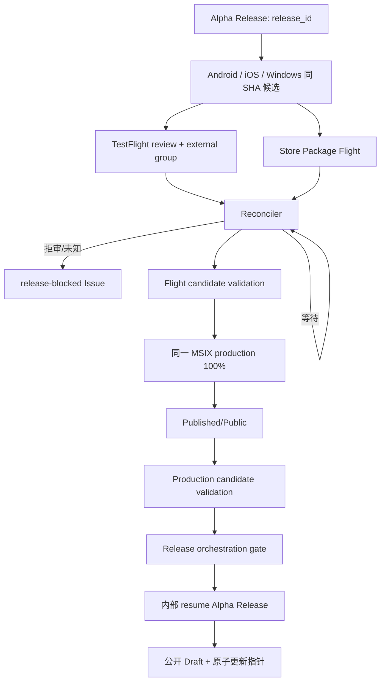

# Alpha Release 端到端自动发布规格

**Status**：Active

**Version**：2.0

**Date**：2026-08-25

**Product source**：`docs/product/Alpha_PRD_无登录版.md` 3.1、AT-21～AT-26

## 1. 目的与边界

从 `master` 的单一不可变提交生成 Android、iOS、Windows Alpha 候选，自动提交 TestFlight 外测审核和 Microsoft Store，等待商店事实状态与真实分发验证全部通过后，自动公开原 GitHub Draft Pre-release 并原子更新签名指针。

维护者只手动启动一次 `Alpha Release` 并提供 `release_id`。逐版本流程不允许最终人工审批、人工 Store 状态证明、临时 TestFlight 链接、重建已批准候选或旁路公开。

## 2. 工作流拓扑

| Workflow | Trigger | 责任 |
| --- | --- | --- |
| `alpha-release.yml` | `workflow_dispatch` | 分配构建号，创建 Draft/tag，构建三平台候选，上传 TestFlight，提交 Store Flight；内部恢复时验证最终门禁并公开 |
| `alpha-release-reconcile.yml` | `repository_dispatch` + `*/15 * * * *` | 查询 TestFlight/Store，分类等待/阻断/就绪，提交 production，调度真实分发验证，汇总最终门禁 |
| `candidate-distribution-validation.yml` | `repository_dispatch` | Flight 与 production 两阶段分别验证 Android Draft APK 和 Windows Store 安装生命周期 |
| `platform-distribution-validation.yml` | `repository_dispatch` | 公开后纵向审计，不替代公开前门禁 |

## 3. 输入

| Input | 类型 | 调用者 | 规则 |
| --- | --- | --- | --- |
| `release_id` | string | 维护者 | 必填，`v<semver>-alpha.<n>` |
| `release_notes` | string | 维护者 | 可选 |
| `resume_run_id` | string | 协调器/维护 | 正常发布不填写；必须绑定已成功的候选 source run |
| `orchestration_run_id` | string | 仅协调器 | resume 时必填，必须包含完整门禁 Artifact |
| `withdraw_update` | boolean | 维护者 | 仅已公开版本撤回 |
| `repair_update_pointer` | boolean | 维护者 | 仅已公开版本指针修复 |

TestFlight 链接不接受运行输入，只读取固定 Environment Variable。

## 4. 核心需求

| ID | Requirement | Priority | Verification |
| --- | --- | --- | --- |
| REL-001 | 三平台候选来自同一 annotated tag、SHA、release ID 和共享构建号 | Critical | 三份候选清单交叉核对 |
| REL-002 | 共享构建号从 2001 连续递增，Android 实测 versionCode、iOS build、Windows `1.0.<build>.0` 一致 | Critical | 构建号分配与包审计 |
| REL-003 | Android 仅正式签名 arm64 APK，Draft 公开前不进入更新指针 | High | APK 清单、签名与 Draft 状态 |
| REL-004 | iOS 仅上传 TestFlight；固定外测组、稳定 public link、自动通知并提交 Beta App Review | High | Fastlane 参数与 App Store Connect API |
| REL-005 | TestFlight 必须 processing `VALID`、review `APPROVED`、非过期且可外测/Testing | Critical | 脱敏 TestFlight 回执 |
| REL-006 | Windows 同一 MSIX 先进入固定 Package Flight，Flight 必须 `Published` | Critical | Flight API 回执与包名/版本/x64 |
| REL-007 | Flight 真实分发验证成功后才允许 production submission | Critical | candidate validation flight receipt |
| REL-008 | production 使用同一 MSIX、rollout 100%，必须 `Published/Public` | Critical | production API 回执 |
| REL-009 | production 真实分发验证必须是独立运行，不复用 Flight 回执 | Critical | 两个不同 validation run ID |
| REL-010 | 完整门禁前不得公开 Draft 或更新指针 | Critical | final publish 只接受 orchestration gate |
| REL-011 | 正常路径无 `github-release`/`windows-store-validation` reviewer | High | bootstrap 与守卫测试 |
| REL-012 | 拒审、未知状态或查询失败创建/更新 `release-blocked` Issue，Draft 与旧指针不变 | High | reconciler failure path |
| REL-013 | 外部状态恢复后复用原候选自动继续 | High | schedule/repository dispatch 幂等恢复 |
| REL-014 | GitHub Release 不包含 IPA、MSIX 或 `.appinstaller` | Critical | Release asset allowlist |

## 5. 状态机

### 5.1 TestFlight

- `PROCESSING`、`WAITING_FOR_REVIEW`、`IN_REVIEW` 及已知外测准备状态：`waiting`。
- `VALID + APPROVED + READY_FOR_EXTERNAL_TESTING/TESTING + testing=true`：`ready`。
- `FAILED`、`INVALID`、`REJECTED`、未知组合或字段歧义：`blocked`。

### 5.2 Microsoft Store

- 对同一包的 commit/processing/certification/publishing 等已知中间状态：`waiting`。
- Flight 对同一唯一 x64 包返回 `Published`：`flight_ready`。
- production 对同一唯一 x64 包返回 `Published/Public`：`production_ready`。
- 同一包返回失败/未知状态、多个包、错误版本/文件名/架构：`blocked`。
- production 查询尚未出现目标包且 Flight 验证已通过：提交一次 100% production；已出现目标包时不得重复提交。

## 6. 不可变回执

最终 `release-gate.json` 必须包含：

- release ID、candidate SHA、source run、orchestration run、共享构建号；
- TestFlight build ID、版本/build、固定组/link、review/processing/external/testing 状态；
- Windows Flight ID/submission ID 与目标包；
- Windows production submission ID、`Published/Public` 与目标包；
- Flight、production 两阶段 candidate distribution receipt。

最终发布端使用 Dart 校验器重新验证整个门禁；不能仅依赖上游 job conclusion。校验通过后复制脱敏 production receipt 供公开后纵向验证使用。原始 Apple/Store 响应和 P8、client secret、下载 URL 不进入 Artifact。

## 7. 安全与环境

| Environment | 权限边界 |
| --- | --- |
| `android-alpha` | Android signing 与 Firebase/Sentry |
| `testflight` | iOS signing、App Store Connect API、固定外测组/link |
| `windows-alpha` | Store MSIX signing |
| `microsoft-store` | Partner Center 最小权限凭据与固定 Flight ID |
| `windows-store-validation` | 专用 runner 隔离；无 required reviewer |
| `github-release` | 更新指针 Ed25519 seed，以及用于最终重验的固定 TestFlight group/link 和 Store Flight ID；无 required reviewer |

所有第三方 Action 固定完整 40 位 commit SHA。Store CLI 固定版本。专用 Windows runner 只接受默认分支 `repository_dispatch`，并验证自身标签、操作系统、Store 源、包身份与目标版本。

一次性 `bootstrap_release_automation.ps1` 清除 wait timer/reviewer、设置固定 Variable 并验证 Secret 名称。它必须在自动化变更合并后由仓库管理员执行，且不读取或打印 Secret 值。

## 8. 故障策略

| Failure | Result | Recovery |
| --- | --- | --- |
| 候选构建/签名/审计失败 | 工作流失败，Draft 不公开 | 修复后复用合法 Draft；二进制变化用新版本 |
| 外部审核等待 | 协调运行成功但不推进 | 15 分钟后自动查询 |
| TestFlight/Store 拒审或未知 | `release-blocked` Issue，Draft/旧指针不变 | 修复商店元数据；状态恢复后自动继续 |
| Flight 真实安装失败 | 不提交 production | 修复环境或新候选，保留证据 |
| production 真实安装失败 | 不公开 GitHub | 修复 Store 可用性或新候选 |
| final publish 失败 | 门禁 Artifact 保留，Draft 仍不公开或指针不前移 | 协调器重新恢复；已公开但指针失败用 repair |
| 严重版本撤回 | 不删除 Release/tag/Store submission | 指针置 `withdrawn`，修复版本向前发布 |

## 9. 验证

- Dart 单元测试覆盖 TestFlight、Store Flight/production 和 orchestration gate 的成功与篡改路径。
- workflow guard 覆盖唯一公开入口、固定 Action SHA、Flight/production CLI、15 分钟协调、无人工回执、真实分发阶段和 final gate 顺序。
- `ruby -c tool/release/app_store_connect_status.rb` 在 macOS 发布 runner 执行或本地 Ruby 环境验证。
- 发布工作流变更必须通过格式化、`flutter analyze`、完整 `flutter test`、YAML/actionlint 和 OCR 100% 审查。
- 首次生产运行前，执行 bootstrap dry-run 与 `-Apply`，并确认专用 Windows runner 的 Store 账号属于固定 Flight 测试受众、Firebase WIF、TestFlight 固定组/link 和 Partner Center auto-publish 配置。

## 10. 变更记录

| Version | Date | Change |
| --- | --- | --- |
| 2.0 | 2026-08-25 | 移除最终审批；增加 TestFlight 审核轮询、Store Flight/production 自动提交、两阶段真实分发门禁和认证通过后自动公开 |
