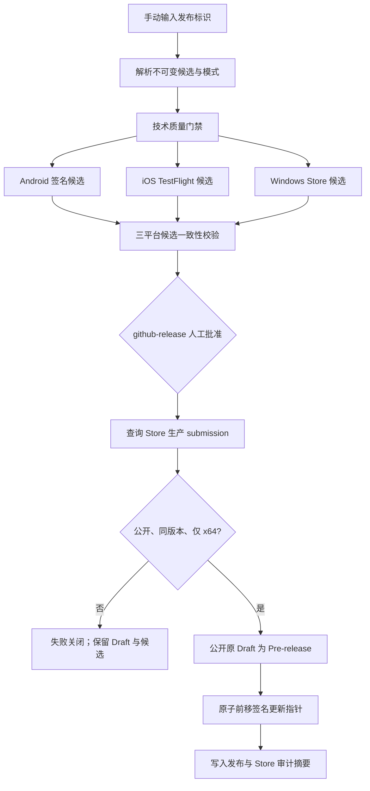

# Alpha Release 端到端工作流规格

## Workflow Overview

**Purpose**：从 `master` 的单一不可变提交生成 Android、iOS、Windows Alpha 候选，在分发状态可验证且人工批准后公开 GitHub Pre-release 和签名自动更新指针。

**Trigger Events**：仅允许维护者手动启动；发布标识必填，发布说明、TestFlight 外部链接和恢复参数可选。

**Target Environments**：`android-alpha`、`testflight`、`windows-alpha`、`github-release`。

## Execution Flow Diagram

## Jobs & Dependencies

| Job | Purpose | Dependencies | Execution Context |
|---|---|---|---|
| prepare | 解析 candidate、resume、metadata 模式和共享构建号 | 无 | Linux，只读仓库 |
| quality | 运行统一 Flutter 技术门禁 | prepare | 可复用质量工作流 |
| android | 构建、签名、审计并暂存唯一公开 APK | prepare, quality | `android-alpha` |
| ios | 构建、签名、审计并上传 TestFlight | prepare, quality | `testflight` |
| windows | 构建、审计并保存固定 Store 身份 MSIX 候选 | prepare, quality | `windows-alpha` |
| publish | 复核三平台、验证 Store 生产状态、公开 Release 与更新指针 | prepare, android, ios, windows | `github-release`，需人工批准 |

## Requirements Matrix

### Functional Requirements

| ID | Requirement | Priority | Acceptance Criteria |
|---|---|---|---|
| REL-001 | 单一入口绑定 `master` 不可变提交 | High | 候选 SHA 属于 `master`，tag 与 Draft Release 均绑定该 SHA |
| REL-002 | 三平台使用同一发布标识、营销版本和共享构建号 | High | 三份候选清单逐字段一致 |
| REL-003 | Android 仅公开签名 `arm64-v8a` APK | High | Release 中恰有一个预期 APK，摘要和签名身份匹配候选证据 |
| REL-004 | iOS 仅上传 TestFlight | High | GitHub Release 与 Artifact 均不公开 IPA |
| REL-005 | Windows 仅通过固定 Microsoft Store 产品分发 | High | Store ID、包身份、Publisher、PFN、版本映射和 x64 架构匹配固定合同 |
| REL-006 | Store 正式版本先于 GitHub 与更新指针公开 | High | Store 回执为 `Published`、`Public` 且包含同一 `1.0.<build>.0` x64 包，否则失败关闭 |
| REL-007 | 公开需要一次 `github-release` 人工批准 | High | 未批准时不公开 Draft、不写更新指针 |
| REL-008 | 更新指针签名且单调前移 | High | 私钥对应客户端公钥；新构建号递增；写入携带上一 blob 身份 |
| REL-009 | 失败恢复不得重建成功候选 | Medium | resume 模式复核原运行和 Artifact 后继续，不重复 TestFlight/Store 上传 |
| REL-010 | 撤回不删除或覆盖资产 | High | 原 Release/tag/APK/Store submission 保留，指针状态只从公开转为撤回 |

### Security Requirements

| ID | Requirement | Implementation Constraint |
|---|---|---|
| SEC-001 | 发布凭据只在受保护 Environment 可见 | PR、常规 CI、候选 Artifact 和日志不得接收凭据 |
| SEC-002 | Store 查询使用最小必要凭据 | 仅在最终批准 job 中读取 Partner Center Tenant、Seller、Client 和 Secret |
| SEC-003 | Store 回执不得包含访问令牌或客户端密钥 | 只保留产品 ID、submission ID、状态、可见性、包版本、架构和采集时间 |
| SEC-004 | 第三方 Actions 不得漂移 | 所有 Action 固定不可变提交；工具版本固定并受守卫测试约束 |
| SEC-005 | 自动更新私钥不得落盘到仓库或 Artifact | 仅通过进程环境传递，日志不得回显 |

## Input/Output Contracts

### Inputs

| Input | Type | Required | Contract |
|---|---|---:|---|
| release_id | string | 是 | `v<semver>-alpha.<positive>`，营销版本与候选一致 |
| release_notes | string | 否 | 公开说明附加内容，不改变候选身份 |
| ios_testflight_external_url | string | 否 | 仅接受 TestFlight 官方 join URL |
| resume_run_id | positive integer | 否 | 仅引用同工作流、同候选且三平台成功的运行 |
| withdraw_update | boolean | 否 | 仅允许现有公开版本从自动发现中撤回 |
| repair_update_pointer | boolean | 否 | 仅允许现有公开版本重签同一指针 |

### Secrets & Variables

| Scope | Name | Purpose |
|---|---|---|
| android-alpha | Android 签名与 Sentry Secrets | 签名、证书身份校验、符号上传 |
| testflight | App Store Connect、iOS 签名与 Sentry Secrets | TestFlight 上传和符号上传 |
| github-release | `APP_UPDATE_SIGNING_PRIVATE_KEY_BASE64` | 签名自动更新 envelope |
| github-release | `PARTNER_CENTER_TENANT_ID` | Store API 租户身份 |
| github-release | `PARTNER_CENTER_SELLER_ID` | Store Seller 身份 |
| github-release | `PARTNER_CENTER_CLIENT_ID` | Store API 客户端身份 |
| github-release | `PARTNER_CENTER_CLIENT_SECRET` | Store API 客户端凭据 |

### Outputs

| Output | Retention/Visibility | Contract |
|---|---|---|
| Android APK + public candidate manifest | GitHub Pre-release，长期公开 | 不可覆盖、不可删除、与候选摘要一致 |
| iOS signed evidence | Actions Artifact，受限保留 | 不含 IPA |
| Windows Store candidate evidence | Actions Artifact，受限保留 | MSIX 不进入 GitHub Release |
| Store production receipt | Actions summary/evidence，不含 Secret | 证明同版本 production submission 已公开 |
| signed `alpha.json` | `updates/alpha` 分支 | 原子写入、签名有效、构建号不回退 |

## Execution Constraints

- 同一时间最多运行一个 Alpha Release；已有运行不得被新运行取消。
- Android 与 Windows 候选 job 最长 90 分钟，iOS 候选 job 最长 120 分钟，最终公开 job 最长 30 分钟。
- 发布候选必须来自 `master` 历史；禁止移动既有 tag。
- Microsoft Store 首次产品提交、Private audience 和 Flight 的人员/组配置属于 Partner Center bootstrap；完成后由工作流验证正式 submission，不伪造为自动化成功。
- Store 验证失败、超时、凭据缺失或 API 不可用时保持 Draft 和旧更新指针，不得降级放行。

## Error Handling Strategy

| Error Type | Response | Recovery Action |
|---|---|---|
| 技术或平台构建失败 | 阻断候选 | 修复后以同发布标识重试；只复用身份匹配的不可变资产 |
| TestFlight/Store 候选失败 | 阻断统一公开 | 修复平台分发后重试，不公开部分候选 |
| Store production 状态非 Published/Public | 阻断最终公开 | 在 Partner Center 完成同一包的正式认证，再使用原候选恢复 |
| Store API/认证失败 | 阻断最终公开并输出非敏感诊断 | 修复 Environment/Entra 配置后恢复，不重建候选 |
| GitHub Release 公开失败 | 保留 Draft 或已公开状态，禁止盲目覆盖 | resume/metadata 模式重新核对不可变资产 |
| 更新指针写入冲突 | Release 状态保持可审计，旧指针不被覆盖 | 读取最新 blob 后按 repair 模式复核重试 |

## Quality Gates

| Gate | Criteria | Bypass Conditions |
|---|---|---|
| Flutter quality | format、analyze、tests 全部成功 | 无 |
| Platform identity | 三平台候选同 SHA/版本/构建号且身份固定 | 无 |
| Distribution | TestFlight 上传成功；Store production 回执匹配同一 x64 版本 | 无 |
| Human approval | `github-release` reviewer 批准 | 无自动旁路 |
| Public integrity | Release 资产、签名指针、上一指针状态全部有效 | 无 |

## Monitoring & Observability

- Job summary 记录候选 SHA、发布标识、共享构建号、三平台结果、Store submission ID/状态/版本和更新指针状态。
- Store API 错误仅记录状态码与去敏错误信息；令牌、Client Secret 和 SAS URL 不得输出。
- 构建证据默认按工作流保留期自动过期；公开 Release 和 `updates/alpha` 历史长期保留。

## Edge Cases & Exceptions

| Scenario | Expected Behavior | Validation Method |
|---|---|---|
| Store 仍为 Private audience 或 Flight | 不公开 GitHub，不前移指针 | 可见性和 production submission 状态检查 |
| Store 已公开但版本不同 | 不公开 | 精确比较 `1.0.<shared build>.0` |
| Store submission 同时含非 x64 包 | 不公开 | 架构集合检查 |
| TestFlight 外部链接缺失 | 允许公开，但说明标记待提供 | Release notes 检查 |
| 同版本已撤回 | 禁止重新公开 | 签名指针状态迁移检查 |
| API 返回未知状态或关键字段类型错误 | 失败关闭 | 严格枚举状态并校验关键 schema；无关新增字段可忽略 |

## Validation Criteria

- VLD-001：规格、workflow、守卫测试对 Job 依赖和单一批准顺序描述一致。
- VLD-002：Store 回执解析覆盖有效、非公开、版本错、架构错、字段缺失和未知状态。
- VLD-003：YAML/Actions 语法有效，第三方 Actions 固定完整提交。
- VLD-004：发布守卫证明 Store 验证发生在 Release 公开和更新指针写入之前。
- VLD-005：完整 Flutter 测试、静态分析和 OCR 审查通过。

## Change Management

1. 先更新本规格与 PRD 发布合同。
2. 通过 PR 审查工作流、工具和守卫测试。
3. 在 `github-release` 配置 Partner Center Secrets，并保持 reviewer 保护。
4. 以非公开候选验证 Store 查询和失败关闭。
5. 全部门禁通过且用户明确授权后合并；正式发版仍从单一 `Alpha Release` 入口启动。

## Version History

| Version | Date | Changes | Author |
|---|---|---|---|
| 1.0 | 2026-08-20 | 定义三平台候选、Store 生产验证、统一公开与签名更新指针的纵向合同 | Codex |

## Related Specifications

- [Flutter CI/CD 工作流规格](./spec-process-cicd-flutter-ci.md)
- [Alpha PRD](../docs/product/Alpha_PRD_无登录版.md)
- [GitHub Alpha 发布流程](../docs/project/GitHub_版本发布流程.md)
- [代码签名策略](../CODE_SIGNING_POLICY.md)
