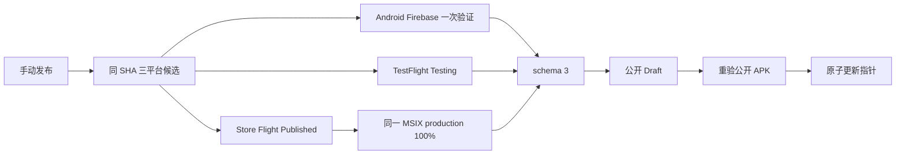

# Alpha Release 自动发布规格

> 状态：Active · 版本：3.7 · 日期：2026-08-28
>
> 产品上游：[Alpha PRD](../docs/product/Alpha_PRD_无登录版.md) 3.1、AT-21～AT-26

## 1. 边界

维护者只手动运行一次 `Alpha Release` 并提供 `release_id`。自动化从 `master` 的同一不可变 SHA 构建 Android、iOS 和 Windows 候选；所有平台门禁通过后公开原 Draft，重验公开 APK，再原子更新签名指针。

逐版本流程不允许最终人工审批、人工 Store 状态证明、重建已批准候选或旁路公开。GitHub Release 只包含 Android APK 与候选清单。

## 2. 拓扑

| Workflow | 触发 | 职责 |
| --- | --- | --- |
| `alpha-release.yml` | `workflow_dispatch`、内部恢复 | 分配版本、构建候选、验证 Android、最终公开与更新指针 |
| `alpha-release-reconcile.yml` | `repository_dispatch`、`7,22,37,52 * * * *` | TestFlight/Store 轮询、Flight/production 提交与回执、最终门禁 |

不得新增候选验证、Store 恢复或公开后审计工作流。

## 3. 核心合同

| ID | 要求 |
| --- | --- |
| REL-001 | 三平台共享 annotated tag、release ID、candidate SHA、source run 和构建号 |
| REL-002 | 构建号从 `2001` 连续递增；Android 实测 `versionCode`、iOS build、Windows `1.0.<build>.0` 的 build 相同 |
| REL-003 | Android 只发布签名 arm64 APK，保留 `--split-per-abi`；Firebase `--no-resign` 原包验证一次，恢复时只复用已验身份和摘要 |
| REL-004 | iOS 只经固定 TestFlight 外测组；Beta App Review 通过并进入 `Testing`，GitHub 不上传 IPA |
| REL-005 | 同一 Windows x64 MSIX 先进入固定 Flight；Flight 为 `Published` 且包名、版本、架构、上传状态匹配后，才提交 100% non-flighted production |
| REL-006 | production 必须为同一 MSIX 和 `Published/Public`；提交前重验来源 Artifact 的 SHA-256，GitHub 不上传 MSIX |
| REL-007 | 完整门禁前不得公开 Draft 或更新指针；Windows 回执不证明客户端生命周期 |
| REL-008 | 公开后重新下载 Android APK 并核对 SHA-256，之后才更新指针 |
| REL-009 | 拒审、未知状态、查询/合同失败维护 `release-blocked` Issue；恢复或正常等待时关闭，Draft 和旧指针不变 |
| REL-010 | 协调器使用当前已审查工具；候选代码、tag、版本、数据 generation 和摘要始终来自原 candidate |
| REL-011 | 同一时刻只有一个活动 Draft；其定义是最新公开 Alpha 之后创建的最新合法 Draft |
| REL-012 | 公开资产、tag 和撤回记录不可删除、覆盖或回退；修复使用更高版本 |

## 4. 门禁

`release-gate.json` schema 3 必须绑定 release ID、candidate SHA、source run、orchestration run 和共享构建号，并包含：

- 固定 TestFlight group、审核和 `Testing` 回执；
- Windows Flight `Published` 与精确目标包回执；
- Windows production `Published/Public`、100% 与同一目标包回执；
- 来源运行内唯一 Android Firebase ARM 回执。

最终发布端必须使用 Dart 校验器重验整个门禁，不能只看 job conclusion。原始 Apple/Store 响应、P8、client secret、短期 URL 和测试者信息不得进入 Artifact。

## 5. 状态与恢复

- 已知 processing/review/certification/publishing：等待下一次协调。
- 拒审、失败、未知状态、字段歧义、身份不匹配或候选发现失败：失败关闭并维护阻断 Issue。
- Flight 同候选的 `pendingcommit/commitfailed` 草稿：删除失败草稿并重提同一 MSIX；不同候选的 pending submission 阻断。
- 构建失败：修复后复用合法 Draft；二进制变化必须新建版本。
- 最终公开失败：保留门禁并恢复；已公开但指针失败只允许指针修复。
- 撤回：保留 Release、tag 和 Store submission，仅把签名指针前移为 `withdrawn`；同一构建不得重新公开。

## 6. 权限

| Environment | 用途 |
| --- | --- |
| `android-alpha` | Android 签名、Firebase、Sentry |
| `testflight` | iOS 签名、App Store Connect、固定 group/link、Sentry |
| `windows-alpha` | Store MSIX 构建与审计；无发布 Secret |
| `microsoft-store` | Partner Center 最小权限凭据与固定 Flight |
| `github-release` | 最终重验和指针签名；无 reviewer |

第三方 Actions 固定完整 SHA。YAML 只保留触发器、权限、Environment、依赖和短胶水；状态分类、合同解析、Artifact 选择与回执生成放在 `tool/`。

## 7. 验证

- `actionlint -config-file .github/actionlint.yaml`
- `flutter test test/architecture/release_workflow_guard_test.dart`
- `flutter test test/tool/release/release_orchestration_gate_test.dart`
- PowerShell Parser 校验 `tool/release/*.ps1`
- `flutter analyze`、`flutter test`、`git diff --check`
- OCR 覆盖全部 reviewable 文件，排除文件人工补审
