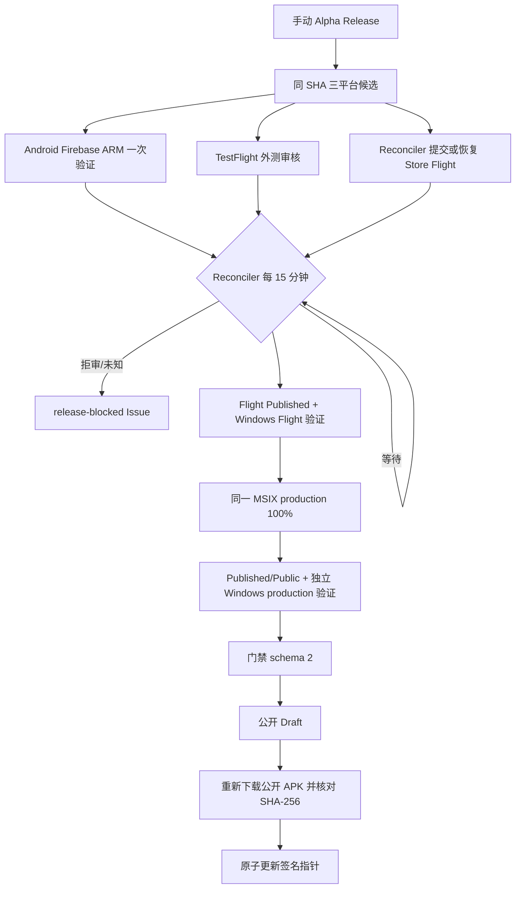

# Alpha Release 端到端自动发布规格

**Status**：Active

**Version**：3.3

**Date**：2026-08-26

**Product source**：`docs/product/Alpha_PRD_无登录版.md` 3.1、AT-21～AT-26

## 1. 目标与边界

维护者只手动启动一次 `Alpha Release` 并提供 `release_id`。自动化从 `master` 的同一不可变 SHA 构建 Android、iOS、Windows 候选，完成商店审核和真实分发门禁后，公开原 GitHub Draft Pre-release，并在公开 APK 摘要复核成功后原子更新签名指针。

逐版本流程不允许最终人工审批、人工 Store 状态证明、重建已批准候选或旁路公开。GitHub Release 只包含 Android APK 与候选清单，不包含 IPA、MSIX 或 `.appinstaller`。

## 2. 工作流拓扑

| Workflow | Trigger | 单一职责 |
| --- | --- | --- |
| `alpha-release.yml` | `workflow_dispatch`；协调器内部恢复 | 分配版本、创建 Draft/tag、构建三平台候选、执行一次 Android Firebase ARM 原包验证；最终重新验证门禁、公开 Draft、复核公开 APK、更新指针 |
| `alpha-release-reconcile.yml` | `repository_dispatch` + `*/15 * * * *` | 幂等提交/恢复 Store Flight，轮询 TestFlight/Store，执行两阶段 Windows 专用机验证，提交 production，汇总最终门禁 |

除以上两个文件外，不得新增候选验证、Store 恢复或公开后审计工作流。

## 3. 状态推进

## 4. 核心合同

| ID | Requirement | Verification |
| --- | --- | --- |
| REL-001 | 三平台共享 annotated tag、SHA、release ID 和构建号 | 三份候选清单交叉核对 |
| REL-002 | 构建号从 `2001` 连续递增；Android 实测 `versionCode`、iOS build、Windows `1.0.<build>.0` 一致 | 包审计与清单 |
| REL-003 | Android 仅正式签名 arm64 APK，保留 `--split-per-abi`，只在 Firebase ARM 使用 `--no-resign` 验证一次 | `androidCandidateDistribution` 回执 |
| REL-004 | iOS 仅经固定 TestFlight 外测组分发；未提供可选发布说明时生成绑定 release ID 的确定性 changelog；Beta App Review `APPROVED` 且进入 `Testing` | Fastlane 守卫；脱敏 TestFlight 回执 |
| REL-005 | 同一 Windows x64 MSIX 先进入固定 Flight；失败草稿仅在绑定同候选时由协调器清理并重提 | Flight request + API 回执 |
| REL-006 | Flight `Published` 后执行专用机安装/启动/卸载，成功后才提交 100% production | Flight 验证回执 |
| REL-007 | production 必须为同一 MSIX、`Published/Public`，并执行独立专用机验证 | production 回执；不同 validation run ID |
| REL-008 | 完整门禁前不得公开 Draft 或更新指针 | `release-gate.json` schema 2 |
| REL-009 | 公开后必须重新下载 Android APK 并核对候选 SHA-256，之后才能更新指针 | final publish 步骤顺序守卫 |
| REL-010 | 拒审、未知状态、身份歧义或查询失败时失败关闭 | `release-blocked` Issue；Draft/旧指针不变 |
| REL-011 | 协调与最终发布使用当前已审查工具，候选提交仅提供不可变产品代码、身份与证据 | checkout workflow SHA；从 candidate SHA 读取版本和数据代际 |

## 5. 门禁回执

`release-gate.json` 使用 schema 2，必须绑定 release ID、candidate SHA、source run、orchestration run 和共享构建号，并包含：

- TestFlight build、固定外测组、审核与 Testing 状态；
- Windows Flight submission、目标包及 `Published` 状态；
- Windows production submission、同一目标包及 `Published/Public` 状态；
- `validations.android`：来源运行内唯一 Android Firebase ARM 回执；
- `validations.windowsFlight` 与 `validations.windowsProduction`：两个不同协调运行生成的专用机回执。

最终发布端必须使用 Dart 校验器重新验证整个门禁，不能只依赖 job conclusion。原始 Apple/Store 响应、P8、client secret 和短期下载 URL 不进入 Artifact。

## 6. 状态与恢复

- 已知 processing/review/certification/publishing 状态：等待，下次协调继续。
- TestFlight `FAILED/INVALID/REJECTED`、Store 失败或未知状态、字段歧义、候选身份不一致或候选发现失败：阻断并维护 `release-blocked` Issue；无法确定版本时归入统一 discovery Issue。
- Flight 同候选 `pendingcommit/commitfailed` 草稿：协调器删除该失败草稿并重新提交同一 MSIX；不同候选的 pending submission 一律阻断。
- 候选构建失败：修复后复用合法 Draft；二进制变化必须使用新版本。
- 最终公开失败：保留门禁并自动恢复；已公开但指针失败仅允许指针修复。
- 撤回不删除 Release、tag 或 Store submission，只将签名指针前移为 `withdrawn`。

## 7. 权限与环境

| Environment | 用途 |
| --- | --- |
| `android-alpha` | Android 签名、Firebase 与 Sentry |
| `testflight` | iOS 签名、App Store Connect、固定组/link |
| `windows-alpha` | 未签名 Store MSIX 候选构建与身份审计；无发布 Secret |
| `microsoft-store` | Partner Center 最小权限凭据与固定 Flight ID |
| `windows-store-validation` | 专用 runner 隔离，无 reviewer |
| `github-release` | 更新指针签名与最终门禁重验，无 reviewer |

所有第三方 Action 固定完整 commit SHA。工作流 YAML 只保留触发器、权限、Environment、依赖和短胶水；可独立测试的分类、合同与回执逻辑放在 `tool/`。

## 8. 验证

- `actionlint -config-file .github/actionlint.yaml`
- `flutter test test/architecture/release_workflow_guard_test.dart`
- `flutter test test/tool/release/release_orchestration_gate_test.dart`
- PowerShell Parser 校验 `tool/release/*.ps1`
- `flutter analyze`、完整 `flutter test`、`git diff --check`
- OCR 覆盖全部 reviewable 文件；排除文件仍人工检查真实 diff

## 9. 变更记录

| Version | Date | Change |
| --- | --- | --- |
| 3.3 | 2026-08-26 | TestFlight 外部分发在可选 release notes 为空时生成确定性 changelog，避免上传前失败 |
| 3.2 | 2026-08-26 | 明确 Windows 候选在 CI 中不自签名，提交后由 Microsoft Store 签名；同步实际 Environment 与 OIDC 配置 |
| 3.1 | 2026-08-26 | 最终发布固定使用已审查工具；候选发现失败进入统一阻断上报；明确候选版本与数据代际仍不可变 |
| 3.0 | 2026-08-26 | 收敛为两个发布工作流；Android 仅验证一次；Flight 恢复和两阶段 Windows 验证归入协调器；公开 APK 复核并入最终发布 |
| 2.0 | 2026-08-25 | 引入 TestFlight/Store 自动轮询、两阶段真实分发和自动公开 |
