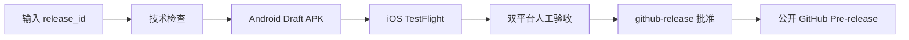

## Workflow Overview

**Purpose**: 提供仓库唯一可见的双平台 Alpha 发布入口，自动串联技术检查、Android Draft、iOS TestFlight 和一次公开审批。
**Trigger Events**: 维护者在 `master` 手动运行 `Alpha Release`。

## Inputs

| Input | Required | Meaning |
|---|---|---|
| `release_id` | 是 | `v<marketing-version>-alpha.<sequence>` |
| `release_notes` | 否 | 公开说明/TestFlight 构建说明 |
| `ios_testflight_external_url` | 否 | 已获批的 TestFlight 外部测试链接 |

`expected_sha`、`gate_input_path`、Android/iOS run ID 均不再由用户填写。

## Execution Contract

1. 首次发布标识从当前 `master` 锁定候选 SHA；已有 Draft 重跑则从 annotated tag 恢复原 SHA。
2. 统一执行格式、静态分析和测试，避免双平台重复。
3. Android 内部工作流创建/更新 Draft 候选，iOS 内部工作流随后上传相同 SHA 的 TestFlight 构建。
4. `github-release` Environment 是唯一人工批准点。批准表示维护者已完成双平台实际验收。
5. 批准后验证清单与 APK 摘要，公开原 Draft；TestFlight 链接缺失不阻断。
6. 同一 ID 已公开时自动进入 metadata 模式，不重建双平台产物，仅补链接或说明，并仍要求公开环境批准。

## Repository Configuration

- `android-alpha`: 保存 Android 签名 Secrets；无需 required reviewer。
- `testflight`: 保存 Apple 签名和上传 Secrets；无需 required reviewer。
- `github-release`: 配置一个 required reviewer，允许发起者审批；这是唯一发布批准。
- 仓库必须公开，Actions 的 `GITHUB_TOKEN` 具备工作流声明的写 Release 权限。

## Quality and Safety

- 自动阻断：格式、分析、测试、签名、包审计、来源证明、同 SHA、版本、APK 摘要、TestFlight 上传。
- 人工判断：AT-01～AT-18 真机结果、性能和已知风险是否可接受。
- `docs/quality/alpha_release_input.json` 与 benchmark 工具继续用于记录和评估，但不被发布工作流读取。
- Draft 阶段允许恢复性覆盖；公开后标签、APK 和候选证据不可变。

## Version History

| Version | Date | Changes | Author |
|---|---|---|---|
| 1.0 | 2026-08-06 | 建立唯一可见发布入口与一次批准的双平台串行流程 | Codex |
