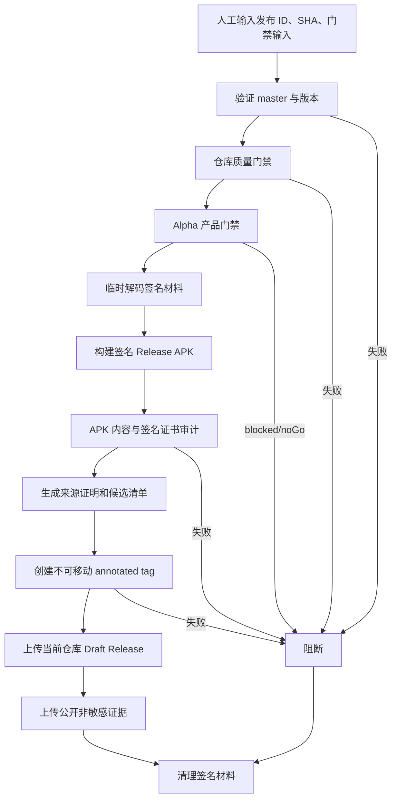

## Workflow Overview

**Purpose**: 从 `master` 的明确 commit 构建、签名和审计仅含 `arm64-v8a` 的 Android Alpha APK，生成来源证明，并将候选暂存到当前公开源码仓库的 GitHub Draft Release。
**Trigger Events**: 维护者从 `master` 人工触发，只输入 release ID 和可选说明。
**Target Environments**: GitHub 托管 Ubuntu、`android-alpha` Environment、当前公开源码仓库的不可见 Draft Release。

## Execution Flow Diagram



## Jobs & Dependencies

| Job Name | Purpose | Dependencies | Execution Context |
|---|---|---|---|
| `release-android-alpha` | 门禁、签名、审计、证明和 Draft 暂存 | 无 | Ubuntu，`android-alpha`，90 分钟 |

## Requirements Matrix

### Functional Requirements

| ID | Requirement | Priority | Acceptance Criteria |
|---|---|---|---|
| REQ-001 | 自动锁定候选 commit | High | 使用 workflow dispatch 触发时的 `master` 完整 SHA，不接受人工 SHA |
| REQ-002 | 发布 ID 与 app marketing version 一致 | High | `v<version>-alpha.<n>` 与 `pubspec.yaml` 匹配 |
| REQ-003 | 产品门禁为 `go` | High | 门禁 CLI 退出码为 0，报告 decision 为 `go` |
| REQ-004 | 使用正式 Android 签名 | High | APK v2/v3 签名有效且证书 SHA-256 与 Environment Secret 一致 |
| REQ-005 | 审计 APK | High | 固定资产、许可、仅 `arm64-v8a` 和禁入内容全部通过 |
| REQ-006 | 候选暂存 | High | 当前源码仓库 Release 必须保持 draft/prerelease，最终发布前不可公开访问 |
| REQ-007 | 输出候选清单 | High | 关联 release ID、commit、versionCode、run、SHA-256 和门禁报告 |
| REQ-008 | 资产不可覆盖 | High | 同一 release ID 已存在 APK 时立即失败，修复须使用新 release ID 和 build number |
| REQ-009 | 预留不可变版本身份 | High | Draft 创建前生成指向候选 SHA 的 annotated tag；后续不得移动、删除或复用 |
| REQ-010 | 固定门禁输入 | High | 只读取仓库内已跟踪的 `docs/quality/alpha_release_input.json`，不接受人工路径 |

### Security Requirements

| ID | Requirement | Implementation Constraint |
|---|---|---|
| SEC-001 | Secrets 仅在 Environment 审批后可用 | Job 绑定 `android-alpha` |
| SEC-002 | 签名材料临时存在 | Runner 临时目录解码，`always()` 清理 |
| SEC-003 | APK 在验收前不可公开 | 只上传 Draft Release；Actions Artifact 排除 APK |
| SEC-004 | 发布令牌最小权限 | 只使用当前运行的 `GITHUB_TOKEN` 和 `contents: write` |
| SEC-005 | 构建来源可验证 | 为签名 APK 生成 GitHub Artifact Attestation |

### Performance Requirements

| ID | Metric | Target | Measurement Method |
|---|---|---|---|
| PERF-001 | 单次运行 | 不超过 90 分钟 | Job 时长 |
| PERF-002 | 发布并发 | 全仓库最多一个 Android Alpha 发布 | 并发组 |
| PERF-003 | 公开证据保留 | 7 天 | Artifact 配置 |

## Input/Output Contracts

### Inputs

```yaml
release_id: v<marketing-version>-alpha.<sequence>
release_notes: optional text
source_revision: workflow dispatch master SHA (derived)
gate_input_path: docs/quality/alpha_release_input.json (fixed)
```

### Outputs

```yaml
source_repository_draft_release: GitHub Release URL
annotated_candidate_tag: git ref
candidate_manifest: json
release_gate_report: json
apk_sha256: text
signing_report: text
```

### Secrets & Variables

| Type | Name | Purpose | Scope |
|---|---|---|---|
| Secret | `ANDROID_KEYSTORE_BASE64` | Release keystore | `android-alpha` Environment |
| Secret | `ANDROID_KEYSTORE_PASSWORD` | Keystore 密码 | Environment |
| Secret | `ANDROID_KEY_ALIAS` | 签名别名 | Environment |
| Secret | `ANDROID_KEY_PASSWORD` | 私钥密码 | Environment |
| Secret | `ANDROID_SIGNING_CERT_SHA256` | 锁定签名证书 | Environment |

## Execution Constraints

- **Timeout**: 90 分钟。
- **Concurrency**: 新运行不得取消正在执行的候选发布。
- **Branch**: Environment 只允许 `master`。
- **Permissions**: Source repo `contents: write`、`id-token: write`、`attestations: write`。

## Error Handling Strategy

| Error Type | Response | Recovery Action |
|---|---|---|
| 触发分支不是 master、版本或门禁不一致 | 签名前失败 | 从 master 重新触发，或更新固定证据后新运行 |
| 签名材料无效 | 构建前失败 | 更换 Environment Secret |
| 证书指纹不匹配 | 阻断分发 | 核对受信任证书 |
| release ID 已有 tag、Release 或 APK | 阻断上传且不覆盖 | 使用新的 Alpha 序号和 versionCode |
| tag 已创建后 Draft 或资产上传失败 | 保留 tag，不宣称候选可用 | 使用新的 release ID 和 versionCode；不得移动或复用旧 tag |

## Quality Gates

| Gate | Criteria | Bypass Conditions |
|---|---|---|
| Repository | 格式、分析、测试通过 | 无 |
| Product | Alpha 门禁 decision=`go` | 无 |
| Package | APK 内容审计通过 | 无 |
| Signing | 签名和证书摘要匹配 | 无 |
| Distribution | 当前仓库 Draft Release 上传成功且保持不可见 | 无 |

## Monitoring & Observability

- 记录 commit、run、versionCode、APK SHA-256、证书 SHA-256 和分发 URL。
- 公开日志不得输出 Secret 或 keystore 内容。

## Integration Points

| System | Integration Type | Data Exchange | SLA Requirements |
|---|---|---|---|
| GitHub Environment | 审批和 Secrets | 临时签名材料 | 必须审批后注入 |
| 当前 GitHub 仓库 | Draft Release | APK、摘要、候选清单 | 最终验收前必须保持 draft |
| Git Tags | 候选版本预留 | annotated tag | 不得移动、删除或复用 |
| Artifact Attestation | 构建来源 | APK digest 与 workflow 身份 | 生成失败即阻断 |

## Compliance & Governance

- 不上传模型权重、录音、数据库、设备序列号或原始评测音频。
- Release 签名变更必须更新证书摘要和发布文档。
- 工作流、Gradle 签名配置和审计脚本必须进入 OCR。

## Edge Cases & Exceptions

| Scenario | Expected Behavior | Validation Method |
|---|---|---|
| 重跑同一候选 | 不覆盖既有 tag/APK；使用新 release ID 和 versionCode | Tag 与 Release asset API |
| Draft 被提前公开 | 上传前或最终发布前失败 | Release API 的 draft 状态 |
| Release 未产生唯一 APK | 阻断 | 文件计数 |

## Validation Criteria

- **VLD-001**: 无 Secrets 时流程在签名前明确失败。
- **VLD-002**: 正确 Secrets 生成受信任证书签名的唯一 APK。
- **VLD-003**: Actions Artifact 不包含 APK，当前仓库 Draft Release 包含唯一命名的 `arm64-v8a` APK。
- **VLD-004**: Draft Release 的 APK 名称、大小与 SHA-256 和候选清单一致，关联 tag 为指向候选 SHA 的 annotated tag。

## Change Management

1. 更新本规格。
2. 修改 Gradle、工作流和审计脚本。
3. 执行单测、分析、构建检查与 OCR。
4. 配置 Environment 后人工运行。
5. 将运行 URL 和摘要写入质量证据。

## Version History

| Version | Date | Changes | Author |
|---|---|---|---|
| 1.0 | 2026-08-06 | 初始 Android Alpha 候选发布规格 | Codex |
| 1.1 | 2026-08-06 | 改为当前公开仓库 Draft 暂存仅 arm64 APK，禁止覆盖并等待双平台最终发布 | Codex |
| 1.2 | 2026-08-06 | Draft 创建前预留 annotated tag，避免 GitHub 自动生成轻量 tag 并禁止后续移动 | Codex |
| 1.3 | 2026-08-06 | 删除人工 SHA 与门禁路径输入，自动锁定 master 触发 SHA 并读取固定证据文件 | Codex |

## Related Specifications

- [Flutter Quality](spec-process-cicd-quality.md)
- [版本最终发布](spec-process-cicd-release-finalize.md)
