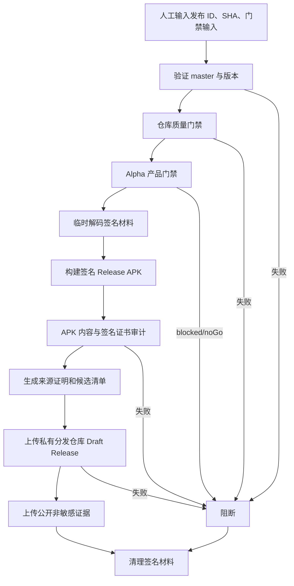

## Workflow Overview

**Purpose**: 从 `master` 的明确 commit 构建、签名和审计 Android Alpha APK，生成来源证明，并将 APK 仅分发到私有 GitHub 仓库。
**Trigger Events**: 维护者人工触发。
**Target Environments**: GitHub 托管 Ubuntu、`android-alpha` Environment、私有 GitHub 分发仓库。

## Execution Flow Diagram



## Jobs & Dependencies

| Job Name | Purpose | Dependencies | Execution Context |
|---|---|---|---|
| `release-android-alpha` | 门禁、签名、审计、证明和私有分发 | 无 | Ubuntu，`android-alpha`，90 分钟 |

## Requirements Matrix

### Functional Requirements

| ID | Requirement | Priority | Acceptance Criteria |
|---|---|---|---|
| REQ-001 | 候选 commit 属于 `master` | High | SHA 可达且与输入完全一致 |
| REQ-002 | 发布 ID 与 app marketing version 一致 | High | `v<version>-alpha.<n>` 与 `pubspec.yaml` 匹配 |
| REQ-003 | 产品门禁为 `go` | High | 门禁 CLI 退出码为 0，报告 decision 为 `go` |
| REQ-004 | 使用正式 Android 签名 | High | APK v2/v3 签名有效且证书 SHA-256 与 Environment Secret 一致 |
| REQ-005 | 审计 APK | High | 固定资产、许可、arm64 和禁入内容全部通过 |
| REQ-006 | 受控分发 | High | 目标 GitHub 仓库必须是 private，Release 必须是 draft/prerelease |
| REQ-007 | 输出候选清单 | High | 关联 release ID、commit、versionCode、run、SHA-256 和门禁报告 |

### Security Requirements

| ID | Requirement | Implementation Constraint |
|---|---|---|
| SEC-001 | Secrets 仅在 Environment 审批后可用 | Job 绑定 `android-alpha` |
| SEC-002 | 签名材料临时存在 | Runner 临时目录解码，`always()` 清理 |
| SEC-003 | 公开仓库不保存签名 APK | Source repo Artifact 排除 APK，仅私有分发仓库接收 |
| SEC-004 | 分发令牌最小权限 | Fine-grained token 只允许目标私有仓库 `contents: write` |
| SEC-005 | 构建来源可验证 | 为签名 APK 生成 GitHub Artifact Attestation |

### Performance Requirements

| ID | Metric | Target | Measurement Method |
|---|---|---|---|
| PERF-001 | 单次运行 | 不超过 90 分钟 | Job 时长 |
| PERF-002 | 发布并发 | 全仓库最多一个 Android Alpha 发布 | 并发组 |
| PERF-003 | 公开证据保留 | 7 天 | Artifact 配置 |

## Input/Output Contracts

### Inputs

```yaml
release_id: v<marketing-version>-alpha.<sequence>
expected_sha: full commit SHA
gate_input_path: repository-relative JSON path
release_notes: optional text
```

### Outputs

```yaml
private_draft_release: GitHub Release URL
candidate_manifest: json
release_gate_report: json
apk_sha256: text
signing_report: text
```

### Secrets & Variables

| Type | Name | Purpose | Scope |
|---|---|---|---|
| Secret | `ANDROID_KEYSTORE_BASE64` | Release keystore | `android-alpha` Environment |
| Secret | `ANDROID_KEYSTORE_PASSWORD` | Keystore 密码 | Environment |
| Secret | `ANDROID_KEY_ALIAS` | 签名别名 | Environment |
| Secret | `ANDROID_KEY_PASSWORD` | 私钥密码 | Environment |
| Secret | `ANDROID_SIGNING_CERT_SHA256` | 锁定签名证书 | Environment |
| Secret | `ANDROID_DISTRIBUTION_TOKEN` | 写入私有分发仓库 | Environment |
| Variable | `ANDROID_DISTRIBUTION_REPOSITORY` | `owner/repo` 目标 | Environment |

## Execution Constraints

- **Timeout**: 90 分钟。
- **Concurrency**: 新运行不得取消正在执行的候选发布。
- **Branch**: Environment 只允许 `master`。
- **Permissions**: Source repo `contents: read`、`id-token: write`、`attestations: write`。

## Error Handling Strategy

| Error Type | Response | Recovery Action |
|---|---|---|
| SHA、版本或门禁不一致 | 签名前失败 | 修复输入或证据后新运行 |
| 签名材料无效 | 构建前失败 | 更换 Environment Secret |
| 证书指纹不匹配 | 阻断分发 | 核对受信任证书 |
| 目标仓库不是 private | 阻断上传 | 改用私有分发仓库 |
| 上传失败 | 不宣称候选可用 | 重跑并使用新 versionCode |

## Quality Gates

| Gate | Criteria | Bypass Conditions |
|---|---|---|
| Repository | 格式、分析、测试通过 | 无 |
| Product | Alpha 门禁 decision=`go` | 无 |
| Package | APK 内容审计通过 | 无 |
| Signing | 签名和证书摘要匹配 | 无 |
| Distribution | 私有 Draft Release 上传成功 | 无 |

## Monitoring & Observability

- 记录 commit、run、versionCode、APK SHA-256、证书 SHA-256 和分发 URL。
- 公开日志不得输出 Secret 或 keystore 内容。

## Integration Points

| System | Integration Type | Data Exchange | SLA Requirements |
|---|---|---|---|
| GitHub Environment | 审批和 Secrets | 临时签名材料 | 必须审批后注入 |
| 私有 GitHub 仓库 | Draft Release | APK、摘要、候选清单 | 必须为 private |
| Artifact Attestation | 构建来源 | APK digest 与 workflow 身份 | 生成失败即阻断 |

## Compliance & Governance

- 不上传模型权重、录音、数据库、设备序列号或原始评测音频。
- Release 签名变更必须更新证书摘要和发布文档。
- 工作流、Gradle 签名配置和审计脚本必须进入 OCR。

## Edge Cases & Exceptions

| Scenario | Expected Behavior | Validation Method |
|---|---|---|
| 重跑同一候选 | 使用新 versionCode，替换私有 Draft asset | 候选清单 |
| 分发仓库误设为 public | 上传前失败 | Repository API visibility |
| Release 未产生唯一 APK | 阻断 | 文件计数 |

## Validation Criteria

- **VLD-001**: 无 Secrets 时流程在签名前明确失败。
- **VLD-002**: 正确 Secrets 生成受信任证书签名的唯一 APK。
- **VLD-003**: Source repo Artifact 不包含 APK。
- **VLD-004**: 私有 Draft Release 与候选清单摘要一致。

## Change Management

1. 更新本规格。
2. 修改 Gradle、工作流和审计脚本。
3. 执行单测、分析、构建检查与 OCR。
4. 配置 Environment 后人工运行。
5. 将运行 URL 和摘要写入质量证据。

## Version History

| Version | Date | Changes | Author |
|---|---|---|---|
| 1.0 | 2026-08-06 | 初始 Android Alpha 候选发布规格 | Codex |

## Related Specifications

- [Flutter Quality](spec-process-cicd-quality.md)
- [版本最终发布](spec-process-cicd-release-finalize.md)

