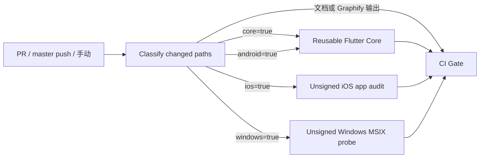

# Flutter CI/CD 工作流规格

> 当前状态：常规 CI 已加入 Windows x64 Release 与未签名 MSIX 开发探针；正式 `Alpha Release` 已生成固定 Microsoft Store 身份的 Windows 候选并纳入三平台门禁，签名自动更新指针生产链已闭合；Store 限定受众/Flight、正式认证和首次统一公开仍未完成，不得据此公开 Windows 支持。

## 1. 目标与边界

本规格描述会迹仓库的常规 CI、Alpha 候选构建和公开发布工作流。工作流必须保证：

- 分支保护始终可以依赖名称稳定的 `CI Gate`，不因路径过滤而缺失。
- Flutter 格式化、静态分析和测试只定义一次，由常规 CI 与正式发布复用。
- Android、iOS、Windows 原生变更仅触发对应平台检查；未知路径保守执行完整 CI。
- iOS 无签名构建只上传 JSON/TXT 审计证据，不生成或上传 IPA。
- 正式 Android 候选进入 GitHub Draft Release；正式 iOS 只进入 TestFlight。
- 正式三平台构建均注入同一营销版本和共享构建号；客户端只由正式发布工作流显式启用生产更新入口。
- GitHub Release 只保留 Android APK 与单一候选清单，详细签名和包检查证据进入短期 Actions Artifact。
- 最终批准先公开 Pre-release，再以 Ed25519 签名并原子前移 `updates/alpha/alpha.json`；撤回不删除或覆盖资产。
- Sentry 符号上传仅在受保护的发布 Environment 中运行，并与应用内 release/dist 完全一致。

## 2. 工作流清单

| 文件 | 触发方式 | 职责 |
|---|---|---|
| `.github/workflows/quality.yml` | PR、`master` push、手动 | 分类变更、执行所需平台检查、汇总稳定 Gate |
| `.github/workflows/_flutter-core.yml` | `workflow_call` | 锁定依赖、格式化、分析、测试及可选 Android APK 审计 |
| `.github/workflows/alpha-release.yml` | 手动 | 同一 SHA 的 Android 候选、TestFlight 构建与公开批准 |
| `.github/workflows/firebase-test-lab.yml` | 手动/被调用 | Android 设备实验室自动化回归，不作为发布证据门禁 |
| `.github/workflows/codeql.yml` | PR、`master` push、每周、手动 | 使用高级配置扫描 Actions、C/C++ 与 Python，排除代理技能目录 |

## 3. 常规 CI 流程



### 3.1 路径分类契约

`tool/ci/classify_changes.py` 输出字符串布尔值 `core`、`android`、`ios`、`windows`：

- `lib/`、`assets/`、依赖文件、工具脚本和工作流：四个输出均为 `true`。
- `android/`：`core=true`、`android=true`。
- `ios/`、`Gemfile`、`Gemfile.lock`：`core=true`、`ios=true`。
- `windows/`：`core=true`、`windows=true`。
- `test/`：只设置 `core=true`。
- 文档、Graphify 输出、`.agents/**` 与 `.claude/**`：四个输出均为 `false`；代理技能目录不属于项目质量检测范围。
- 未识别路径：四个输出均为 `true`，不得静默漏检。
- 手动执行、缺失基准 SHA 或全零基准 SHA：等同完整 CI。

### 3.2 稳定 Gate 契约

`CI Gate` 必须使用 `if: always()` 并依赖分类、Flutter Core、iOS 和 Windows 检查。分类必须成功；按条件执行的任务必须为 `success`，未选中的任务只能为 `skipped`。工作流触发器不得使用顶层 `paths` 或 `paths-ignore`，以免 required check 消失。

### 3.3 Windows MSIX 开发探针

常规 Windows job 固定使用 `windows-2025`、Java 17 与仓库锁定的 Flutter。它以 `SENTRY_ENABLED=false` 构建 x64 Release，使用 `CN=MeetTrace Development` 生成未签名探针，只验证 manifest、运行资产、模型权重/用户数据/凭据禁入和 SHA-256；上传证据前删除包体。

正式 `Alpha Release` 的 Windows job 使用 Partner Center 固定 Name、Publisher、PublisherDisplayName、PFN 和 Store ID 构建 Store MSIX，生成候选清单与 provenance，并把 MSIX 只上传 Actions Artifact。发布批准必须验证三平台同 SHA、版本和构建号；GitHub Release 明确拒绝 IPA 与 MSIX。首次发布用 Private audience 验收，已有公开版本的后续更新用 Package Flight；同一包进入正式 submission、通过认证并确认 Store 可安装后，才允许批准 GitHub Pre-release。

## 4. 可复用 Flutter Core

输入：

| 输入 | 类型 | 要求 |
|---|---|---|
| `checkout_ref` | string | 必填，待验证的不可变提交或引用 |
| `build_android` | boolean | 是否构建并检查 Debug APK |
| `upload_evidence` | boolean | 是否上传非敏感 Android/工具链证据 |

执行顺序固定为：检出 → Java/Flutter 工具链 → 工具链快照 → `flutter pub get --enforce-lockfile` → format → analyze → test → 可选 Android 构建与审计。任一步失败即失败关闭。

## 5. iOS 无签名审计

常规 CI 在 macOS/Xcode 固定版本上构建 Debug 和 Release `Runner.app`。允许上传的内容仅为：

- 工具链文本快照；
- App 检查 JSON；
- 包含目录树 SHA-256、体积和不可分发标志的元数据 JSON。

禁止创建 `Payload`、压缩 `.ipa`、上传 `.ipa` 或把无签名产物描述为可安装发行包。

## 6. Alpha 发布与 Sentry

`alpha-release.yml` 对选定 SHA 先调用 Flutter Core，再分配 Android/iOS 共用构建号。运行时通过 `--dart-define` 注入：

- `SENTRY_RELEASE=com.meettrace.app@<version>+<build>`
- `SENTRY_DIST=<build>`

Android 符号上传在 `android-alpha` Environment 中执行；iOS dSYM 上传在 `testflight` Environment 中执行。两者只读取对应 Environment 的 `SENTRY_AUTH_TOKEN`，失败最多重试三次，最终失败阻断该平台候选。

Android APK 与 `candidate-manifest.json` 是 Release 中仅有的自定义资产；APK 检查、签名输出、证书摘要和 iOS 候选清单保存在 Actions Artifact，不上传 IPA。若三平台 job 已成功、仅最终公开 job 失败，可通过可选的 `resume_run_id` 复核原运行证据并继续批准，不得再次构建或重复上传同一 TestFlight/Store build。

`github-release` Environment 保存 `APP_UPDATE_SIGNING_PRIVATE_KEY_BASE64`。工作流从 Android 候选证据、固定 TestFlight/Store 入口、当前数据代和候选 SHA 生成紧凑 payload，校验私钥导出的公钥与客户端内置公钥一致，并验证上一 envelope 的签名与状态迁移。Contents API 写入携带上一 blob SHA，避免并发覆盖；新公开版本构建号必须递增，同版本仅允许指针修复或从 `publicApproved` 撤回，撤回后不得重新公开同一构建。

## 7. 安全与依赖维护

- 第三方 Actions 必须固定到完整提交 SHA。
- Dependabot 常规 Gradle 更新仅允许既定补丁线；安全更新不使用 `ignore` 排除。
- Dependabot Security Updates 在仓库设置中启用后，仍需通过相同的 `CI Gate`。
- Secrets 不得进入 PR 工作流、日志、仓库文件或非发布 Artifact。
- 历史 Artifact 默认等待保留期到期，不执行批量删除。

Codacy 托管的 Dart Analyzer 不负责 `test/**`，因为它不解析 Flutter 的
`flutter_test` package graph；测试代码仍由仓库内锁定 Flutter 版本执行的
`flutter analyze` 和 `flutter test` 强制检查。Codacy 继续分析 `lib/**` 与其他
受支持源码，不得把整个 Dart 语言关闭。

`.agents/**` 与 `.claude/**` 同时从 Codacy 全局分析和 CodeQL 高级配置中排除；
这两个目录保持主分支原状，不属于项目质量检测与审查范围。

## 8. 验证与变更管理

修改这些工作流时至少运行：

```text
dart format --output=none --set-exit-if-changed lib test tool
flutter analyze
flutter test
```

同时执行 YAML/Actions 静态检查、`test/architecture/release_workflow_guard_test.dart` 和 `test/tool/ci/classify_changes_test.dart`。OCR 审查排除 `.agents/**` 与 `.claude/**`；发布相关改动合并前必须完成其余差异审查，未解决的 Critical/High 阻断交付。
