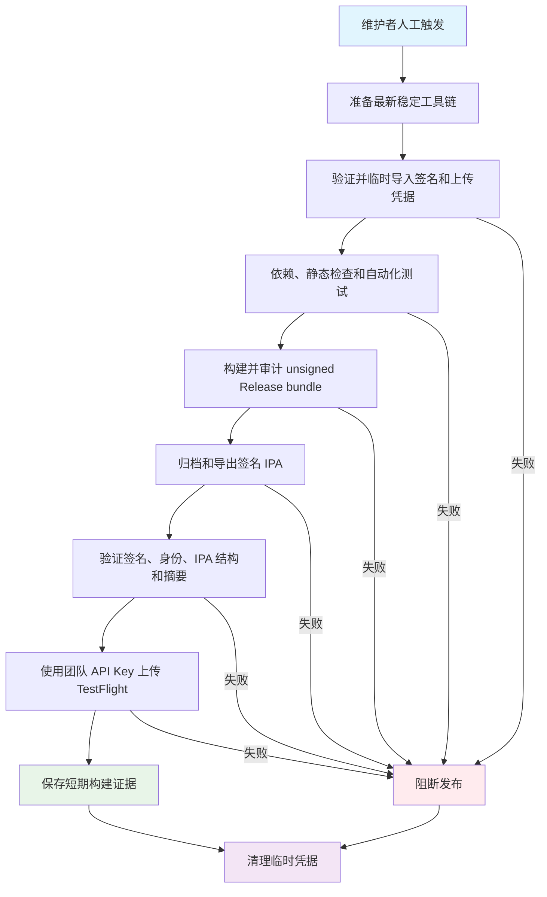

## Workflow Overview

**Purpose**: 在无本地 macOS 的条件下，对 MeetTrace iOS Alpha 执行质量检查、App Store 分发签名、IPA 验证，并将构建上传至 TestFlight。
**Trigger Events**: 仅允许维护者人工触发，可附带可选的 TestFlight 构建说明。
**Target Environments**: GitHub 托管的最新稳定 macOS/Xcode、Flutter 最新 stable、App Store Connect TestFlight。

## Execution Flow Diagram



## Jobs & Dependencies

| Job Name | Purpose | Dependencies | Execution Context |
|---|---|---|---|
| `release-ios-testflight` | 检查、签名、验证并上传单个 iOS Alpha 构建 | 无 | 最新稳定 macOS Runner，受 `testflight` Environment 管理，串行执行 |

## Requirements Matrix

### Functional Requirements

| ID | Requirement | Priority | Acceptance Criteria |
|---|---|---|---|
| REQ-001 | 仅人工启动发布 | High | push 和 pull request 不会触发签名或上传 |
| REQ-002 | 跟随最新稳定 macOS、Xcode 和 Flutter stable | High | 日志记录实际工具链，不静默回退旧环境 |
| REQ-003 | 发布前执行静态检查和自动化测试 | High | 任一检查失败即阻断签名和上传 |
| REQ-004 | 签名前复用 unsigned bundle 审计 | High | 架构、权限、许可、资产和数据安全检查全部通过 |
| REQ-005 | 每次运行及重跑使用唯一构建号 | High | App Store Connect 不出现重复构建号 |
| REQ-006 | 使用指定团队的 distribution 身份和 App Store profile | High | profile 明确包含当前 p12 导入的证书，且证书、profile、Bundle ID 和 Team ID 一致并有效 |
| REQ-007 | 严格验证签名 IPA | High | codesign、嵌入 profile、标识、构建号、ZIP 和摘要检查全部通过 |
| REQ-008 | 使用团队 API Key 上传 | High | App Store Connect 接收上传，流程不依赖 Apple ID 会话 |
| REQ-009 | 支持可选构建说明 | Medium | 非空说明随构建提交，空说明不阻断上传 |
| REQ-010 | 输出可追溯证据 | High | 产物关联 commit、run、attempt、构建号、工具链和 SHA-256 |
| REQ-011 | 签名设置仅作用于 App 主目标 | High | provisioning profile 不得注入 Pods、插件或测试目标 |

### Security Requirements

| ID | Requirement | Implementation Constraint |
|---|---|---|
| SEC-001 | 最小 GitHub Token 权限 | 仅允许读取仓库内容 |
| SEC-002 | Secrets 不进入仓库、日志或长期文件 | 凭据仅从 GitHub Secrets 注入，不输出原文 |
| SEC-003 | 签名材料仅存在于临时 Runner | 使用临时钥匙串和临时文件，流程结束始终清理 |
| SEC-004 | 上传认证使用短时 JWT | 团队 API Key 仅用于生成短时 App Store Connect 令牌 |
| SEC-005 | 拒绝错误签名材料 | 解码、格式、身份、profile 内证书、profile 类型、有效期、团队和 Bundle ID 均需验证 |
| SEC-006 | 禁止原始私钥进入 IPA | IPA 不得包含 `.p12`、`.p8`、`.pem` 或 `.key` |
| SEC-007 | 限制发布并发 | 同时只允许一个 TestFlight 发布，运行中不得自动取消 |
| SEC-008 | 隔离发布权限 | Job 绑定 `testflight` Environment，支持审批和 Environment Secrets |

### Performance Requirements

| ID | Metric | Target | Measurement Method |
|---|---|---|---|
| PERF-001 | 单次运行时长 | 不超过 120 分钟 | GitHub Actions Job 时长 |
| PERF-002 | 发布并发 | 全仓库最多一个有效发布 | 并发组运行历史 |
| PERF-003 | 签名产物保留 | 3 天 | Artifact 保留配置 |

## Input/Output Contracts

### Inputs

```yaml
repository_event: manual
source_revision: git commit SHA
release_notes: optional string
toolchain_policy: latest-stable
bundle_id: com.meettrace.app
```

### Outputs

```yaml
signed_ipa: file
ipa_sha256: text
unsigned_app_inspection_report: json
codesign_report: text
build_metadata: json
toolchain_snapshot: text
testflight_upload: submitted build
```

### Secrets & Variables

| Type | Name | Purpose | Scope |
|---|---|---|---|
| Secret | `IOS_DISTRIBUTION_P12_BASE64` | Apple Distribution 证书及私钥 | Environment 或仓库 |
| Secret | `IOS_DISTRIBUTION_P12_PASSWORD` | 解锁 distribution p12 | Environment 或仓库 |
| Secret | `IOS_PROVISIONING_PROFILE_BASE64` | App Store Connect provisioning profile | Environment 或仓库 |
| Secret | `APPLE_TEAM_ID` | 校验证书、profile 与签名团队 | Environment 或仓库 |
| Secret | `APP_STORE_CONNECT_KEY_ID` | 标识团队 API Key | Environment 或仓库 |
| Secret | `APP_STORE_CONNECT_ISSUER_ID` | 标识 API 发行方 | Environment 或仓库 |
| Secret | `APP_STORE_CONNECT_API_KEY_P8_BASE64` | 团队 API 私钥 | Environment 或仓库 |
| Variable | `IOS_BUNDLE_ID` | 锁定发布目标应用 | Workflow |

## Execution Constraints

### Runtime Constraints

- **Timeout**: 120 分钟。
- **Concurrency**: TestFlight 发布串行，进行中的发布不因新触发而取消。
- **Build Number**: 由工作流运行序号和重试序号确定，禁止复用已上传构建号。
- **Distribution Scope**: 仅上传构建；不启用外部测试、不通知外部测试员、不提交 App Store 审核。

### Environmental Constraints

- **Runner Requirements**: 最新稳定 macOS，具备 Xcode、codesign、临时钥匙串和 iOS arm64 归档能力。
- **Network Access**: 用于源码、Flutter/依赖、发布客户端和 App Store Connect。
- **Apple Configuration**: `com.meettrace.app` 已创建 App Store Connect 应用记录；profile 属于同一 Team，并包含 p12 对应的 distribution 证书。
- **Signing Scope**: 手动签名设置只允许绑定 `Runner` 的 Release 配置；Pods、Flutter 插件和测试目标沿用各自构建设置。
- **Permissions**: GitHub Token 只读；API Key 角色允许上传构建。

## Error Handling Strategy

| Error Type | Response | Recovery Action |
|---|---|---|
| Secret 缺失、空文件或 Base64 无效 | 导入前失败 | 修复对应 Secret 后重跑 |
| p12 密码或 distribution 身份错误 | 导入或身份校验失败 | 重新导出包含匹配私钥的 p12 |
| profile 不包含 p12 对应证书，或类型、标识、团队、有效期错误 | 在归档前阻断 | 使用当前 distribution 证书重新生成 App Store Connect profile |
| 分析、测试或 unsigned 审计失败 | 阻断签名和上传 | 修复代码或资产后重跑 |
| 归档、签名或导出失败 | 保留非敏感诊断，阻断上传 | 根据 Xcode 日志修复 |
| IPA 校验失败 | 阻断上传 | 修复导出配置并重新构建 |
| App Store Connect 拒绝上传 | Job 失败并短期保留 IPA | 根据上传错误处理后使用新构建号重跑 |
| Apple 后台处理失败 | GitHub 上传可能已成功 | 在 App Store Connect 查看处理错误 |
| 任意步骤失败或取消 | 始终执行清理 | 删除临时钥匙串、证书、profile 和 API 私钥 |

## Quality Gates

| Gate | Criteria | Bypass Conditions |
|---|---|---|
| Manual Authorization | 维护者触发并满足 Environment 审批 | 无 |
| Code Quality | 静态检查无问题 | 无 |
| Automated Tests | 单元和组件测试全部通过 | 无 |
| Unsigned Bundle Integrity | 现有 iOS bundle 审计全部通过 | 无 |
| Signing Material Integrity | distribution identity 和 App Store profile 匹配 | 无 |
| Signed IPA Integrity | codesign、profile、标识、构建号和 ZIP 全部通过 | 无 |
| Upload Authentication | 团队 API Key 成功认证 | 无 |
| TestFlight Acceptance | 上传请求被 App Store Connect 接收 | Apple 后台处理需继续观察 |

## Monitoring & Observability

### Key Metrics

- **Success Rate**: GitHub Actions 发布运行成功率。
- **Execution Time**: Job 与各步骤耗时。
- **Toolchain Drift**: macOS、Xcode、Flutter、Dart、CocoaPods、Ruby 和发布客户端版本。
- **Artifact Traceability**: commit、run、attempt、构建号、Bundle ID、大小和 SHA-256。
- **Apple Processing State**: App Store Connect 构建活动与处理邮件。

### Alerting

| Condition | Severity | Notification Target |
|---|---|---|
| 发布流水线失败 | High | GitHub Actions 默认通知与维护者 |
| App Store Connect 后台处理失败 | High | Apple 邮件和 App Store Connect 用户 |
| 签名材料临近过期 | Medium | Apple Developer Account 维护者 |

## Integration Points

### External Systems

| System | Integration Type | Data Exchange | SLA Requirements |
|---|---|---|---|
| GitHub Actions | 托管构建与 Secret 管理 | 源码、临时签名材料、日志和 Artifact | 无外部 SLA |
| Flutter stable | iOS 构建工具链 | SDK 和锁定依赖 | 失败时不回退 |
| Apple Code Signing | Runner 本地签名 | distribution certificate、profile、IPA | 材料必须有效且匹配 |
| App Store Connect API | JWT 认证和构建上传 | API Key 身份、IPA、可选说明 | Apple 平台可用性 |
| TestFlight | 构建处理与测试分发 | 已上传构建 | Apple 后台处理完成后可用 |

### Dependent Workflows

| Workflow | Relationship | Trigger Mechanism |
|---|---|---|
| iOS Unsigned Build | 独立持续编译诊断；发布流程复用相同审计门槛但不依赖其运行结果 | push、pull request 或人工触发 |

## Compliance & Governance

### Audit Requirements

- **Execution Logs**: 由 GitHub Actions 按仓库策略保留。
- **Build Artifacts**: 签名 IPA 和非敏感报告保留 3 天。
- **Approval Gates**: 推荐为 `testflight` Environment 配置 required reviewers。
- **Change Control**: 行为变化先更新本规格，再修改工作流和发布配置。
- **External Distribution**: 外部测试组、测试员通知和 Beta Review 不属于本流程。

### Security Controls

- **Access Control**: GitHub Token 只读，发布由 Environment 权限控制。
- **Secret Management**: 凭据不回显，仅写入 Runner 临时目录并限制文件权限。
- **Keychain Isolation**: distribution 私钥只导入本次运行的临时钥匙串。
- **Cleanup**: 成功、失败或取消后均恢复默认钥匙串并删除临时材料。
- **Artifact Classification**: 签名 IPA 是受控发布产物；访问权限继承仓库设置。

## Edge Cases & Exceptions

| Scenario | Expected Behavior | Validation Method |
|---|---|---|
| 人工重跑同一 GitHub run | 生成新构建号 | 构建元数据与 Info.plist |
| 最新 Xcode 更新导出方法名称 | 选择当前 Xcode 支持的方法 | 工具帮助与导出日志 |
| p12 为 0 B 或解码为空 | 在钥匙串创建前失败 | 解码长度检查 |
| p12 不含匹配 Team ID 的 distribution 私钥 | 在归档前失败 | codesigning identity 查询 |
| profile 未选择当前 p12 对应的 distribution 证书 | 在依赖解析和构建前失败 | profile 内证书 SHA-1 与已导入身份比对 |
| 使用 Development、Ad Hoc 或 Enterprise profile | 在安装前失败 | entitlement 和设备范围检查 |
| Pods 或 Flutter 插件不支持 provisioning profile | profile 不会注入这些目标，归档继续 | 检查归档参数和目标级签名配置 |
| 签名 App 正常包含 embedded profile | 允许唯一内嵌 profile，拒绝其他原始密钥 | IPA entries 检查 |
| 上传成功但 Apple 处理失败 | 不将上传成功解释为已可测试 | App Store Connect 状态 |
| 未提供构建说明 | 正常上传，不提交空说明 | 发布参数检查 |

## Validation Criteria

### Workflow Validation

- **VLD-001**: Workflow 语法可被 GitHub Actions 解析。
- **VLD-002**: Fastlane 配置语法有效，上传 lane 可被发现。
- **VLD-003**: 七个 Secrets 缺一时明确失败且不输出其他 Secret。
- **VLD-004**: 分析、测试和 unsigned 审计通过后才开始签名。
- **VLD-005**: IPA 通过 codesign 严格验证，只包含一个 App 和一个 embedded profile。
- **VLD-006**: Bundle ID、Team ID 和构建号与运行配置一致。
- **VLD-007**: 上传使用团队 API Key，不要求 Apple ID、专用密码或会话。
- **VLD-008**: App Store Connect 出现对应构建号；可用性以 Apple 后台处理结果为准。
- **VLD-009**: 清理步骤在成功和失败路径均执行。
- **VLD-010**: profile 的开发者证书集合包含 p12 导入的 distribution identity。
- **VLD-011**: 归档命令不全局传入 Team ID、Bundle ID、签名身份或 provisioning profile，签名设置仅写入 `Runner` Release 配置。

### Performance Benchmarks

- **PERF-001**: 单次成功运行不超过 120 分钟。
- **PERF-002**: Artifact 只保存一个签名 IPA 和必要证据，保留 3 天。

## Change Management

### Update Process

1. **Specification Update**: 先修改本规格。
2. **Review & Approval**: 按 OCR 规则审查规格、工作流与发布配置。
3. **Implementation**: 同步修改 GitHub Actions 和 Fastlane lane。
4. **Local Validation**: 校验 YAML、Shell 片段和 Ruby 配置语法。
5. **Cloud Validation**: 人工触发，确认签名、IPA 校验和上传。
6. **Evidence**: 保存运行链接、构建号、SHA-256 和 App Store Connect 状态。

### Version History

| Version | Date | Changes | Author |
|---|---|---|---|
| 1.0 | 2026-08-05 | 初始 TestFlight 签名发布规格 | Codex |
| 1.1 | 2026-08-05 | 增加证书/profile 精确匹配校验，并将手动签名限制到 Runner 目标 | Codex |

## Related Specifications

- [iOS Unsigned Build](spec-process-cicd-ios-unsigned.md)
- [iOS Alpha 设备矩阵](../docs/quality/iOS_Alpha_设备矩阵.md)
- [运行时模型初始化与发布门槛](../docs/quality/运行时模型初始化与发布门槛.md)
- [Android + iOS Alpha PRD V0.9](../docs/product/Alpha_PRD_无登录版.md)
