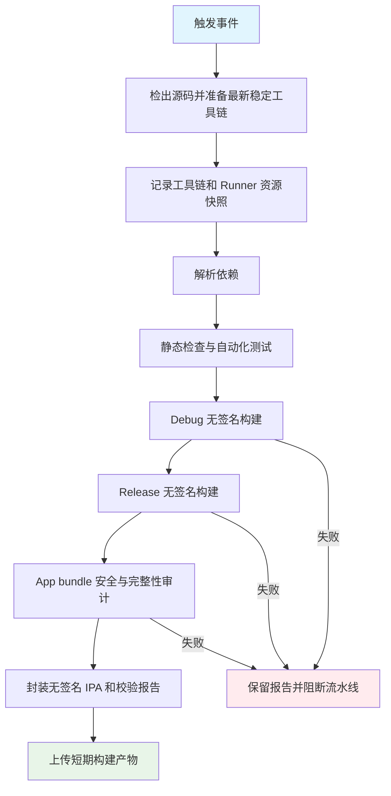

## Workflow Overview

**Purpose**: 在无本地 macOS 的条件下，持续验证 iOS 可编译性、App bundle 合规性，并提供可下载的无签名 IPA 诊断产物。
**Trigger Events**: 默认分支推送、面向默认分支的拉取请求、人工触发。
**Target Environments**: GitHub 托管的最新稳定 macOS、默认稳定 Xcode、Flutter 最新 stable 通道。

## Execution Flow Diagram



## Jobs & Dependencies

| Job Name | Purpose | Dependencies | Execution Context |
|---|---|---|---|
| `build-ios-unsigned` | 完成质量检查、双配置无签名构建、审计、封装和上传 | 无 | 最新稳定 macOS 托管 Runner，串行执行 |

## Requirements Matrix

### Functional Requirements

| ID | Requirement | Priority | Acceptance Criteria |
|---|---|---|---|
| REQ-001 | 跟随最新稳定 macOS、Xcode 和 Flutter stable | High | 每次运行均使用托管 Runner 默认稳定工具链，不静默回退旧版本 |
| REQ-002 | 在构建前执行仓库静态检查和自动化测试 | High | 任一检查失败即阻断后续构建 |
| REQ-003 | 验证 Debug 与 Release 均可无签名编译 | High | 两种配置均产生 iPhoneOS App bundle |
| REQ-004 | 审计 Release App bundle | High | 所有安全、架构、权限、许可和固定资产检查通过 |
| REQ-005 | 生成无签名 IPA | High | IPA 包含 `Payload/Runner.app`，可正常解包 |
| REQ-006 | 输出可追溯构建证据 | High | 提供 SHA-256、审计 JSON、工具链文本和构建元数据 JSON |
| REQ-007 | 支持人工重跑 | Medium | 维护者可从 GitHub Actions 页面触发 |

### Security Requirements

| ID | Requirement | Implementation Constraint |
|---|---|---|
| SEC-001 | 最小 GitHub Token 权限 | 仅允许读取仓库内容，不使用写权限 |
| SEC-002 | 不依赖签名秘密 | 不读取证书、描述文件、Apple Team 或仓库 Secrets |
| SEC-003 | 禁止模型权重进入 IPA | 拒绝 ONNX、TFLite、模型 token、模型归档及已知模型权重路径 |
| SEC-004 | 禁止用户数据进入 IPA | 拒绝录音、转录数据库和常见音频/数据库文件 |
| SEC-005 | 禁止签名材料进入 IPA | 拒绝证书、私钥和 provisioning profile |
| SEC-006 | 保留必要法律声明 | 固定 Manifest、模型许可证、Flutter NOTICE 和平台隐私清单必须存在 |

### Performance Requirements

| ID | Metric | Target | Measurement Method |
|---|---|---|---|
| PERF-001 | 单次运行时长 | 不超过 90 分钟 | GitHub Actions Job 时长 |
| PERF-002 | 构建并发 | 同一引用仅保留最新运行 | 并发组取消过期运行 |
| PERF-003 | 产物保留 | 7 天 | Artifact 保留配置 |

## Input/Output Contracts

### Inputs

```yaml
repository_event: push | pull_request | manual
source_revision: git commit SHA
toolchain_policy: latest-stable
```

### Outputs

```yaml
unsigned_ipa: file
ipa_sha256: text
app_inspection_report: json
build_metadata: json
toolchain_snapshot: text
```

### Secrets & Variables

| Type | Name | Purpose | Scope |
|---|---|---|---|
| Secret | 无 | 流水线不得依赖签名或发布秘密 | 不适用 |
| Variable | 无 | 所有约束由仓库配置定义 | 不适用 |

## Execution Constraints

### Runtime Constraints

- **Timeout**: 90 分钟。
- **Concurrency**: 同一工作流和 Git 引用最多一个有效运行。
- **Resource Limits**: 构建开始前记录 CPU 架构、内存和磁盘；Debug 与 Release 串行构建。

### Environmental Constraints

- **Runner Requirements**: GitHub 托管的最新稳定 macOS，支持 iOS arm64 构建。
- **Network Access**: 仅用于检出源码、获取 Flutter SDK 和解析公开依赖。
- **Permissions**: 仓库内容只读；不允许发布 Release、提交代码或访问签名秘密。

## Error Handling Strategy

| Error Type | Response | Recovery Action |
|---|---|---|
| 工具链变化导致不兼容 | 立即失败并保留实际版本 | 根据日志修复兼容性；不得静默固定旧环境 |
| 依赖、分析或测试失败 | 阻断构建 | 修复仓库问题后重跑 |
| Debug 或 Release 构建失败 | 阻断审计和 IPA 交付 | 使用工具链快照定位失败阶段 |
| App bundle 审计失败 | 阻断 IPA 作为成功产物 | 查阅审计 JSON 中的失败项 |
| IPA 封装或校验失败 | 阻断上传成功结论 | 检查 bundle 路径和归档结构 |
| 产物上传失败 | Job 失败 | 在保留期和仓库存储配额满足后重跑 |

## Quality Gates

| Gate | Criteria | Bypass Conditions |
|---|---|---|
| Code Quality | 静态检查无问题 | 无 |
| Automated Tests | 单元和组件测试全部通过 | 无 |
| Debug Compile | Debug iPhoneOS 无签名构建成功 | 无 |
| Release Compile | Release iPhoneOS 无签名构建成功 | 无 |
| Bundle Integrity | Bundle ID、iOS 最低版本、麦克风权限、后台音频和 arm64 均正确 | 无 |
| Package Safety | 无模型权重、用户数据、密钥或 provisioning profile | 无 |
| Legal Assets | 固定 Manifest、模型许可、Flutter NOTICE 和平台隐私清单齐全 | 无 |

## Monitoring & Observability

### Key Metrics

- **Success Rate**: 按 GitHub Actions 历史运行统计。
- **Execution Time**: 记录 Job 总时长及各步骤时长。
- **Resource Usage**: 工具链快照记录 Runner 架构、内存和磁盘空间。
- **Artifact Traceability**: 构建元数据关联 commit、run、attempt 和全部工具链版本。

### Alerting

| Condition | Severity | Notification Target |
|---|---|---|
| 默认分支运行失败 | High | GitHub Actions 默认通知与仓库维护者 |
| 拉取请求运行失败 | Medium | 拉取请求检查状态 |

## Integration Points

### External Systems

| System | Integration Type | Data Exchange | SLA Requirements |
|---|---|---|---|
| GitHub Actions | 托管 CI | 源码、日志、构建产物 | 无外部 SLA |
| Flutter SDK 发布通道 | 工具链解析 | 最新 stable SDK | 失败时不回退 |
| Dart/Flutter 包仓库 | 依赖解析 | 锁定依赖包 | 必须遵循 lockfile |

### Dependent Workflows

| Workflow | Relationship | Trigger Mechanism |
|---|---|---|
| 无 | 当前为独立验证流水线 | 不适用 |

## Compliance & Governance

### Audit Requirements

- **Execution Logs**: 由 GitHub Actions 按仓库策略保留。
- **Build Artifacts**: 无签名 IPA 和报告保留 7 天。
- **Approval Gates**: 无部署和外部分发，因此不配置环境审批。
- **Change Control**: 行为变化先更新本规格，再修改工作流和审计脚本。

### Security Controls

- **Access Control**: GitHub Token 仅具备内容读取权限。
- **Secret Management**: 本流程不声明、不读取、不输出 Secrets。
- **Artifact Classification**: 无签名 IPA 仅用于构建诊断，不是可安装或可发布产物。

## Edge Cases & Exceptions

| Scenario | Expected Behavior | Validation Method |
|---|---|---|
| 最新稳定工具链升级 | 使用新环境；失败时输出实际版本，不回退 | 工具链快照与失败日志 |
| App bundle 包含模型权重 | 审计失败且报告列出精确相对路径 | 注入测试文件或审计脚本回归验证 |
| App bundle 缺少固定许可 | 审计失败且报告列出缺失项 | 移除测试资产后运行审计 |
| 构建未产生 App bundle | 立即失败，不生成伪 IPA | 构建输出路径检查 |
| 拉取请求被新提交替代 | 取消旧运行，仅保留最新提交 | 并发运行历史 |
| 无签名 IPA 被尝试安装 | 不提供安装成功承诺 | 文档与产物命名明确标注 unsigned |

## Validation Criteria

### Workflow Validation

- **VLD-001**: Workflow 语法可被 GitHub Actions 解析。
- **VLD-002**: 人工触发后 Debug 与 Release 无签名构建均通过。
- **VLD-003**: 审计报告 `passed` 为 `true` 且失败项为空。
- **VLD-004**: IPA 解包后存在 `Payload/Runner.app/Info.plist`。
- **VLD-005**: SHA-256 与上传 IPA 一致。
- **VLD-006**: 构建元数据可定位 commit、run 和实际工具链。
- **VLD-007**: 该结果不改变 iOS 真机、签名和 TestFlight 门槛的阻塞状态。

### Performance Benchmarks

- **PERF-001**: 单次成功运行不超过 90 分钟。
- **PERF-002**: 上传产物不包含重复 Debug App，只交付 Release unsigned IPA。

## Change Management

### Update Process

1. **Specification Update**: 先修改本规格。
2. **Review & Approval**: 按仓库 OCR 规则审查规格、工作流和脚本。
3. **Implementation**: 同步修改 GitHub Actions 与审计逻辑。
4. **Testing**: 执行本地语法/静态检查，并人工触发云端流水线。
5. **Evidence**: 将运行链接、版本、SHA-256 和审计结论写入质量文档。

### Version History

| Version | Date | Changes | Author |
|---|---|---|---|
| 1.0 | 2026-08-05 | 初始无签名 iOS 构建规格 | Codex |

## Related Specifications

- [iOS Alpha 设备矩阵](../docs/quality/iOS_Alpha_设备矩阵.md)
- [运行时模型初始化与发布门槛](../docs/quality/运行时模型初始化与发布门槛.md)
- [Android + iOS Alpha PRD V0.9](../docs/product/Alpha_PRD_无登录版.md)
