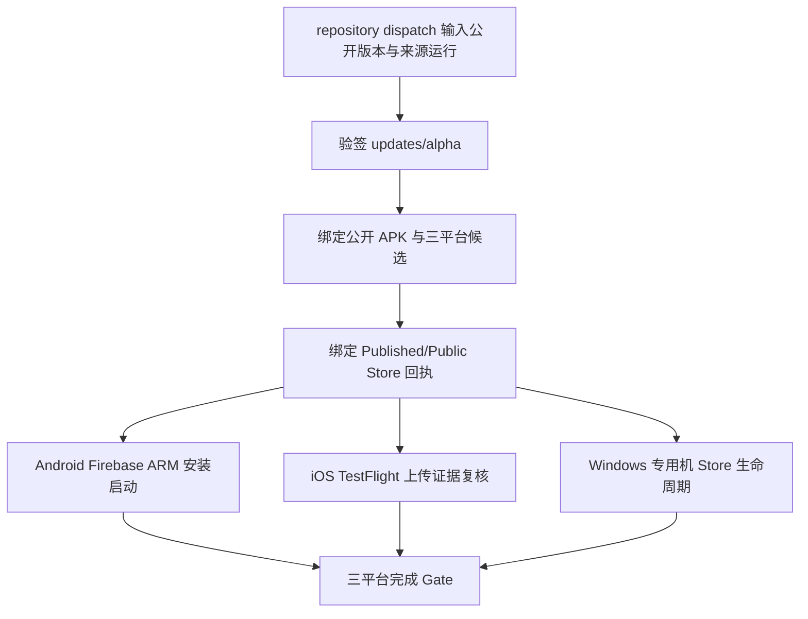

# 平台分发纵向验证工作流规格

## Workflow Overview

**Purpose**：在 Alpha 已公开后，从公开 Release、签名 `updates/alpha`、原始 `Alpha Release` 运行和平台分发证据重新解析同一个不可变候选；在 Firebase ARM 设备验证 Android 公开 APK 安装启动，在 TestFlight 侧复核签名上传证据，并在专用 Windows Store 自托管机执行真实安装/启动/卸载或更新/启动/卸载。

**Trigger Events**：仅接受默认分支上的 `repository_dispatch` 事件类型 `platform-distribution-validation`，由具备仓库操作权限的维护者通过 GitHub API 发起。它不会在 Actions 页面增加第二个手动入口，也不是正式发版入口；不构建、不签名、不上传 Store/TestFlight、不修改 Release 或更新指针。

**Current Readiness**：工作流、解析器、脚本和守卫可由 PR 交付；仓库尚无带 `meettrace-store` 标签的专用自托管 Windows x64 运行器，因此在该运行器配置且完整运行成功前，Windows 继续标记为“规划中/未就绪”。

## Execution Flow Diagram

## Jobs & Dependencies

| Job | Purpose | Dependencies | Execution Context |
|---|---|---|---|
| `resolve` | 验签公开指针，绑定 Release、三平台候选、Store 生产回执、来源运行和 Android 签名世系 | 无 | GitHub 托管 Linux，只读 GitHub |
| `android_public_install` | 下载并校验公开 arm64 APK，在 Firebase Test Lab ARM 设备原样安装和启动 | `resolve` | GitHub 托管 Linux + Google WIF |
| `ios_testflight_evidence` | 复核同一来源运行的签名 TestFlight 候选与上传 job；拒绝 IPA 出现在证据中 | `resolve` | GitHub 托管 Linux，只读 GitHub |
| `windows_store` | 从 `msstore` 安装当前版本或升级预装旧版，核对 Store 身份、x64 版本、单实例启动并卸载 | `resolve` | 专用自托管 Windows 10 22H2/11 x64，受保护 Environment |
| `validation_gate` | 仅在三个平台 job 全部成功后记录完成 | 全部前置 job | GitHub 托管 Linux |

## Requirements Matrix

### Functional Requirements

| ID | Requirement | Priority | Acceptance Criteria |
|---|---|---|---|
| PDV-001 | 只验证现有公开候选 | High | Release 是公开 Pre-release，且自定义资产恰为候选清单和唯一 arm64 APK |
| PDV-002 | 签名更新指针是唯一平台入口事实 | High | 使用客户端内置 Ed25519 公钥验签，状态为 `publicApproved`，三平台候选身份一致 |
| PDV-003 | 全部证据绑定同一来源运行 | High | `Alpha Release` 为成功的手动运行；三平台候选、提交 SHA、构建号和运行 ID 一致 |
| PDV-004 | Windows 绑定确切生产包 | High | 候选 MSIX 字节摘要与 Published/Public 回执中的版本、x64、文件名及可用摘要一致 |
| PDV-005 | Android 验证公开签名包 | High | Firebase ARM 设备使用 `--no-resign` 安装并启动 Release 中的确切 APK |
| PDV-006 | iOS 不复制分发包 | High | 只复核 TestFlight 签名候选和成功上传 job；证据目录不得包含 IPA |
| PDV-007 | Windows 执行真实 Store 生命周期 | High | `winget` 只使用 `msstore` 产品 `9PHHSJMWK06G`；安装/更新后核对固定身份与版本，启动两次仍为单实例，最后只卸载当前验证用户的包 |
| PDV-008 | 三平台无旁路完成 | High | 最终 Gate 直接依赖三个平台成功，任何失败均阻断完成结论 |

### Safety Requirements

| ID | Requirement | Implementation Constraint |
|---|---|---|
| SAFE-001 | Windows 破坏性操作限于专用机 | 必须同时满足自托管标签、`windows-store-validation` Environment、`MEETTRACE_DEDICATED_STORE_VALIDATION=1`、`repository_dispatch` 和 `master` |
| SAFE-002 | 不影响其他 Windows 用户 | 禁止 `-AllUsers`；只读取和移除运行器服务账号当前用户的 `zhangheng2026.MeetTrace` 包 |
| SAFE-003 | 安装模式要求干净前置状态 | `InstallUninstall` 遇到预装 MeetTrace 立即失败，不自行删除未知现有安装 |
| SAFE-004 | 更新模式要求确切旧版 | `Update` 仅在当前用户预装固定身份且版本精确等于输入旧版时执行，目标版本必须更高 |
| SAFE-005 | 不修改生产分发状态 | 工作流权限只读；不得创建、覆盖、撤回 Release、tag、Store submission、TestFlight build 或 `updates/alpha` |
| SAFE-006 | 不引入目标设备人工证据门禁 | 工作流证据来自自动化运行；不要求截图、人工设备矩阵、性能或准确率记录 |

## Input/Output Contracts

### `client_payload` Inputs

| Field | Required | Contract |
|---|---:|---|
| `release_id` | 是 | 当前签名指针指向的公开 `v<semver>-alpha.<n>` |
| `previous_android_release_id` | 是 | 更低构建号的公开 Android Release，用于校验同包名、同发布证书世系；不声称执行系统级 APK 升级 |
| `source_run_id` | 是 | 生成并公开该候选的成功 `Alpha Release` 运行 |
| `windows_validation_mode` | 是 | `InstallUninstall` 或 `Update` |
| `windows_previous_version` | 条件必填 | `Update` 时必须是专用机已预装的 `1.0.<build>.0`；其他模式必须为空 |
| `android_device_model` | 否 | Firebase ARM 设备，默认 `MediumPhone.arm` |
| `android_version` | 否 | 设备支持的 Android 版本，默认 `35` |

### Outputs

| Output | Retention | Contract |
|---|---|---|
| public distribution contract | 90 天 | 非敏感；包含签名指针、平台候选、来源运行、Windows 生产回执和 Android 签名世系的规范化结果 |
| Android public distribution evidence | 30 天 | APK 摘要、Firebase 模型、命令输出和可取得的原始结果；不改变 APK |
| iOS TestFlight distribution evidence | 30 天 | 候选清单、上传证据和规范化回执；不得包含 IPA |
| Windows Store lifecycle receipt | 90 天 | 操作、固定身份、预期版本、成功/失败和去敏错误；不得包含凭据或包下载 URL |

## Execution Constraints

- `resolve` 使用公开 Release、GitHub Actions Artifact 和 `updates/alpha`；来源证据过期时失败关闭，不能凭手工复制的 JSON 补齐。
- Android 公开 APK 只有 `arm64-v8a`，不得改用 x64 GitHub 模拟器或重新签名。Firebase Robo 证明当前公开包可安装和启动；Android 包级旧版到新版升级仍由签名世系、递增构建号和应用内更新单元测试覆盖，不能把它描述成真实系统升级验证。
- iOS 当前自动化证明相同签名候选已由来源 job 提交 TestFlight，不调用 App Store Connect 查询处理完成或外部测试可用性；不得夸大为真实终端安装。
- Windows `Update` 模式要求专用机在新版公开前已保留确切旧版 Store 包；Store 不提供任意历史版本回装接口，工作流不得旁加载 MSIX 冒充分发更新。
- 专用 Windows 运行器必须是一次只跑一个验证任务的隔离账号，装有 GitHub CLI、WinGet 和 `msstore` source，并允许启动桌面应用；服务会话无法启动 UI 时不得绕过启动检查。
- 并发组固定且不取消已有运行，避免两个 Windows 生命周期同时修改同一专用账号安装状态。

## Error Handling Strategy

| Error Type | Response | Recovery Action |
|---|---|---|
| 公开指针、候选或来源运行不匹配 | `resolve` 失败 | 使用正确的不可变版本和运行 ID；不得改写证据 |
| Firebase 安装/启动失败 | Android job 失败并上传可得输出 | 诊断设备/包问题，发布新 Alpha 修复；不得重新签名原 APK |
| TestFlight Artifact 过期或含 IPA | iOS job 失败 | 在保留期内运行；若需长期机器验证，应另行增加最小权限 App Store Connect 查询并更新本规格 |
| Windows 前置安装状态不匹配 | 在任何安装/卸载前失败 | 重置专用验证账号或按新版公开前的计划预装旧版 |
| Windows 安装后失败 | 写失败回执并仅清理由本次验证安装/升级的当前用户包 | 检查回执和 Store/应用日志；不影响其他用户 |
| 任一平台失败 | 不运行最终 Gate | 修复基础设施或发布新候选后重新发送验证事件 |

## Quality Gates

| Gate | Criteria | Bypass Conditions |
|---|---|---|
| Public contract | Ed25519、Release 资产、三平台候选、来源运行和 Store 回执全部一致 | 无 |
| Android | ARM Firebase 运行成功，APK 原摘要且 `--no-resign` | 无 |
| iOS | 来源上传 job 成功、候选签名字段为真、证据无 IPA | 无 |
| Windows | 专用机 Store 生命周期脚本成功并写成功回执 | 无 GitHub 托管机或旁加载替代 |
| Completion | 三个平台 job 全部成功 | 无 `always()` 或 continue-on-error 旁路 |

## Validation Criteria

- VLD-001：YAML 与守卫测试证明工作流只有只读权限、不可变 Action SHA，且使用 `repository_dispatch` 保持 `Alpha Release` 为 Actions 页面唯一手动入口。
- VLD-002：公开更新解析器单元测试覆盖有效合同、摘要错、撤回状态和来源运行错。
- VLD-003：PowerShell 可解析，安全环境变量、事件和分支检查发生在首次包状态变更之前。
- VLD-004：工作流守卫覆盖 Firebase ARM/不重签、iOS 无 IPA、Windows 专用机/当前用户卸载及最终无旁路 Gate。
- VLD-005：首次真实运行必须保留三个平台 Artifact 和成功 Gate；在此之前不得把 Windows 状态改为就绪。

## Change Management

1. 通过独立 PR 更新工作流、工具、测试、规格和 Runbook。
2. PR 内完成格式、静态分析、完整测试与 OCR 审查；合并需用户明确授权。
3. 合并后创建 `windows-store-validation` Environment，限制 `master` 并配置 required reviewer；不配置 Store 或签名 Secret。
4. 在隔离 Windows 10 22H2/11 x64 主机注册仓库级自托管运行器，标签固定为 `Windows`、`X64`、`meettrace-store`。
5. 先通过 GitHub API 调度 `InstallUninstall`；成功后为下一公开版本提前准备旧版快照，再通过同一事件运行 `Update`。
6. 只有真实 Windows 安装、更新、卸载与最终 Gate 全部成功后，才能在后续 PR 评估 PRD AT-21～AT-26 是否全部闭环并修改 Windows 就绪状态。

## Version History

| Version | Date | Changes | Author |
|---|---|---|---|
| 1.0 | 2026-08-21 | 定义公开合同、Android ARM 安装、TestFlight 证据和专用 Windows Store 生命周期纵向验证 | Codex |

## Related Specifications

- [Alpha Release 端到端规格](./spec-process-cicd-alpha-release.md)
- [Flutter CI/CD 工作流规格](./spec-process-cicd-flutter-ci.md)
- [Alpha PRD](../docs/product/Alpha_PRD_无登录版.md)
- [GitHub Alpha 发布流程](../docs/project/GitHub_版本发布流程.md)
