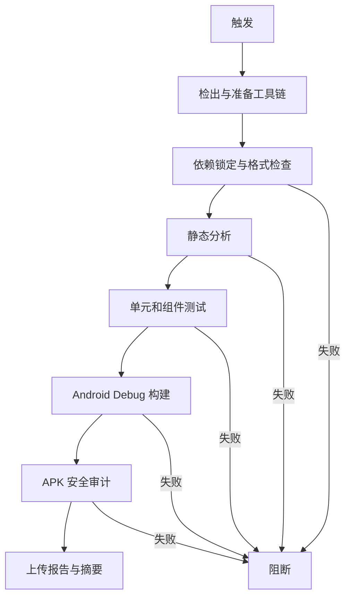

## Workflow Overview

**Purpose**: 对 Pull Request、`master` 推送和人工运行执行可重复的 Flutter 仓库门禁，并生成不含应用二进制的 Android 审计证据。
**Trigger Events**: 面向 `master` 的 Pull Request、`master` 推送、人工触发。
**Target Environments**: GitHub 托管 Ubuntu、Flutter stable、JDK 17、Android SDK。

## Execution Flow Diagram



## Jobs & Dependencies

| Job Name | Purpose | Dependencies | Execution Context |
|---|---|---|---|
| `flutter-quality` | 格式、分析、测试、Debug APK 构建与审计 | 无 | Ubuntu，45 分钟 |

## Requirements Matrix

### Functional Requirements

| ID | Requirement | Priority | Acceptance Criteria |
|---|---|---|---|
| REQ-001 | 使用锁定依赖 | High | `pubspec.lock` 可被解析且不被工作流改写 |
| REQ-002 | 检查 Dart 格式 | High | `lib`、`test`、`integration_test`、`tool` 无格式差异 |
| REQ-003 | 执行静态分析与自动化测试 | High | 任一诊断或测试失败即阻断 |
| REQ-004 | 构建 Android Debug APK | High | APK 可生成并通过固定资产、ABI、许可和禁入内容审计 |
| REQ-005 | 输出短期证据 | Medium | 上传 SHA-256、审计 JSON 和工具链信息，不上传 APK |

### Security Requirements

| ID | Requirement | Implementation Constraint |
|---|---|---|
| SEC-001 | 最小权限 | GitHub Token 仅可读取仓库内容 |
| SEC-002 | 不接触发布 Secrets | Job 不绑定发布 Environment，不声明签名 Secrets |
| SEC-003 | 不公开应用二进制 | Artifact 只能包含报告、摘要和工具链信息 |

### Performance Requirements

| ID | Metric | Target | Measurement Method |
|---|---|---|---|
| PERF-001 | 单次运行 | 不超过 45 分钟 | Job 时长 |
| PERF-002 | 并发 | 同一引用只保留最新运行 | 并发组历史 |
| PERF-003 | 证据保留 | 7 天 | Artifact 配置 |

## Input/Output Contracts

### Inputs

```yaml
repository_event: pull_request | push | workflow_dispatch
source_revision: commit SHA
```

### Outputs

```yaml
apk_sha256: text
apk_inspection: json
toolchain_snapshot: text
```

### Secrets & Variables

无。

## Execution Constraints

- **Timeout**: 45 分钟。
- **Concurrency**: 同一 workflow/ref 的旧运行可取消。
- **Network**: 仅用于检出、Flutter SDK 与公开依赖。
- **Permissions**: `contents: read`。

## Error Handling Strategy

| Error Type | Response | Recovery Action |
|---|---|---|
| 依赖、格式、分析或测试失败 | 立即阻断 | 修复后由新提交重跑 |
| APK 构建或审计失败 | 阻断合并 | 使用审计报告定位资产或打包问题 |
| 报告上传失败 | Job 失败 | 检查 Actions 配额后重跑 |

## Quality Gates

| Gate | Criteria | Bypass Conditions |
|---|---|---|
| Formatting | 无格式差异 | 无 |
| Analysis | `flutter analyze` 无问题 | 无 |
| Tests | `flutter test` 全部通过 | 无 |
| Android Package | Debug APK 审计通过 | 无 |

## Monitoring & Observability

- 成功率、执行时长、Flutter/Dart/JDK 版本和 APK SHA-256 写入运行记录。
- PR 失败通过 required status check 阻止合并。

## Integration Points

| System | Integration Type | Data Exchange | SLA Requirements |
|---|---|---|---|
| GitHub Actions | 托管 CI | 日志和非敏感证据 | 无 |
| Flutter/Android SDK | 构建工具链 | SDK 与锁定依赖 | 失败时不静默跳过 |

## Compliance & Governance

- 工作流变化必须先更新本规格。
- 证据不得包含录音、模型权重、密钥、数据库或 APK。
- 工作流文件必须进入 OCR 审查范围。

## Edge Cases & Exceptions

| Scenario | Expected Behavior | Validation Method |
|---|---|---|
| 新提交替代旧 PR 运行 | 取消旧运行 | Actions 历史 |
| APK 中出现模型权重或用户数据 | 审计失败 | 审计 JSON |
| 工具链升级破坏构建 | 明确失败并记录版本 | 工具链快照 |

## Validation Criteria

- **VLD-001**: Workflow 语法有效。
- **VLD-002**: 本地格式、分析和测试通过。
- **VLD-003**: GitHub 运行产生非敏感证据且不上传 APK。

## Change Management

1. 更新规格。
2. 修改工作流或审计脚本。
3. 执行本地验证和 OCR。
4. 在 Pull Request 上观察真实运行。
5. 将 Job 名配置为 `master` required status check。

## Version History

| Version | Date | Changes | Author |
|---|---|---|---|
| 1.0 | 2026-08-06 | 初始 Flutter 仓库门禁规格 | Codex |

## Related Specifications

- [iOS 无签名构建](spec-process-cicd-ios-unsigned.md)
- [Android Alpha 候选发布](spec-process-cicd-android-alpha.md)

