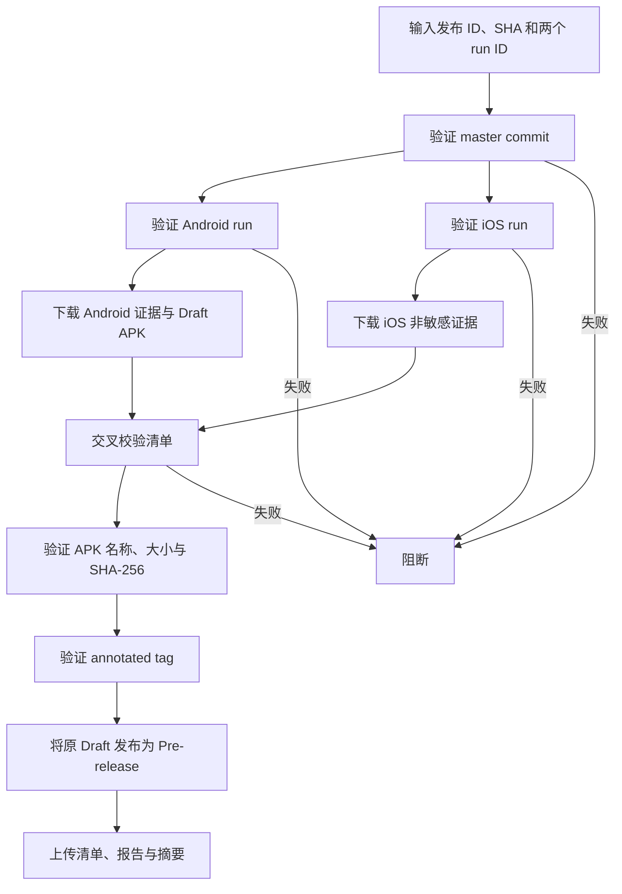

## Workflow Overview

**Purpose**: 只在 Android 与 iOS 候选来自同一 `master` commit 且门禁均为 `go` 时，验证 Android 候选阶段预留的 annotated tag 和 Draft Release 原始 APK，并将该 Draft 公开为 GitHub Pre-release。
**Trigger Events**: 维护者人工触发。
**Target Environments**: GitHub 托管 Ubuntu、`github-release` Environment、当前公开源码仓库。

## Execution Flow Diagram



## Jobs & Dependencies

| Job Name | Purpose | Dependencies | Execution Context |
|---|---|---|---|
| `finalize-alpha-release` | 运行、tag、APK 校验与 Pre-release 公开 | 无 | Ubuntu，`github-release`，30 分钟 |

## Requirements Matrix

### Functional Requirements

| ID | Requirement | Priority | Acceptance Criteria |
|---|---|---|---|
| REQ-001 | 两个候选运行成功 | High | conclusion=`success` 且 workflow 身份正确；Android run head 为候选 SHA，iOS 候选 SHA 由清单与 annotated tag 证明 |
| REQ-002 | 候选来自同一 SHA | High | run、输入、候选清单和请求 SHA 全部一致 |
| REQ-003 | 两个平台门禁为 `go` | High | 两份报告 decision 均为 `go` |
| REQ-004 | 发布 ID 不可改写 | High | 只接受 Android 候选阶段创建、指向同一 SHA 的既有 annotated tag 和 Draft/prerelease |
| REQ-005 | 验证 annotated tag | High | tag 对象类型为 `tag` 且 peel 后指向已验证候选 SHA |
| REQ-006 | 公开原 Draft | High | 验证后的同一 Draft 变为 Pre-release，保留且不覆盖已验收 APK |
| REQ-007 | 提供公开安装信息 | High | Release 说明包含 Android 安装/数据风险提示，并显示有效 TestFlight 外部链接或“待提供” |

### Security Requirements

| ID | Requirement | Implementation Constraint |
|---|---|---|
| SEC-001 | 发布需要独立审批 | Job 绑定 `github-release` Environment |
| SEC-002 | 二进制范围固定 | 公开已验收的 Android APK；Release 和 Actions Artifact 均不保存 IPA |
| SEC-003 | 最小写权限 | 仅 `contents: write` 与 `actions: read` |
| SEC-004 | tag 不覆盖 | 既有 tag 必须是指向同一候选 SHA 的 annotated tag，否则立即失败 |

### Performance Requirements

| ID | Metric | Target | Measurement Method |
|---|---|---|---|
| PERF-001 | 单次运行 | 不超过 30 分钟 | Job 时长 |
| PERF-002 | 并发 | 同时只允许一个最终发布 | 并发组 |

## Input/Output Contracts

### Inputs

```yaml
release_id: v<marketing-version>-alpha.<sequence>
candidate_sha: full commit SHA
android_run_id: integer
ios_run_id: integer
release_notes: optional text
ios_testflight_external_url: optional https://testflight.apple.com/join/<code>
```

### Outputs

```yaml
annotated_tag: git ref
github_prerelease: URL
public_android_apk: meettrace-<release-id>-android-arm64.apk
android_candidate_manifest: json
ios_candidate_manifest: json
release_gate_reports: json files
```

### Secrets & Variables

使用 Environment 审批和自动生成的 `GITHUB_TOKEN`；不使用平台签名 Secrets。

## Execution Constraints

- **Timeout**: 30 分钟。
- **Concurrency**: 最终发布串行且不自动取消。
- **Branch**: 候选 SHA 必须可达 `master`。
- **Permissions**: `contents: write`、`actions: read`。

## Error Handling Strategy

| Error Type | Response | Recovery Action |
|---|---|---|
| run ID 不存在、失败或 workflow 不匹配 | 公开 Draft 前阻断 | 提供正确候选运行 |
| SHA、release ID、版本、tag、门禁或 Draft APK 摘要不一致 | 公开 Draft 前阻断 | 使用新的候选发布流程 |
| tag/Release 与候选身份冲突 | 拒绝覆盖 | 使用新的 Alpha 序号 |
| tag 已创建但 Draft 公开失败 | 保留 tag 和 Draft 并明确失败 | 修复后重跑；只恢复同一身份 Draft 的公开 |
| Release 已公开后补 TestFlight 链接 | 只允许原候选证据逐字节一致 | 更新说明；不得覆盖 APK 或候选证据 |

## Quality Gates

| Gate | Criteria | Bypass Conditions |
|---|---|---|
| Candidate Identity | Android/iOS workflow、SHA、release ID 一致 | 无 |
| Product Evidence | 两份 decision=`go` | 无 |
| Version Integrity | marketing version 与 tag 一致 | 无 |
| Approval | `github-release` Environment 审批完成 | 无 |

## Monitoring & Observability

- Release 页面保存候选 run URL、commit、构建号、SHA-256、风险和证据文件。
- 失败运行不会移动候选阶段已经预留的 tag，也不会公开 Draft。

## Integration Points

| System | Integration Type | Data Exchange | SLA Requirements |
|---|---|---|---|
| GitHub Actions API | 候选验证和 Artifact 下载 | run 元数据与非敏感证据 | 必须可追溯 |
| Git Tags | 版本固定 | annotated tag | 不得移动或复用 |
| GitHub Releases | 候选暂存与公开发布记录 | Draft/Pre-release、Android APK 与证据 | 不含 IPA |

## Compliance & Governance

- 仅 Android 候选流程可创建 `v*` annotated tag；最终流程只验证，不创建、移动或删除。
- 撤回版本保留 tag 和 Release 审计记录，标记为已撤回并通过新版本向前修复。
- 公开资产不得包含录音、数据库、设备序列号、模型权重或 IPA；只允许发布已验收且与清单一致的 Android APK。

## Edge Cases & Exceptions

| Scenario | Expected Behavior | Validation Method |
|---|---|---|
| Android 与 iOS 来自不同 SHA | 阻断 | run API 与清单比对 |
| 候选 Artifact 已过期 | 阻断 | 重新执行候选发布 |
| 重复 release ID 且身份不同 | 阻断，不覆盖 | tag/Release API |
| 同一 release ID/SHA 的失败恢复 | Draft 可补齐非 APK 证据；已公开后要求全部候选证据逐字节一致，只更新说明 | tag peel、Release 与资产 API |
| 只有 Android 候选通过 | 保留不可见 Draft 和已预留 tag，状态保持 blocked | Release API |

## Validation Criteria

- **VLD-001**: 错误 run ID 或 SHA 不会公开 Draft 或移动既有 tag。
- **VLD-002**: 相同 SHA 和 `go` 报告只能复用 Android 候选阶段的唯一 annotated tag。
- **VLD-003**: GitHub Release 标记为 prerelease，包含与候选清单一致的唯一 Android APK 且不含 IPA。
- **VLD-004**: Release 资产可反向定位两个候选 run。

## Change Management

1. 更新本规格。
2. 修改最终发布工作流。
3. 使用无写权限的校验模式验证输入路径。
4. 完成 OCR 与 GitHub Environment 配置。
5. 首次真实发布后记录运行链接。

## Version History

| Version | Date | Changes | Author |
|---|---|---|---|
| 1.0 | 2026-08-06 | 初始 Alpha 最终发布规格 | Codex |
| 1.1 | 2026-08-06 | 增加 tag 已创建或 prerelease 部分完成后的同身份幂等恢复 | Codex |
| 1.2 | 2026-08-06 | 验证并公开 Android Draft APK，增加 TestFlight 外部链接占位和强制安装风险说明 | Codex |
| 1.3 | 2026-08-06 | 改为验证 Android 候选阶段预留的 annotated tag，最终流程不再创建或移动 tag | Codex |
| 1.4 | 2026-08-06 | 允许 iOS workflow 从 Android annotated tag 派生候选 SHA，不再把 iOS run head 误当作构建提交 | Codex |

## Related Specifications

- [Android Alpha 候选发布](spec-process-cicd-android-alpha.md)
- [iOS TestFlight 发布](spec-process-cicd-ios-testflight.md)
